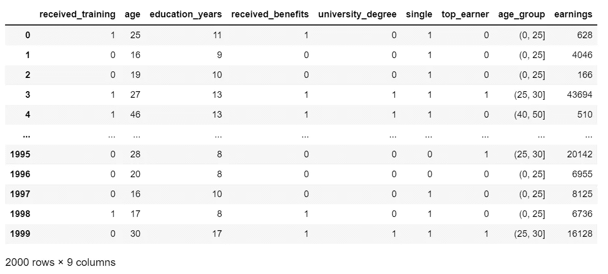
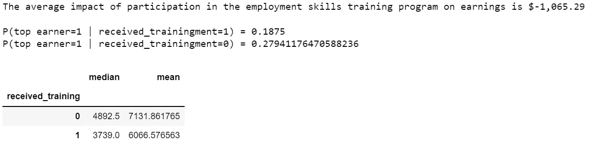
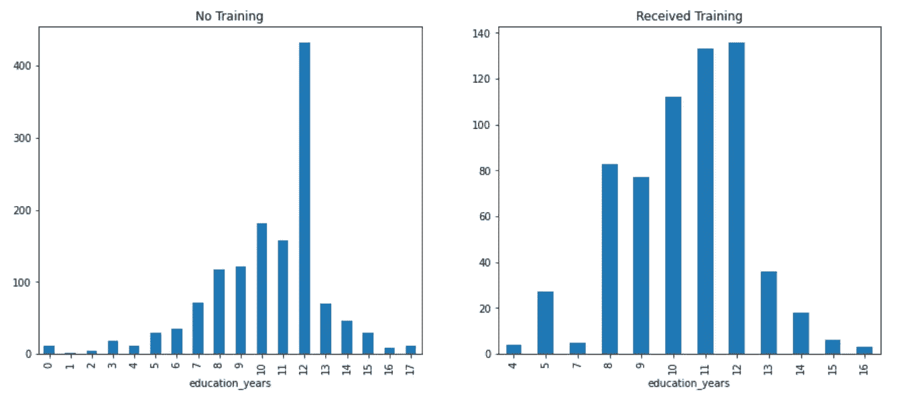
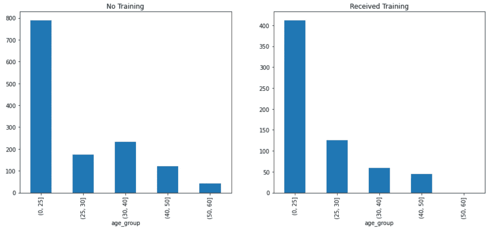
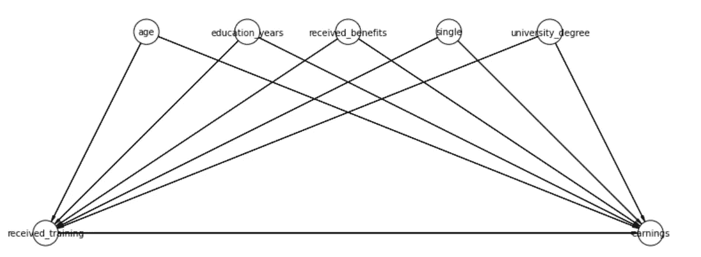
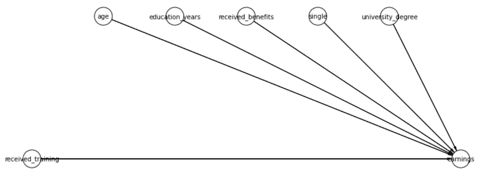
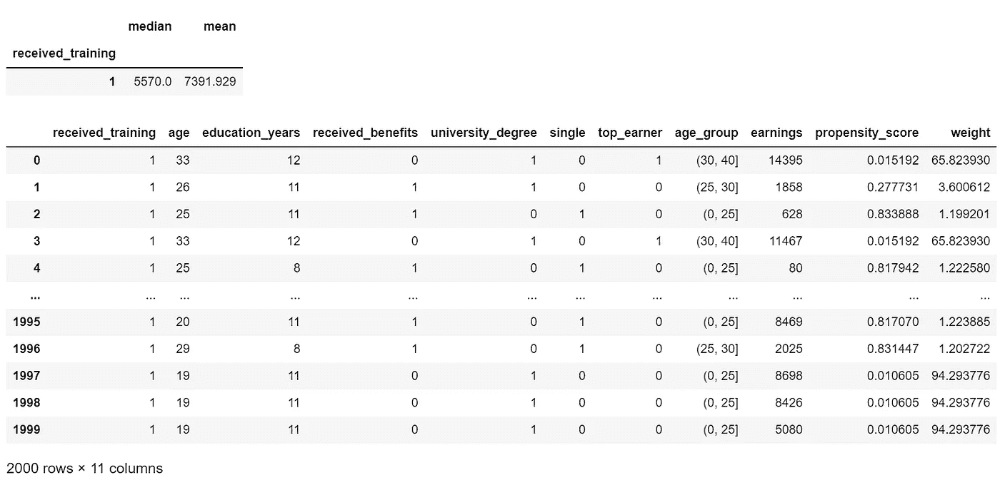
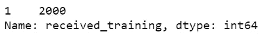
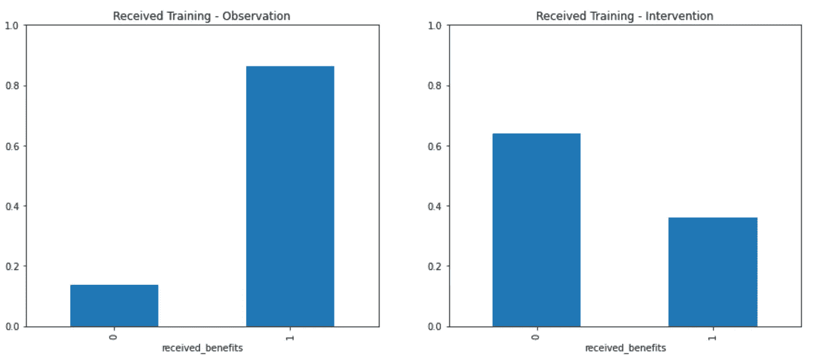
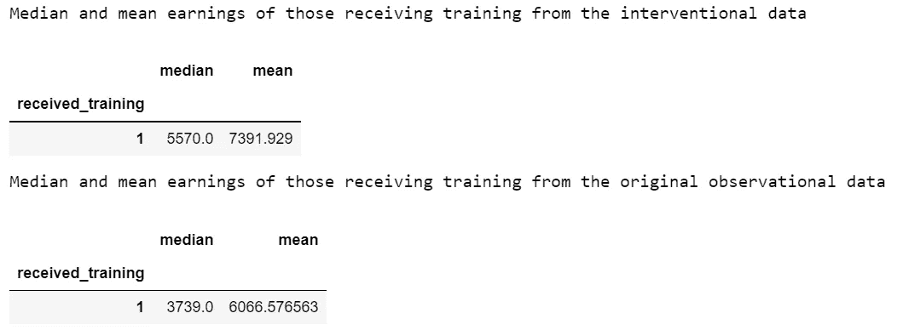

# 因果推理“do”操作符的完整解释，包括一个使用 Python 和 DoWhy 的端到端示例

> 原文：<https://towardsdatascience.com/the-causal-inference-do-operator-fully-explained-with-an-end-to-end-example-in-python-20ec1a9dde5d>

## 如何掌握因果推理 do 运算符，以及为什么您的数据科学工具包中需要它

Bradyn Trollip 在 [Unsplash](https://unsplash.com/s/photos/domino?utm_source=unsplash&utm_medium=referral&utm_content=creditCopyText) 上拍摄的照片

# 介绍

正如我在理解这项新兴技术如何工作以及它为什么如此重要的过程中所发现的那样，在互联网上或书籍中很难找到完整解释的、端到端的因果推理例子，这些例子都有实际的、有效的源代码。

但如果你坚持不懈，这肯定是非常值得的努力，因为它将能够解决一种不同类型的问题，这种问题使用其他机器学习技术无法解决。

> 传统的机器学习模型可以预测如果未来大体上像过去一样可能会发生什么，但它们不能告诉你应该采取不同的措施来实现预期的结果。

例如，分类算法可以预测银行贷款客户是否可能违约，但它无法回答诸如“如果我们改变贷款的还款期限，是否会有更多的客户避免违约？”

以下是因果推理可以回答的传统预测模型无法回答的问题类型的几个例子:

*   对一个系统提议的改变能改善人们的结果吗？
*   是什么导致了系统结果的变化？
*   系统的哪些变化可能会改善人们的结果？

有许多在线文章的例子详细介绍了因果推理所涉及的数学，但是很少有文章提供了一个完整的解释和所有源代码的实例。

> 如果你坚持和我一起读完这篇文章，我保证给你提供完整的解释和所有的源代码，这将使你能够做一些真正令人惊讶的事情，而这是其他机器学习技术不可能做到的。

# 数据

我们首先需要一些数据。我创建了一个纯合成数据集，其灵感来自著名的 LaLonde 数据，该数据观察并记录了 20 世纪 70 年代就业技能培训计划对收入的影响。

由于 LaLonde 的数据和研究提供了灵感，所以在文章结尾的参考文献部分有一段引文。

作者图片

有必要花点时间来理解合成数据集的关键方面

*   如果个人参加了旨在提供就业技能和增加收入潜力的虚构培训计划，则持有 1。在合成数据集中，640 人参加了训练计划，1360 人没有参加。
*   `age`是以年为单位的年龄。
*   `education_years`持有学校教育的年限。
*   `received_benefits`如果个人曾经接受过失业救济，则持有 1。
*   `university_degree`是 1，如果个人在大学学习并获得学位。
*   `single`如果个人是单身(即没有结婚或处于民事伴侣关系中)，则为 1。
*   `top_earner`如果个人处于收入最高的四分之一，则为 1。
*   `age_group`是`age.`的分类版本
*   `earnings`是个人在完成虚拟就业技能培训计划 3 年后的收入，是感兴趣的“目标”或特征。

# 培训方案产生了什么影响？

现在让我们来看看数据，看看培训计划对参与者的收入有什么影响…

作者图片

根据分析，参加培训计划的影响是负面的-

*   参加培训方案的明显影响是年收入减少 1 065.29 美元。
*   参加培训的人成为高收入者的概率是 0.19，不参加培训的人是 0.28。
*   接受培训者的收入中位数为 3739 美元，未接受培训者的收入中位数为 4893 美元。
*   接受培训者的平均收入为 6067 美元，未接受培训者的平均收入为 7132 美元。

# 你会给出什么建议？

根据分析，明确的建议是停止培训计划，因为使用四种不同的衡量标准可以表明，对收入的影响始终是负面的。

直觉上，这个结论似乎并不正确。即使培训绝对糟糕，参加培训会降低参与者的就业能力并损害他们未来的收入也是不对的。

# 那么，分析出了什么问题？

在这一点上，包括概率和预测模型在内的传统方法的潜力无法让我们走得更远。这些技术的任何应用都将得出训练应该被取消的结论。

为了突破这些限制，并真正理解发生了什么，我们需要建立一个因果模型，并应用神奇的“do”运算符。

如果你想知道培训项目的真正影响，以及为什么使用传统的概率和预测模型会导致错误甚至危险的结果，请继续阅读…

# 使用“do”运算符的因果推理解决方案

让我们通过更详细地查看数据集中的一些要素来开始更准确的评估之旅…

作者图片

显然，参加培训的人和没有参加培训的人在教育方面有着明显不同的模式。

在现实世界项目中的这一点上，我们将与领域专家合作来理解这些模式，但即使没有领域专业知识，也有理由得出结论，教育可能会对参加培训的人及其赚钱的能力产生因果影响。

作者图片

这是一个相似的故事。对于那些接受培训的人来说，这是一个线性模式，年轻人多，老年人少。对于没有训练的人来说，在 30-40 岁年龄段会有一个高峰。一种假设可能是，许多 30-40 岁的人已经收入颇丰，不想接受任何与工作技能相关的培训。

这再次表明，年龄既影响个人是否有可能参加培训，也影响他们的收入潜力。

# 因果推理和“混杂”

这个简单的附加分析揭示了“混杂因素”的存在。这个术语在许多可用的例子中到处流传，通常伴随着微积分和公式，但通常没有明确的解释。

简而言之，年龄和教育等特征的影响与兴趣的主要影响(即培训对收入的影响)混合在一起，当我们应用传统方法时，无法分离出独立的影响。

# 构建“有向无环图”(DAG)

从数据中发现因果关系是不可能的。数据需要用“有向无环图”(DAG)来补充，DAG 是通过利用领域专业知识和其他技术来“发现”因果关系而构建的。

关于更详细的探索，请看看我关于发现因果关系的文章

</causal-discovery-does-the-cockerel-crowing-cause-the-sun-to-rise-f4308453ecfa>  

下一步将使用我的`DirectedAcyclicGraph`类。为了使文章更加简洁，我在文章中省略了源代码，但如果你想自己运行代码，这里有完整源代码的链接-[https://gist . github . com/grahamharrison 68/9733 b 0 CD 4 db 8 e 3 e 049 D5 be 7 fc 17 b 7602](https://gist.github.com/grahamharrison68/9733b0cd4db8e3e049d5be7fc17b7602)。

如果你决定使用它，如果你喜欢它，为什么不考虑给我买杯咖啡？…

这是我对数据中因果关系的建议-

作者图片

DAG 可以解释如下-

*   `received_training`(即参加培训项目)对`earnings`(即未来收入)有因果影响。
*   所有其他特征对一个人是否可能参加培训计划都有因果影响。
*   所有其他特征也会对未来收益产生因果影响。

例如，个人的年龄“导致”他们是否参加培训，可能是因为更多的年轻人希望接受培训，年龄也“导致”收入，可能是因为经验更多的老年人可以赚得更多。

这种模式很常见。当统计学家在进行随机对照试验(RCT)时，他们可能会对与主效应混合的变量进行调节或控制。

这意味着，对于年龄，他们可以将观察结果分成不同的年龄组，查看每组的治疗和年龄之间的关系，然后对每组进行比例平均，以估计真实的总体效果。

然而，这种方法存在一些问题。例如，如何定义组的边界？如果关键影响是 16-18 岁的人，但界限被设定为 16-30 岁，会怎样？如果没有对 40-45 岁人群的观察结果会怎样？

另一种方法不是观察，而是干预。我们可以简单地强迫每个人进行培训，然后我们就会看到真正的影响。但是，如果观察是历史的(如在拉隆德的数据中),并且干预为时已晚，该怎么办呢？或者如果这是一项关于吸烟或肥胖的研究呢？

受试者不能仅仅为了证明我们的理论而被迫吸烟或变胖！

这就是“do”操作符的用武之地。这听起来像是魔术，但建立一个因果推理模型是真正可能的，它可以准确地模拟这些干预，而不必在现实世界中进行。

这将节省大量时间和金钱，消除对随机控制试验的需求，这些试验以大量变量为条件，并使对吸烟和肥胖等现实世界研究中存在道德和伦理问题的因素的研究成为可能。

# “Do”操作符的魔力

让我们想象一下，不是观察一群人，其中一些人接受了训练，一些人没有，我们可以回到过去，干预而不是观察，让他们都接受训练。

在这种情况下，DAG 看起来像这样-

作者图片

这就是神奇的“do”操作符正在做的事情。如果你进行干预和𝑑𝑜(𝑡𝑟𝑒𝑎𝑡=1)，你就有效地“消除”了所有因果关系的输入线，因为无论年龄、教育和其他特征如何影响进行培训的概率，它总是会发生。

在幕后，图书馆正在模拟这种干预。它可以通过使用做微积分的规则来转换𝑝(earnings|𝑑𝑜(received_training=1)来做到这一点，除非我们对一组可以从数据中计算出来的观察规则进行物理干预，否则这些规则无法直接计算出来。

我有意在这篇文章中省略了数学的细节。有很多文章展示了数学，但是很少展示 Python 代码的工作示例，因此这是本文的重点。

注意:如果你想运行代码，你将需要我的`DirectedAcyclicGraph`类，所以如果你还没有下载它，请前往[https://gist . github . com/grahamharrison 68/9733 b 0 CD 4 db 8 e 3 e 049 D5 be 7 fc 17 b 7602](https://gist.github.com/grahamharrison68/9733b0cd4db8e3e049d5be7fc17b7602)，如果你喜欢的话，不要忘记考虑[请我喝杯咖啡](https://ko-fi.com/grahamharrison)！

这是对数据执行“do”操作的完整源代码…

作者图片

# 代码是什么意思？

在我们进入真正令人惊奇的结果之前，逐行浏览代码是有用的。

首先，导入`dowhy.api`神奇地扩展了熊猫`DataFrame`，使得这个类获得了一个新的`causal.do`方法。

接下来在`numpy`中设置随机种子，确保`do`方法的结果是可重复的。文档中没有提到任何关于设置随机种子的内容，这是通过反复试验找到的。还要注意，随机种子需要在每次调用`causal.do`之前在前面的语句中设置，而不仅仅是在第一次调用之前。

`causal.do`的下一个谜团是`variable_types`参数。`DoWhy`文件不完整且不一致。尝试了很多不同的东西，得出了以下结论-

*   不管文档中怎么说，只有两种类型是重要的——“d”代表离散型,“c”代表连续型。
*   在统计学中，整数是离散的，但是如果整数被声明为“d”，那么`DoWhy`会产生一些非常奇怪的结果。基于对`DoWhy`文档和例子的大量阅读，我的结论是整数需要声明为“c”来表示连续。
*   在`DoWhy`源代码中有一个名为`infer_variable_types`的方法，但是它没有代码，所以我写了自己的实现，在`DirectedAcyclicGraph.infer_variable_types()`中它是一个静态方法。

以下是最重要的`causal.do`方法参数的含义-

*   `x={"received_training": 1}`是说我们想“做”什么。在这种情况下，我们想看看如果每个人都被迫参加数据中由`received_training=1`表示的培训会发生什么。
*   `outcome="earnings"` -这是我们正在寻找的结果或效果，即“做”received_training=1 对个人收入的影响是什么？
*   `dot_graph=training_model.gml_graph`通知`do`操作者我们认为数据中存在的因果关系。`training_model`是我的`DirectedAcyclicGraph`类的一个实例，我给了它一个属性，它以`gml`的格式给出了结构
*   `do`方法需要传入`common_causes`或`dot_graph`来描述因果关系。
*   `dot_graph`参数将接受`dot`或`gml`格式的结构，但在文档中没有提到这一点；`gml`在我看来要好得多，因为它在`DoWhy`中到处都被使用。
*   指定一个图比设置`common_causes`要好得多，因为图可以捕捉任何类型的结构，而`common_causes`则有更多的限制。同样，在`DoWhy`文档中也没有提到这一点。
*   `variable_types`参数已经解释过了。
*   `proceed_when_unidentifiable=True`避免干扰计算的恼人的用户提示。

# 它是如何工作的？

`causal.do`方法正在返回一个新的数据帧，该数据帧有效地模拟了强制干预，并提供了如果每个人都完成了培训就会收集到的数据-

作者图片

在这方面，`DoWhy`与大多数其他 Python 因果库不同，因为大多数其他库只是返回一个数字而不是一个`DataFrame`。

返回一个`DataFrame`最初有点令人困惑，但是再深入一点，这是一个强大、灵活和信息丰富的方法。

在不知道内部实现细节的情况下，我的结论是`DoWhy`正在模拟随机对照试验(RCT ),根据需要用于“消除混杂”本文前面描述的混合效应的组对数据进行采样。

例如，看一下原始观察数据和新干预数据之间的以下特征的比较-

作者图片

显然`DoWhy`已经以一种非常不同的方式对该特征的干预数据进行了重新采样。

# 培训对收入真正的“非决定性”影响是什么？

现在剩下的就是通过观察`df_do` `DataFrame` -来解释培训对收入的真正影响

作者图片

# 结论

根据观察数据使用概率的传统方法表明，参加培训的人实际上比没有参加培训的人工资要低。

根据观察数据接受培训的人的平均工资为 6067 美元，而模拟干预的因果推断“do”方法揭示了真实的影响——工资增加，平均工资为 7392 美元。

> 在应用因果推断方法后，建议不是取消培训计划，而是扩大培训计划，因为它为需要帮助的群体提供了更公平的机会，以增加他们的长期收入。

在文章的结尾，我承诺了一些令人惊奇的事情，如果这个结果对你有和对我一样的启示性影响，那么我希望它没有辜负我的承诺。

> 每当数据中存在因果效应时，传统的预测方法都会导致错误的结论和建议，这使得因果推断成为所有数据科学家的工具包中的一个重要工具。

如果你喜欢这篇文章，请考虑…

[通过我的推荐链接](https://grahamharrison-86487.medium.com/membership)加入 Medium(如果你使用此链接注册，我将收取一定比例的费用)。

<https://grahamharrison-86487.medium.com/membership>  

每当我发表新故事时，订阅一封免费电子邮件。

[快速浏览我以前的文章](https://grahamharrison-86487.medium.com/)。

[下载我的免费战略数据驱动决策框架](https://relentless-originator-3199.ck.page/5f4857fd12)。

访问我的数据科学网站— [数据博客](https://www.the-data-blog.co.uk/)。

# 参考

拉隆德数据集-

*   引文:罗伯特·J·拉隆德，1986 年。“用实验数据评估培训项目的计量经济学评估”，《美国经济评论》，美国经济协会，第 76 卷(4)，第 604-620 页，9 月。