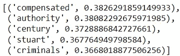

# 自然语言处理中口译语言的挑战

> 原文：<https://towardsdatascience.com/the-challenge-of-interpreting-language-in-nlp-edf732775870>

# 自然语言处理中口译语言的挑战

## 为什么教机器理解语言如此困难


照片由 [Rey Seven](https://unsplash.com/@rey_7?utm_source=medium&utm_medium=referral) 在 [Unsplash](https://unsplash.com?utm_source=medium&utm_medium=referral) 拍摄

让我们的机器理解文本是一项艰巨的任务。尽管在这方面已经取得了很多进展，但我们距离创造一种将语言无缝转换成机器可读数据的方法还有很长的路要走。

让我们面对它；我们的语言很复杂。

与整齐地由行和列组成的表格以及由 RBG 值在固定范围内的像素组成的图像不同，我们说的和写的单词不遵循严格的结构化系统。

鉴于我们的灵活性，在过去 200 万年的人类文明中，我们一直能够做到这一点(这是一次不错的尝试)。不幸的是，当我们试图教计算机理解我们复杂的系统时，我们语言中的谬误开始困扰我们。

为了更好地理解 NLP 从业者面临的挑战，从语言学家的角度来审视我们的语言是理想的。

让我们来看看让我们的语言变得晦涩甚至有时无意义的一些因素。

注:本文主要以英语为主。讨论的一些特性可能不适用于其他语言。

## 单词序列

在口语和书面语中，单词的顺序很重要。一篇文章的语义价值不仅在于单词本身，还在于单词的顺序。

考虑下面几对句子:

```
Case 1:
"The cat ate the mouse."
"The mouse ate the cat."Case 2:
"I had fixed my laptop."
"I had my laptop fixed."
```

在这两种情况下，即使句子有相同的单词，它们的语义是不同的。

## 同义词

同义词指的是彼此意思相同或相似的词。您很可能对它们很熟悉，但这里有几个例子:

```
1: {great, amazing, fantastic}
2: {big, huge, enormous}
3: {costly, expensive, pricey}
```

用多种方式表达相同的信息会增加复杂性，这是 NLP 模型必须考虑的。

## 同音异义词

同音异义词是指拼写和发音相同，但有多种含义的词。

在对话中，根据上下文，很容易确定所指的是什么意思。这里有一个例子:

```
"The fishes are swimming in a tank."
"The military unit was supplied with a tank."
```

根据所提供的上下文，我们可以很容易地说出每个场景中“tank”的定义。然而，让计算机做同样的事情是一个挑战。

## 讽刺

讽刺，通俗地说，就是说一些与你想说的意思相反的话(通常是一种嘲弄或嘲笑的形式)。它早已融入我们的日常对话。它也存在于文本中，常见于个人聊天等交流形式中。

我相信我们都见过类似以下的在线评论:

```
"What a book! After 50 pages in, I only dozed off twice!"
```

同样，这种现象对人类来说很容易察觉，但对计算机来说就不那么容易了。不幸的是，未能检测讽刺会妨碍需要检测情感(例如，情感分析)的 NLP 应用的性能。

## 未知单词

NLP 模型也有可能遇到不认识的单词。这些词不包括在用于训练模型的数据中。这类单词的例子包括新词汇、拼写错误的单词、俚语和缩写。

# NLP 中的当前模型

研究人员进行了无数的研究，以开发算法和模型，使计算机能够向量化文本，尽管我们的语言错综复杂。

让我们来看看其中的几个。

## 基于计数的模型

像单词袋或 TF-IDF 这样的模型经常被介绍给从自然语言处理开始的新手。他们对文本进行矢量化的方法很简单，主要基于单词的频率来评估文本。

这些模型易于大规模部署，可用于许多应用。然而，他们的矢量化方法忽略了单词的顺序以及单个单词的语义值。

例如，这里有两个非常简单的句子:

```
"Pigeons fly."
"Eagles soar.
```

很相似，对吧？

不幸的是，对于单词袋或 TF-IDF 模型，这些句子的余弦相似度为 0。

使用基于计数的模型，同义词如“飞”和“翱翔”以及来自同一类别的词如“鸽子”和“鹰”将被视为完全不同的实体。

## 深度学习模型

为了解决基于计数的模型的局限性，一些研究转向深度学习模型作为向量化文本的手段。

例如，word2vec 模型使用浅层神经网络根据每个单词周围的单词来评估每个单词。这解决了基于计数的模型无法保留给定文本的语义值的问题。

不幸的是，word2vec 模型有其自身的局限性。

首先，它不能正确识别同音异义词的不同含义。该模型不能识别在正文中找到的单词的版本。

其次，它无法容纳未用于训练模型的未知单词。

最后，作为深度学习模型，它需要大量的数据。深度学习模型的性能只有在用高质量和高数量的数据训练时才能达到令人满意的水平。

为了演示，让我们使用从 Kaggle(无版权)获得的几篇 BBC 文章来创建 word2vec 模型。此演示的数据可在[这里](https://www.kaggle.com/pariza/bbc-news-summary)找到。

首先，让我们加载。txt 文件，并将业务类别中的所有文本合并成一个语料库。

在用 NLTK 库对语料进行预处理之后，让我们用它来训练一个 word2vec 模型。

对于模型，我们来看 5 个与“金融”最相似的词。



代码输出(由作者创建)

如你所见，被认为与金融最相似的 5 个词在商业环境中并没有那么紧密地联系在一起。然而，这样的结果是可以预期的，因为模型的输出受到用于训练它的语料库的限制。不能期望这样的模型充分执行。

## 基于变压器的模型

广泛的研究导致了基于变压器的模型的出现。这些模型的编码器-解码器架构允许计算机理解更复杂的文本。他们能够处理同音异义词，甚至是不认识的单词。

这种模型可用于执行高级任务，如文本摘要和机器翻译。

基于变压器的模型的例子包括谷歌的变压器双向编码器表示(BERT)模型和 OpenAI 的 GPT-2。

虽然这些模型非常复杂，但它们的性能代价很高。字面上。

这些模型具有复杂的体系结构，并用数十亿个单词进行训练。因此，培训和部署他们会产生很高的成本。

自然，它们是为更高级的应用程序保留的。

使用变压器完成简单的 NLP 任务就像租一辆豪华轿车去杂货店一样。

## 结论


照片由[普拉蒂克·卡蒂亚尔](https://unsplash.com/@prateekkatyal?utm_source=medium&utm_medium=referral)在 [Unsplash](https://unsplash.com?utm_source=medium&utm_medium=referral) 拍摄

你现在对我们语言的构成是如何让计算机理解我们的语言变得如此困难有了一些了解。

在 NLP 中显然还有其他困难的障碍需要面对(例如，缺乏对数据的可访问性)，但是认识到有多少障碍源于我们语言的无组织本质是很重要的。

随着我们继续尝试实现更复杂的 NLP 技术，让我们的计算机理解我们的语言，尽管它们是谬误的，仍将是一个持续的挑战。

我祝你在 NLP 的努力中好运！

## 参考

1.  谢里夫，P. (2018)。BBC 新闻摘要，第 2 版。于 2022 年 1 月 30 日从 https://www.kaggle.com/pariza/bbc-news-summary.取回