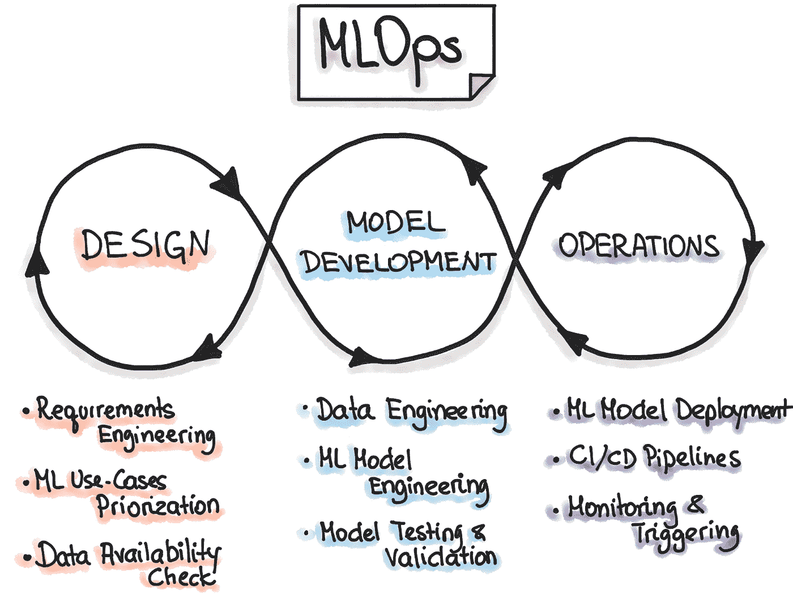
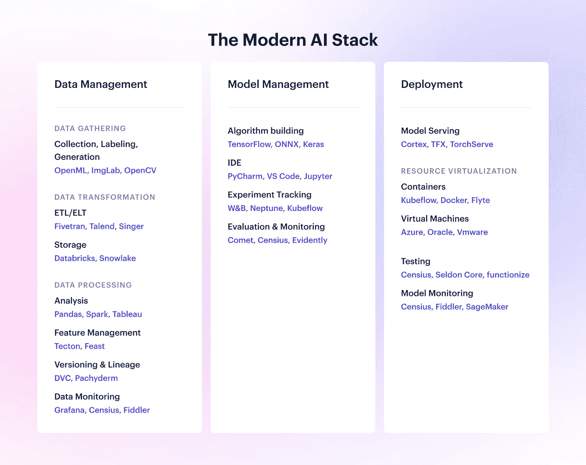
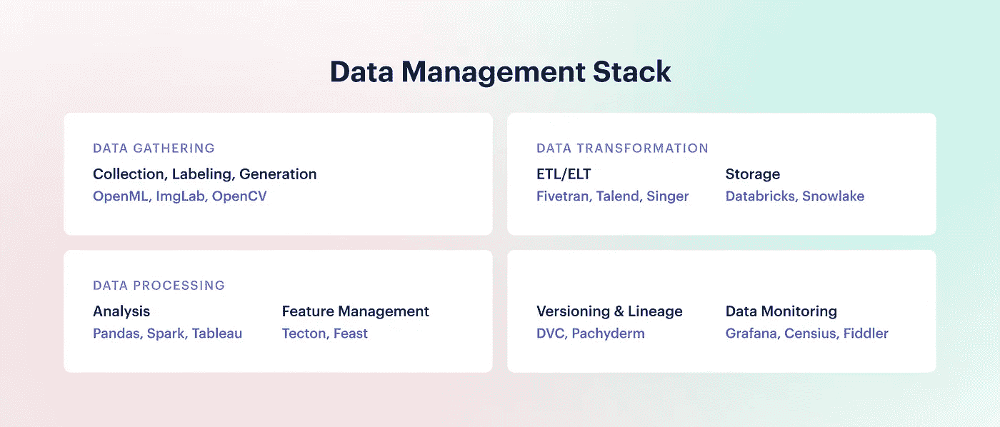
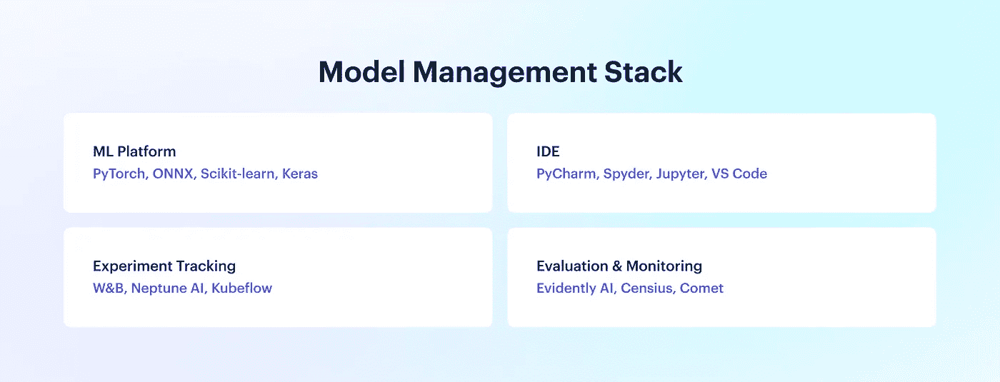
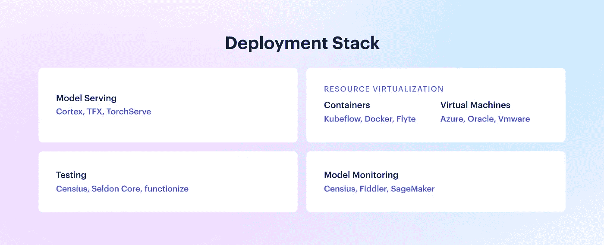

# 现代人工智能堆栈完全指南

> 原文：<https://towardsdatascience.com/the-complete-guide-to-the-modern-ai-stack-9fe3143d58ff>

## AI/ML 生命周期中的阶段、技巧和工具

图片来源:Unsplash

企业中的机器学习(ML)在一个狭窄的范围内迅速发展。虽然它呈指数级增长，但一些组织仍在努力跟上 ML 堆栈发展的步伐。

这份现代人工智能堆栈的端到端指南希望将最佳工具和实践纳入一个公共空间，作为以下方面的参考:

*   **人工智能领域的领导者**包括经理、总监、副总裁和首席技术官，他们可以了解更多关于新技术/集成的知识，并引导他们的团队走向现代人工智能堆栈
*   **数据科学家和 ML 工程师**，他们可以将他们当前的堆栈与我们提议的 AI 堆栈进行比较，并发现要采用的新技术。

但是首先，沿着记忆的小路走一走…

# 企业中 ML 的开始

机器学习在不久前还处于企业市场的实验阶段。就在五年前，大型服务公司刚刚开始涉足概念验证(POC)项目，广泛宣称机器学习(ML)是新兴技术，将影响作为其客户一部分的大量行业。

一旦客户开始规划智能解决方案的可能性，如预测性维护、异常检测、收入预测和推荐系统，就没有回头路了。然而，由于数据的动态性质，即使是最先进的模型也面临着不可避免的退化。下面的一些例子可以更好地理解这一点:

*   **未开发的适应**:一种癌症预测解决方案具有 99%的灵敏度，但没有明确定义的途径或监控方法来检测漂移的数据模式并悄悄地更新失败的模型。这里的数据漂移可能涉及从改变药物模式到输入设备/技术升级的任何地方。
*   **由于不可靠，需要更多的手动工作**:欺诈检测模型可以达到 95%的灵敏度，但必须在精确度上做出妥协，比如说 75%，这样才能过滤掉所有可能的欺诈案例。这导致在筛选检测到的案例后需要更多的手动工作，并限制了对无过失客户的询问操作。
*   **糟糕的客户体验**:贷款预测解决方案可能有 97%的准确率，但与每种机器学习算法一样，随着数据的变化，性能可能会下降。对于黑盒人工智能模型，没有明确的方法来理解贷款为什么被批准或拒绝。特别是在贷款被拒绝的情况下，客户需要一个适当的解释，如果没有这个解释，会有几次重复，导致客户体验不佳。

这些现实世界的问题自 AI 在企业中出现以来就一直存在，给客户打上了 AI 在很大程度上不可靠的烙印。作为专注于人工智能可观察性的 Censius 的创始人，我遇到了许多这样的故事，它们阻碍了自动化或基于人工智能的解决方案的可信度。

# 过渡到可靠的解决方案

人工智能/人工智能在经历了数年的试验阶段后，正朝着一个更为简化的方向发展。较大的组织已经开始完善他们的流程，以创建标准化的 ML 管道，这些管道针对规模、效率和控制进行了优化。

过去，由于数据科学家和工程师之间的巨大差距，团队无法保持敏捷，解决任何问题的时间都很慢。但最近，企业一直在努力通过实施**MLOps——一种机器学习解决方案的生命周期管理技术，为 ML 管道创建一个更可控的环境。**

MLOps 通过在整个 ML 管道中实施一套标准化实践，从需求收集开始，一直到在生产中监控解决方案，促进了开发和运营团队之间的沟通。这是确保 ML 解决方案的规模、速度和质量的基础。

通过 MLOps 实践，团队可以了解 ML 基础设施，并彻底了解 AI 性能和 ROI 机会——鉴于现实世界数据的动态行为，这在以前是一个重大挑战。密切跟踪 ML 管道以捕捉重复出现的问题仅仅是在 AI 领域注入可靠性的开始。至关重要的是，通过模型[可观察性](https://censius.ai/wiki/ai-observability)——m lops 生态系统的新兴支柱，超越模型监控，以实现对每个模型决策的剖析，并在规模上建立可解释和负责任的人工智能。

***我们显然正在迈向人工智能发展的下一个阶段，在这个阶段，人工智能产品提供了更多类似于 SaaS 工具的具体体验，增加了模型的可靠性、性能，并最终增加了客户的信任。***

# 现代人工智能堆栈是如何形成的

## 软件即服务(SaaS)并行

两大技术革命之间有相似之处:很久以前发生的 SaaS 革命和现在正在发生的人工智能进化。

在 SaaS，当微服务或面向服务的架构(SOA)的概念被引入时，它被证明比单一的应用程序更好。然而很快引发了数百个难以规模化的微服务的兴起。这导致了无服务器架构的发展，在这种架构中，资源在事件期间动态分配，一旦达到目的就被销毁，从而实现了巨大的可扩展性。

SaaS 的这一里程碑式的转变与人工智能目前的发展非常相似。随着人工智能从业者在回头客中发现更多价值，人工智能正逐步**从具有分散流程的易错系统演变为可扩展和可信的人工智能生态系统**，正如 SaaS 之前从分布式单片或 SOA 转变为大规模可靠的无服务器架构。

## 向 DevOps 学习

为了使从不可靠的人工智能到值得信赖的人工智能的飞跃成为可能，标准化的 MLOps 过程越来越多地被采用，以改善模型可见性、模型性能以及随着数据变化的实时故障排除。MLOps 与 DevOps 有着密切的联系，并一直受到它的启发。两者之间有几个相似之处，包括 CI/CD 实践、有效的协作方法以及提高管道中容错能力的共同目标。

DevOps 通过采用一套最佳实践和工具来鼓励开发和运营团队之间的快速协作，为开发人员和运营团队提供最佳实践，以高速构建和交付可靠的 SaaS 产品。 **MLOps 诞生于类似的需要，结合了 DevOps、数据工程和 ML 的实践。**合并三个不同的领域建立了 MLOps，以有竞争力地维持 DevOps 策略，同时适应 ML 管道的实验性质。

## 输入 MLOps

MLOps 是精简整个 ML 管道的过程，以便团队可以顺利地运行开发、生产、监控和维护活动。多年来，MLOps 已被证明能够带来多种好处，促使更多的组织效仿。

尽管 MLOps 仍处于早期形成阶段，但对早期采用者的好处已经很明显了。以下是团队在实施 MLOps 的早期就意识到的一些好处:

*   **实施经过验证的 CI/CD 方法**，在不中断产品体验的情况下，以首选频率推动变革。例如，[优步](https://analyticsindiamag.com/how-uber-implements-ci-cd-of-machine-learning-models/)采用 CI/CD 方法发布实时预测服务
*   **机器学习生命周期中测试阶段的自动化**，包括预测验证、数据质量监控、集成测试等。Nike[的 ML 团队能够自动化他们的 A/B 测试和服务渠道，管理集成模型的执行。](https://databricks.com/session/enabling-data-scientists-to-bring-their-models-to-market)
*   所有 ML 解决方案的技术债务最小化，尤其是在 ML 生命周期中频繁出现的维护活动中。[谷歌](https://hitinfrastructure.com/news/google-launches-machine-learning-platform-for-ai-maintenance)很容易就发现了这个问题，并推出了 Vertex AI，促进了人工智能的维护和发展。
*   **通过提高整个 ML 管道的可重复性，解决方案的可扩展性和脆弱性的降低**。为了通过 MLOps 战略实现 ML 渠道的规模化，[网飞](https://metaflow.org/)在内部开发了端到端的工作流程管理工具。

*MLOps 循环|来源:*[*ml-ops.org*](http://ml-ops.org)

随着公司试验 MLOps 并亲身体验其好处，它在现代人工智能堆栈中获得了永久的一席之地。让我们浏览堆栈的每一层，以更清楚地了解组装最佳流程、工具和 MLOps 实践，从而实现向可靠 AI 的飞跃。

# 现代人工智能堆栈的阶段

现代人工智能堆栈是吸收了 MLOps 实践的工具、服务和过程的集合，允许开发人员和运营团队在资源利用、团队工作、最终用户体验和维护活动方面有效地构建 ML 管道。

我们将讨论 ML 管道的每个阶段，并从 20 英尺的角度来看每个阶段可以利用的工具。

现代人工智能堆栈|作者图片

# 阶段 1:数据管理

数据管理有五个主要的对应部分:收集、转换、处理、版本控制和监控。

数据管理堆栈|作者图片

## 数据采集

数据收集过程经历了几个第三方工具和服务的交叉，这些工具和服务与内部工具集成在一起以组装可用的数据。

*   数据收集

数据收集通常涉及[网络搜集](https://scrapy.org/)，浏览旧数据库，并编写复杂的查询来提取它们。除了这些方法之外，数据集还直接来源于 [OpenML](https://www.openml.org/) 、 [Kaggle](https://www.kaggle.com/) 和[亚马逊数据集](https://aws.amazon.com/datasets/)等网站。

*   数据标记

需要对收集的数据进行处理和注释，以便机器可以在受监督的解决方案中学习适当的关系。数据标记在很大程度上一直是手动的，但最近出现了几个工具，如 [V7 labs](https://www.v7labs.com/) 、 [LabelMe](http://labelme.csail.mit.edu/Release3.0/) 和 [ImgLab](https://imglab.in/) ，这些工具大大自动化了标记，使大规模繁琐的过程成为可能。

然而，这一阶段仍然是一个人工密集型的过程，因为算法往往会遗漏特定的案例，并且审查非常耗时。你需要对收集什么类型的数据有明确的参数，并在标记过程中非常严格。亚马逊的 Mechanical Turk 和 Ground Truth 等工具也可以通过外包提供支持。

*   合成数据生成

尽管数据量很大，但有时数据并不总是可用于非常特定的用例，或者由于隐私问题而不被直接使用，例如罕见疾病数据。尽管这种数据很难获得，但对这种具有特定数据要求的模型的需求相对较高。有大量的工具和库支持各种数据类型的数据生成，包括图像、文本、表格等。

[Tensorflow](https://www.tensorflow.org/) 和 [OpenCV](https://opencv.org/) 是图像数据的理想选择，支持旋转、翻转、重缩放、亮度变化、颜色修改等等。 [Scikit-learn](https://scikit-learn.org/) 可以为表格数据创建合成数据点，并且 [scikit image](https://scikit-image.org/) 也支持图像数据。 [SymPy](https://www.sympy.org/) 和 [Pydbgen](https://readthedocs.org/projects/pydbgen/) 是分别支持符号表达式和分类数据生成的专用库。 [Hazy](https://hazy.com/) 和 [Datomize](https://www.datomize.com/) 也是两个有竞争力的合成数据生成工具，具有与第三方工具和应用程序集成的额外功能。

## 数据转换和存储

数据存储需要可靠的系统，能够长期支持可变的数据量而不损坏它。为了适应这种广泛的需求，组织越来越多地涉足结构化和非结构化数据的多种存储方法，如数据仓库、数据湖、数据库等。

*   ETL、ELT 和反向 ETL

ETL(提取、转换、加载)和 ELT(提取、加载、转换)是两种不同类型的数据转换系统。ETL 是传统的方法，当处理过的数据比保存原始数据具有更高的优先级时，ETL 是有利的。它将数据加载到临时暂存位置，对其进行处理，然后将其存储在目标位置。ELT 是更现代的方法，是时间优化和高数据量的理想选择。它首先将数据加载到目标位置，然后进行处理。

反向 ETL 是一个较新的发展，刚刚成为人们关注的焦点。它将数据存储连接到面向客户或基于行动的系统，如 CRMs 和 ERP，以实现跨应用程序的共享实时洞察，从而大规模个性化客户交互。

Oracle、T2、辛格、T4、IBM、Pentaho 和 Talend 提供了大量的 ETL 工具。ELT 是一项较新的技术，具有相对较少的专业选项，包括 [Fivetran](https://www.fivetran.com/blog/etl-vs-elt) 、 [Informatica](https://www.informatica.com/resources/articles/what-is-extract-load-transform.html) 和 [Airbyte](https://airbyte.com/) 。 [Airflow](https://airflow.apache.org/) 也是一个非常流行的开源工具，用于规划、调度和监控 ELT 管道。一些即将推出的反向 ETL 工具包括 [Hightouch](https://hightouch.io/blog/reverse-etl/) 、 [Hevo Data](https://hevodata.com/learn/reverse-etl/) 和 [Census](https://blog.getcensus.com/what-is-reverse-etl/) 。

*   储存；储备

数据存储有几个派别，每个派别都有不同的目的。例如，数据湖存储非结构化数据，并以灵活的格式聚合所有可用数据。另一方面，数据仓库存储经过处理的结构化数据。数据库对处理过的或结构化的数据有类似的要求，可以基于本地、云中，甚至是托管服务。有几个工具如[谷歌云平台](https://www.google.com/aclk?sa=l&ai=DChcSEwijvbSZjJT4AhVBkmYCHbuiCC8YABAAGgJzbQ&sig=AOD64_0RTziNIec45CJ7P6Nh_JvFcwZOfA&q&adurl&ved=2ahUKEwjmv6yZjJT4AhVJR2wGHUZtC30Q0Qx6BAgDEAE)、[数据块](https://databricks.com/)、 [SnowflakeDB](https://www.snowflake.com/) 和 [Azure cloud](https://azure.microsoft.com/en-in/) 提供有竞争力的存储设施。

这三种不同类型的数据存储设备的主要区别在于容量、交互频率和结构。简单的数据库存储结构化和过滤的数据，非常适合频繁的交互，而数据仓库是数据库的高级版本，针对跨多个接触点分析和存储大量结构化数据进行了优化。因为仓库依赖于转换和装载时间表，所以更新按照 ETL/ELT 的频率是滞后的。

最新的存储技术是数据湖库(Data Lakehouse ),它产生于存储种类繁多、数量巨大的非结构化数据的需求，这些数据不能立即被数据仓库或简单的数据库处理。随着数字系统和多个客户接触点生成的数据持续增长，data lakehouses 提供了管理丰富和高质量数据的解决方案，而无需丢失或处理这些数据。Data Lakehouse 不受格式限制且经济高效，是存储数据以供将来分析的理想而快速的方法。

## 数据处理

这是将原始数据转换为模型可以使用的有用数据的过程。原始输入被转换成数字、向量、嵌入等。供模特消费。

*   数据分析

数据分析(或探索性数据分析)是整个 ML 生命周期中最耗时的活动之一。用于分析的几个最流行的 python 库是 [NumPy](https://numpy.org/) 和 [pandas](https://pandas.pydata.org/) 。对于特定于大数据的用例， [Apache spark](https://spark.apache.org/) 是高速查询和分析数据的绝佳工具。

商业智能工具构成了分析过程的末端，其中涉及利益相关者的交互以获得商业见解。 [Tableau](https://www.tableau.com/) 和[超集](http://joinsuperset.com/)为报告生成提供了大量易于理解的可视化工具。

*   特征管理

在应对了管理大量原始数据、它们各自的特性和特性版本的挑战之后，特性存储成为热门话题就不足为奇了。特征存储跨机器学习解决方案存储、计算、管理和版本化特征，使得整个特征管道比手动管理更加可靠。 [Iguazio](https://www.iguazio.com/) 、 [Tecton](https://www.tecton.ai/) 、 [Feast](https://feast.dev/) 和 [Hopsworks](https://www.hopsworks.ai/) 是提供特色商店解决方案的一些工具。

对于特征工程任务，诸如 pandas 和 NumPy 之类的分析工具服务得很好。一旦特性逻辑最终确定，就可以通过 ide(如 [PyCharm](https://www.jetbrains.com/pycharm/) 和 [VS Code](https://code.visualstudio.com/) )对特性函数进行优化编写和打包。此活动的最终输出是一个数据清理管道，它可以处理静态和生产数据，后面是相关的特性函数。

## 数据版本和沿袭

出于同样的原因，数据版本控制和代码版本控制一样重要。考虑到数据是动态的且经常更新，除非仔细地进行版本控制，否则相同的过程不会对数据产生相同的结果。DVC 是一个开源工具，主要用于数据版本控制。它与语言无关，有助于构建可重复的数据管道。它集成了代码、数据、中间文件和存储工具，包括[亚马逊 S3](https://aws.amazon.com/s3/) 、[谷歌云](https://www.google.com/aclk?sa=l&ai=DChcSEwiMx5HUjpT4AhXNMysKHc7MDkEYABAAGgJzZg&sig=AOD64_3o71iDnHm4nW3jHWsJdn6M2Zy6qA&q&adurl&ved=2ahUKEwjfjIjUjpT4AhX2SmwGHSr_DlUQ0Qx6BAgDEAE)和硬盘。

另一方面，数据沿袭是在整个 ML 管道中仔细映射数据旅程的过程。有了数据血统，用户可以从数据中形成一个故事，看到版本如何随着时间的推移而演变，并在每个数据接触点之间建立逻辑联系。 [Pachyderm](https://www.pachyderm.com/) 提供数据版本和数据血统支持。它不仅支持分支、版本控制、提交和回购维护，还清晰地描绘了这些活动之间的关系。

## 数据监控

由于输入问题或手动错误，真实世界的数据有很多漏洞。如果错误的数据被允许传递到模型中，模型结果可能会产生误导。然而，保持大规模数据(比如数百万个数据点)的质量既费时又耗资源。自动监控是可以在有限的预算和时间内建立的最直接的 MLOps 实践。

像 [Censius](http://censius.ai) 这样的自动化监控工具密切检查质量问题，比如缺失值、不兼容的数据类型或数据异常。即使是概念模式，如数据漂移或不断变化的统计关系，也受到持续监控。还可以使用流量监视器来跟踪传入和传出的数据量。其他工具如[提琴手](http://fiddler.ai)和 [Grafana](https://grafana.com/) 也有监控功能。

# 阶段 2:模型训练和评估

数据和建模阶段是交织在一起的，开发人员必须在它们之间进行调整以获得最佳结果。但是，一旦数据被彻底收集、存储、分析并转化为可用的特征，模型构建基本上就开始了。

模型的建立有很多方面，其中最主要的是算法的选择。然而，在将时间和资源完全投入到算法之前，考虑计算、环境和安全限制同样重要。

模型管理堆栈|作者图片

## 算法选择

有各种各样的机器学习库，像 [TensorFlow](https://www.tensorflow.org/) 、 [scikit-learn](https://scikit-learn.org/) 、 [MXNET](https://mxnet.apache.org/) 、 [Keras](https://keras.io/) 、 [ONNX](https://onnx.ai/) 、 [PyTorch](https://pytorch.org/) 等等。它们中的每一个都带有特定的 USP，并在定制、灵活性、速度、易于采用、社区支持等方面具有优势。一旦选择了库，就可以开始常规的模型构建活动(如选择和调优)来执行一系列实验。

## 集成驱动电子设备

IDE 或集成开发环境就像软件开发的画布。它允许集成代码、编译器、调试器、目录、代码预测器和其他一些对代码编写和软件开发至关重要的特性。PyCharm 是一个用于核心开发的 goto IDE，因为它使得导入、代码链接和文件管理变得非常容易操作和理解，因此即使在所有权变更之后，项目也经历了最小的中断。

[VS 代号](https://code.visualstudio.com/)也是另一个热门选择。它几乎与操作系统无关，并支持与一些外部工具的集成，如 PyLint、Node.js 和 SQL。其他流行的 IDE 选择有 [Jupyter](https://jupyter.org/) 和 [Spyder](https://www.spyder-ide.org/) ，尤其是在实验阶段。MATLAB 主要用于学术领域，但也是支持整个应用程序代码的可行选择。

## 实验跟踪

机器学习不像软件开发那样简单。它涉及对数据、模型、特征组合甚至资源的多次实验，以找到达到最佳结果的优化路线。实验必须是可重复的，以便峰值结果可以被重新追踪并部署到生产中。

像 [MLFlow](https://mlflow.org/) 、 [Neptune](https://neptune.ai/) 和[Weights&bias](https://wandb.ai/site)这样的工具支持实验跟踪和元数据记录，以建立和维护可追踪和可再现的实验，这些实验适合于快速分析和选择。另一个值得关注的独特工具是[层](http://layer.ai)，它有助于构建、跟踪和训练所有机器学习项目元数据。协作式 ML 对于扩大规模至关重要，这也是我们 Censius 选择[与 Layer](https://censius.ai/blogs/censius-layer-partnership) 合作，将协作式且易于监控的 ML 项目引入社区的原因。

## 性能赋值

为了分析性能，需要跨实验和数据段对结果进行比较和监控。由于涉及到多个实验和比较，因此监控工具如 [Comet](https://www.comet.ml/) 、 [Censius](http://censius.ai) 和[apparent AI](https://evidentlyai.com/)会自动执行该过程，并在满足预先配置的条件时触发。

托管工具使数据科学家能够创建监视器，而无需编写任何代码或与工程团队协作。对标准和定制指标的支持也很关键，因为复杂的用例依赖于非常具体的定制指标。此外，将性能与其他检测到的问题(如模型漂移或数据质量差)相关联的能力非常适合根本原因检测。像 [Censius](http://censius.ai) 这样的工具可以帮助团队满足上述必备的需求以及一些有用的特性。

# 第 3 阶段:部署

部署阶段是解决方案和最终用户之间的直接连接器，使其成为 ML 生命周期中最重要的方面之一。这一阶段的重点是基础设施、环境和模型服务管道的一致性。

即使是微小的细节，如最新模型版本与生产环境之间的不兼容，也可能暗示着不久的将来会出现停机。自动化部署管道的很大一部分可以在大范围内处理这些微小的细节。

部署堆栈|作者图片

## 模型服务

模型服务是在本地、公共云或私有云上托管开发的机器学习解决方案的过程。模型服务阶段的主要目标是确保集成应用程序或最终用户可以轻松访问解决方案。

[Cortex](https://www.cortex.dev/) 、[tensor flow Serving](https://www.tensorflow.org/tfx/guide/serving)(tensor flow Extended 可用)、 [Seldon](https://www.seldon.io/) 和 [Torchserve](https://pytorch.org/serve/) 是一些模型服务工具，它们允许 API 管理和可伸缩性、多模型服务、轻松的云可访问性、协作和更多选项来简化生产。

## 资源虚拟化

资源虚拟化支持隔离的环境和实验，这些环境和实验构成了 ML 生命周期中易于管理的模型训练、模型选择和部署阶段的基础。它还优化了生产环境中的故障排除，为再现性和可扩展性铺平了道路。

*   虚拟机

虚拟机类似于容器，不同之处在于它允许虚拟化 ML 管道的所有层，包括硬件层，而容器只提供软件层。

当需要运行具有不同操作系统要求的多个应用程序时，虚拟机是理想的选择。虚拟机由几家供应商提供，包括行业领导者，如 [VMware](https://www.vmware.com/in/products/workstation-player.html) 、[谷歌](https://cloud.google.com/compute)、[甲骨文](https://www.oracle.com/in/virtualization/technologies/vm/downloads/virtualbox-downloads.html)和 [Azure](https://azure.microsoft.com/en-in/services/virtual-machines/) 。

*   容器

集装箱化是隔离环境的行为，以保持清洁的实验，不损害或改变其他实验，并容易实现操作，如 A/B 测试。它使开发人员能够轻松地管理开发和部署活动，使过渡更加顺畅。容器非常容易运输，独立于平台，轻量级，并且易于管理。 [Kubernetes](https://kubernetes.io/) 和 [Docker](https://www.docker.com/) 对于部署独立的微环境是有效的。自动化工具如 [Kubeflow](https://www.kubeflow.org/) 和 [Flyte](https://flyte.org/) 优化和管理运行在容器上的复杂工作流程。

容器通常比虚拟机更加便携和高效，因为它们可以利用主机操作系统，而不必每次都启动一个。由于在实际需求中更加灵活和经济，容器在大多数情况下已经超过了虚拟机。

## 测试

模型和基础设施测试通过在模型预测到达最终用户之前过滤掉次要问题和主要问题来确保高质量的客户体验。需要在各种环境和容器中进行测试。

测试工具通常应该与广泛的基础设施一起工作，无论是内部部署、云还是容器，并支持跨培训和生产环境的 A/B 测试和故障排除。各种测试支持的几个选项包括[functionalize](https://www.functionize.com/)、[app advance](https://www.appvance.ai/)和 [Seldon Core](https://www.seldon.io/solutions/open-source-projects/core) 。

## 模型监控

生产中的输入流带来原始数据，管道对这些数据进行处理，以提供预测作为输出。一旦事件被触发，通常在预测之后，就会记录另一个实际值的输入流。

监控工具确保不仅跟踪原始数据和模型输出，而且跟踪实际值，以检测任何不自然的行为。生产中的监控需要彻底，包括数据质量、模型漂移、偏差、流量和性能监控。其中每一项都可以通过几个指标进行评估，这些指标由自动化监控工具跟踪，如 [Censius](http://censius.ai) 、 [Fiddler](http://fiddler.ai) 和[亚马逊 SageMaker](https://aws.amazon.com/sagemaker/) 以及人工智能可观察性工具，如 [Censius](http://censius.ai) 。

监控只是解决人工智能问题的开始。要解决触发显示器的问题，详细解释导致该问题的原因至关重要。重要的是用模型可观察性扩展模型监控，因为它提供了每个模型决策的完整剖析。这样，根本原因很容易被识别并迅速修复，使开发者能够大规模地构建可解释的和负责任的人工智能。

# 最后一个音符

随着人工智能从业者测试和汲取现代人工智能堆栈的好处，更多的工具正在出现以满足需求。虽然有太多的工具可供选择来构建整体的人工智能堆栈，但您需要检查三个要点:

*   *对该工具的投资是否远低于从头构建其功能的成本？*
*   *该工具是否易于采用和使用，是否有可靠的客户支持？*
*   *该工具的可定制性是否足以满足基本需求之外的附加功能？*

一旦你勾掉了主要条件，其他因素如易用性、平台、与基础设施无关的设置、无代码或低代码能力等。可以被照顾。

人工智能堆栈可能会势不可挡，尤其是对那些刚刚开始这一旅程的人来说。诀窍是通过自动化和声明性方法来接近第一个具有成本效益且可大规模实现的垫脚石。

**取得联系！**

如果你想了解更多关于 MLOps 和可靠的 AI 框架，请参考我们的[资源(博客、电子书、白皮书](https://censius.ai/blogs))。如果您有任何问题或想了解更多信息，欢迎发送电子邮件至 [hello@censius.ai](mailto:hello@censius.ai) 或在此分享您的评论。