# 使用 Sklearn、Pandas 和 Numpy 进行时间序列预测的完整指南

> 原文：<https://towardsdatascience.com/the-complete-guide-to-time-series-forecasting-using-sklearn-pandas-and-numpy-7694c90e45c1>

## 在 Python 中使用任何 scikit-learn 模型进行时间序列预测的实践教程和框架


[王禹](https://unsplash.com/@stanyw?utm_source=medium&utm_medium=referral)在 [Unsplash](https://unsplash.com?utm_source=medium&utm_medium=referral) 上拍照

# 介绍

时间序列预测有很多所谓的*传统*模型，比如 [SARIMAX](https://www.datasciencewithmarco.com/blog/time-series-forecasting-with-sarima-in-python) 系列模型、[指数平滑](https://www.datasciencewithmarco.com/offers/G6ULNc7n)，或者 [BATS 和 TBATS](https://www.datasciencewithmarco.com/blog/how-to-forecast-time-series-with-multiple-seasonalities) 。

然而，我们很少提到最常见的回归机器学习模型，如决策树，随机森林，梯度推进，甚至支持向量回归机。我们看到这些模型广泛应用于典型的回归问题，但不是时间序列预测。

因此写这篇文章的原因！在这里，我们设计了一个框架，将一个时间序列问题框定为一个监督学习问题，允许我们从我们最喜欢的库中使用任何我们想要的模型: *scikit-learn* ！

到本文结束时，您将拥有将任何机器学习模型与上述统计模型一起应用于时间序列预测的工具和知识。

我们开始吧！

完整的源代码可以在 [GitHub](https://github.com/marcopeix/datasciencewithmarco/blob/master/sklearn_time_series.ipynb) 上获得。

> ***用我的*** [***免费时间序列小抄***](https://www.datasciencewithmarco.com/pl/2147608294) ***在 Python 中学习最新的时间序列分析技巧！获得统计和深度学习技术的实现，全部在 Python 和 TensorFlow 中！***

# 准备数据集

首先，我们导入完成教程所需的所有库。

```
import numpy as np
import pandas as pd
import statsmodels.api as sm
import matplotlib.pyplot as plt
```

这里，我们使用 *statsmodels* 库来导入数据集，这是从 1958 年到 2001 年的每周 CO2 浓度。

```
data = sm.datasets.co2.load_pandas().data
```

一个好的第一步是用下面的代码块可视化我们的数据。

```
fig, ax = plt.subplots(figsize=(16, 11))ax.plot(data['co2'])
ax.set_xlabel('Time')
ax.set_ylabel('CO2 concentration (ppmw)')fig.autofmt_xdate()
plt.tight_layout()
```


1958 年至 2001 年的周 CO2 浓度(ppmv)。我们注意到，由于季节的原因，数据中存在明显的年度季节性(冬季的 CO2 浓度高于夏季)。还有一个明显的积极趋势，我们注意到数据集开始时有一些缺失的数据。图片由作者提供。

从上图中，我们注意到数据中明显的积极趋势，因为浓度随着时间的推移而增加。我们还观察到一种年度季节性模式。这是由于季节的变化，冬季的 CO2 浓度高于夏季。最后，我们在数据集的开头看到一些缺失的数据。

然后，让我们用插值法处理缺失的数据。我们将简单地在两个已知点之间进行线性插值来填充缺失值。

```
data = data.interpolate()
```

既然我们没有丢失数据，我们就可以开始建模了！

# 使用 scikit 建模-学习

正如您将看到的，用 scikit-learn 预测时间序列的最大挑战是正确设置问题。

有 3 种不同的方法可以将时间序列预测问题构建为监督学习问题:

1.  使用之前的观察预测下一个时间步
2.  使用一系列过去的观察结果预测下一个时间步
3.  使用一系列过去的观测值预测一系列未来的时间步长

让我们详细探讨每种情况！

## 使用之前的观察预测下一个时间步

这是最基本的设置。该模型输出下一个时间步长的预测，仅给出前一个观察值，如下图所示。

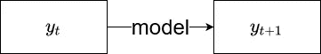

根据前面的观察，模型被训练来预测下一个时间步。图片由作者提供。

这是一个几乎没有实际应用的简单用例，因为一个模型很可能不会仅仅从之前的观察中*学到*任何东西。然而，它可以作为一个很好的起点，帮助我们理解后面更复杂的场景。

现在，我们的数据集看起来像这样:

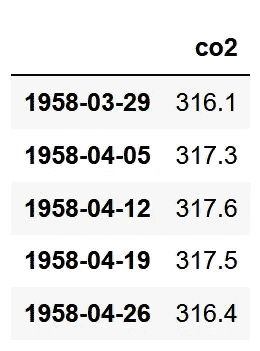

作者图片

这不是很有用。没错，所有的值都在一列中，但是我们需要格式化数据集，使得当前观察值是预测下一个观察值(目标)的特征。

因此，我们添加了第二列，该列简单地移动了 *co2* 列，使得 1958–03–29 的值现在是 1958–04–05 的值的预测值。

```
df = data.copy()df['y'] = df['co2'].shift(-1)
```

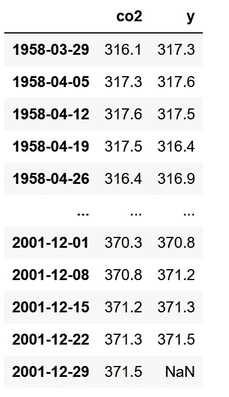

数据集没有被格式化为监督学习问题，其中当前观察是特征，下一个观察是目标。图片由作者提供。

正如您所看到的，我们的数据集现在已经格式化，因此每个当前观察都是下一个观察的预测值！请注意，我们的数据集末尾缺少一个值。这对于最后已知的观察来说是正常的。我们将在以后的步骤中删除该行。

现在，让我们将数据集分成训练集和测试集，以便运行我们的模型并对它们进行评估。这里，我们使用最近两年的数据作为训练集。由于我们有每周数据，并且一年有 52 周，这意味着最后 104 个样本被保留用于测试集。

```
train = df[:-104]
test = df[-104:]
test = test.drop(test.tail(1).index) # Drop last row
```

**基线模型**

当然，我们需要一个基线模型来确定使用机器学习模型是否更好。这里，我们天真地预测下一个观察值将与当前观察值相同。

换句话说，我们简单地将 *co2* 列设定为我们的基线预测。

```
test = test.copy()
test['baseline_pred'] = test['co2']
```

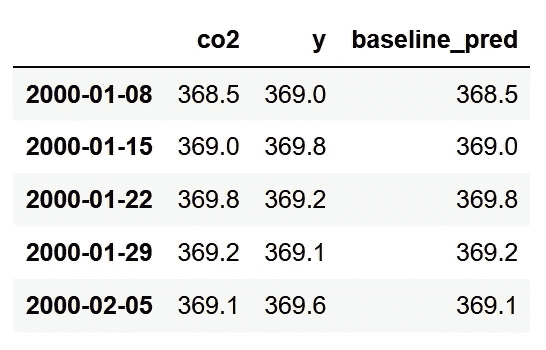

基线预测只是简单地重复未来已知的观察。图片由作者提供。

太好了！完成这一步后，让我们继续更复杂的模型。

**决策树**

这里，让我们应用一个决策树回归器。这个模型可以被 scikit-learn 库中您想要的任何模型替换！请注意，我们使用随机状态来确保可重复性。

```
from sklearn.tree import DecisionTreeRegressorX_train = train['co2'].values.reshape(-1,1)
y_train = train['y'].values.reshape(-1,1)
X_test = test['co2'].values.reshape(-1,1)# Initialize the model
dt_reg = DecisionTreeRegressor(random_state=42)# Fit the model
dt_reg.fit(X=X_train, y=y_train)# Make predictions
dt_pred = dt_reg.predict(X_test)# Assign predictions to a new column in test
test['dt_pred'] = dt_pred
```

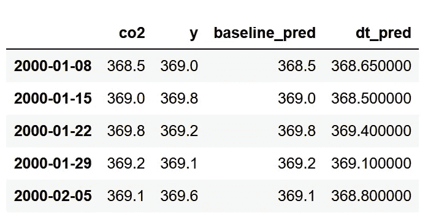

测试集现在有来自决策树模型的预测！图片由作者提供。

注意，我们保持建模部分简单。我们不执行任何交叉验证或超参数调整，尽管这些技术可以正常应用于此，就像在任何其他回归问题中一样。

随意运用这些技巧，看看你是否能得到更好的表现。

**梯度增强**

为了尝试不同的模型，让我们现在应用梯度推进。

```
from sklearn.ensemble import GradientBoostingRegressorgbr = GradientBoostingRegressor(random_state=42)gbr.fit(X_train, y=y_train.ravel())gbr_pred = gbr.predict(X_test)test['gbr_pred'] = gbr_pred
```

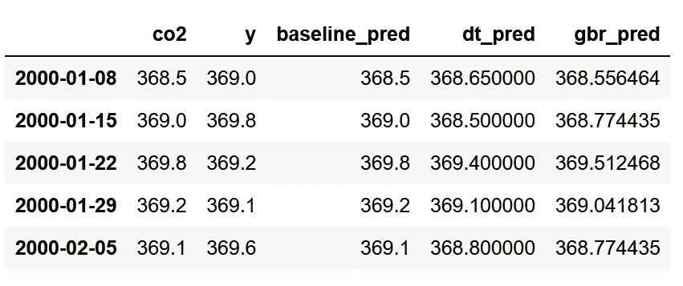

测试集现在具有来自梯度推进模型的预测。图片由作者提供。

太好了！我们现在有了来自两个机器学习模型和一个基线的预测。是时候评估每种方法的性能了。

**评估**

这里，我们使用平均绝对百分比误差(MAPE)。这是一个特别有用误差指标，因为它返回一个百分比，很容易解释。确保只在没有接近 0 的值时应用它，这里就是这种情况。

不幸的是，MAPE 还没有在 *scikit-learn* 中实现，所以我们必须手工定义这个函数。

```
def mape(y_true, y_pred):
    return round(np.mean(np.abs((y_true - y_pred) / y_true)) * 100, 2)
```

然后，我们可以评估每个模型，并生成以下条形图:

```
baseline_mape = mape(test['y'], test['baseline_pred'])
dt_mape = mape(test['y'], test['dt_pred'])
gbr_mape = mape(test['co2'], test['gbr_pred'])# Generate bar plot
fig, ax = plt.subplots(figsize=(7, 5))x = ['Baseline', 'Decision Tree', 'Gradient Boosting']
y = [baseline_mape, dt_mape, gbr_mape]ax.bar(x, y, width=0.4)
ax.set_xlabel('Regressor models')
ax.set_ylabel('MAPE (%)')
ax.set_ylim(0, 0.3)for index, value in enumerate(y):
    plt.text(x=index, y=value + 0.02, s=str(value), ha='center')

plt.tight_layout()
```

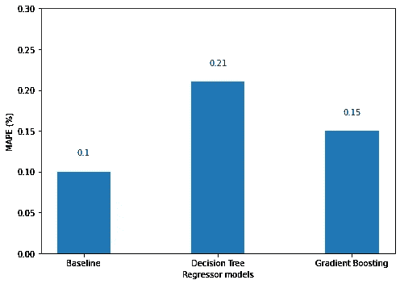

每种预测方法的 MAPE。这里，基线提供了最佳性能，因为它具有最低的 MAPE。图片由作者提供。

看上面的图，我们看到基线具有最好的性能，因为它具有最低的 MAPE。这是有道理的，因为二氧化碳浓度似乎不会从一周到另一周发生剧烈变化。

在这种情况下，使用机器学习模型并没有给我们带来任何附加值。同样，这可能是因为模型仅从一个观察中学习来做出预测。最好给它一个序列作为输入，以便预测下一个时间步。

这就把我们带到了下一个场景！

## 使用一系列过去的观察结果预测下一个时间步

正如我们在前面的例子中所看到的，使用单个观察值来预测下一个时间步并不是很好。现在，让我们尝试使用一个序列作为模型的输入，并预测下一个时间步，如下所示

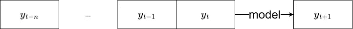

采用输入序列预测下一时间步的模型的模式。图片由作者提供。

同样，我们必须格式化我们的数据集，以便我们有一系列过去的观察值作为下一个时间步的预测值。

我们可以很容易地编写一个函数，通过添加移位的列来获得所需的输入长度。

```
def window_input(window_length: int, data: pd.DataFrame) -> pd.DataFrame:

    df = data.copy()

    i = 1
    while i < window_length:
        df[f'x_{i}'] = df['co2'].shift(-i)
        i = i + 1

    if i == window_length:
        df['y'] = df['co2'].shift(-i)

    # Drop rows where there is a NaN
    df = df.dropna(axis=0)

    return df
```

让我们使用这个函数输入 5 个观测值，以便预测下一个时间步。

```
new_df = window_input(5, data)
```

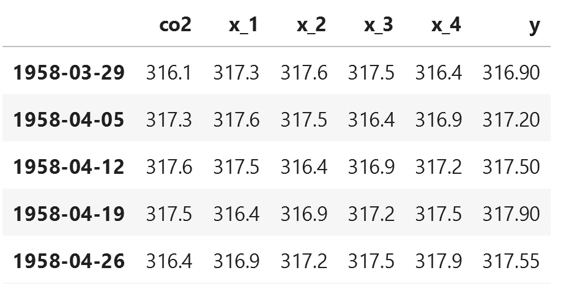

结果数据集。如你所见，我们现在有 5 个观测值作为下一个时间步的预测值。图片由作者提供。

查看上图，我们可以看到我们的数据集以这样的方式排列，我们有五个观察值来预测下一个时间步，存储在 *y* 列中。

这基本上解决了最难的部分！现在，简单的问题是应用不同的模型，看看哪个表现最好。

在进入这一步之前，让我们首先将数据分为训练集和测试集。

```
from sklearn.model_selection import train_test_split

X = new_df[['co2', 'x_1', 'x_2', 'x_3', 'x_4']].values
y = new_df['y'].values

X_train, X_test, y_train, y_test = train_test_split(X, y, test_size=0.3, random_state=42, shuffle=False)
```

**基线模型**

同样，让我们为这种情况定义一个基线模型。这里，我们将简单地预测输入序列的平均值

```
baseline_pred = []

for row in X_test:
    baseline_pred.append(np.mean(row))
```

**决策树**

同样，让我们应用决策树回归器。这与前面的实现一样简单。

```
dt_reg_5 = DecisionTreeRegressor(random_state=42)

dt_reg_5.fit(X_train, y_train)

dt_reg_5_pred = dt_reg_5.predict(X_test)
```

**梯度增强**

为了保持一致，我们也来试试梯度提升。

```
gbr_5 = GradientBoostingRegressor(random_state=42)

gbr_5.fit(X_train, y_train.ravel())

gbr_5_pred = gbr_5.predict(X_test)
```

**评估**

我们现在可以评估每个模型的性能。同样，我们使用 MAPE 并将结果绘制在柱状图中。这基本上是和以前一样的代码。

```
baseline_mape = mape(y_test, baseline_pred)
dt_5_mape = mape(y_test, dt_reg_5_pred)
gbr_5_mape = mape(y_test, gbr_5_pred)# Generate the bar plotfig, ax = plt.subplots()

x = ['Baseline', 'Decision Tree', 'Gradient Boosting']
y = [baseline_mape, dt_5_mape, gbr_5_mape]

ax.bar(x, y, width=0.4)
ax.set_xlabel('Regressor models')
ax.set_ylabel('MAPE (%)')
ax.set_ylim(0, 2.5)

for index, value in enumerate(y):
    plt.text(x=index, y=value + 0.1, s=str(value), ha='center')

plt.tight_layout()
```

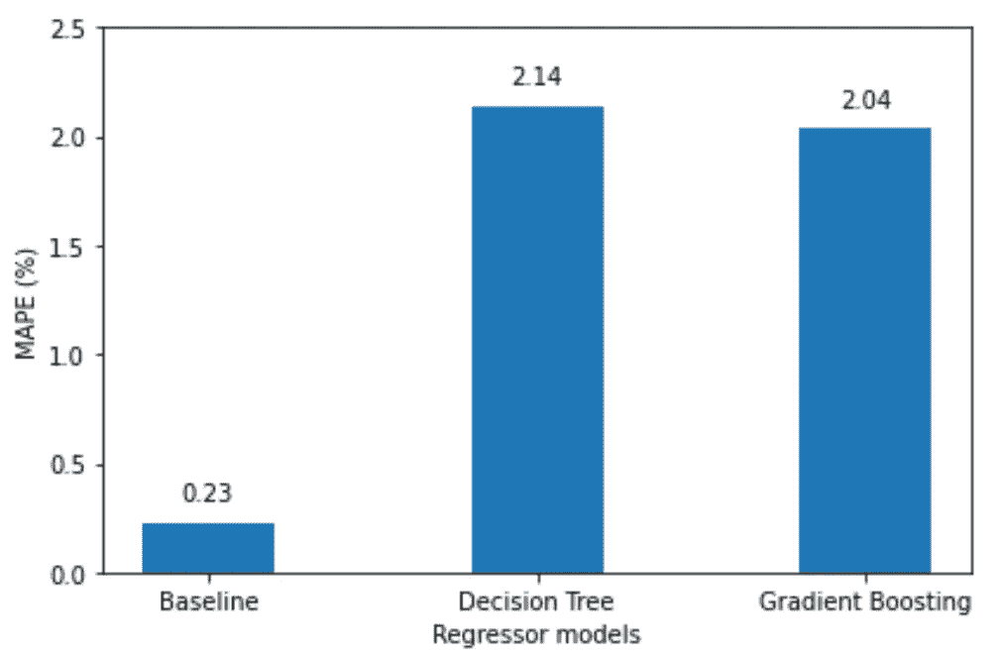

MAPE 针对不同的预测方法使用五个观测值来预测下一个时间步。同样，机器学习模型并没有超越基线。图片由作者提供。

令人惊讶的是，从上图中，我们看到机器学习模型并没有超越基线。

虽然超参数调整可能会提高 ML 模型的性能，但我怀疑输入窗口太短。五周的输入不足以让模型获得趋势和季节性成分，因此我们可能需要更长的时间窗口。

我们将在下一个场景中尝试这样做！

## 使用一系列过去的观测值预测一系列未来的时间步长

最后一个场景是使用一系列观察值来预测一系列未来的时间步长，如下所示。

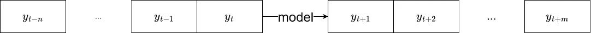

采用输入序列并预测未来时间步长序列的模型架构。图片由作者提供。

这里，我们的模型需要输出一系列预测。这可以看作是一个多输出回归问题。

因此，第一步是适当地格式化我们的数据集。我们开发了另一个函数，它使用 *shift* 方法将数据集格式化为多输出回归问题。

```
def window_input_output(input_length: int, output_length: int, data: pd.DataFrame) -> pd.DataFrame:

    df = data.copy()

    i = 1
    while i < input_length:
        df[f'x_{i}'] = df['co2'].shift(-i)
        i = i + 1

    j = 0
    while j < output_length:
        df[f'y_{j}'] = df['co2'].shift(-output_length-j)
        j = j + 1

    df = df.dropna(axis=0)

    return df
```

这里，我们将使用 26 个观测值的序列来预测接下来的 26 个时间步。换句话说，我们输入半年来预测下半年。注意，输入和输出序列不需要具有相同的长度。这是我的一个武断的决定。

```
seq_df = window_input_output(26, 26, data)
```

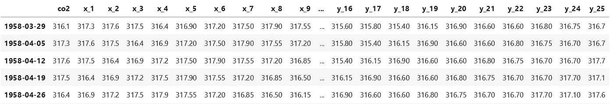

数据集未格式化，因此 26 个观察值是接下来 26 个时间步的预测值。图片由作者提供。

如您所见，我们现在有一个数据集，其中 26 个观测值用作接下来 26 个时间步长的预测值。

在继续建模之前，我们再次将数据分为训练集和测试集。这里，我们为测试集保留最后两行，因为它给了我们 52 个测试样本。

```
X_cols = [col for col in seq_df.columns if col.startswith('x')]

X_cols.insert(0, 'co2')

y_cols = [col for col in seq_df.columns if col.startswith('y')]X_train = seq_df[X_cols][:-2].values
y_train = seq_df[y_cols][:-2].values

X_test = seq_df[X_cols][-2:].values
y_test = seq_df[y_cols][-2:].values
```

**基线模型**

作为基线模型，我们将简单地重复输入序列。换句话说，我们获取输入序列并输出与基线预测相同的序列。

这是一个非常琐碎的预测，所以我们将在准备评估模型时实现它。

**决策树**

同样，让我们尝试应用决策树。注意，决策树可以产生多输出预测，所以我们不需要在这里做任何额外的工作。

```
dt_seq = DecisionTreeRegressor(random_state=42)

dt_seq.fit(X_train, y_train)

dt_seq_preds = dt_seq.predict(X_test)
```

**梯度推进**

现在，梯度推进需要一点额外的工作。它不能处理多输出目标。试图立即拟合梯度增强模型将导致错误。

在这里，我们必须包装模型，以便它的预测被用作下一个预测的输入。这是通过使用来自 *scikit-learn* 的*回归链*包装器实现的。

```
from sklearn.multioutput import RegressorChain

gbr_seq = GradientBoostingRegressor(random_state=42)

chained_gbr = RegressorChain(gbr_seq)

chained_gbr.fit(X_train, y_train)

gbr_seq_preds = chained_gbr.predict(X_test)
```

这允许训练模型并进行预测，而不会遇到任何错误。正如我提到的，在幕后，模型预测下一个时间步，并使用该预测进行下一次预测。这种方法的缺点是，如果第一个预测是坏的，那么序列的其余部分很可能也是坏的。

现在我们来评价一下每一款。

**评估**

同样，我们使用 MAPE 来评估我们的预测方法。

```
mape_dt_seq = mape(dt_seq_preds.reshape(1, -1), y_test.reshape(1, -1))
mape_gbr_seq = mape(gbr_seq_preds.reshape(1, -1), y_test.reshape(1, -1))
mape_baseline = mape(X_test.reshape(1, -1), y_test.reshape(1, -1))# Generate the bar plotfig, ax = plt.subplots()

x = ['Baseline', 'Decision Tree', 'Gradient Boosting']
y = [mape_baseline, mape_dt_seq, mape_gbr_seq]

ax.bar(x, y, width=0.4)
ax.set_xlabel('Regressor models')
ax.set_ylabel('MAPE (%)')
ax.set_ylim(0, 1)

for index, value in enumerate(y):
    plt.text(x=index, y=value + 0.05, s=str(value), ha='center')

plt.tight_layout()
```

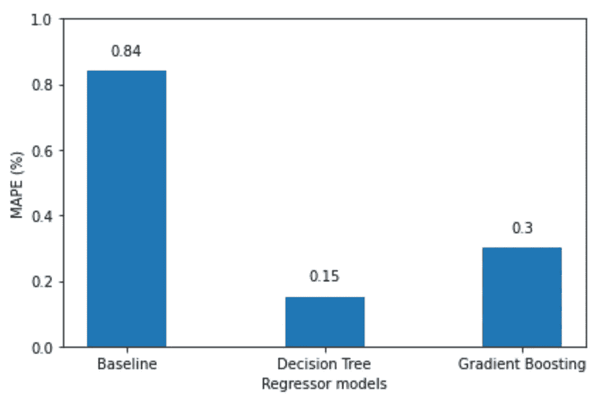

所有多输出回归模型的 MAPE。这里，ML 模型优于基线，决策树是最好的模型。图片由作者提供。

从上图可以看出，我们终于成功训练出了跑赢基线的 ML 模型！在这里，决策树模型是冠军模型，因为它实现了最低的 MAPE。

我们可以选择将去年的预测可视化。

```
fig, ax = plt.subplots(figsize=(16, 11))ax.plot(np.arange(0, 26, 1), X_test[1], 'b-', label='input')
ax.plot(np.arange(26, 52, 1), y_test[1], marker='.', color='blue', label='Actual')
ax.plot(np.arange(26, 52, 1), X_test[1], marker='o', color='red', label='Baseline')
ax.plot(np.arange(26, 52, 1), dt_seq_preds[1], marker='^', color='green', label='Decision Tree')
ax.plot(np.arange(26, 52, 1), gbr_seq_preds[1], marker='P', color='black', label='Gradient Boosting')ax.set_xlabel('Timesteps')
ax.set_ylabel('CO2 concentration (ppmv)')plt.xticks(np.arange(1, 104, 52), np.arange(2000, 2002, 1))
plt.legend(loc=2)fig.autofmt_xdate()
plt.tight_layout()
```

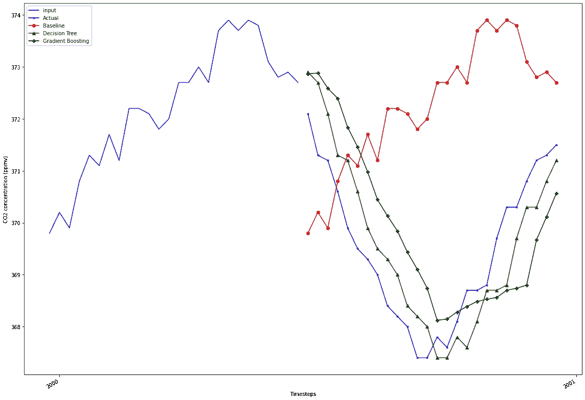

可视化去年每个模型的预测。显然，基线偏离得很远，而决策树和梯度推进更接近实际值。图片由作者提供。

进一步支持 MAPE，我们可以看到决策树和梯度推进比基线预测更接近实际值。

在本文中，我们看到了如何将时间序列预测问题构建为一个回归问题，可以使用 *scikit-learn* 回归模型来解决该问题。

我们探讨了以下场景:

1.  使用之前的观察预测下一个时间步
2.  使用一系列过去的观察结果预测下一个时间步
3.  使用一系列过去的观测值预测一系列未来的时间步长

我们现在有了一个框架，可以将任何时间序列预测问题构建为一个监督学习问题，在这个框架中，您可以应用来自 *scikit-learn* 的任何回归模型。

我希望这篇文章对你有用！

一定要下载我用 Python 写的[免费时间序列预测小抄](https://www.datasciencewithmarco.com/pl/2147608294)，涵盖统计和深度学习模型！

干杯！🍺