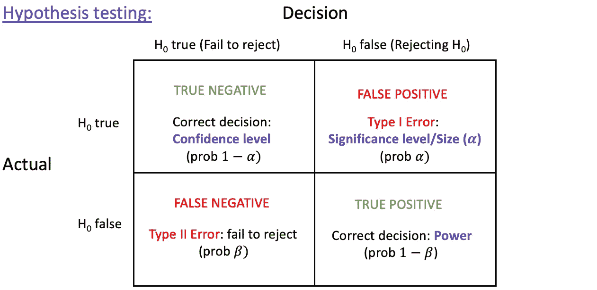
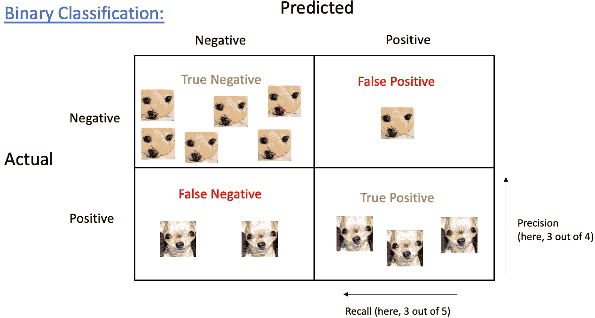
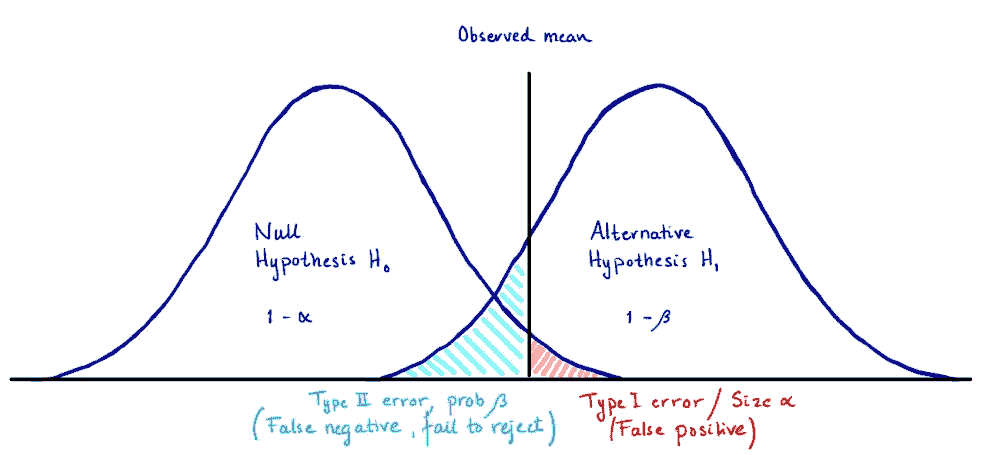
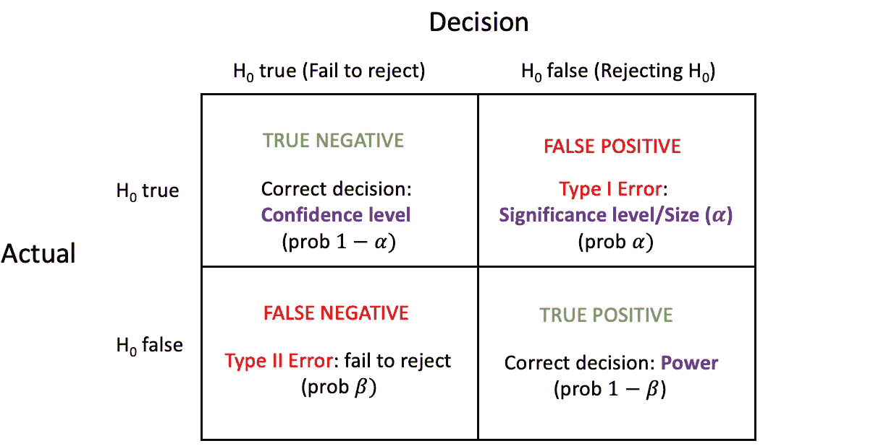

# 假设检验中的混淆矩阵

> 原文：<https://towardsdatascience.com/the-confusion-matrix-explained-part-1-5513c6f659c1>

## 使用混淆矩阵识别和理解 I 型错误、II 型错误和幂。

罗伯特·卡茨基在 [Unsplash](https://unsplash.com?utm_source=medium&utm_medium=referral) 上的照片

在推理分析(如 A/B 测试)和预测分析(如分类)中，混淆矩阵对于理解和评估统计测试或预测模型的某些任务非常有用。两者都涉及做出二元决策。在假设检验中，我们拒绝或未能拒绝零假设，在二元分类中，分类器将预测一个观察结果是肯定的还是否定的。

这两项任务都允许我们将结果组织成一个 2x2 的混淆矩阵，显示真阳性和假阳性，以及真阴性和假阴性。如果你看下面的两个矩阵，你会发现两个矩阵的结构都是一样的，矩阵主对角线上的条目对应正确的决策。

作者图片

作者图片

虽然矩阵以相同的方式构造，并且本质上也包含相同类型的测量，但是矩阵中包含的信息根据上下文而不同地命名和使用。在假设检验中，混淆矩阵包含不同结果的概率，这有助于我们理解检验的某些属性，如 I 型和 II 型错误和功效。在二元预测或分类中，每个方块(TP、FP、TN 和 FN)的计数用于计算不同的度量来评估某个预测模型。

在本文中，我们将在假设检验的背景下研究混淆矩阵。你可以在这里阅读关于分类问题的[混淆矩阵。](https://medium.com/@andreagustafsen/the-confusion-matrix-explained-part-2-6be183f180e0)

 [## 分类中的混淆矩阵

### 使用混淆矩阵评估二元分类器的性能。如何计算性能指标…

towardsdatascience.com](/the-confusion-matrix-explained-part-2-6be183f180e0) 

# 可视化假设检验

假设检验是检验两个样本分布之间的差异是否是由两组之间的实际差异引起的，或者该差异是否可以通过随机机会来解释的方法。

为了在推理分析的背景下理解混淆矩阵，查看下面的单侧假设检验的可视化表示可能会有所帮助，以显示矩阵中的四个可能结果如何与假设检验的可能事件相对应。

作者图片

作者图片

# 第一类误差(α)

I 型误差也称为测试的*大小*或*显著性水平*。它用 alpha 表示，通常设置为 0.05。第一类错误代表假设检验的**假阳性**，意味着我们错误地拒绝了假设为真的零假设。

*   **I 型误差(α)= P(拒绝 null | Null 为真)**

如果我们比较两个组的平均值，这意味着我们错误地得出两个组的平均值不同的结论，而实际上两个组的平均值是相同的。

类型 I 错误对应于图中的红色区域。即使零假设为真，我们也会在拒绝区域找到检验统计量，并在 5%的情况下错误地拒绝零假设。很多人对此感到困惑。如果检验统计量落在拒绝区域，怎么可能是假阳性？

好吧，考虑一下 p 值的行为。(所有的测试统计，像 z，t，chisq，f 等。可以转换为范围从 0 到 1 的 p 值。)在零假设下，并且满足测试的所有假设，p 值应该在 0 和 1 之间形成均匀分布。在重复采样的情况下，我们期望一些 p 值是<0.05, due to natural variation in the data and random sampling. While it is more unlikely to draw a sample with extreme values than a sample with less extreme values, it does happen due to chance. That is why we expect that, on average, 5% of rejected nulls will be false positives.

Can we not just lower the alpha value, you might ask. We can do that, and you can see that some studies use the lower significance level 0.01\. But we must be aware that this also affects the power of the test negatively which is not optimal.

# Type II error (beta)

Type II error is what the matrix shows as **假阴性，**并且被表示为β。这发生在当我们未能拒绝零假设的替代假设为真的时候。

*   **第二类误差(β)= P(拒绝无效|备选项为真)**

如果我们在比较两组的平均值，这意味着我们错误地得出了平均值没有差异的结论，而实际上两组的平均值是不同的。换句话说，当事实上存在差异时，我们无法察觉到差异。

如果测试没有足够的能力，这种情况会更频繁地发生。

# 力量

功效是指当零假设为假时，正确拒绝零假设的概率，即**真阳性**。幂是第二类错误(β)的补码:1-β。

*   **Power = P(拒绝 null |备选项为真)**

功效是检测到均值真正差异的概率，意味着我们希望测试的功效尽可能高。通常，可接受的功率应该高于 80%。

接受较高的 I 型误差/显著性水平(α)将导致较小的β，这将增加检测真实效应的能力(能力= 1-β)。相反，如果我们降低犯 I 型错误的概率，我们也会降低功率。从混淆矩阵中可能看不出来，但如果你看一下图表，你会发现事实就是如此。α的增加导致β的减少，反之亦然。

但是，通常不建议将 alpha 值增加到 0.05 以上。我们还可以使用其他一些方法来增加功率，这些方法将在另一篇文章中介绍。

(功效相当于分类中的召回指标，也是检测到的阳性百分比的表达式。)

# 可信度

alpha 的补码，1-alpha，是正确拒绝零假设失败的概率，**真否定**。这种概率被称为测试的*置信水平*，在设定置信区间时使用，通常设定为 0.95 (1-alpha)。

*   **置信水平(1-alpha) = P(拒绝 null 失败| Null 为真)**

在我们比较平均值的例子中，这将是正确的结论，即两组之间没有差异。

应该强调的是，推理分析中的混淆矩阵代表*概率*，而不是单个测试的计数。在一个假设检验中，只有一个结果。概率显示了在所有假设和零假设为真的情况下，每种结果在*重复*测试中出现的频率。为了评估这些结果，你可以做一个控制参数的模拟。

如果我们评估类型 I 错误，运行模拟 1，000，000 次，显著性水平为 0.05，我们预计拒绝空值 50，000 次(5%的测试)。这与在单独测试中拒绝空值不是一回事。假设零假设成立，如果你拒绝零假设，出错的几率是 100%，而不是 5%。经过反复测试，平均大约有 5%的情况下会出现假阳性。

如果您对如何评估 I 型误差和功率感兴趣，欢迎您阅读这篇关于如何使用仿真[评估 t-test](/evaluating-the-performance-of-the-t-test-1c2a4895020c) 性能的深入文章。

 [## 仔细看看 T-test 的性能

### 一项模拟研究，调查不同情况下 t 检验的 I 型误差和功效。样本大小和…

towardsdatascience.com](/evaluating-the-performance-of-the-t-test-1c2a4895020c)  [## 分类中的混淆矩阵

### 使用混淆矩阵评估二元分类器的性能。如何计算性能指标…

towardsdatascience.com](/the-confusion-matrix-explained-part-2-6be183f180e0)