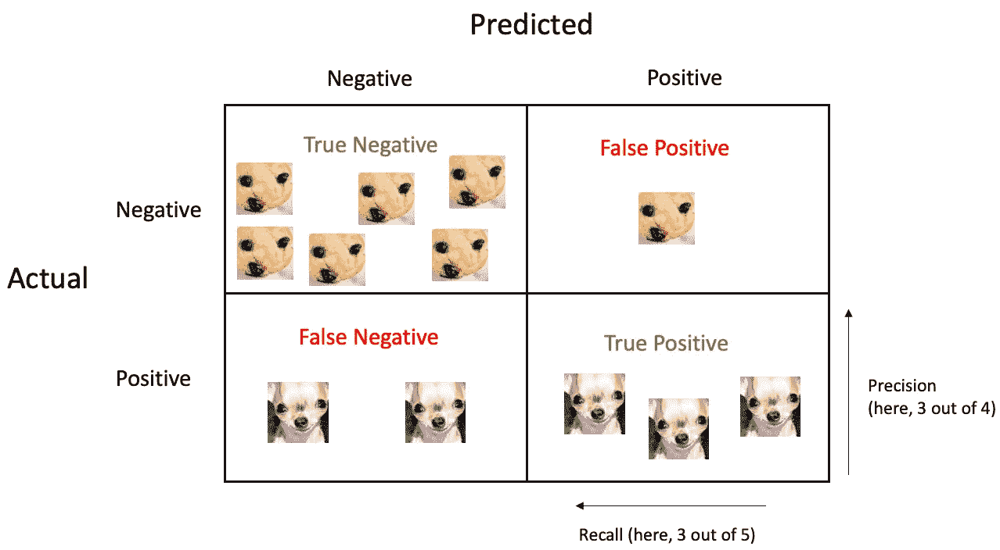
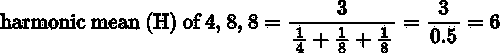
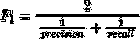
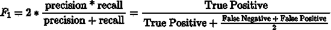

# 分类中的混淆矩阵

> 原文：<https://towardsdatascience.com/the-confusion-matrix-explained-part-2-6be183f180e0>

## 使用混淆矩阵评估二元分类器的性能。如何计算性能指标以及它们告诉我们的结果。

凯勒·琼斯在 [Unsplash](https://unsplash.com?utm_source=medium&utm_medium=referral) 上拍摄的照片

在本文中，我将在评估二进制分类模型的背景下讨论混淆矩阵。你可以在这里阅读用于推理分析和假设检验的[混淆矩阵](https://medium.com/@andreagustafsen/the-confusion-matrix-explained-part-1-5513c6f659c1)。

 [## 假设检验中的混淆矩阵

### 使用混淆矩阵识别和理解 I 型错误、II 型错误和幂。

medium.com](https://medium.com/@andreagustafsen/the-confusion-matrix-explained-part-1-5513c6f659c1) 

在分类中，行代表实际类别，列代表预测类别。让我们使用吉娃娃或蓝莓松饼分类案例，我们想要识别其中有狗的图像来说明混淆矩阵。

作者图片

第一行显示了模型如何预测非狗的图像，我们可以看到 6 张图像被正确地分类为非狗(真正的否定)。一幅图像被错误地分类为狗(假阳性)。

第二行向我们展示了模型如何预测狗的图像。两幅图像被错误地分类为非狗(假阴性)，而三幅图像被正确地分类为狗(真阳性)。

混淆矩阵本身提供了大量关于模型性能的信息，然而，我们可能想要使用一些更精确的度量。我们可以从这个矩阵中的信息计算出不同的有用指标。

# 准确(性)

模型的总体精度可以计算为正确预测的数量除以矩阵中所有观测值的数量:

*   准确度=(真阳性+真阴性)/(真阳性+真阴性+假阳性+假阴性)

在我们的例子中，准确率是(3 只狗+ 6 个松饼)/ (3 只狗+ 6 个松饼+ 1 个松饼+ 2 只狗)= 9/12 = 75%。

# 精确

Precision，也称为*阳性预测值(PPV)* ，表示被预测为狗的样本中有多少实际上是狗。换句话说，在所有预测为狗的图像中，正确分类的狗(真阳性)的百分比(真*和*假阳性):

*   精度=真阳性/(真阳性+假阳性)

在我们上面的混淆矩阵例子中，精度是 3 只狗/(3 只狗+1 个松饼)= 3/4 = 75%。

当您想要限制误报的数量时，精度非常有用。

# 回忆

召回指标也称为*敏感度*或*真阳性率(TPR)* ，显示被正确分类为阳性的阳性实例的百分比。有多少只狗被检测为狗？

*   回忆=真阳性/(真阳性+假阴性)

在上面的例子中，召回率是 3 条检测到的狗/(3 条检测到的狗+ 2 条错过的狗)= 3/5 = 60%。

当避免假阴性很重要时，回忆是有用的。

请注意这两个指标向我们展示的差异。虽然**精度**告诉我们，该模型在 75%的情况下做出正确的狗分类预测，但是**回忆**告诉我们，该模型只检测到 60%的狗。

精确度和召回率可以结合成两者的概括指标，称为 F1 分数。

# F1 分数

F1 分数是精确度和召回率的调和平均值。当您想要几个指标的平均比率时，通常使用调和平均值。它被表示为给定的一组观察值的倒数的算术平均值的倒数，如下面一个简单的例子所示。

F1 分数的计算方法如下

其可以被重新排列

我们的示例中 F1 得分为 2 / (1/0.75 + 1/0.60) = 0.67

调和平均值给予低值更多的权重，这意味着只有当精确度和召回率都高时，F1 分数才会高。(表达式 1/precision 的值随着精度值的增加而变小。)这个 F1 分数有利于精确度和召回率相似的模型。

但是，根据分类器的上下文，您可能不希望精确度和召回率的权重相等。例如，如果您尝试对适合儿童的内容进行分类，您可能希望优先考虑高精度(避免误报)。在这种情况下，您宁愿选择较低的召回率，拒绝太多的安全项目(假阴性)，同时保持较高的精确度，只保留适当的内容。或者，您可能希望在筛查疾病时优先考虑高召回率(避免假阴性)。在这种情况下，您宁愿让一些健康的人被检测为患病(假阳性)，而不是遗漏患病的人(假阴性)。

理想情况下，您希望精确度和召回率都尽可能高，但不幸的是，这是不可能的。这被称为精确度/召回率的权衡。

# 特征

虽然准确度、精确度、召回率和 F1 分数是机器学习环境中评估二元分类器最常用的指标，但我还想包括特异性，或*真阴性率(TNR)。*

*   特异性=真阴性/(真阴性+假阴性)= 1 -回忆

在诊断测试中，特异性通常与敏感性(回忆)一起使用，所以我认为它应该包括在内。灵敏度衡量测试/模型检测真阳性的程度，而特异性衡量测试/模型识别真阴性的程度。与精确度和召回率(灵敏度)一样，在灵敏度和特异性(召回率)之间也有一个权衡。

在本文中，我只讨论了可以从混淆矩阵中导出的五个分类度量。还有很多，你可以在这篇维基百科文章中看到更全面的指标列表。

我希望这篇文章能帮助您理解混淆矩阵，以及如何根据它计算不同的二进制分类度量。

 [## 假设检验中的混淆矩阵

### 使用混淆矩阵识别和理解 I 型错误、II 型错误和幂。

medium.com](https://medium.com/@andreagustafsen/the-confusion-matrix-explained-part-1-5513c6f659c1) 

*如果你喜欢阅读这样的故事，并想支持我成为一名作家，可以考虑注册成为一名灵媒会员。每月 5 美元，你可以无限制地阅读媒体上的故事。如果你注册使用我的链接，我会赚一小笔佣金。*

 [## 通过我的推荐链接加入 Medium-Andrea gustaf sen

### 作为一个媒体会员，你的会员费的一部分会给你阅读的作家，你可以完全接触到每一个故事…

medium.com](https://medium.com/@andreagustafsen/membership)