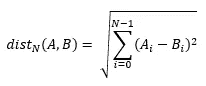
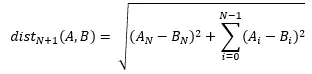

# 维度的诅咒

> 原文：<https://towardsdatascience.com/the-curse-of-dimensionality-69acc63eebd6>

## 为什么不把所有的变量都放入你的模型中

虽然这很酷，但这篇文章并不是关于海盗在他们的维度帆船上穿越平行现实，而是关于那些你想把所有变量都塞进你的模型，看看它是否能消化它们的时刻。相信我:如果你这样做，你会被诅咒的，我会告诉你为什么和怎么做。

匿名作者，http://www.pikist.com/free-photo-srces

# 诅咒本身

我已经听过很多次了，起初，它甚至是有意义的:“模型中的信息越多越好，所以我将把所有这些变量都放进去，并得到完美！”这就是人们，或者更确切地说是建模工作，获得诅咒的方式:在他们的特征空间中放置大量变量，急剧增加其维度。

嗯，在大多数情况下，当你继续增加数据集中的变量数量(或者相反，向量空间的维数)时，过一段时间后，你会发现你的模型越来越难得到可靠的结果。这似乎违反直觉，是维度的诅咒。

那么，为什么添加变量会有问题呢？为什么会有维度的“诅咒”？

# 稀疏向量空间

诅咒的第一个原因是拓扑性的:空间中的维度(变量)越多，数据点之间的“空间”就越大，因为随着维度数量的增加，距离会逐渐“拉长”。

设 A 和 B 是 N 维欧氏空间中的数据点:

如果我们再增加一个维度，效果将会是:

由于添加到总和中的新项是平方的，其影响将总是正的，因此，除非所有数据点在新维度中具有相同的坐标(即:我们添加了一个常量变量)，否则随着我们向数据集添加变量，总距离将总是增加。换句话说:维数更多的向量空间也*更稀疏*。

甚至更多:让我们考虑ε是由于增加了一个新的变量而增加的距离的百分比，假设我们增加的所有变量只对我们的向量空间有相同的贡献。

如果我们再向数据集添加一个变量，向量空间的体积将乘以(1 + ε)，因此，如果我们在新的向量空间中再插入 V 个变量，它的体积将增加(1 + ε)的 V 次方倍。这意味着，随着我们向数据集添加更多的变量，它的向量空间变得**指数级**稀疏。

那么，再一次，稀疏向量空间有什么问题？

更稀疏的向量空间是一个问题的原因与我们使用平方度量来检测差异的原因相关，例如 MSE(均方误差)度量中的平方误差或计算方差的平均值的平方偏差。除了它使所有数字都为正数这一事实(我们可以通过取绝对值来实现这一点)之外，对指标求平方强调了数据点之间的每一点差异，因此我们就像通过放大镜一样看待它们。

这种“放大效应”对于检测偏差来说是完美的，但是当它太强时，对于聚类和分类来说可能是有问题的，因为同一聚类或类中的点之间的非常微小的差异将被视为较大，使得非常相似的数据点看起来与其余的数据点如此分离，以至于其他相似(但不那么相似)的数据点将被视为属于不同的组。这造成了数据集中大量聚类的假象，而实际上数据集中只有少数几个聚类，这可能会使理应属于某个类的元素在我们的模型中看起来像是离群值。即使在最好的情况下，它也会增加我们预测的方差(请告诉我你**会**估计你的模型的预期误差……你会这样做，对吗？问起来总是健康的。)

既然我们之前谈到了海盗，一个戴着滑稽帽子、牙齿很少的瘦子举起了手，用传统的海盗语言告诉我们他找到了解除诅咒的方法。由于迄今为止我们一直依赖欧几里得距离来描述诅咒，所以我们所要做的就是离散化我们的变量，并且通过在不同类型的空间中航行，我们将把讨厌的诅咒沉入黑暗的深处，并让它留在那里！每个人都欢呼，但坏消息来了…

可惜事情没那么简单。当你增加一个离散空间的体积时(比如说，一个具有曼哈顿距离的空间)，它的离散可能位置的数量呈指数增长，并且它开始表现得越来越像欧几里得空间，因此，虽然我们讨论的效果对于离散变量来说会有所减弱，但增加太多的离散变量会使你走上同样的道路——这只是考虑稀疏性，正如我们将在前面看到的，这只是问题之一。

干得好，菜鸟…但你还是被诅咒了。

# 组合学难题

我们在数据科学中使用的大多数模型只不过是数学近似值。我们用它们来近似回归问题中的生成函数，用它们来近似分类问题中的分离函数。这就是我们在大多数日常活动中所做的:我们近似函数。

由于数学近似的性质，极限情况(在你的域中每个维度的最左边和最右边的那些数据点)与泛化非常相关。如果你没有正确处理极限情况，当你的模型投入生产时，它们会像幽灵船的船员一样困扰着你。

这是诅咒的一部分:被可怕的极限案例所困扰。

对于一个单独的变量，您的极限情况将只出现在数字线的两侧(嗯，这不是真的，因为您可能也必须处理您的聚类的极限情况，但是让我们暂时忽略这一点……)，因此，每次您在数据集中插入一个新的变量时，您不仅必须处理它的两个新的极限情况，而且必须处理新旧变量的极限情况的**组合**。

组合学告诉我们，对于这类问题，极限情况的数量往往是数据集中变量数量的 2 次方。这意味着:每次你插入一个新变量，你至少要处理两倍的极限情况…不考虑集群的极限情况！

由于处理极限情况需要这些方面的数据，我希望在这一点上很清楚，当你向数据集中插入新的变量时，你需要的数据量不仅会增加，而且会以指数方式增加**。**

**当然，由于表现良好且可预测的变量的极限情况很好地符合其余数据曲线的整体形状，这根本不是问题…但是，让我们坦率地说:如果现实生活中的变量经常如此，数据科学家将面临就业市场的短缺。**

**如果这还不能说服你，它将说服你的经理，因为更多的数据意味着更多的内存使用，这意味着更多的“强壮”的机器来运行你的模型…所以可怕的极限情况也通过增加云提供商在年底的账单来掏你的腰包。更不用说你的数据工程师同事检查、清理、整形、存储和争论这些(大量)额外数据行的成本，以及人们必须给它们贴标签的可能成本。**

**这是诅咒的“组合学难题”部分:当你在数据集中插入新的变量时，你会被你的极限情况的幽灵所困扰…他们会得到你的金子。**

# **超球形笼子**

**你可能听说过数学吸引子，它是一种突现的行为，迫使一些数学关系进入某种模式，在迭代过程中更常见，比如在数据集中插入一个又一个变量，然后又是一个。这正是我们在这里处理的那种怪物——如果你想知道，当你同时插入所有变量时，它也会抓住你…**

**让我们想象一下，我们所有的变量都有以零为中心的对称分布。这不是诅咒的必要条件，但有助于我们理解参与其中的怪物(吸引子)。我们稍后会提出这个假设。**

**对于我们单独选取的任何一个变量，最大的概率是它在给定的随机选择的数据点的值将接近于零。无论如何，我们的变量是弱相关的，因为两个强相关的变量不应该在同一个数据集中，因为它们给模型带来的信息很少(但是它们的全部噪声)。**

**由于我们的变量是弱相关的，在一个数据点中找到一个变量的边缘值(比如说，分布尾部的 5%大部分或 5%小部分)的概率独立于同一数据点的所有其他变量的值。这意味着:对于我们数据集中插入的每个新变量，对于我们数据集中的每个数据点，它有 10%的概率要么是一个小变量(5%的下尾部)，要么是一个大变量(5%的上尾部)。**

**随着变量数量的增加，数据点超出 5%上下区域的概率显著下降(10 个变量时为 35%，20 个变量时为 12%)。有了足够的变量，几乎所有的**数据点在其一个变量中至少有一个条纹值是确定的。****

**此外，正如我们在关于稀疏性的讨论中所看到的，当我们向数据集添加另一个变量时，点之间的总距离**永远不会**减少，每个变量都会增加任意点与向量空间中心之间的距离，无论任何变量或变量组在任意点可能取值。**

**通常，当我们描绘一个围绕零对称分布的数据云时，我们会把它想象成一个模糊的云，它填充了围绕向量空间中心的超球体的空间。高维空间绝对不会发生这种情况。**

**随着新变量的加入，任何一点**而非**位于分布边缘的概率降低，并且一个接一个地，所有的点都位于超球面的表面，它们都离中心非常远。**

**更是如此，因为，对于每一个新的变量，这个过程是独立于所有其他变量的值的。实际上，它是随机的，因此，变量越多，它就越受中心极限定理的约束，使得每个数据点和向量空间的中心之间的距离正态分布在某个值周围，即超球笼的半径。**

**请注意，我们没有提及或关心任何变量中包含的信息…您可能会发现这真的无关紧要。**

**现在您可以看到怪物(将所有数据点放入数据集向量空间中的一个单一几何形状的吸引子，无论变量可能携带的信息如何)和笼子(超球体本身)。**

**如果您的数据不对称和/或以非零点为中心，这对我们这个可怕的怪物来说无关紧要:它只会将超球体的中心转换为数据的平均向量，并根据每个变量的分布扭曲超球体。**

**好吧，很可怕，但是我们所有的数据点都在超球体表面，这有什么问题呢？**

**还记得我说过我们的数据被放置在超球表面**而不管我们的变量可能携带的信息**吗？嗯，D 维向量空间中的超球面本身就是 D-1 维向量空间。**

**当这些风足够强大时(即:数据集中已经有太多的变量)，我们的数据将被投影到一个维度更小的空间，除非投影过程仔细考虑数据集中的信息，否则仅仅这样做就可能丢失大量信息。**

**碰巧我们的怪物完全不关心数据中包含的信息，所以预计会有重大损失。如果变量带有大量噪声(即:它们具有小的信噪比)，则更是如此。**

**对于嘈杂的变量，我们面临着一个悲剧，因为这整个过程使噪音能够简单地接管我们想要通过增加变量来增加的信息。**

**怎么会？当我们用每个新变量将数据投射到超球表面时，新空间中每个数据点的位置都携带着它(减少的)信息，但在这一过程的每一步都会受到它的全部噪声的干扰，因为破坏信息比维护信息容易得多。**

**最后，随着添加越来越多的噪声，超球面表面中每个数据点的位置变得越来越随机。**

**因此，如果它还不足以被抛入一个不断扩张的空间，同时被碰巧是抢金扒手的可怕极限案例追逐，那么你现在被一个数学怪物锁定在一个扭曲的超球体中，它也碰巧将你变平！说到诅咒，这是一个连最强悍的次元海狼都不应该掉以轻心的问题。**

# **维度的祝福**

**到目前为止，我们已经看到了相当危险的事情，但是在高维空间中，并不是所有的事情都是黑暗和可怕的。你可能会发现那里有可供掠夺的黄金！**

**在某些情况下，在我们的数据集中插入新的变量对我们的工作有益。事实上，这正是我们最喜爱的模型之一背后的原理:支持向量机(SVM)。**

**SVM 的工作原理是插入至少一个新的变量——从一个学习的数学变换(一个核函数)中创建——以正确的方式扭曲我们的数据，允许线性分隔符将其分割成有意义的部分。这就是所谓的“内核把戏”。**

**从更高维数据集获得信息的许多其他形式是存在的，但是它们通常依赖于大量数据点的存在以便被利用(正如我们在上面的“组合学难题”一节中看到的)。**

**从本质上讲，在非常特定的条件下，增加数据集中变量的数量是有用的，但是为了使用任何形式的“维度祝福”，您将需要大量的数据和非常仔细的特征工程。**

# **最后的想法**

**我们至少看到了构成我们所知的“维数灾难”的最重要的元素，并讨论了它们的工作方式及其对数据科学的影响。**

**我希望在这里可以清楚地看到:**

*   **“更多变量”不一定意味着“更多信息”；**
*   **没有什么，绝对没有什么可以替代好的特征工程，当选择我们打算用什么来喂养我们的模型时；**
*   **我们变量的信噪比(或“信息密度”)很重要。**
*   **穿越高维空间是非常危险的…**

**如果这四点很清楚，我将认为工作已经完成。**