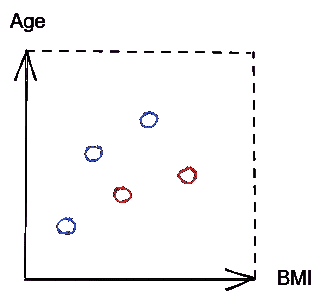
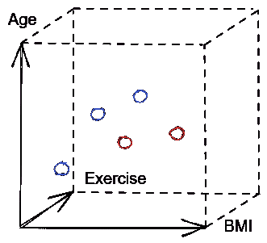

# 维数灾难解释

> 原文：<https://towardsdatascience.com/the-curse-of-dimensionality-explained-3b5eb58e5279>

## 为什么高维数据集如此不受欢迎

玛格达·埃勒斯的照片:[https://www.pexels.com/photo/orange-cube-1340185/](https://www.pexels.com/photo/orange-cube-1340185/)

维数灾难在我们如何在建模之前转换数据方面扮演着重要的角色。

也就是说，尽管人们对高维数据集抱有负面情绪，但首先值得一问的是，整合太多预测特征会如何破坏模型性能。

毕竟，特性提供了预测给定目标所需的关键信息，因此认为首先存在“太多特性”这种事情似乎很奇怪。

在这里，我们解释了维数灾难，并阐明了为什么降维在特征工程中如此流行。

## 可视化高维度

要了解高维度的缺点，了解数据集中的要素数量如何影响特征空间非常重要。为了实现这一点，我们可以使用可视化。

作为一个例子，让我们假设我们正在寻求建立一个预测患者糖尿病的模型。对于这项任务，我们只提供了样本的体重指数(身体质量指数)作为预测特征。

我们虚构的数据集中有 5 个数据点。代表糖尿病患者的数据点为红色，而代表非糖尿病患者的数据点为蓝色。在这种情况下，特征空间可能是这样的。

代码输出(由作者创建)

当然，身体质量指数指标本身不足以准确预测患者的结果。

现在让我们假设我们使用两个特征来预测糖尿病。以下是包含身体质量指数和年龄变量的数据集的特征空间。

代码输出(由作者创建)

现在，我们有两个可用于生成预测的特征。很明显，在特征空间扩展到二维平面后，数据点之间的间隔更大了。

这一次，让我们来看看具有 3 个预测变量的数据集的特征空间是什么样的。

代码输出(由作者创建)

此外，添加第三个特征后，数据点变得更加分散。请注意，每次添加另一个特征时，特征空间会显著扩大。

总的来说，预测特征的数量越多，为用户提供的信息就越多，这些信息可用于预测目标，从而获得更好的结果。然而，通过可视化具有不同数量特征的特征空间，我们可以观察到高维数的严重缺点。

增加特征的数量使特征空间更加*稀疏*，这意味着每个区域的数据点更少。高度稀疏是高维数据集的一个共同特征，这可能是机器学习应用中的一个严重障碍。

高维度的有害本质被一个不祥的术语抓住了:维数灾难。

## 维度的诅咒

维数灾难是指由于大量预测特征产生稀疏的特征空间，模型无法识别模式并使用训练数据进行归纳。

为了理解拥有过多维度的危害，重要的是要理解增加预测特征的数量会以指数方式增加特征空间*(如上例所示)。*

*具有巨大特征空间的模型在每个区域将具有较少的数据点，这是不希望的，因为模型通常需要每个区域足够数量的数据点，以便能够以令人满意的水平执行。*

*如果模型是用稀疏特征空间中的数据训练的，那么它更有可能适合于不能充分代表总体的唯一观察值。所得到的模型将不能一般化，并且在看不见的数据上表现不佳(即，过拟合)。*

*从前面的例子中，我们已经看到了仅仅从过渡到单独使用 2 个和 3 个特征时，特征空间的稀疏性峰值有多大。*

*不幸的是，现实生活中的数据集可能包含数十个、数百个甚至数千个要素！想象一下具有这种维度水平的特征空间的稀疏性(我很想展示它，但 Medium 不允许我绘制超过 3D)。*

## *多少功能才算太多？*

*显然，有很强的理由不要用太多的特征来训练模型。但是，什么层次的维度才算过高呢？*

*最终还是要看情况。*

*毕竟，维度的影响基于多个因素(例如，数据点的数量、算法等。).如果不进行实验，就无法判断有多少功能会产生最佳效果。*

*因此，在确定高维度是否是一个问题时，创建一个可以用作参考的基线非常重要。*

*如果基线在训练数据上表现良好，但在测试数据上表现不佳，则它是过度拟合的，这可能是模型受到高维度阻碍的证据。*

## *解决方法*

*虽然增加数据点的数量将使模型能够用高维数据集进行概括，但在现实生活中，数据通常是稀缺的。*

*因此，面对高维数时，最明智的解决方案是减少数据集中的要素数量。*

*有许多方法可以用来降低维数。这些方法通常分为两组:特征选择和特征提取。*

1.  ***功能选择***

*功能选择是一种简单的方法，需要选择可用功能的子集。简单地说，这意味着只保留对预测给定目标标签贡献最大的特征；其余省略。*

*可以使用类似正向特征选择的技术单独进行特征选择。它们也可以通过正则化等技术嵌入到算法中，其中特征可以没有权重。*

*执行功能选择时，值得考虑:*

*   *在可用的特性中，应该保留多少？*
*   *应该使用什么策略来剔除不需要的特性？*

***2。特征提取***

*与特征选择相比，特征提取在如何减少特征数量方面更加抽象。它以保留方差同时降低维度的方式变换要素的值(即创建替换原始要素的新要素)。*

*特征提取方法的例子包括主成分分析(PCA)和线性判别分析(LDA)。*

*执行特征提取时，值得考虑的是:*

*   *转换后应该有多少功能？*
*   *转换后应该保留多少与原始数据的差异？*

## *关键要点*

**

*在 [Unsplash](https://unsplash.com?utm_source=medium&utm_medium=referral) 上 [Prateek Katyal](https://unsplash.com/@prateekkatyal?utm_source=medium&utm_medium=referral) 拍摄的照片*

*简而言之，维数灾难指的是高维数据集的性质，这使得模型很难进行归纳。*

*虽然具有一定数量的特征对于确保模型具有足够的预测能力是必要的，但是太多的特征将使模型无法对看不见的数据执行良好的操作。*

*出于这个原因，在考虑训练模型时使用的特征数量时，处理机器学习任务的用户必须采用金发姑娘原则:不要太多，也不要太少。*

*我祝你在数据科学的努力中好运！*