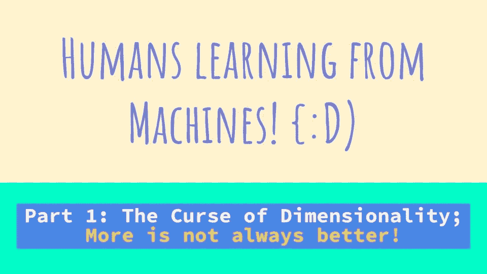
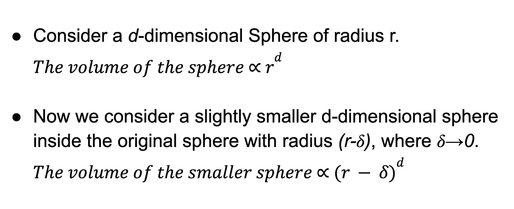
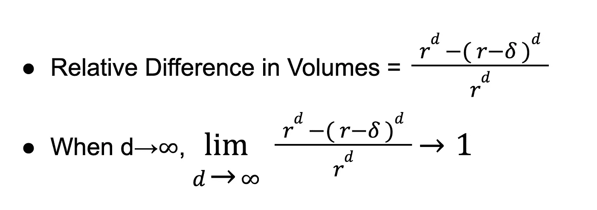
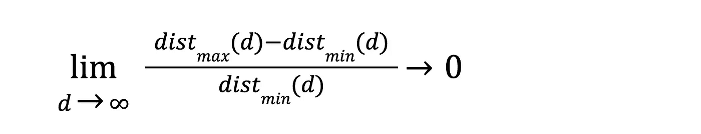

# 维度的诅咒；越多不一定越好

> 原文：<https://towardsdatascience.com/the-curse-of-dimensionality-more-is-not-always-better-585b5a49fce3>

## 人类向机器学习:第一部分

## 人工智能和机器学习概念的哲学要点

来源:作者图片

在我作为一名人工智能从业者的旅程中，我观察到我们教给机器的几个人工智能概念也可以应用在生活中，以提高我们的福祉和生产力。**人类向机器学习**是一个系列，我试图介绍人工智能中一些有趣的概念，并讨论它们在我们生活中的**哲学相关性**。

在一个机器变得越来越聪明，人类变得越来越懒惰的世界里，让我们从人类教给机器的东西中吸取一些教训，并将其应用到我们的生活中吧！因为**归根结底，人工智能和给它编程的人一样好！**

从我最喜欢的一句话开始 [**乔布斯**](https://en.wikipedia.org/wiki/Steve_Jobs)；

> 每个人都应该学会给电脑编程，因为它教会你如何思考
> 
> ***——乔布斯***

PS:我在之前的一篇文章里用过同样的语录， [**没人会教你的 10 条编码原则**](/10-coding-principles-that-no-one-will-teach-you-37d64b5081ef) **。嗯，这里的引用也是有效的:P**

我们开始吧！

# 1.维度的诅咒

来源:[https://unsplash.com/photos/gC_aoAjQl2Q?utm_source=unsplash&UTM _ medium = referral&UTM _ content = creditShareLink](https://unsplash.com/photos/gC_aoAjQl2Q?utm_source=unsplash&utm_medium=referral&utm_content=creditShareLink)

随着技术的到来，从 Alexa 到自动驾驶汽车，一切都由数据驱动的技术推动。据 Statista 称，到 2025 年，产生的数据量预计将增长到巨大的 181 万亿 GB！！！这个数字呈指数级增长，总数据的 90%是在过去三年中创建的。

直觉上，我们假设更多的数据意味着模型可以学习得更好，可以驱动更多的洞察力。嗯，越多越好，对吧？

> 答案是…..不总是这样！

这就是通常所说的 [**维度诅咒**](https://www.quora.com/What-is-the-curse-of-dimensionality) ！让我们从**计算负担、空间体积、可视化和参数估计**的角度来看看更多的数据如何影响可学性。

## 1.1 计算负担和空间体积

假设您是一名园丁，想要在一个 100 米长的线性花园中种植相隔 1 米的玫瑰。很简单吧？种 100 朵玫瑰就完事了。园艺太有趣了！这只是激情的问题…我爱它！！！开设了 YouTube 频道，名为 **Fun with Gardening** ，如何在没有任何背景的情况下进入园艺行业！:P

如果花园是一个每边 100 米的正方形花园会怎么样？在这种情况下，我们需要种植 100×100 朵玫瑰。复杂性增加了 100 倍。园艺是一项单调乏味的工作，但是如果你充满热情并且持之以恒，那么你就可以做到！**如何通过持之以恒赢得人生**，YouTube 视频发布！:P

100 立方米的立方花园怎么样？在这种情况下，我们需要种植 100×100×100 朵玫瑰。嗯，我突然对园艺失去了兴趣！不可能的！一个名为**知道何时退出的新视频！来自园艺的生活课程**发布了，订户很失望

现在想象一下，如果园丁在上述花园的某个地方留下了一把铲子，他需要找到它。他最多需要穿越 100 米，10000 米(10 公里)，1000000 米( **1000 公里** whoaaa！！)分别用于每个花园。

因此，计算复杂性和空间体积随着维度的增加而呈指数增长。我们将在接下来的章节中讨论这些空间的影响。

## 1.2 可视化和参数估计

我们可以将数据可视化到 4 维

用 0-4D 表示数据来源:斯匹莉缇娅，公共领域，通过维基共享

之后会发生什么？数学家甚至可以使用方程轻松地表示无限维数据。顺便说一句，布鲁诺·乔亚尔在 MathExchange 的一个有趣的回答说

> 当有人说“高维空间难以想象”时，他们想到的是用眼睛来想象*。但是数学家用大脑将*形象化*！*

有史以来最伟大的数学家之一， [**伦纳德·欧拉**](https://en.wikipedia.org/wiki/Leonhard_Euler) ，在他生命的最后 17 年里双目失明。令人惊讶的是，他对世界的贡献有一半是在失明之后。你可以在 [**盲数学家的世界**](http://www.ams.org/notices/200210/comm-morin.pdf) 里读到类似的有趣故事。

这里有一篇非常有趣的文章，作者是 [**迈克尔·西蒙斯**](https://medium.com/@michaeldsimmons) ，完成这篇文章后，请按 control/command 并点击[此处](https://medium.com/accelerated-intelligence/these-billionaire-ceos-see-the-world-differently-because-they-see-time-differently-faa2909e8fa2)稍后阅读:P

由于我们看不到更高维度的数据，我们试图外推我们对数据的直觉，直到 4D。那么数据在更高维度下是如何表现的呢？和我们到 4 D 之前对它的了解类似吗？

> 我们的几何直觉在高维空间中失效了

让我们通过考虑一个 d 维球体来理解这一点。

*   因此，从我们人类的直觉来看，我们假设，如果我们把稍小的球体从较大的球体中移走，大部分信息都会丢失，对吗？因为理想情况下，我们将只留下大球的表层。让我们通过计算体积的相对差值来进行数学处理。

在 3D 中，如果我们假设一个半径为 3 个单位的球体， *𝛿* 为0.1，体积的相对差值为 0.096。因此，当移除内部球体时，99%以上的数据会丢失。而在更高维度中，比如说一个 100 维的球体，体积的相对差异是 0.966，当移除内部球体时，信息损失不到 1%。因此，我们可以看到，体积往往集中在更高维度的边缘周围。

## 1.3 含义

高维数据的这种行为如何影响我们？

*   可用数据变得稀疏。表示数据所需的空间量呈指数增长，密度随着维度的增加而降低。这一点我们可以从 1.1 节的园艺比喻中推断出来。
*   对象的“最远”和“最近”对之间的相对差异减小。

随着维度趋于无穷大，比较因素如“近”或“远”变得没有意义。这直接影响所有基于相似性的算法，如聚类。

基于它们的相对距离来检测相似的数据点是不可能的，因为它们被表示为占据如此大的空间，因此，这就像试图进行 K 均值聚类，其中 K 等于特征向量的数量，每一行将自己标识为新的聚类，从而使得信息不相关。

## 1.4 处理维数灾难

现在你可以看到拥有更高维度数据的含义。越多不一定越好。有时，我们会被流入大脑的大量数据淹没。无限可能的存在，让我们失去焦点，不知所措。

看不完的电影/连续剧，卷轴，课程，职业选择，YouTube 视频…..选择的挣扎是真实的！！突然间，我们都需要好好吃饭，通过比特币赚钱，担心股市，完成工作，陪伴家人，锻炼身体，社交，做爱好…啊啊啊啊…思想已经开始膨胀了…！！

这些铺天盖地的信息本质上让我们的大脑疲惫不堪，最终我们将一事无成。对生活无限可能性的担忧困扰着我们，我们最终变得悲伤和沮丧。维度的诅咒也是生活中的诅咒。

> 当你的头脑被思绪淹没时，如何整理东西？如何处理维数灾难？

答案是一样的。我们只是改变我们的视角，试着从不同的角度看问题。从一个新的角度来看，我们可以区分哪些信息是重要的，哪些只是噪音！这被称为主成分分析，我们将在本系列的下一篇文章中讨论。在这个信息超载的世界里，改变你的视角来理解大局！人类向机器学习:第二部分

# 降维——拥有的越多，看到的越少！

这里可以找到[。](https://sreekiranar.medium.com/dimensionality-reduction-the-more-you-have-the-less-you-see-ac9dbc546be6)

非常感谢您花费宝贵的时间…我希望我的观点对你有所帮助！请在 [LinkedIn](https://www.linkedin.com/in/sreekiranar/) 或通过[电子邮件](http://sreekiranar@gmail.com)告诉我您的宝贵建议和反馈。

鸣谢:维度诅咒的技术层面我从伯明翰大学计算机科学学院的伊恩·斯泰尔斯博士的讲座中学到了。花点时间来表达我对他们无价服务的感激之情！:D

一如既往，

# 快乐学习:D