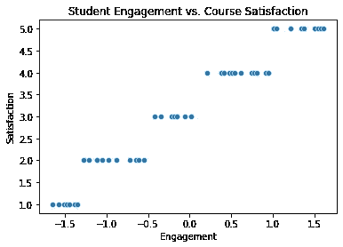
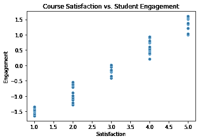

# 假设因果关系的危险

> 原文：<https://towardsdatascience.com/the-dangers-of-assuming-causal-relationships-7d4d46111742>

## 你需要理解你的数据


在 [Unsplash](https://unsplash.com/s/photos/cause?utm_source=unsplash&utm_medium=referral&utm_content=creditCopyText) 上由 [Nadir sYzYgY](https://unsplash.com/@nadir_syzygy?utm_source=unsplash&utm_medium=referral&utm_content=creditCopyText) 拍摄的照片

到现在为止，我相信每个人都听过这句话，“相关性并不意味着因果关系”。无论你是在高中的第一堂统计学课、大学的研究方法课程中，还是在你自己的阅读中接触到这个概念，它都是人们记住的主要概念之一。但是，这到底意味着什么呢？

相关性:根据 dictionary.com[的说法，相关性被定义为“同一组元素的两个或更多属性或度量显示出一起变化的趋势的程度。”](https://www.dictionary.com/browse/correlation)

另一方面，一个原因被定义为“一个人或一件事以这样一种方式行动、发生或存在，使得某件特定的事情作为一个结果发生；一个效果的制作者。”

当我们处理统计学、数据科学、机器学习等问题时。，了解相关性和因果关系之间的区别可以决定你的模型的成败。我用一个例子来演示。

假设你从大学心理学课程中收集了大量数据。我们对研究学生参与对课程满意度的影响很感兴趣。

为了做到这一点，教授记录了学生参与讨论、提问或回答问题的次数。结果是一个标准化的区间分数，以便我们可以比较不同学生的参与程度。

例如，我们找到每个学生的 z 分数，然后我们可以比较他们的参与程度。接下来，我们要求学生在课程结束时提供反馈。学生们接受了一项调查，要求他们对自己的满意度进行评分，等级为 1-5。

为了进行分析，教授决定运行学生参与度分数和满意度分数之间的相关性。为此，我使用了自己的虚拟数据，包括 60 行和 2 列。第一列，敬业度，从 1 到 100 打分，然后用下面的 z 计分法标准化:

```
# copy the data
df_z_scaled = df.copy()

# apply normalization technique to Column 1
column = 'Engagement'
df_z_scaled[column] = (df_z_scaled[column] - df_z_scaled[column].mean()) / df_z_scaled[column].std()    

# view normalized data  
display(df_z_scaled)
```

第二栏，满意度，评分为 1-5。

为了研究这些数据，首先我们做了一个散点图。



作者提供的图表

从散点图中可以很清楚地看出，敬业度与满意度正相关，但只是为了好玩，让我们来计算一下相关系数。

```
from scipy.stats import pearsonr
from scipy.stats import spearmanr
# calculate Pearson's correlation
corr, _ = pearsonr(df_z_scaled.Engagement, df_z_scaled.Satisfaction)
print('Pearsons correlation: %.3f' % corr)
# calculate spearman's correlation
corr2, _ = spearmanr(df_z_scaled.Engagement, df_z_scaled.Satisfaction)
print('Spearmans correlation: %.3f' % corr2)
```

这是输出，它向我们展示了我们已经推断出的东西。

```
Pearsons correlation: 0.977
Spearmans correlation: 0.976
```

现在，如果数据分析师或数据科学家想要进一步研究这个问题，有几种方法可以选择。虽然过分热心的数据科学家可能想直接进入预测模型，但我们提出了一种不同的方法。

1.  收集更多数据
2.  继续探索性数据分析

3.确定合适的模型来回答您的具体问题

这就是因果关系假设发挥作用的地方。基于我们简短的分析结果，人们可能会认为学生的参与会导致对课程的满意。合理的假设，对吗？

不完全是。

我们只收集了两个变量的数据——参与度和满意度——但是我们怎么知道没有其他变量可以解释这种关系呢？事实上，我们怎么知道这种关系不是反方向的呢？

换个说法，看下面两个语句。

**学生参与度的提高带来了更高的满意度**

**课程满意度提高，学生参与度提高**

基于我们的一个图表，我们不知道这些陈述中哪一个是正确的。为了演示，我将交换前面图表上的轴。



作者提供的图表

虽然图表看起来不完全一样，但关系或相关性仍然存在。当一个变量增加时，另一个也增加。为了更进一步，让我们通过改变变量顺序来运行相同的相关性测试。

```
# calculate Pearson's correlation
corr, _ = pearsonr(df_z_scaled.Satisfaction, df_z_scaled.Engagement)
print('Pearsons correlation: %.3f' % corr)
# calculate spearman's correlation
corr2, _ = spearmanr(df_z_scaled.Satisfaction, df_z_scaled.Engagement)
print('Spearmans correlation: %.3f' % corr2)

Pearsons correlation: 0.977 Spearmans correlation: 0.976
```

正如你所料，结果是完全一样的。变量的顺序不会影响相关性的结果，这意味着你不能由此假设因果关系。

**但是如果你做了会怎么样呢？**

让我们来看看做出这种假设的危险。根据最初的研究，首席数据科学家的任务是开发一个预测模型，以确定影响课程满意度的所有因素。

学校的目标是制定干预措施来提高课程满意度，因此他们需要了解是什么导致了对课程的不满意，他们将从确定学生参与度作为其关键特征之一开始。

这是一个加快数据分析过程的例子。在 Erdogan Taskesen 的一篇文章中，他讲述了检测因果关系的一些关键步骤。这句话让我印象深刻:

*如果两个随机变量 x 和 y 在统计上相关(X/Y)，那么要么(a) X 导致 y，(b) Y 导致 x，要么(c)存在第三个变量 z 导致 x 和 y。此外，给定 z，x 和 y 变得独立，即 X⊥Y∣Z.*

当我们的示例数据科学家假设学生参与会导致课程满意度时，他没有考虑到上面提到的其他两个选项。他不仅忽略了满意度导致参与度的可能性，还可能忽略了一个完全不同的变量，这个变量导致了 covary 的满意度和参与度。

从本质上来说，假设一种因果关系，而没有足够的数据来支持它，数据科学家就冒着开发一种不准确的模型的风险，在一个项目上浪费大量的时间和资源，而这些本来可以通过更全面的数据分析来避免。

**有什么意义？**

底线是，人工智能，人工智能，预测分析，都是可以用来解释因果关系的工具，但你需要先做基线分析。如果你没有收集正确的数据，全面地分析它，并客观地呈现它，你的模型就会失败。

我们需要后退一步，回到基础。

我想参考另一篇关于有效数据科学项目的[步骤的非常好的文章。这是他们讨论的七个步骤:](/7-steps-to-a-successful-data-science-project-b452a9b57149)

1.  **问题陈述**
2.  **数据采集**
3.  **数据清理**
4.  **探索性数据分析(EDA)**
5.  **特征工程**
6.  **造型**
7.  **通信**

正如你所看到的，建模是第六步，也就是说，这是整个过程的最后一步。虽然这些步骤不是一成不变的，但它是您分析过程的良好指南，并且它确实让您明白，如果不首先提出问题、收集数据、清理数据和探索数据，您就无法创建模型。

我们不能忘记这一进程的前四个步骤。如果我们这样做，我们就有可能陷入假设因果关系的陷阱，而事实上根本没有因果关系。

所以下次你听到相关性≠因果关系时，试着记住为什么这个概念如此重要，即使对于高级数据科学家来说也是如此。这些是你下一个伟大的 ML 模型的构建模块，如果你花时间去使用它们的话。