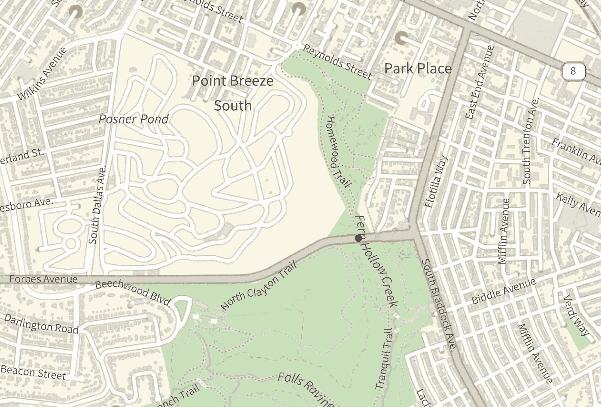
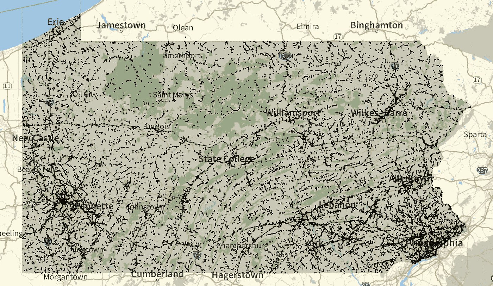
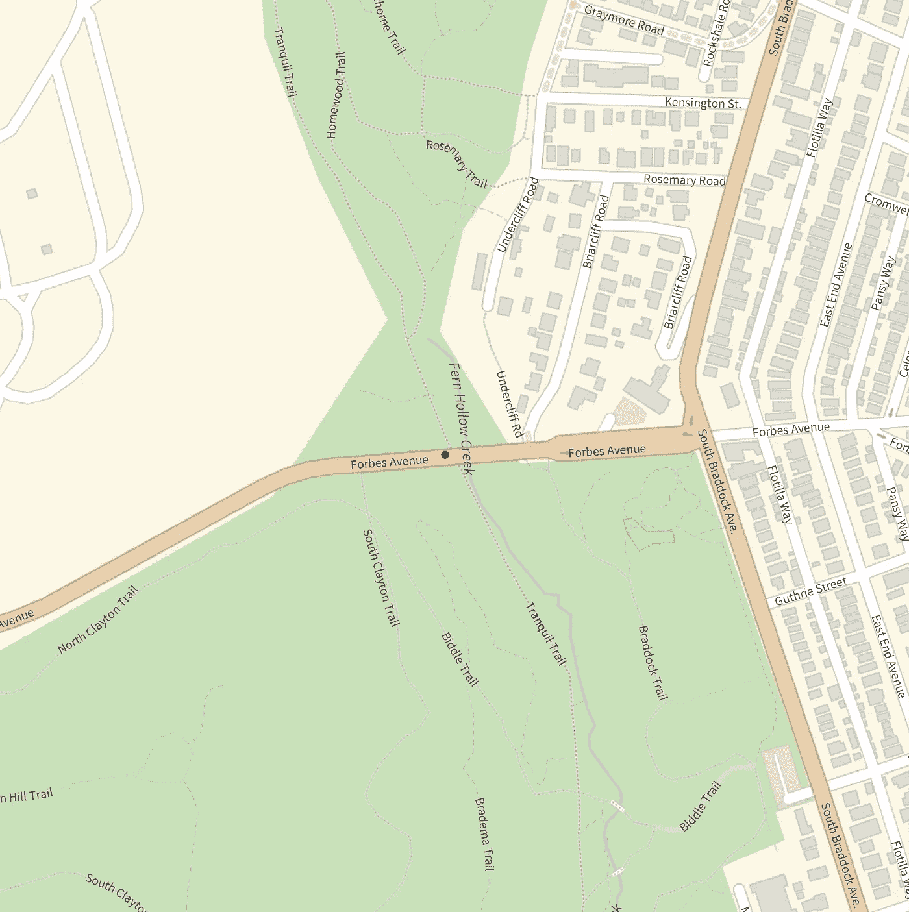
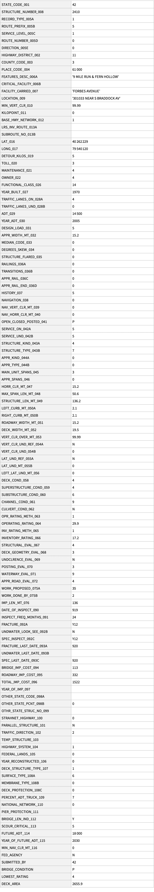
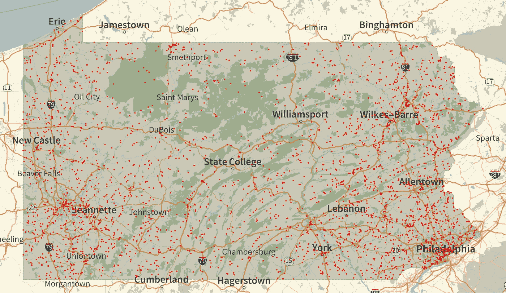
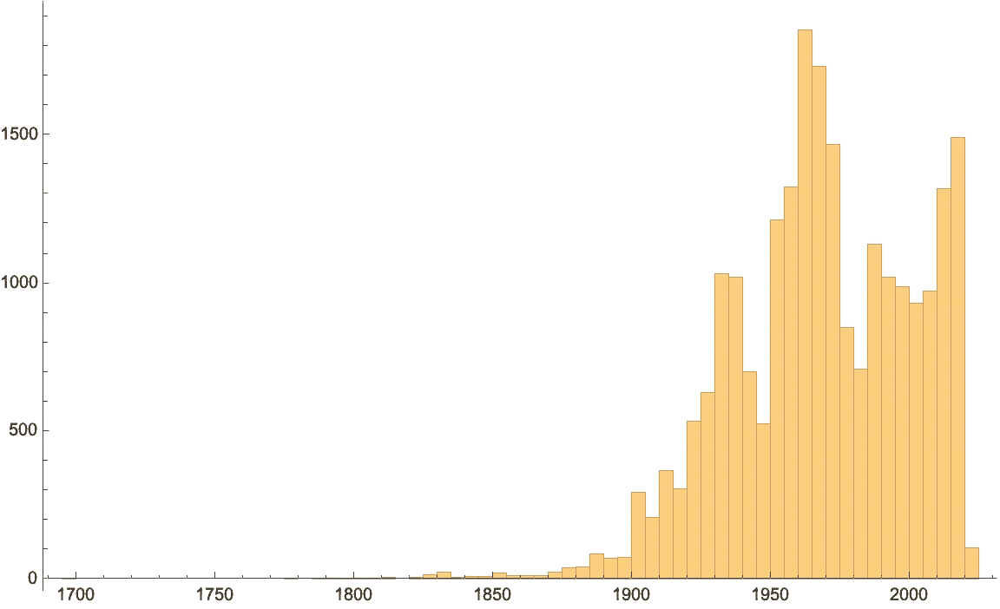

# 弗里克大桥倒塌背后的数据

> 原文：<https://towardsdatascience.com/the-data-behind-the-frick-bridge-collapse-ac0d5a41bdd1>

# 弗里克大桥倒塌背后的数据

## 用 Wolfram 语言进行计算分析

美国有数以万计的桥梁，其中许多是几十年前建造的。尽管投资保持良好的维修，许多这些桥梁状况不佳，不安全。今天早上新闻报道了美国又一座重要的桥梁倒塌。事情发生在宾夕法尼亚州的匹兹堡，一座桥承载着位于弗里克公园的弗恩霍洛溪上的福布斯大道上的交通:

(这张图片和所有后续图片都是作者用 Wolfram 语言从头开始创建的)

桥梁的这种失修状态是一个有据可查的“肮脏秘密”。我看了看交通部维护的桥梁数据。该数据库包含所有重要的公共和私人桥梁及其位置和状况。这个数据库中记录的东西相当令人不安。我将使用 [Wolfram 语言](https://www.wolfram.com/language/)作为我的数据分析工具，对这些数据进行一些探索，希望从中得出一些见解。

第一步是将原始数据库下载并导入到交互式 Wolfram 语言会话中。因为我们对宾夕法尼亚州的这座桥感兴趣，所以我只下载该州的桥。第二步是通过将原始数据转换成[数据集](https://reference.wolfram.com/language/ref/Dataset.html)，使其“可计算”:

该数据集包含 123 个描述属性的字段，如桥梁状况、桥梁位置(纬度和经度)、建造年份，以及 1995 年的本 [PDF 手册中描述的关于维护和桥梁尺寸的各种技术细节。](https://www.fhwa.dot.gov/bridge/mtguide.pdf)

为了使这些数据更有意义，让我们绘制所有这些桥的地图，并了解它们是如何分布的(本文末尾的笔记本中包含了“convert”函数的定义):

在 Wolfram 语言[笔记本](https://www.wolfram.com/notebooks/)会话中运行这段代码会产生以下输出。这张地图实际上也揭示了大量关于宾夕法尼亚州的地质信息。它紧邻公路网和许多河流和山谷:

(图片由作者提供)

我们可以放大弗里克公园附近的桥，以该位置为中心，并将绘图范围限制在该位置:

这为我们提供了以下带有红点的弗里克公园桥位置图:

(图片由作者提供)

我们还可以通过查找弗里克公园内或附近的桥梁，从所有宾夕法尼亚州桥梁的数据集中选择这座桥梁:

在 Wolfram 语言的笔记本会话中，这给出了一个格式良好的数据表。)具有所有 123 个电桥特性的全输出:

(图片由作者提供)

我们可以看到这座桥建于 1970 年，桥梁状况等级为差(P)。它最近一次检查是在 2019 年 9 月，仅桥梁的改善成本估计为 113，000 美元(从零开始重建没有列在数据中，但想必比改善成本高得多)。

这不是唯一一座被评为“差”的桥。宾夕法尼亚州共有 3198 座桥梁具有相同的“差”评级，它们分散在整个州，这里用红点表示:

(图片由作者提供)

弗里克公园的桥甚至不是一座特别“古老”的桥。有许多桥要古老得多。宾夕法尼亚州一座桥的年龄中值实际上是 1968 年，比倒塌的桥还要老两年:

(图片由作者提供)

所有这些都有助于证明基础设施维护对于保持桥梁和道路的安全非常重要。在本文中，我们看到了如何将原始数据加载到 Wolfram 语言会话中，并使其可计算。通过使用可计算的数据集，我们能够可视化宾夕法尼亚州的桥梁，并放大特定的数据。我们还了解了如何过滤全部数据，并使用过滤后的数据来可视化特定的方面或绘制特定的统计数据。我确实跳过了一些编码细节，但是本文中的所有代码都可以从这个 [Wolfram Cloud 笔记本](https://www.wolframcloud.com/obj/arnoudb/Published/Bridges-01.nb)中查看和下载。