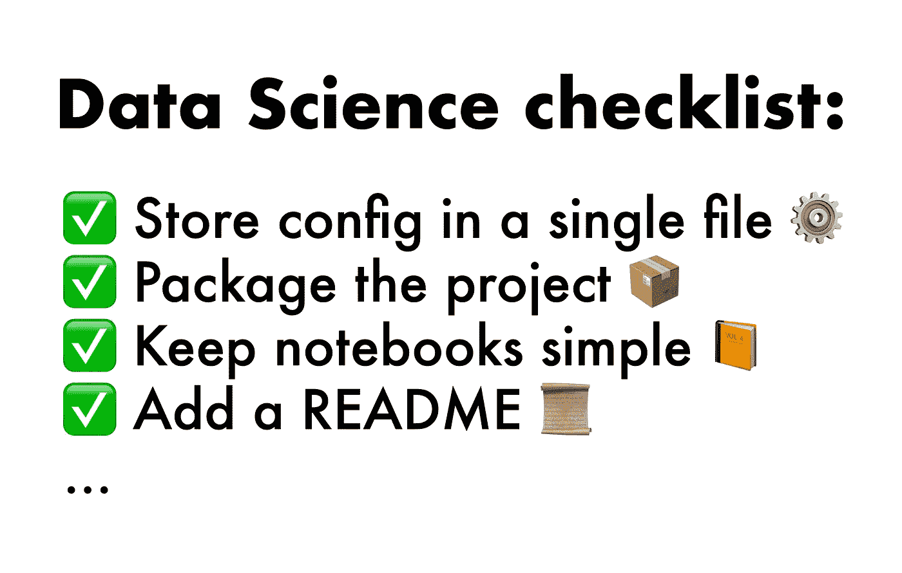
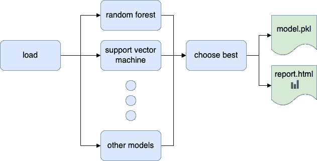

# 数据科学清单:可维护数据科学项目的最佳实践

> 原文：<https://towardsdatascience.com/the-data-science-checklist-best-practices-for-maintainable-data-science-projects-1b0afd035ff5>

## 数据科学软件工程

## 构建可维护数据项目的 16 个步骤



图片作者。

这些年来，我已经开发了几十个数据科学和机器学习项目，我也学到了一些教训。没有结构和标准，混乱就会接管，使得持续的进步变得困难。我已经编制了一个确保项目可维护性的最佳实践列表，我将与您分享，以便您可以在您的下一个项目中使用它。我们开始吧！

# **总结**

在我们深入了解每一项的细节之前，先总结一下:

1.  在不同的位置存储数据、工件和代码
2.  在单个文件中声明路径和配置参数
3.  安全存储凭据
4.  通过使用一个`.gitignore`文件来保持你的存储库干净
5.  端到端自动化工作流程
6.  声明所有软件依赖关系
7.  分离生产和开发依赖关系
8.  有一个信息丰富和简洁的自述文件
9.  文件代码
10.  以分层结构组织您的存储库
11.  打包您的代码
12.  保持你的 Jupyter 笔记本简单
13.  使用记录模块(不要使用打印)
14.  测试您的代码
15.  注意代码质量
16.  删除死的和不可达的代码

# 1.在不同的位置存储数据、工件和代码

在处理项目时，我们会遇到三种类型的文件:

1.  **数据。**所有原始数据和任何中间数据结果(如 CSV、txt、SQL 转储等。)
2.  **神器。**管道执行期间生成的任何其他文件(例如，序列化模型、带有模型指标的 HTML 报告)
3.  **源代码。**支持流水线执行的所有文件(如`.py`、`.R`源代码、Jupyter 笔记本、测试)

为了让事情有条理，把每个组分成不同的文件夹；这样做将更容易理解项目结构:

# 2.在单个文件中声明路径和配置参数

您的管道需要从特定的源加载其原始数据；此外，您可能需要与其他系统(比如数据仓库)进行交互。最后，您需要存储结果(本地文件系统或远程存储)。一种常见的反模式是在源代码中嵌入这些配置参数，这会导致以下问题:

1.  **暧昧。**不公开外部系统隐藏了重要的实现细节，这会让合作者感到困惑:数据在哪里？这个项目需要访问 Kubernetes 集群吗？
2.  **不透明。**如果没有一个单独的地方来存储临时文件，每个协作者可能会开始将输出保存在任意的位置，这使得组织项目变得困难。
3.  **冗余。**基础设施资源(即数据仓库、Kubernetes 集群)可能会被多次使用，如果配置参数不集中，会导致重复配置。

**是**:集中路径和配置参数

…然后从那里开始读:

**否**:硬编码的价值观会让你的生活更加艰难

# 3.安全存储凭据

您不应该在纯文本文件(包括`.py`源代码或任何配置文件)中存储数据库凭证(或任何其他类型的凭证)。

**是**:安全地存储您的凭证(本例使用的是`[keyring](https://github.com/jaraco/keyring)`库)

然后在您的脚本中:

`keyring`库使用你的操作系统凭证存储，比纯文本文件更安全。前面的示例只存储密码，但是您可以存储任何其他字段。

**否**:存储在源文件中的凭证

# 4.使用一个`.gitignore`文件来保持您的存储库整洁

最有可能的是，您将代码存储在 git 存储库中。因此，指定一个`.gitignore`文件来保持它的整洁是必不可少的。缺少这个文件可能会使您的存储库变得不必要的混乱，并且可能会破坏您同事的项目(例如，如果您提交了一些依赖于用户的配置文件)。

在`.gitignore`文件中包含什么？首先，从 Github 获取 [Python 模板，其中包含了您需要的大部分内容。然后，确保您还包括通用扩展，以避免意外提交数据或配置文件。例如，如果您的原始数据是 CSV/JSON 格式，并且您有一些用户相关的 YAML 配置文件，请添加以下行:](https://github.com/github/gitignore/blob/master/Python.gitignore)

如果您已经提交了其中的一些文件，可以使用以下命令删除它们:

请注意，这不会删除以前提交的文件。从`git`中这样做是 CLI，但是 [BFG 工具](https://rtyley.github.io/bfg-repo-cleaner/)简化了这个过程。

# 5.端到端自动化数据工作流



图片作者。

一个数据项目通常需要多次数据转换。因此，自动化整个过程对于确保代码的可重现性至关重要。没有完全自动化的分析将会带来麻烦。例如，假设您必须在别人编写的项目中重新训练一个模型，那么您会在`README.md`中看到下面一行:

但是接下来会得到这样一个错误:

嗯，在尝试训练模型之前，您应该构建特征，这是有道理的，但是此时，您会想知道如何这样做。

[Ploomber](https://github.com/ploomber/ploomber) 让自动化数据工作流变得简单，您可以添加任意数量的脚本或笔记本，然后通过以下方式协调执行:

# 6.声明软件依赖关系

数据科学项目通常依赖于第三方包(如 pandas、scikit-learn)；未能指定它们会给任何新的合作者带来麻烦。这个错误你见过多少次了？

尽管错误消息非常具有描述性，但是记录所有的依赖关系是一个很好的实践，这样任何人都可以快速开始。在 Python 中，您可以通过一个`requirements.txt`文件来实现这一点，该文件每行包含一个包的名称。例如:

然后，您可以安装所有依赖项，包括:

如果您使用的是 [Ploomber](https://github.com/ploomber/ploomber) ，您可以使用下面的命令来设置虚拟环境并安装所有声明的依赖项:

# 7.分离生产和开发依赖关系

将依赖项的数量保持在最小是有好处的。您的项目需要的依赖项越多，遇到安装问题的可能性就越大。简化安装的一种方法是将我们的依赖项分成两组:

1.  *运行管道所需的包* —这些是在生产中运行管道所需的包。
2.  *开发管道所需的可选软件包* —这些是您在项目中工作所需的可选软件包(例如，构建文档、运行探索性 Jupyter 笔记本、运行测试等)。)但在生产中并不需要。

对于我们的例子，您可能想要两个保持两个依赖文件(比如`requirements.prod.txt`和`requirements.dev.txt`)。然后，在开发过程中，您可以运行:

在生产中:

**重要:**在生产中运行时，声明每个包的具体版本是很重要的；您可以使用`pip freeze`命令导出一个文件，其中包含每个已安装软件包的特定版本。如果你想省事，你可以使用 [Ploomber](https://github.com/ploomber/ploomber) 并执行`ploomber install`，它将存储一个单独的`requirements.txt` (dev 和 prod)和每个包的特定版本。

# 8.有一个信息丰富和简洁的自述文件

自述文件是任何使用管道的人的入口点；有一个信息丰富的文件来帮助合作者理解源文件是如何组合在一起的是非常重要的。

**自述文件包括哪些内容？**项目的基本信息，至少包括项目的简要描述(它是做什么的？)，列出数据来源(数据从哪里来？)，以及端到端运行管道的说明。

示例:

```
### Boston house value estimation projectThis project creates a model to predict the value of a house using the Boston housing dataset: [https://www.kaggle.com/c/boston-housing](https://www.kaggle.com/c/boston-housing) #### Running the pipeline```sh
# clone the repo
git clone [http://github.com/edublancas/boston-housing-project](http://github.com/edublancas/boston-housing-project)# install dependencies
pip install -r requirements.txt# run the pipeline
python run.py
```
```

# 9.代码文档

随着新的贡献者加入项目，文档变得更加重要。好的文档有助于理解不同的部分是如何组合在一起的。此外，文档将有助于您快速获得您不久前编写的代码的上下文。

但是文档是一把双刃剑；过时了会惹麻烦。所以，作为一个一般的建议，保持你的代码简单(好的变量名，小的函数)，这样其他人可以很快理解它，并且有一些最小的文档来支持它。

**如何记录代码？**在函数定义旁边添加一个字符串(也称为 docstring ),以提供高级描述，并使用代码本身传达尽可能多的信息。

有许多 docstring 格式可供选择，但是 Python 科学界的标准格式(在上面的例子中使用)是 [numpydoc](https://github.com/numpy/numpydoc) 。

一旦添加了 docstring，就可以从 Jupyter/IPython 快速访问它，如下所示:

# 10.以分层结构组织您的存储库

随着项目的进展，您的代码库将会增长。您将拥有用于探索数据、加载、生成特征、训练模型等的代码。将代码分散在多个文件中是一个很好的实践，组织这些文件是很重要的；看一下下面的例子:

这种扁平的结构让人很难理解发生了什么以及文件之间是如何相互关联的。因此，最好有这样的**层次结构**:

# 11.打包您的代码

无论何时运行`pip install`，Python 都会进行必要的配置调整，以确保解释器可以使用这个包，因此您可以在任何使用`import`语句的 Python 会话中使用它。通过创建 Python 包，您可以为您的实用程序函数实现相同的功能；这给了你很大的灵活性来组织你的代码，然后把它导入到任何地方。

创建一个包只是添加一个`setup.py`文件。例如，如果您的`setup.py`存在于`my-project/`下，您可以这样安装它:

**注意:**我们为 Python 传递了`--editable`标志来重新加载包内容，因此无论何时更新代码和启动会话，您都将使用最新的代码。

安装软件包后，您可以像导入任何其他软件包一样导入它:

如果您修改了`some_function`，您将不得不重启您的会话以查看您的更改(假设您以可编辑模式安装软件包)，如果使用 IPython 或 Jupyter，您可以通过使用[auto load](https://ipython.readthedocs.io/en/stable/config/extensions/autoreload.html)来避免重启会话:

关于 Python 打包的更详细的讨论，请看我们的博客文章。

# 12.保持你的 Jupyter 笔记本简单

笔记本是一种与数据互动的奇妙方式，但它们可能会很快失控。如果处理不当，您可能会在笔记本之间复制粘贴代码，并创建会崩溃的大型单片笔记本。所以我们写了一整篇关于写干净笔记本的文章[看看吧。](https://ploomber.io/blog/clean-nbs/)。

# 13.使用`*logging*`模块(不要使用`print`)

日志记录是软件工程中的一项基本实践；它使得诊断和调试更加易于管理。以下示例显示了一个典型的数据处理脚本:

上面例子的问题是使用了`print`语句。`print`默认发送一个流到标准输出。因此，如果每个文件都有一些`print`语句，那么每次运行管道时，您的终端都会`print`输出很多很多消息。你拥有的打印语句越多，看穿这些噪音就越复杂，它们最终会变成毫无意义的信息。

使用`logging` [模块](https://docs.python.org/3/library/logging.html)代替。日志记录最相关的特性包括:按严重性过滤消息，为每个记录添加时间戳，包括文件名和日志记录调用的起始行，等等。下面的例子显示了它最简单的用法:

注意，使用`logging`需要一些配置。查看[基础教程。](https://docs.python.org/3/howto/logging.html)

# 14.测试您的代码

测试数据管道是具有挑战性的，但是从长远来看，这是一个很好的时间投资，因为它允许你更快地迭代。虽然在项目的试验阶段，许多代码会发生变化(可能会使您的测试过时)，但是测试会帮助您取得更一致的进展。

我们不得不考虑数据科学项目是实验性的，首要目标是看项目是否可行，所以你想尽快有个想法。但是，另一方面，完全缺乏测试可能会让你得出错误的结论，所以你必须找到一个平衡点。

至少，每次合并到主分支时，要确保管道是端到端的。我们已经写了大量关于数据项目测试的文章。查看我们关于[测试数据科学项目](https://ploomber.io/blog/ci-for-ds/)的文章，以及我们关于[测试机器学习项目](https://ploomber.io/blog/ml-testing-i/)的文章。

# 15.注意代码质量

人们读代码的次数比他们写代码的次数多。为了使代码更具可读性，请使用样式指南。

风格指南是关于一致性的；他们建立了一套标准的规则来提高可读性。这些规则与最大行长度、空白或变量命名有关。Python 的官方风格指南叫做[pep 8](https://www.python.org/dev/peps/pep-0008/)；如果你打开链接，你会注意到这是一个很长的文档。幸运的是，有更好的方法让你跟上速度。

pycodestyle 是一个根据 PEP8 的规则自动检查代码的工具。它将扫描您的源文件，并向您显示哪些代码行不符合 PEP8。虽然 pycodestyle 限制查找不符合 PEP8 的代码行以提高可读性，但是还有更通用的工具。

pyflakes 是一个工具，它也检查可能的运行时错误；它可以发现语法错误或未定义的变量。

如果你想同时使用`pycodestyle`和`pyflakes`，我建议你使用 [flake8](https://github.com/PyCQA/flake8) ，它结合了两者和另一个工具来检查[代码复杂度](https://github.com/PyCQA/mccabe)(一个与[线性独立路径](https://en.wikipedia.org/wiki/Cyclomatic_complexity)的数量相关的度量)。

您可以通过命令行界面使用所有以前的工具。例如，一旦安装了`flake8`，您就可以通过`flake8 myfile.py`检查文件。为了使这个过程自动化，文本编辑器和 ide 通常提供插件，当你编辑或保存一个文件并突出显示不兼容的行时，这些插件会自动运行这些工具。以下是 [VSCode](https://code.visualstudio.com/docs/python/linting) 的说明。

*自动格式化*

作为对样式标记的补充，自动格式化程序允许您修复不兼容的行。考虑使用[黑色](https://github.com/python/black)。自动格式化程序可以修复代码中的大多数问题，使其符合标准；然而，仍然可能有一些东西你需要手动修复，但是它们可以节省大量的时间。

*其他棉绒*

还有其他可用的棉绒；最流行的一个是 [pylint](https://github.com/PyCQA/pylint) ，它类似于`flake8`，但是它提供了更复杂的分析。此外，还有一些其他特定的工具，如 [bandit](https://github.com/PyCQA/bandit) ，专注于发现安全问题(如硬编码密码)。最后，如果你有兴趣了解更多，可以查看 [Github](https://github.com/PyCQA) 上的 Python 代码质量权威网站。

# 16.删除死的和不可达的代码

养成删除[死](https://en.wikipedia.org/wiki/Dead_code)(输出从不使用的代码)和[不可达](https://en.wikipedia.org/wiki/Unreachable_code)代码(从不执行的代码)的习惯。

一个死代码的例子发生在我们调用一个函数，但是我们从来不使用它的输出:

在我们之前的例子中，`compute_statistics`是死代码，因为我们从来不使用输出(`stats`)。所以让我们去掉它:

我们去掉了`stats = compute_statistics(data)`，但是我们应该检查我们是否在其他地方调用了`compute_statistics`。如果没有，我们应该删除它的定义。

必须当场删除代码，因为时间越长，发现这类问题就越复杂。一些库帮助[检测死代码](https://github.com/jendrikseipp/vulture)，但是最好在我们注意到它的时候做得正确。

# 最终意见

希望这些建议能帮助你改善工作流程。一旦你习惯了它们，你会发现保持你的代码库的可维护性最终会提高你的生产力。如果您有任何意见或问题，请联系我们。

*最初发布于*[*ploomber . io*](https://ploomber.io/blog/checklist/)