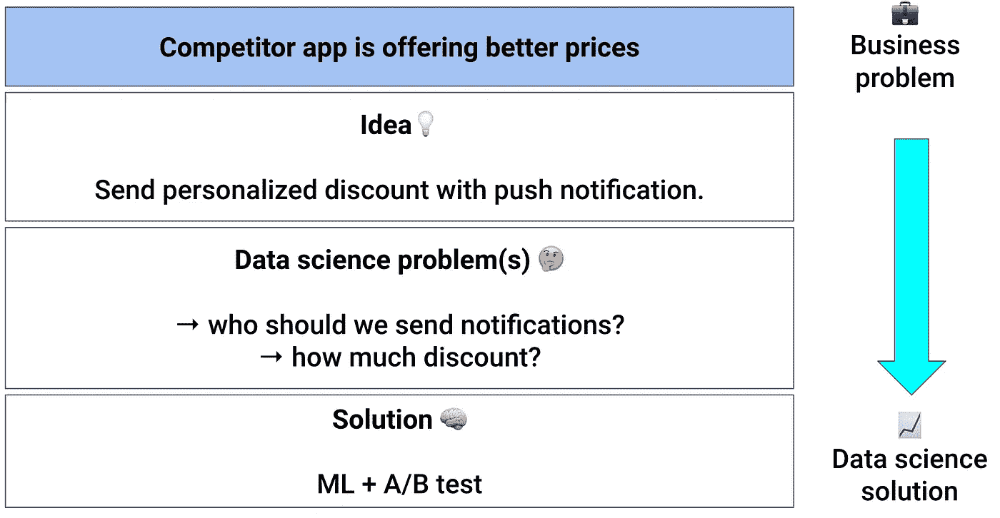
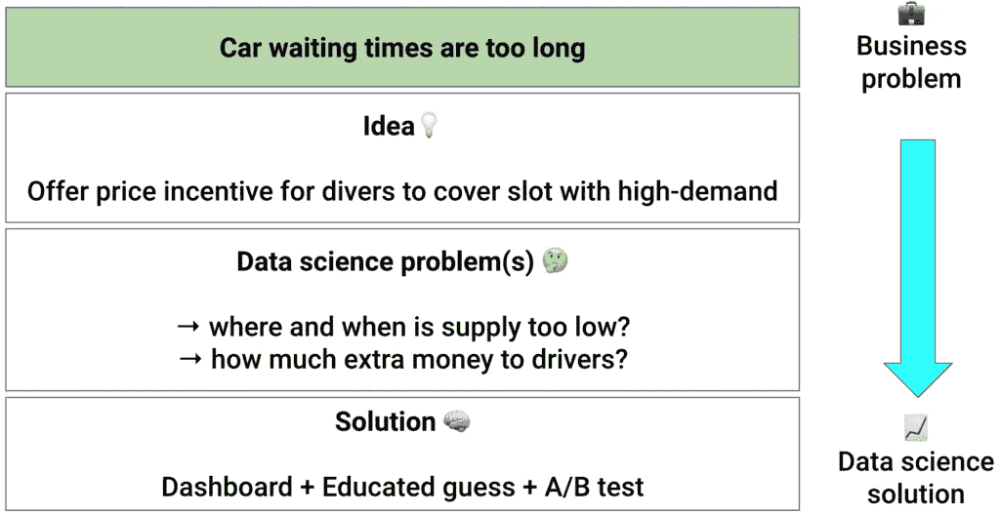
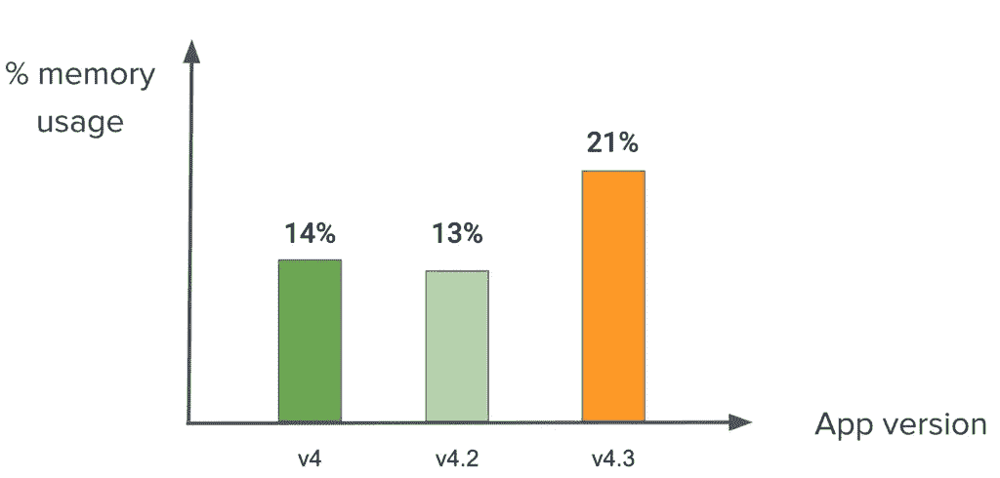
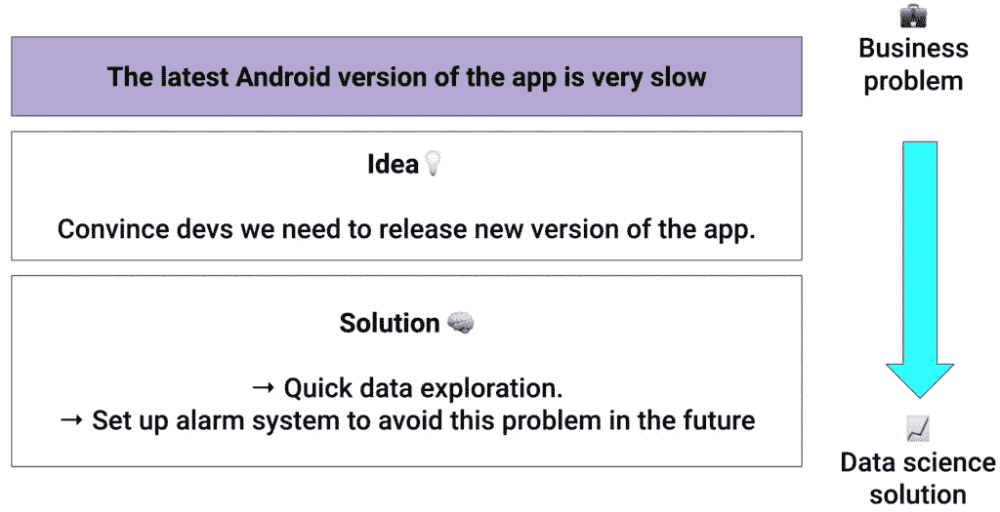

# 了解业务:我们没有充分讨论的数据科学技能

> 原文：<https://towardsdatascience.com/the-data-science-skill-no-one-talks-about-57d5d3e9f9d>

## 为什么你需要掌握这项技能，以及如何去做

黑山 Ada Bojana(图片由作者提供)

与我交谈过的每一位有抱负的数据科学家都认为，当别人给他们以下建议时，他们的工作就开始了:

1.  一个数据集，以及
2.  明确定义的优化指标，例如准确性

但事实并非如此。

它始于一个你需要理解、构建和解决的业务问题。这是区分高级和初级专业人员的关键数据科学技能。

在本文中，我将通过一个真实的例子向您展示如何训练这种数据科学技能。

# 数据科学项目的起点

在现实世界中，数据科学项目始于一个业务问题。他们生来就是要推动关键业务指标(KPI)。

数据科学家的工作是将业务问题转化为 ***right*** 数据科学问题。那就解决。

要将业务问题转化为*正确的*数据科学问题，您需要做两件事:

1.  提问
2.  探索数据，寻找线索。

> 没有什么比针对错误的业务问题构建出色的数据科学解决方案更令人沮丧的了。

我们来举个例子。

# 例子

假设你是一家顶级拼车应用公司的数据科学家。你的产品主管告诉你:

> 👩‍💼:“我们希望本季度将用户流失率降低 5%”

我们说，当用户决定停止使用我们的拼车应用程序时，她会感到不安。

用户流失背后有不同的原因。例如:

*   “另一家拼车应用公司(又名直接竞争对手)为该地区提供了更好的价格”(定价问题)
*   “汽车等待时间过长”(供应问题)
*   “Android 版本的应用程序非常慢”(客户端-应用程序性能问题)

你通过向团队的其他成员提出正确的问题来建立这个列表。你需要了解用户使用 app 的体验，从她的角度出发。

通常情况下，流失背后没有单一的原因，而是几个原因的结合。问题是:你应该关注哪一个？

这时，您需要发挥您出色的数据科学技能，探索数据🔎。

你研究这些数据，以了解上述每一种解释的可能性有多大。这个分析的结果是一个假设，你应该进一步考虑。

根据不同的假设，你会用不同的方法解决数据科学问题。

例如:

# 场景 1:“竞争对手提供了更好的价格”(定价问题)

一种解决方案是以某种方式检测/预测可能流失的用户群(可能使用 ML 模型),并通过推送通知发送个性化折扣。为了测试您的解决方案是否有效，您需要运行 A/B 测试，因此您需要将一定比例的应用程序用户分成两组:

*   A 组。该组中的用户不会获得任何折扣。
*   B 组。模型认为这个群体中的用户可能会流失，他们将在下一次旅行中获得价格折扣。

您可以添加更多组(例如 C、D、E……)来测试不同的定价点。

从定价问题到数据科学解决方案(图片由作者提供)

# 场景 2:“汽车等待时间过长”(供应问题)

在这种情况下，不存在定价问题，但缺乏司机来接客户。问题不一样，解决方法也一定不一样。

你可以做的事情是确定供应过低的位置和时间，并为潜水员提供价格激励来填补这些空缺。这样你可以更好地平衡供需，减少汽车等待时间。

从供应问题到数据科学解决方案(图片由作者提供)

# 场景三:“安卓版 App 很慢”(App 性能问题)

想象一下，您研究了应用程序的内存消耗数据，发现最新版本的应用程序消耗的内存几乎是以前版本的两倍。

按应用版本细分应用内存消耗(图片由作者提供)

这很奇怪，所以你去问客户支持团队是否收到过用户的投诉。

事实证明，大多数用户不会联系支持部门，而是停止使用该应用程序，并使用替代产品。然而，仍然有少数用户抱怨，并提到新版本的应用程序不是“非常响应”。

答对了。你在最新版本的应用中发现了一个问题。

你如何解决这个问题？去找前端开发人员，向他们展示应用程序版本的用户流失情况，并说服他们发布性能更好的新版本应用程序。

从技术问题到数据科学解决方案(作者图片)

# 综上

*   将业务问题转化为“正确的”数据科学问题是区分高级数据科学家和初级数据科学家的关键数据科学技能。
*   提出正确的问题，列出可能的解决方案，并探索数据，将列表缩小到一个。
*   解决这一数据科学问题

# 想成为机器学习和数据科学的专家吗？

🚀 [**加入 Datamachines 时事通讯，了解 ML 和数据科学的真实世界。**](https://datamachines.xyz/subscribe/)

➡️接上 [**碎碎念**](https://twitter.com/paulabartabajo_) 🐦，[**LinkedIn**](https://www.linkedin.com/in/pau-labarta-bajo-4432074b/)**👔**

**💎 [**今天使用我的推荐链接**](https://pau-labarta-bajo.medium.com/membership) 成为会员，可以无限制地访问我在媒体上发布的所有内容并支持我的写作。**

**<https://pau-labarta-bajo.medium.com/membership>  

快乐学习🤗

避寒胜地**