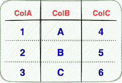
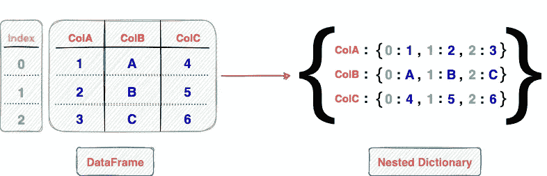
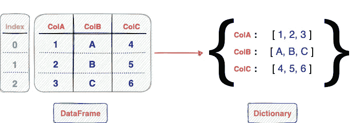
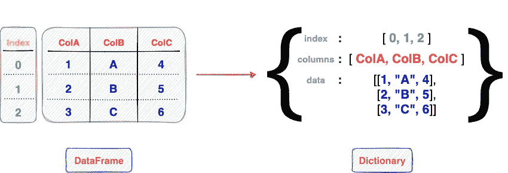

# 作为 Pandas 用户，您应该知道的数据帧类型转换

> 原文：<https://towardsdatascience.com/the-dataframe-type-conversions-you-should-know-as-a-pandas-user-4f8d3dd9d012>

## 从 Pandas DataFrame 生成列表、字典和 NumPy 数组的指南


克里斯·劳顿在 Unsplash[拍摄的照片](https://unsplash.com?utm_source=medium&utm_medium=referral)

熊猫数据框架在机器学习工程师和数据科学家中广泛流行，用于各种表格数据分析、管理和处理任务。



三列三行的表格数据(图片由作者提供)

虽然 Pandas 库对于许多用例是自给自足的，并且各种其他 Python 库为 Pandas 提供了内在支持，如 Matplotlib、Plotly、Sklearn 等。，在有些情况下，您可能需要将 Pandas 数据帧转换为 Python 中其他受支持的数据类型(或数据结构)。

即使不是这样，我坚信对这些转换的认识对熊猫数据帧的一般使用是有帮助的。

因此，在这篇文章中，我将展示 Python 社区中开发人员将 Pandas 数据帧转换为其他广泛使用的数据类型的不同方法。

文章的亮点提到如下:

[**理解熊猫 data frame**](#f98f)[**转换为 NumPy 数组**](#85de)[**转换为 Python 列表**](#e603)[**转换为字典**](#04fd)
[**结论**](#e36f)

我们开始吧🚀！

# 了解熊猫数据框架

在我们对 Pandas 数据帧进行各种类型转换之前，让我们先简要了解一下这个数据结构。

简单地说，Pandas 数据帧是驻留在 Python 环境中的表格数据结构。


三列三行的表格数据(图片由作者提供)

它可以熟练地执行各种表格数据操作，如过滤操作、I/O 操作、数据分组和聚合、表连接、列分布方法、滚动窗口分析等等。

当然，只有在现有 Python 环境/会话中加载了 Pandas 数据帧时，才能执行上述操作。

创建数据帧的最基本的技术之一是使用如下所示的`pd.DataFrame()`方法。

首先，我们导入所需的库。

接下来，我们使用`pd.DataFrame()`方法从列表列表`data`中创建一个数据帧`df`，如下所示:

我们可以使用 Python 中的`type()`方法来验证数据帧的类:

你可以在我之前的博客中读到创建熊猫数据框架的各种技术。

# 转换为 NumPy 数组

首先，让我们了解如何将 Pandas 数据对象转换成 NumPy 数组。

这里，我们将考虑以下数据帧:

## 方法 1:

您可以使用`[values](https://pandas.pydata.org/docs/reference/api/pandas.DataFrame.values.html)`属性将熊猫数据帧转换为 NumPy 数组。

我们可以验证`result`对象的数据类型，它实际上是一个 NumPy 数组。

## 方法二:

Pandas 中的另一个可用功能是`[to_numpy()](https://pandas.pydata.org/docs/reference/api/pandas.DataFrame.to_numpy.html)`方法。

> **注意:** Pandas 官方文档推荐使用`df.to_numpy()`而不是方法 1 中讨论的`values`属性。(来源:[此处](https://pandas.pydata.org/docs/reference/api/pandas.DataFrame.values.html))

## 方法三:

最后，您还可以使用 NumPy 的基本方法— `[np.array()](https://numpy.org/doc/stable/reference/generated/numpy.array.html)`将 Pandas 数据帧转换为 NumPy 数组，如下所示:

如果您想了解创建 NumPy 数组的各种方法，可以在下面找到我的博客:

</here-are-30-ways-that-will-make-you-a-pro-at-creating-numpy-arrays-932b77d9a1eb>  

# 转换为 Python 列表

接下来，我们将学习一些将熊猫数据帧转换成 Python 列表的方法。

不幸的是，Pandas 没有提供将 Pandas 数据帧转换成 Python 列表的直接方法。

因此，为了实现这一点，我们应该首先将 DataFrame 转换成一个 NumPy 数组，然后使用 NumPy 中的`[tolist()](https://numpy.org/doc/stable/reference/generated/numpy.ndarray.tolist.html)`方法转换成一个列表。

如上所述，该方法首先使用上一节中讨论的`values`属性将 DataFrame 转换为 NumPy 数组，之后，我们使用 NumPy 的`[tolist()](https://numpy.org/doc/stable/reference/generated/numpy.ndarray.tolist.html)`方法。

# 转换为词典

Pandas 数据框架的另一个流行的转换是从它生成一个 Python 字典。

简单回顾一下，我们在博客中使用了以下数据框架:

在 Pandas 中，我们可以使用`[to_dict()](https://pandas.pydata.org/docs/reference/api/pandas.DataFrame.to_dict.html)`方法将数据帧转换成字典。下面，我们将讨论使用这种方法可以生成的各种格式的 Python 字典。

这些格式主要取决于方法返回的键值对的类型。字典的结构由`to_dict()`方法的`orient`参数决定。

## 方法 1:

使用`orient='dict'`(这也是参数的默认值)，该方法返回一个嵌套字典，其中外部字典的键是列的名称，内部字典的键是索引值。

默认行为(`orient='dict'`)的示意图如下所示:



熊猫数据框架到 Python 字典(图片由作者提供)

下面的代码块演示了`to_dict()`方法的输出。

## 方法二:

与方法 1 中的嵌套字典不同，您可以从 DataFrame 中生成一个字典，用`key`作为列名，`value`作为表示为列表的列。

您可以通过将`orient=”list”`传递给`to_dict()`方法来实现这一点。

下图对此进行了描述:



熊猫数据框架到 Python 字典(图片由作者提供)

相应的实现如下所示:

## 方法三:

使用`to_dict()`方法生成字典的另一种有趣方式是指定参数`orient=”split”`。

返回的字典有三个键值对。这些是:

```
1\. **'index'**: The value holds the index of the DataFrame as a Python list.
2\. **'columns'**: This is also a list which specifies the name of the columns.
3\. **'data'**: The value of this parameter is a list of list which represents the rows of the DataFrame. The value of this key is the same as what we discussed in **'Converting to Python List'** section.
```



熊猫数据框架到 Python 字典(图片由作者提供)

该转换的输出如下所示:

此外，该方法还提供了另外四种表示方法来从数据帧中获取字典。

这些是`orient='**series’**`、`orient='**tight**’`、`orient='**records**’`和`orient=**'index**’`。你可以在官方文件[这里](https://pandas.pydata.org/docs/reference/api/pandas.DataFrame.to_dict.html)读到它们。此外，StackOverflow 上的这个答案是了解它们的绝佳资源。

# 结论

总之，在这篇文章中，我演示了将熊猫数据帧转换成不同 Python 数据对象的各种方法。

更具体地说，我讨论了 Pandas 数据帧到 NumPy 数组、Python 列表和字典的转换。

请注意，各种其他数据类(或数据类型/框架等。)支持与 Pandas 的相互转换，比如 DataTable 数据帧、Dask 数据帧和 Spark 数据帧，我将在另一篇文章中演示。

**感谢阅读！**

[🧑‍💻**成为数据科学专家！获取包含 450 多个熊猫、NumPy 和 SQL 问题的免费数据科学掌握工具包。**](https://subscribepage.io/450q)

✉️ [**注册我的电子邮件列表**](https://medium.com/subscribe/@avi_chawla) 不要错过另一篇关于数据科学指南、技巧和提示、机器学习、SQL、Python 等的文章。Medium 会将我的下一篇文章直接发送到你的收件箱。

我喜欢写基本的数据科学概念、工具、技巧和诀窍。你可以在 LinkedIn 上和我联系。