# 助推和套索的深层联系

> 原文：<https://towardsdatascience.com/the-deep-connection-between-boosting-and-lasso-b40c00fc71c6>

## 通过彻底的视角转换理解强大的算法

(来自 [Unsplash](https://unsplash.com/photos/7hwF_T-1YPg) 的[汤姆·盖诺尔](https://unsplash.com/@its_tgain)摄影)

梯度推进既被普遍使用，又被普遍低估。

当讨论其有效性时，人们通常默认两种观点:

1.  梯度提升从低方差和高偏差开始，并通过添加更多弱学习者来减少偏差
2.  梯度推进近似于函数空间中的“梯度下降”,并试图最小化该空间中的损失

这两种观点都很有趣，非常有价值！然而，它们并没有讲述整个故事；**特别是，他们努力解释*为什么*梯度推进如此有效。**

通过将增强(特别是具有固定小权重的梯度增强)重新表述为近似套索(L1 正则化)问题，我们可以对增强的作用有另一种理解，并将其与内核化方法等其他基本技术进行比较。我们为什么关心？找到不同技术的机制之间的共性可以帮助我们提出全新的算法！

让我们通过扩展 Rosset 等人在[这篇论文](https://www.jmlr.org/papers/volume5/rosset04a/rosset04a.pdf)中讨论的一些观点来进行这种重新表述。以一种读者友好的方式。(注意:我将使用*树*作为原子模型的选择，但是许多相同的想法适用于各种基础学习者。)

# 概述:功能梯度下降

升压的一个常见类比是函数空间中的梯度下降。代替迭代更新 n 维参数向量，我们现在迭代更新参数*函数*(其属于潜在的无限维函数空间。)

让我们快速回顾一下这个类比。现在，我们有一个以参数函数作为自变量的成本函数，而不是参数向量上的成本函数(函数上的函数称为“泛函”):

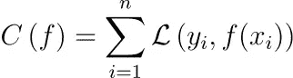

图 1:提升问题的成本函数(图片由作者提供)

这里，花哨的“L”是我们传统的建模损失函数，它将真实标签和我们的模型(其中我们的模型由函数“f”表示)分离的输出作为参数。

就像计算参数向量的梯度一样，也可以计算参数*函数*的梯度。结果也是一个函数(正如参数向量的梯度也是一个向量)，我们可以从参数函数中减去它来执行“下降”步骤。

我将省去实际梯度的求导；更多详情，请参见亚历克斯·格拉布和萨曼莎·霍瓦特的精彩课堂笔记。只需知道，得到的梯度是一个“尖峰”函数，当在训练点 x{i}上评估时，它吐出当前预测的“残差”(如果损失函数“L”是平方损失，则为真残差，否则为伪残差)，当在其他地方评估时，吐出零。以下是梯度函数和结果更新的可视化效果:

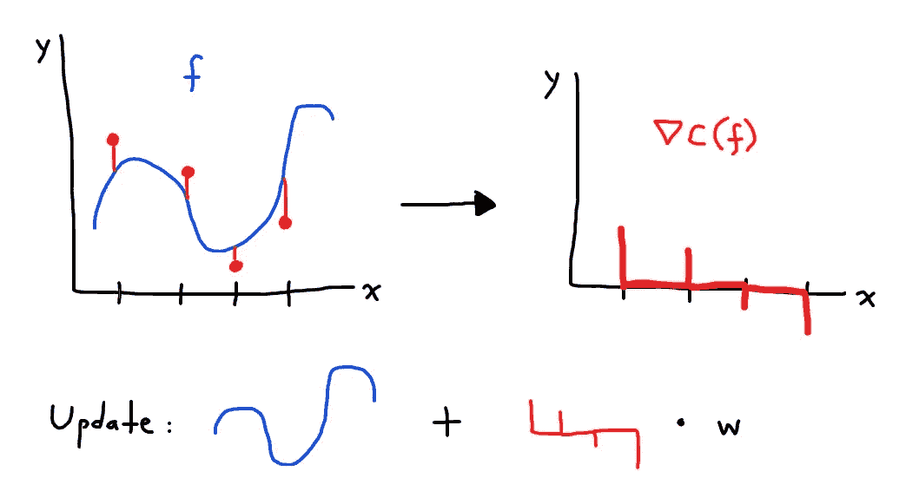

图 2:使用来自图 1 的成本函数的梯度进行更新(图片由作者提供)

将这个原始梯度添加到我们的当前函数将导致严重的过度拟合，本质上使结果成为一个存储我们训练数据上的目标的查找表。为了解决这种缺乏一般化的问题，我们可以通过在约束函数类(例如决策树)中找到一个与梯度“接近”的函数来“平滑”这种梯度，同时产生更一般化的结果。我们修改后的更新变成了我们熟悉的梯度增强更新:从我们的函数类中找到一个“接近”真实梯度的函数，并以较小的权重将其添加到我们当前的模型中。

优雅的东西。然而，一个关键问题仍然存在:

**如果弱学习者在拟合梯度方面做得很差(根据定义)，为什么推进会如此有效？**

在我看来，这就是高级功能梯度下降类比的失败之处(更详细的版本可能会更好。)这里有*和*其他解释提升能力的方法，但是 LASSO 公式既易于理解，又非常有助于将提升与其他方法如支持向量机进行比较。

为了理解这个公式，它有助于完全转移我们对增压问题的观点。让我们透过向量代数的镜头来看问题吧！

# 提升树的向量空间

当人们想到向量时，他们通常会想到欧几里得空间中的尖箭头。

实际上，“向量”和“向量空间”的概念要抽象得多。

一个空间成为向量空间的唯一要求是，增加和缩放向量会在该空间内产生另一个向量(您还需要存在一个“零”向量，当添加到另一个向量时，它什么也不做。)

这意味着许多，*许多*集合都是向量空间。所有多项式的集合是一个向量空间(使用规则验证这一点！)所有 2x2 矩阵的集合是一个向量空间。

**重要的是，所有提升的树的集合是一个向量空间。**

如果我们将“提升树”定义为具有固定深度 D(其中 D 由我们选择)的决策树的有限加权和(即线性组合)，那么很明显，任何提升树的线性组合都是*自身*提升树。

正如您可以通过一组有限的向量(轴向量)的线性组合来重新创建所有欧几里得空间一样，您也可以通过单棵树的线性组合来重新创建所有增强的树空间！如果我们只允许在观察到的数据点上或数据点之间进行树分裂，那么任何深度为 D 的单独的树都可以写成深度为 D 的有限多个“构建块”树的线性组合。

让我们来研究一种方法。请注意，如果我们只允许在观察到的数据点上或数据点之间进行分割，那么我们只能生成有限多个分区(即分割的组合)。然后，我们可以将一个给定分区的叶值的任意组合写成该分区上简单的“独热”树的线性组合。以下是使用两个特征维度 X1 和 X2 的深度为 2 的树的分解示例:

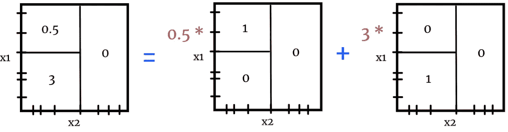

图 3:分解为线性组合的深度为 2 的树(图片由作者提供)

如果我们可以将任何深度为 D 的树写成“积木”树的线性组合，那么我们可以*也可以*将任何深度为 D 的提升树表示成线性组合，如下所示:

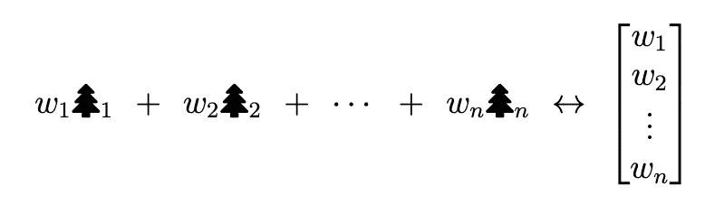

图 4:作为个体树的线性组合的增强树(由作者提供的图像)

左边的公式看着眼熟吗？如果这看起来像线性回归，那么你就有所发现了！理论上，我们可以将寻找一个好的加性树集合的问题简化为对一组生成所有可能的提升树的空间的树的**线性回归。但是，如果我们天真地试图建立一个回归模型，我们会遇到两个主要问题:**

1.  我们需要评估和使用大量的树作为特征。对于很多常见的数据集，在已知的宇宙中，唯一的树比夸克还多。
2.  *甚至*如果我们可以修复#1，我们将拥有比数据点多很多倍的特征，并且将需要约束我们的优化问题或者添加复杂度惩罚以达到有用的优化。

关于第二点，“拥有比数据点多很多倍的特征”正是 LASSO 能够解决的问题！

# 增强近似于套索调谐

让我们考虑一下，使用有限的“积木”函数，LASSO 回归是什么样子的。(注意，LASSO 通常使用平方损失来定义，但我将把定义推广到使用任何凸损失 c。)

首先，我们评估所有数据点上的每个函数，以在我们的特征矩阵 x 中创建列。现在我们有了我们的特征，我们解决以下 LASSO 回归优化问题:

图 5:特征函数 F1，F2，…，FM 的套索回归问题(图片由作者提供)

这个定义(用 L1 惩罚使损失最小化)可能为许多人所熟悉。不太熟悉但仍被普遍使用的是下面的套索的 **L1 约束公式:**

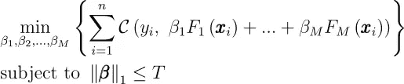

图 6:图 5 中问题的等价重写(作者的图片)

对于图 5 中的每个λ值，在图 6 中存在唯一的 T 值，其恢复相同的解，反之亦然(其中增加的 T 映射到减小的λ，直到λ = 0，此时任何更大的 T 值恢复相同的解:非正则解。)

让我们快速展示为什么每个λ映射到一个唯一的 T(另一个方向稍微复杂一点，使用拉格朗日对偶的论点可以在网上找到。)我将把这个证明自包含在下面的编号列表中，这样就可以很容易地跳过它:

1.  给定λ值，图 5 中优化问题的解对应于向量β，该向量β具有比对应于非正则化解(λ = 0)的范数小的某个有限 L1 范数 N。
2.  现在，考虑图 6 中 T = N 的约束优化问题。图 6 中 T = N 的解不能具有小于 N 的 L1 范数，因为这将是约束集内的局部最优解(与我们的凸目标只有一个局部最优解的事实相矛盾)。)因此，图 6 中 T = N 的解具有正好为 N 的 L1 范数
3.  由于图 6 中 T = N 的解决方案在所有 L1 范数等于 N 的解决方案中最小化了图 6 的目标，所以它也必须在所有 L1 范数为 N 的解决方案中最小化图 5 中给定λ的目标
4.  因此，T = N 的图 6 的解等于给定λ的图 5 的解，因为后一个解也具有 N 的 L1 范数
5.  图 6 中 T < N or T > N 的任何值都不能恢复相同的解，因为有一个不是 N 的范数(参见#2 中的论证)。)因此，映射λ → T = N 是唯一的。

换句话说，解决图 6 中的 L1 约束优化问题，对于 T 的许多连续较大的值，解决了λ的许多连续较小的值(范围从λ = ∞到λ = 0)的套索优化问题。)

这对我们有什么帮助？事实证明，提升——更具体地说，*贪婪ε*提升(即，在我们的回归特征集合中执行最佳ε大小的系数更新)——对于 t 的连续较大值，非常接近 L1 约束优化问题的“解序列”

因此，基于 T 和λ之间的对偶性，这意味着 boosting 解决了具有大范围λ值的多个套索问题，当我们找到导致良好验证性能的正则化水平时终止(这是实践中的“早期停止”)。换言之，提升在我们的非常高维的特征空间中有效地近似套索超参数调谐。

为了理解为什么提升等价于一系列 L1 约束回归问题，考虑下面的增量优化问题:

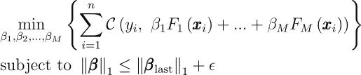

图 7: β_last 是 T (T_last)的某个值的图 6 的解(图片由作者提供)

这里，β_last 是图 6 中的 L1 约束问题的解，具有 T (T_last)的某个值。现在，我们想找到一个稍微宽松的 L1 约束的最优解，也就是说，T 的值稍微大一点——这就是问题的“增量”本质。

假设图 7 中问题的解是“单调”更新，即解的每个坐标的绝对值大于或等于β_last 的绝对值(换句话说，“单调性”意味着更新在每个坐标上增加了离原点的距离。)最佳更新实际上*是*单调更新在实践中是常见的，特别是对于小的ε值。(我们将在本节的后面回到*为什么*我们需要单调性。)

在接下来的几段中，我将使用图 7 中的优化约束来帮助我们理解这个“单调最佳更新”*实际上看起来像什么*。

现在—如果图 7 中的最佳更新是单调的，那么当您在图 7 中的现有约束之上添加新的单调性约束时，它仍然是最佳解决方案，因此我们可以在不改变最终解决方案的情况下添加该单调性约束。这两个组合约束等价于下面的约束集(“等价”在创建相同的可行β集的意义上):

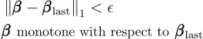

图 8:β上新的等价约束集(作者图片)

(您可以通过使用单调性的定义以及涉及算术和绝对值的不等式来展示这种等价性。这次我省略了证明，但是请随意检查我的证据！)

如果我们在图 8 中的约束对下恢复我们的单调最佳更新，那么如果我们丢弃第二个约束并且在第一行中仅使用 L1 邻域约束，我们也将恢复它。(注意，在该奇异 L1 邻域约束下可行的所有β在图 7 中的原始约束下也是可行的，因此我们永远不会“超越”原始约束。)

我们剩下的是一个约束，约束我们的更新在 L1 距离上接近前面的参数β_last。**换句话说，如果图 7 中原始问题的最优解是单调更新，那么我们也可以通过以β_last 为中心的局部优化问题来恢复它。**

我们快到了！让我们使用上面的新约束重写图 7 中的优化问题。此外，如果我们在β_last 周围的局部邻域足够“小”并且我们的成本函数 C 是平滑的，那么我们可以通过使用其梯度用线性近似来替换目标函数(我们在图 7 的花括号内最小化的“成本之和”函数)。对约束和目标函数进行这些替换产生了这个最终的优化问题，只要图 7 中的最佳更新是单调的，就恢复与图 7 相同的最佳更新:

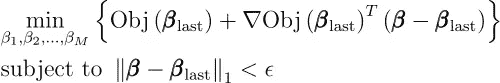

图 9:“Obj”是图 7 中花括号内的“成本总和”目标函数(图片由作者提供)

由于目标是线性的，那么很容易看出这个约束优化问题的解决方案是仅改变目标在β_last 的梯度具有最大绝对值的β的坐标，如果符号是负的则加上ε，如果符号是正的则减去ε(注意，根据定义这将是单调更新，因为我们假设*最佳*更新本身是单调的。)

这听起来熟悉吗？在每一步，我们只更新β的最“有影响”的坐标；**这相当于在最“有影响力”的特征函数(其系数就是β** 的所说坐标)上迈出了一小步。)

概括一下:图 7 中的优化问题是图 6 中优化问题的增量版本。如果我们针对某个 T 值求解图 6，并且针对稍大的 T 值的解是单调更新，那么我们通过贪婪的ε提升来恢复它。只要每个增量问题通过单调更新得到解决，那么**我们在一系列推进迭代下追踪出整个套索解序列。**在这种情况下，boosting 的每次迭代都解决了λ值稍小的套索问题。

我们提到了单调性很重要。这是因为如果违反了单调性，那么在我们的推进解序列和套索解序列之间就不再有完美的 1:1 对应关系。这是因为违反单调性意味着我们有效地“重新访问”并更新具有较小 L1 范数的解，而不是在该迭代上求解具有递增的较大 L1 范数(对应于递增的较小λ)的解。然而，在这种情况下，增强通常非常接近套索序列*甚至*。检查来自 Efron 等人的论文中的[下图。a1 在糖尿病数据集上比较 LASSO 系数序列和 boosting 序列:](https://projecteuclid.org/journals/annals-of-statistics/volume-32/issue-2/Least-angle-regression/10.1214/009053604000000067.full)

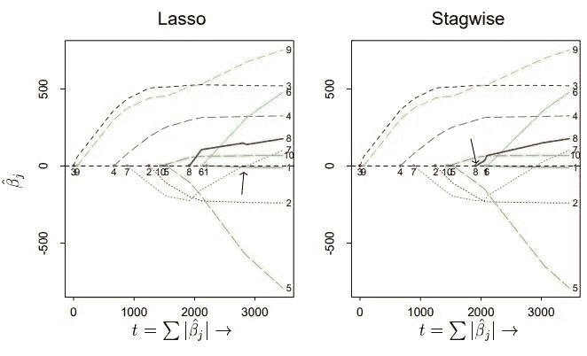

图 10:在糖尿病数据集上，套索系数对增强(阶段式)系数。(图片由 Efron 等人提供。阿尔(2004 年))

在该图中，LASSO 和 boosting(阶段式拟合)仅在原始特征上完成，而不是在功能特征上，但是紧密的对应关系仍然很能说明问题。当变量 7(灰色线)违反单调性时，变量 8 之后会出现差异(见黑色箭头和红色线)，但这种差异很小，随着迭代次数的增加，似乎几乎可以解决。这里需要注意的是，这种“对违反单调性的鲁棒性”还没有在非常高的维度上测试过；然而，将助推与套索联系起来的基本原则依然存在。

# 放在一起:树推进

我们讨论了如何发现最佳加性系综的问题通常可以写成在一组“构件”函数(对应于回归中的特征)上的线性回归问题。)参见图 3 中使用决策树的例子。

在本节中，我们将快速讨论使用我们的“构建块”树的 epsilon greedy boosting 更新是什么样子，以及它与经典树提升的比较。

回想一下，我们通过使用目标函数相对于每个系数的梯度来确定更新哪个“构建块”系数(参见围绕图 9 的讨论)。)我们可以通过链式法则重写目标函数相对于β的每个坐标的梯度，如下所示:

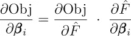

图 11:用链式法则求目标函数 w.r.t. β_i 的梯度(图片由作者提供)

回想一下，F_hat 是通过在所有数据点上评估我们的加性系综(在任何非线性变换之前)而生成的输出向量。)图 11 右侧的一阶偏导数是当我们进行传统的梯度增强时，我们在每次迭代中“拟合”的残差/伪残差。二阶偏导数是引入对系数向量β的依赖性的元素。这是这个偏导数的完全展开:

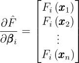

图 12:相对于单个坐标扩展梯度(作者图片)

该图的推导源于这样一个事实，即原始向量 F_hat 只是在每个点上评估的函数的线性组合，因此关于单个系数的导数隔离了由该系数加权的分量函数。

现在，如果我们的“构造块”函数是如图 3 所示的“独热树”，那么对于落入对应的独热树 F_i 的“活动叶”的所有 x，图 12 中的向量元素等于 1，否则为零。然后，图 11 中的产品可以重写如下:

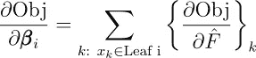

图 13:使用“独热树”重写图 11(作者图片)

换句话说，**找到梯度最大(绝对)的β的坐标，等价于找到残差/伪残差之和最大(绝对)的划分叶！**

注意，传统的树增强并不像*那样工作。不是一次更新一片叶子(通过一个热树)，我们会找到一个最佳的*分区*并更新对应于该分区的所有*叶子。此外，在传统的树提升中，我们也不局限于 epsilon 大小的更新；相反，我们进行与*梯度*的大小成比例的更新，由ε加权以确保任何单独的更新不会太大。

但是，尽管两种范式之间存在差异，但“最优更新”背后的驱动力非常相似。如果我们将由传统树提升生成的集成映射回我们的独热树坐标系中的权重，那么我假设由具有相似系数 L1 范数的独热树提升生成的集成表现大致相似。对这两者进行比较的模拟将是这一讨论的一个非常有趣的后续。

# 与内核化方法的比较

boosting 和 kernelized 方法都声称能够适应任何情况。在传统的 ML 世界中，两者都是“黑箱”。那么一个比另一个有什么优势呢？

回想一下，一个内核化的方法是任何使用“内核技巧”来适应模型的方法。我不会在这里讨论这个概念背后的数学；只需知道，通过使用“内核技巧”，我们可以以很少的额外成本利用许多高度非线性的特性(通常在传统的线性模型中)。

对于内核化方法，我们通常在新的“内核”特征空间中拟合线性模型。下面是一个内核化线性回归的示例，优化目标扩展到包括隐式内核特性:

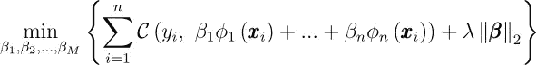

图 14:用隐式核特征扩展的核化线性回归目标(作者提供的图像)

请注意，这个问题看起来与图 5 中的升压问题非常相似！

很快，我们可以看到内核化方法的一个主要缺点:**我们对ɸ的隐式内核特性没有多少选择**。

然而，在 boosting 中，我们可以自由选择我们喜欢的任何函数集，只要我们可以在任何迭代中有效地评估“最佳方向”。对于树提升，找到这个“最佳方向”就像在每一步拟合一个与残差/伪残差“相关”的树一样容易。

内核化方法的另一个缺点是**我们被锁定在某些先验中，也就是说，某些特征会自动受到比其他特征更重的惩罚**。

大多数内核化方法采用某种形式的正则化来处理过拟合和过参数化(图 14 是内核化脊回归的例子，即 L2 正则化。)并且众所周知，在采用 L1/L2 正则化和相关方法之前，您需要缩放您的特征；否则，“较小”的特征将比“较大”的特征受到更严重的惩罚。

然而，内核化的方法使得*不可能*让你可靠地保持最终的“内核特性”不变！

考虑多项式核。多项式核中的某些项具有相对较大的范围-想想(1 + xy)以及乘积项“xy”如何具有系数 2，这使得最终 1 次要素的系数为√2，而最终 2 次要素的系数较小，为 1。结果，当加入正则化时，我们被锁定在不成比例地惩罚某些项，这对于所谓的“通用”算法可能是不期望的。

不言而喻，boosting 不会遇到这个问题，因为我们可以完全控制我们的功能。

最后，**广泛使用的内核化方法需要花费更多的时间来进行(正则化)超参数调整。**这个不可否认地不是这些方法的*固有的*问题，因为迭代解经常存在，在单个模型拟合中自动追踪每个超参数值的解。然而，在*练习*中，练习者通常会做的是，每次使用不同的超参数值对内核化模型进行多次改装。

另一方面，我们已经探索了 boosting 和 LASSO 之间的联系，以及 greedy epsilon boosting 如何像 LASSO 的高效版本一样，在一次拟合中求解多个 T/λ值，从而在多次 boosting 迭代中有效地描绘出整个“解的轨迹”。换句话说，通常实践的**增强为我们提供了一种在*单一*拟合中的超参数调整形式。**好看！

# 结论

Boosting 是一种极其强大的技术，但它远不像人们想象的那样是一个“黑箱”。虽然最终的结果可能无法解释，但驱动其部分力量的高层次思想甚至对于那些只上过线性模型课程的人来说也是可以理解的。

与神经网络形成对比，神经网络的基础理论仍在发展中，在数学上更加复杂。

总而言之，我希望这次深入探索能让你对你信赖的表格工具多一点点欣赏。优雅和力量的结合，没有什么比渐变更好的了！

# 参考

[1] S. Rosset，J. Zhu，和 T. Hastie， [Boosting 作为一个正则化的最大间隔分类器路径](https://www.jmlr.org/papers/volume5/rosset04a/rosset04a.pdf) (2004)，机器学习研究杂志 5 941–973

[2] A. Grubb 和 s .霍瓦特，[增强:函数空间中的梯度下降](https://www.cs.cmu.edu/~16831-f14/notes/F11/16831_lecture15_shorvath.pdf) (2012)，机器人学中的统计技术(16–831，F10)，第 15 讲(卡耐基梅隆大学)

[3] B. Efron，T. Hastie，I. Johnstone 和 R. Tibshirani，[最小角度回归](https://projecteuclid.org/journals/annals-of-statistics/volume-32/issue-2/Least-angle-regression/10.1214/009053604000000067.full) (2004)，《统计年鉴》32(2):407–499