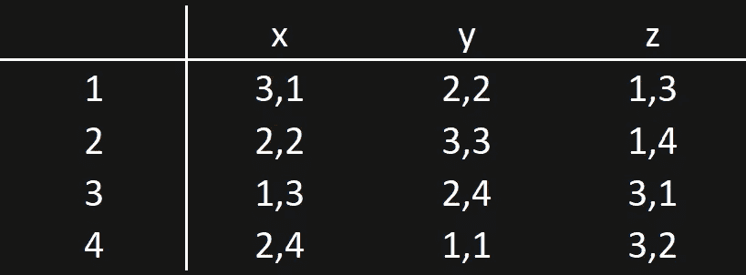

# Python 在学校选择中使用的延迟接受(DA)算法

> 原文：<https://towardsdatascience.com/the-deferred-acceptance-da-algorithm-utilised-in-school-choice-with-python-afc0fe892921>

## 我们如何让学生和学校稳定匹配？

安诺尔·查菲克在 [Unsplash](https://unsplash.com?utm_source=medium&utm_medium=referral) 上拍摄的照片

匹配研究调查人、机构和商品之间的稳定匹配。从 Gale 和 Shapley (1962)的延迟接受(DA)算法开始，这项研究已经成功地应用于现实世界，尤其是 21 世纪初以来的学校选择。在这篇博文中，我将简要解释匹配/学校选择理论的背景及其理论发展，并展示算法的 python 实现。

Python 的实现可以在[这个回购](https://github.com/kyosek/deferred_acceptance_school_choice)中找到。

# 目录

1.  介绍
2.  延期录取算法与学校选择
3.  Python 实现
4.  结论和未来工作

# **1。简介**

传统上，人们会被自动分配到美国最近的学校。然而，在 1980 年代，政府开始了学校选择制度，以便让学生更灵活地选择他们喜欢的学校。从此，人们开始思考如何策略性地获得自己的首选学校。事实证明，博弈论的方法是有帮助的。作为一个现实世界的例子，纽约市高中录取在 2003 年使用了 d a 算法的一个变种。这篇博文研究了延期录取算法的特性及其在学校选择机制中的应用。还演示了算法的 python 实现。

# **2。延期录取(DA)算法与学校选择**

本节简要介绍几个属性，并举例说明该算法如何工作。所有的证明和详细的解释都可以在文献中找到，这里只演示了最基本的部分。

**2.1 框架/属性**

进一步讨论这个话题，有几个重要的性质，即**稳定性**、**效率、防策略**。本节解释这些概念。

**稳定性**

DA 算法是找到代理和主体的稳定匹配的算法。但是这里的“稳定匹配”是什么意思呢？

为了有一个**稳定匹配**，我们必须满足以下条件(盖尔和沙普利，1962):

(I)代理人是个体理性的

(ii)如果代理人与委托人匹配，这种匹配不能被任何联盟阻止。

**效率**

由 DA 算法产生的每个匹配**弱 Pareto 支配由任何其他机制产生的匹配**(Gale 和 Shapley，1962)。如果没有其他匹配，其中至少有一个学生过得更好，没有学生过得更差，那么这个匹配就是(帕累托)有效的。在这种情况下，由于没有代理人有动机偏离这个分配到其他分配，或者没有代理人可以通过误报而变得更好，这就是**纳什均衡**。

**防战略**

这种算法使得**真实的偏好披露成为每个代理人的主导策略**，杜宾斯和弗里德曼(1981)证明了这一点；罗斯(1982) **。**

DA 算法满足稳定性和防策略性，但不满足效率。事实上，任何机制都不可能既高效又稳定(Roth 1982)。

**2.2 算法**

那么 DA 算法是如何工作的呢？该算法处理以下迭代:

**迭代 1:** 每个代理根据她的偏好等级选择委托人。每个得到报价的委托人拒绝最不喜欢的代理人，否则，把他放在“保留名单”上。

**迭代 2:** 在前一轮被拒绝的代理提供了他的第二个选择，委托人再次拒绝了最不喜欢的代理。

**迭代 k:** 在第 k 轮被拒绝的代理提供他的第 k 个选择，委托人拒绝最不优选的代理。

重复上述阶段，直到每个代理都在委托人的“保持列表”上。一旦最后一个委托人与最后一个代理人匹配，每个委托人都需要接受他们自己的“保留列表”中的提议。

**这证明了 DA 算法总能找到稳定的匹配(Gale 和 Shapley，1962)。**

2.3 学校选择

在择校的设置上，DA 算法需要一点点修改。在原来的 DA 算法设定中，一对一匹配是假设之一，但在学校选择中，这需要放宽到一对多匹配。所以学校有一定的学生配额，只要学生人数少于配额，学校就可以录取学生。下面是一个例子。

**示例**

表 1:学生/学校偏好表

假设存在 N = 4 名学生和 3 所学校，X，y，z ∈ X，如表 1 所示。学校 x 和 z 有 1 个名额，y 有 2 个名额。下表 1 显示了每个学校/学生的偏好排名。为了找到稳定的匹配，实现 d a 算法。一、学生申请学校，他们最偏爱。在第一轮中，1 和 2 都最喜欢 z，z 更喜欢 1 而不是 2，因此 z 拒绝了 2。3 个申请 x，4 个申请 y，放在各个学校的“保留名单”里。在第二轮中，2 应用她的第二选择 x。在 x 的“保留列表”中，有来自第一阶段的 3，但是 x 更喜欢 2 而不是 3，因此它拒绝了 3，并将 2 保留在其“保留列表”中。然后重复这些程序，直到每个人都被大学录取，最终可以找到稳定的配对。这些迭代显示在下面的动画中。

DA 算法迭代

然而，在现实世界中，学校通常不会对一群学生有严格的偏好。通常，他们的偏好包括 4 个优先组:(I)同胞和步行区，(ii)同胞，(iii)步行区和(iv)其他。为了解决这个问题并仍然应用 DA 算法，我们需要打破那些无关紧要的偏好，并使它们的偏好变得严格。为了打破平局，可以使用“随机抽签”。在同一个优先组的学生中，使用随机抽签人为地创建组中的排名，并在其他组中重复这一过程，以严格优先于所有学生。然而，不幸的是，使用这种方法会导致效率损失。

[奥斯曼·拉纳](https://unsplash.com/@osmanrana?utm_source=medium&utm_medium=referral)在 [Unsplash](https://unsplash.com?utm_source=medium&utm_medium=referral) 上的照片

# **3。Python 实现**

本节展示了算法的 python 实现。我已经创建了[回购](https://github.com/kyosek/deferred_acceptance_school_choice)。

**主 DA 算法功能**

这里展示了该算法的 python 实现的一部分。首先，下面是它的主要部分。在这个函数中，deferred_acceptance 接受 student_df、schools_df、schools_quota 和 verbose 输入。这些 student_df 和 schools_df 包含学生和学校对学校和学生的偏好。这些数据帧的细节将在下面进一步解释。schools_quota 表示每个学校的学生配额。如果 verbose 不为 0，它将打印迭代次数。

该函数将执行以下操作:

1.  创建匹配的初始环境
2.  遍历学生，开始将他们放在学校的“保留列表”中
3.  确保学校的学生人数少于学校的配额

**效用函数**

这里显示了几个实用函数。首先，一个叫做*严格 _ 偏好 _ 检查*。这个名字是不言自明的，但将确保学生对学校有严格的偏好，因为它对算法正常工作很重要。

第二个叫做 *create_dataframes。*它有助于从学生和学校偏好的列表和字典中创建一个 pandas 数据框架，以便在主要 DA 算法函数中使用。

第三个是随机打破一个学校的平局偏好的函数。正如上文提到的，现实世界中的学校通常对学生群体有不同的偏好。然而，为了让算法起作用，我们需要通过使用随机“抽签”来严格限定他们的偏好。

**例子**

这里有一个例子，说明了带有随机平局决胜的整个 DA 算法是如何工作的。这个例子创建了一个任意的集合，其中 4 个学生的偏好高于学校，3 个学校的偏好不严格高于学生。学校的配额是学校 a，学校 b，学校 c = 1，2，1。

示例:带随机平局决胜的 DA 算法

这个函数的输出是:

{('a '，' A'): (1，0)，(' C '，' C'): (1，0)，(' d '，' B'): (1，1)，(' B '，' B'): (3，2)}。

所以学校" A "收了学生" A "，学校" B "收了学生" B "和" d "，学校" C "收了学生" C "，这看起来像是我们所期望的。

# 4.结论和未来工作

本文简要介绍了 DA 算法的概念及其在择校中的应用，以及它的 Python 实现。这里介绍的算法是基本算法，也有一些算法的变体，例如，Erdil 和 Ergin (2008)提出的稳定改进周期(sic)。这种算法交换分配后的学生随机平局打破。尽管它不再是策略证明的，但该算法显著提高了其效率(Abdulkadiroglu 等人，2009)。因此，作为未来的工作，这将是一个伟大的下一步实现这一点。

# 参考

Abdulkadiroglu，a .和 Sonmez，T. (2003 年)。一种机制设计方法。美国经济评论，93(3):729–747。

Abdulkadiroglu，a .和 Pathak，P. A .和 Roth，A. E,《策略的严密性与匹配差异的效率:重新设计纽约市高中比赛》。美国经济评论，99(5):1954-1978。

杜宾斯，L. E .和弗里德曼，D. A. (1981 年)。马基雅维利和盖尔-沙普利算法。美国数学月刊，88(7):485–494。

盖尔和沙普利(1962)。大学录取和婚姻的稳定性。美国数学月刊，69(1):9–15。

罗斯(1982 年)。匹配经济学:稳定性和激励。运筹学数学，7(4):617–628。