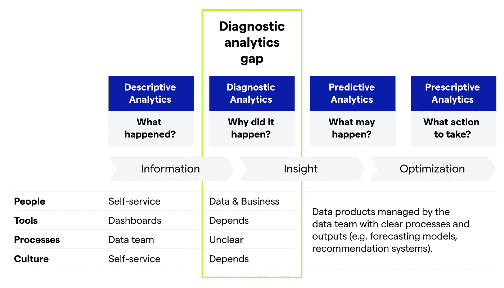
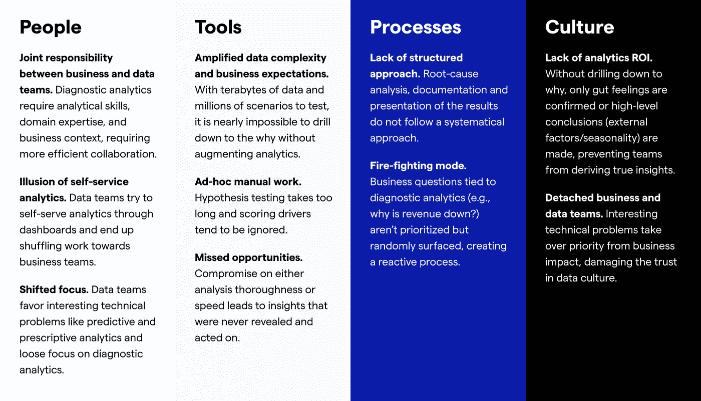
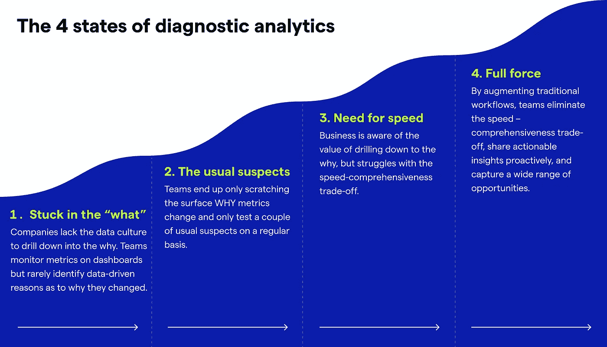

# 诊断分析差距

> 原文：<https://towardsdatascience.com/the-diagnostic-analytics-gap-3f9d0a44e8f8>

## 为什么这种差距是相关的，如何弥补？

注意差距(图片由 jigsawstocker 在 Freepik 上提供)

在仪表板中显示正在发生的事情是信息性的，而不是深刻的。知道一个关键的业务指标是上升还是下降是有用的，但是这是不可行的。只有这些变化背后的“为什么”才能推动建议和行动。

然而，我经常听到团队如何在每周/每月的评审中查看仪表板，并评论指标上升或下降，而没有对根本原因或可操作的见解的明确答案。这导致错失通过数据和分析推动业务影响的机会，阻碍了保持竞争优势所需的敏捷性。

# 这有什么关系？

在大多数组织中，分析仍然主要是描述性的(例如，发生了什么)。

很少有数据和业务团队找到了诊断分析(即，为什么会发生这种情况)。

当外部事件影响业务和利益相关者采取行动时，指标会随之改变。企业需要了解 KPI 的驱动因素，以及它们为什么会改变以做出更好的决策。这只能通过诊断分析来实现:根据业务发展速度提供对指标变化的全面洞察。

但是，利益相关者和数据从业者经常会根据他们的领域专业知识、直觉和经验，提出关于度量标准为什么会改变的假设。这些原因通常是高层次的，只是通过测试 2 或 3 个常见的嫌疑人来了解表面情况，从而导致错失机会。

# 分析领域

从高层次来看，诊断分析经常被忽视，因为它位于数据和业务之间。将它与其他类型的分析类型进行比较很有帮助。

诊断分析差距(图片由作者提供)

**描述性分析**通过仪表盘自助完成。数据团队管理治理和基础设施，并支持业务团队。有清晰的流程、所有权和工具。

**诊断分析**位于业务和数据之间。通过通用仪表板进行自助诊断分析几乎是不可能的(尽管许多数据团队都陷入了这一误区)。没有明确的流程，数据文化差异很大。

**预测和说明性分析**由数据团队管理，拥有业务团队使用的清晰数据产品(如推荐系统和预测模型)。它们在技术上很复杂，但在流程、人员和文化方面非常清晰。

# 是什么造成了这种差距

随着数据量和复杂性的增长以及业务变化速度的加快，业务需求和交付之间的差距不断扩大。出于各种原因，大多数组织都忽略了这一差距。对差距的深入理解需要基于 4 个关键要素的整体方法:人员、文化、工具和流程。

让我们更深入地了解 4 个关键要素中的每一个。

4 个关键要素之间诊断分析差距的原因(图片由作者提供)

# 如何弥合这种差距？

理想情况下，业务和数据团队会定期主动分析指标变化。即使顶线变化很小，通常也会有相反的效果。识别它们是至关重要的，以便团队可以快速区分什么是有效的，什么是无效的，并采取行动来最大化业务影响。

重点放在哪里，要看出发点。它需要对之前描述的 4 个要素进行全面概述。根据与数十名数据和业务负责人的交谈，我经常看到不同的诊断分析成熟度级别。我试着将不同的现实分为以下四种状态。

诊断分析的 4 种状态(图片由作者提供)

**状态 1 — *卡在【什么】***

公司缺乏深入探究原因的数据文化。团队监控仪表板上的度量，但是很少确定数据驱动的原因，即它们为什么改变。

**行动:**培养数据文化，向业务利益相关方展示诊断分析的价值

**如何:**

*   选择 2 或 3 个您认为有巨大潜力交付商业价值的用例。
*   主动调查这些业务指标的变化，并以结构化和影响驱动的方式分享您的发现
*   继续下去，直到你获得几个成功的故事。这应该是进一步扩展到其他用例并开始变更管理过程的基础

**状态 2 — *常见疑点***

团队最终只触及了为什么度量会改变的表面，并且只定期测试几个常见的疑点。

这是一个棘手的问题，因为它缺乏症状。业务涉众只是测试他们的高层次假设，导致错失机会。数据团队认为他们在自助分析方面做得很好。

**行动:**提高认识，不深入探究原因会导致错失机会

**如何:**

*   选择 2 或 3 个关键用例，在这些用例中，您知道业务团队只关注通常的疑点。
*   通过比较全面的分析和之前只触及表面的分析，主动深入到原因并分享您的发现
*   构建成功案例并扩展到更多使用案例

**状态 3 — *需要速度***

企业意识到深入研究原因的价值，但却在速度和全面性之间苦苦挣扎。

在这种情况下，数据文化已经很先进，团队只差马拉松的最后一英里了。大多数团队都意识到存在有待发掘的商业价值，但都在努力加速诊断分析。使用现有工作流执行全面的根本原因分析过于复杂和耗时。团队努力按照业务的速度提供见解。

**行动:**增强当前的工作流程，加快洞察速度，消除速度-全面性之间的权衡。

**如何:**

*   考虑增强分析平台，以加快洞察速度并消除权衡。这些工具利用 ML 来自动化假设测试和驱动因素评分。通过这种方式，团队可以了解业务的发展速度，而您可以扩展分析，而无需投入更多的分析师来解决问题
*   审查当前的诊断分析程序，并确保以适当的方式进行这些分析、分享见解和组织它们
*   针对最重要的用例，加强数据分析师和业务部门之间的协作，以发展领域专业知识

**状态 4 — *全力***

团队主动诊断度量的变化，以便不断改进。通过增强传统的工作流程，团队消除了速度和全面性之间的权衡，主动分享可操作的见解，并捕捉广泛的机会。

这种状态可以作为最佳实践来展示。团队积极主动地协作，流程定义明确清晰，并且实施了一套正确的工具来深入了解原因并找到可行的见解。因此，数据分析的投资回报率是明确的，并且对数据文化有很强的信任。

# 一句话:关键在于为什么

在仪表板中显示正在发生的事情是不够的。全面而快速地深入到为什么是提供可操作的见解以增加分析价值的唯一方法。这是征服数据之旅最后一英里的方法。

—

*思想？伸出手去* [*若昂索萨*](https://www.linkedin.com/in/joaoantoniosousa/)*主管成长* [*考萨*](http://www.kausa.ai) *。敬请关注更多关于如何确定诊断分析和增加数据价值的帖子。*