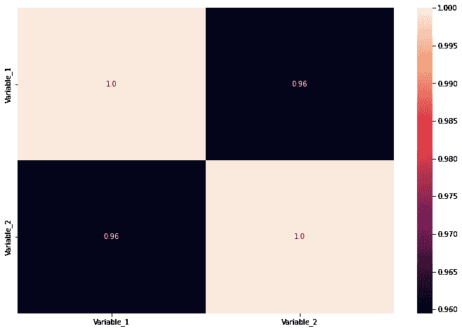
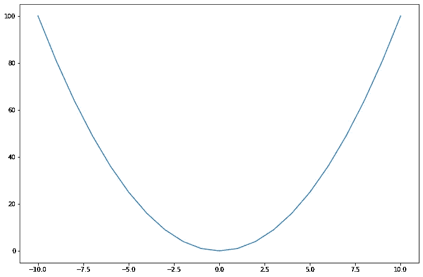
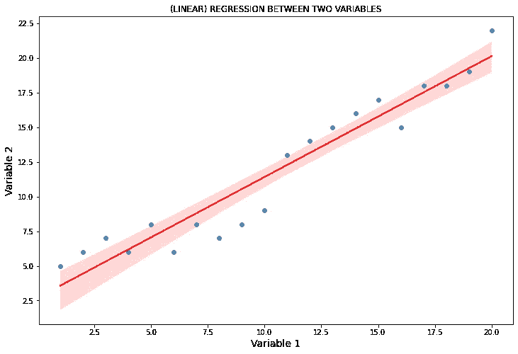

# 相关和回归的区别

> 原文：<https://towardsdatascience.com/the-difference-between-correlation-and-regression-134a5b367f7c>

## 关于这些话题的澄清文章


马库斯·温克勒在 [Unsplash](https://unsplash.com/s/photos/graphs?utm_source=unsplash&utm_medium=referral&utm_content=creditCopyText) 上的照片

W 当开始机器学习时，在移动键盘上的手指并开始编程之前，有许多主题需要理解。这些主题不仅与“可用的”算法有关，还与数学概念密切相关(但是，正如我所说的，如果你不懂数学，你可以在需要时学习)。

当接近数据科学和机器学习时，需要理解统计学中的一些主题；其中一些主题是相关性和回归。在本文中，我将举例说明这两个主题之间的区别，我们甚至会提到“相关性不是因果关系！”。

# 1.相互关系

> **相关性是表示两个变量之间线性关系的统计量。**

事情就是这样。但是，你知道，定义必须付诸实践(也是为了更好地理解我们正在研究的主题)。

深化概念，我们可以说两个变量是相关的，如果第一个变量的每一个值对应于第二个变量的一个值，遵循一定的规则(或者，如果你想的话，遵循一定的路径)；因此，如果两个变量高度相关，路径将是线性的(一条线)，因为相关性描述了变量之间的线性关系。

**这意味着相关性表达的是变量之间的关系，而不是因果关系！**如果自变量的值增加，因变量的值也增加，并不意味着第一个变量导致第二个值的值增加！

我们来举个例子:

夏天到了，很热；你不喜欢你的城市的高温，所以你决定去山上。对你来说幸运的是，你到达山顶，测量温度，你发现温度比你所在的城市要低。你有点怀疑(也是因为你对温度的下降不满意)，你决定去一座更高的山，发现温度甚至低于上一座山的温度。

你尝试不同高度的山，测量温度并绘制图表；你发现随着山的高度增加，温度降低，可以看到一个线性的趋势。这是什么意思？说明温度和高度有关；**这并不意味着山的高度导致了温度的下降**(如果你乘坐热气球到达相同的高度，在相同的纬度，你会测到什么温度？:) ).

因此，既然在物理世界中我们需要定义来衡量事物，那么一个好问题就是:我们如何衡量相关性？

测量相关性的典型方法是使用 c **或相关系数**(也称为皮尔逊指数或线性相关指数)。我不想深究数学，因为这篇文章的目的是提供信息和教育，而不是公式:我只想让你抓住并理解概念。

相关系数利用了统计概念**协方差**，这是一种数字方式来定义**两个变量如何一起变化**。抛开数学，只谈概念，**相关系数是一个在-1 和+1** 之间变化的数值。如果相关系数为-1，两个变量将具有完美的负线性相关性；如果相关系数为+1，两个变量将具有完美的正线性相关性；如果相关系数为 0，说明两个变量之间不存在线性相关。

我说我们会留下数学，但我没有说我们会留下代码，因为我们是在数据科学领域。那么，我们如何在 Python 中计算相关系数呢？我们通常计算相关矩阵。假设我们将两个变量存储在一个名为“df”、“变量 1”和“变量 2”的数据帧中，我们可以绘制相关矩阵，例如在 seaborn:

```
import seaborn as sns#heat map for correlation coefficient
sns.heatmap(df.corr(), annot=True, fmt="0.2")
```

我们得到了:



相关变量的相关矩阵。图片由作者提供。

上图显示，我们考虑的两个变量高度相关，因为它们的相关系数是 0.96。于是，我们期望用一条斜率为正的直线来描述它们之间的关系。这里我们来到了下一个概念:回归。

但是在讨论回归的概念之前，我想说最后一件事。在这篇文章中，我强调了一个事实，相关性与变量之间的线性关系有关。让我们来看两个变量，我们知道它们不是线性相关的；例如，一个寓言:



一个寓言。图片由作者提供。

在这种情况下，如果我们计算相关系数，我们得到 0:


不相关变量的相关矩阵。图片由作者提供。

变量不相关的事实恰恰告诉我们，没有一条线可以描述变量之间的关系:**不代表变量完全不相关！**只是说明关系不是线性的(可以是任何东西！)

# 2.回归

> 回归分析是一种用于分析一些数据的数学技术，由一个因变量和一个(或多个)自变量**组成，目的是找到因变量和自变量之间的最终函数关系。**

**回归分析的目的是找到一个估计值**(一个好的估计值！)在因变量和自变量之间。从数学上来说，回归的目的是找到最符合数据的曲线。

当然，最符合数据的曲线可以是直线；但是可以是什么曲线，看关系！

所以，我们通常做的是计算相关系数，如果它的值接近 1，我们可以在研究回归时得到一条线；否则…我们必须尝试多项式回归(或其他东西，如指数或任何东西)！

事实上，如果我们计算之前看到的数据之间的回归线(相关系数为 0.96 的“变量 1 和变量 2”)，我们会得到:

```
import seaborn as sns
import matplotlib.pyplot as plt#plotting the time series analysis with a red regression line
sns.regplot(data=df, x="Variable_1", y="Variable_2", line_kws={"color": "red"})plt.xlabel('Variable 1', size=14)
plt.ylabel('Variable 2', size=14)
plt.title('(LINEAR) REGRESSION BETWEEN TWO VARIABLES')
```



线性回归图。图片由作者提供。

正如所料，由于相关矩阵为 0.96，我们得到一条斜率为正的线，作为最符合数据的曲线。

最后，我想说，有无数种技术可以找到最符合数据的曲线；最常用的方法之一是“普通最小二乘法”,但是，正如我所说的，我不会进入数学领域:请相信我，因为这篇文章的目的是传播概念和知识。

感谢阅读。如果你不知道，我希望你已经理解了这些概念(如果不知道，请用评论告诉我！);如果你知道这些概念…我希望我没有犯任何错误！

*我们一起连线吧！*

[***中等***](https://federicotrotta.medium.com/)

[***LINKEDIN***](https://www.linkedin.com/in/federico-trotta/)*(给我发送连接请求)*

*如果你愿意，你可以* [***订阅我的邮件列表***](https://federicotrotta.medium.com/subscribe)**这样你就可以一直保持更新了！**

*考虑成为会员:你可以免费支持我和其他像我一样的作家。点击 [***这里***](https://federicotrotta.medium.com/membership)**成为会员。***