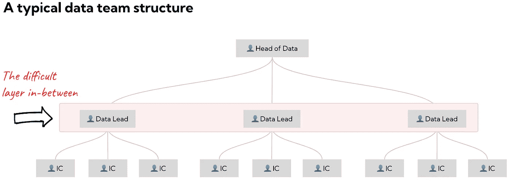
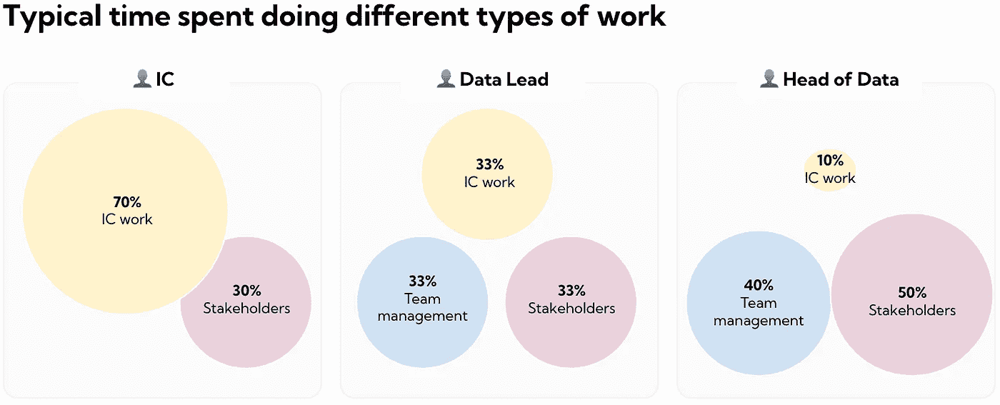
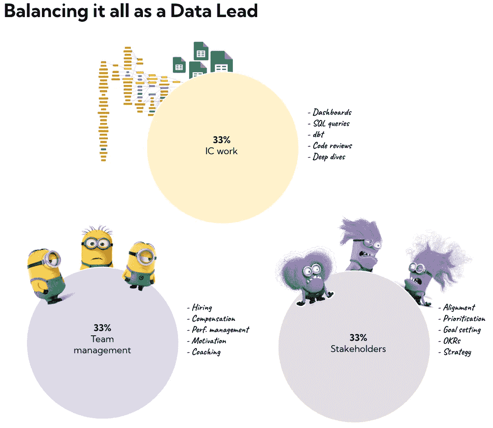

# 数据领导者的艰难生活

> 原文：<https://towardsdatascience.com/the-difficult-life-of-the-data-lead-a31186ef0d27>

## 为什么平衡管理一个团队与要求高的利益相关者和仍然亲力亲为不是一件容易的事情

处理数据从未如此困难。数据堆栈变得越来越复杂，期望值也比以往任何时候都高。

然而，有一个数据角色比大多数人都难:数据领导者。

担任数据中层管理角色的人通常被称为*数据主管*或*数据经理*，这是唯一一个你必须平衡管理团队与作为领导团队的一部分工作并仍然做实际工作的角色。不容易结合。

作者图片

如果你是一个 IC(个人贡献者),你的工作很有挑战性，但是你的重点很明确。通过交付高质量的分析和数据产品，通过与利益相关方合作确保您的工作产生影响，您将获得成功。

如果你是数据主管，你在战略层面上工作，如果你幸运的话，你在最高管理层有一个席位。你的角色很难，但你的重点也很明确；在你周围建立一个伟大的团队，确保数据团队在正确的优先事项上工作，并为未来的成功做好准备。

但是，如果你是一名数据主管，你必须一次完成所有这些工作。

作者图片

作为数据主管，你必须管理你的直接团队。这包括处理绩效管理问题，确保优秀员工受到挑战，以及雇佣合适的人。

你还必须管理利益相关者，他们通常有相互竞争的优先事项，并了解你的直接团队中有人参与的每个领域的情况。

你需要亲自动手，能够直接编写代码、构建仪表盘或提供分析，为好的外观设定标准。

这是一个很大的平衡。

作者图片

所有这些结合在一起，使得数据中层管理的角色非常独特，而作为一个数据行业，我们还没有想出如何处理这个问题。

随着数据集成电路职业发展道路开始成为人事管理阶梯的可行替代方案，我开始看到更多的数据线索被吸引到这一点上。他们仍然雄心勃勃，希望在职业生涯中取得进步，但也希望有时间专注于自己的手艺和深度工作。

如果你看看工程团队，许多工程经理已经把大部分与 IC 相关的工作抛在脑后了。事实上，在许多组织中，看到工程经理将代码推送到生产代码库是不常见的。

公司仍然需要数据经理，所以不是每个人都可以转移到 IC 阶梯。有人建议数据主管应该更像工程经理，但我不确定这是他们想要的。根据我的经验，亲力亲为是他们最喜欢的工作。

# 问题的一个可能的根本原因

随着[数据团队变得越来越大](https://mikkeldengsoe.substack.com/p/data-team-size)，对数据中层管理人员的需求只会增加，找出最佳运营模式是关键。一个解决办法是停止期望他们能够一次完成所有的事情。

如果当务之急是发展团队，那么在团队被雇佣之前，利益相关者不应该期望数据引导是实际的。

如果有一个绩效管理问题，团队中有人需要很多关注，招聘团队应该接受更多的初始候选人电话。

我认为数据经理压力最常见的根本原因是利益相关者。他们不是故意刁难(我希望如此),通常是出于良好的意愿来推动自己的商业目标。但是许多利益相关者不知道如何与数据人员合作。在高速增长的公司里，你经常会有来自各种背景的利益相关者。特别是来自传统公司的人，他们可能希望数据团队更多地作为服务功能来运作，目标是响应特定的数据请求。这是一个我一直以来都在制造很多摩擦的话题。

利益相关者为分配给他们的项目的数据“资源”而斗争，让数据领导者处于无法让任何人满意的困境，这也并不罕见。

**如何改善这种情况？**

一个问题是，许多组织没有一个高级数据人员坐在最高管理层的桌子上，可以为数据说话。这不像你在工程领域看到的那样，没有至少一个高级技术人员在那里是不常见的。

另一个解决方案是教育利益相关者。我总是发现与有数据背景的高级利益相关者一起工作要容易得多。他们知道有些工作有多难，也知道什么时候该偷工减料。所有高层领导都有数据背景但不做服务职能的数据团队还是一个比较新的事物，这可能是一厢情愿的想法。希望更多的利益相关者将习惯于如何与数据人员一起工作。

我仍在等待有人给利益相关者写一本关于如何与数据人员合作的终极手册*。*

如果你正在做这方面的工作或者有这方面的经验，我希望收到你的来信！