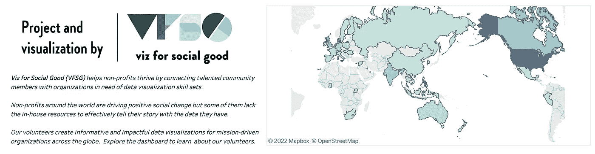
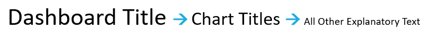
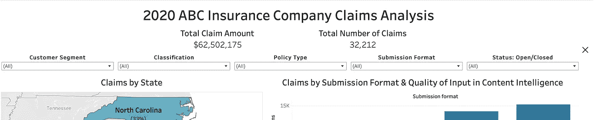
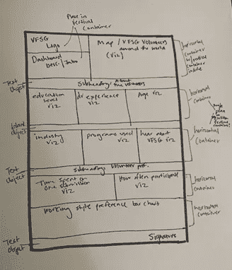
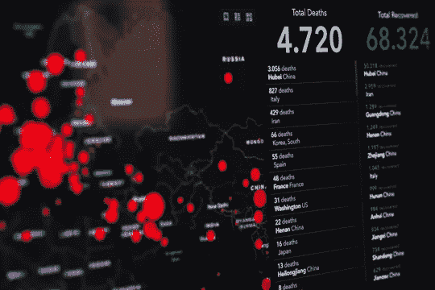
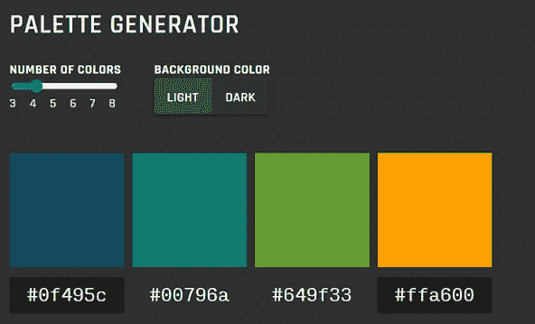

# 仪表板设计的注意事项

> 原文：<https://towardsdatascience.com/the-dos-and-donts-of-dashboard-design-2beefd5cc575>

## 创建有影响力的仪表板的快速提示

卢克·切瑟在 [Unsplash](https://unsplash.com) 上的照片

如今，许多组织和产品都在使用仪表板。仪表板是以可视化格式共享数据的好方法。Tableau、Cognos Analytics 和 Python 是一些用于创建仪表板的工具。有了这么多不同的工具，制作一个优秀的仪表板需要什么呢？

当仪表板不好时，我们作为用户会很快注意到，这反过来又会导致使用率低。当一个仪表板很棒并且易于使用时，我们不会花时间去想它——我们太忙于寻找有趣的见解了！

随着时间的推移，我发现了一些行之有效的制作仪表盘的技巧。下面你会发现仪表板设计的一些注意事项，以帮助你的下一个项目！

# DO:添加文本

仪表板可以包含更多的可视化！添加文本允许您向用户提供额外的上下文。根据所使用的工具，实现的方式会有所不同。许多工具，如 Cognos Analytics 和 Tableau，都有可以添加到仪表板的文本框。我使用仪表板标题下方或附近的文本框为用户提供说明和概述。

文本框可以放置在仪表板上的其他地方，为显示的可视化效果提供评论或见解。突出显示仪表板中的示例见解的几个要点可以帮助用户开始使用该工具。

在向仪表盘添加文本时，记住 KISS 原则— ***保持简洁*** 。长长的文本段落会阻碍用户使用仪表板。

按作者分类的图像:仪表板标题示例，标题下有仪表板说明

# 不要:保留默认字体设置

许多商业智能(BI)工具，包括 Tableau 和 Cognos Analytics，都有默认的字体设置。我个人发现我很少使用这些设置。默认设置并不可怕，但稍加调整就能增强用户体验！调整字体大小、颜色或对齐方式可以微妙地向用户传达意思。特定的尺寸或样式可以向用户表明特定的用途。

以下是几种修改仪表板字体的方法:

*   **整合字体大小的分层系统** —一致的字体大小有助于用户知道在哪里寻找特定类型的信息。在设计仪表板时，我使用最大的字体作为仪表板标题，第二大字体用于图表标题，最小字体用于添加到仪表板的任何附加文本。

作者图片:字体大小的分级系统

*   **加粗文本** —加粗所有标题(包括仪表板标题和单个图表标题)，以及文本框中的任何关键词或短语。
*   ***斜体文本*** —斜体文本是用户在导航仪表板时应特别注意的内容—这可能是针对特定用户组的特殊说明，或者是关于他们正在查看的仪表板的免责声明！
*   **添加颜色** —颜色是一种突出文本框中的关键词、短语或信息的好方法，可以让用户快速发现。在仪表板上添加关键见解时，我使用颜色来突出显示与数据相关的特定单词或数字，如下例所示。

作者提供的图片:为特定的关键数字和单词添加颜色的洞察示例。

# DO:添加过滤器

仪表板的主要优势之一是能够对数据进行切片和切块！最好的方法是使用过滤器！许多 BI 工具允许您直接在仪表板上添加过滤器，或者使用可视化工具过滤您的视图。

当直接在仪表板上添加过滤器时，我把它们放在一个地方，这样用户很容易找到。我选择补充仪表板的位置，但不从整体故事中抽离。将过滤器放置在仪表板的顶部、右侧或左侧，使用户可以轻松地访问过滤器，同时确保可视化具有主要焦点。

作者图片:带有虚拟数据的仪表板—过滤器位于顶部，使用 Tableau 的显示/隐藏按钮

我个人最喜欢的是使用可视化作为过滤器。我发现它为用户创造了愉快的互动体验。他们能够创建和导航自己的数据之旅，并深入挖掘数据集。例如，如果您有一个饼图，用户可以选择一个切片，仪表板上的所有可视化将更新以反映该数据子集。许多工具都支持这个特性，例如，在 Tableau 中，您可以为每个可视化启用一个[过滤器动作](https://help.tableau.com/current/pro/desktop/en-us/actions_dashboards.htm)，而在 Cognos Analytics 中，这是默认的[功能](https://www.ibm.com/docs/en/cognos-analytics/11.1.0?topic=filters-highlighting-data-points-across-visualizations)。

*注意:如果你不想让过滤器占据仪表板上的空间，或者你不想使用可视化作为过滤器，许多工具都有替代方法。Tableau 中的* [*显示/隐藏按钮*](https://www.thedataschool.com.au/david-ruhnau/tableau-2019-2-and-the-show-hide-button/) ，*和 Cognos Analytics 中的* [*所有选项卡&当前选项卡过滤器*](https://www.ibm.com/docs/en/cognos-analytics/11.1.0?topic=dashboards-filters) *都是不错的选择。*

# 不要:在页面上随意放置可视化效果

你把你的视觉效果放在哪里是很重要的——首先考虑你想让用户看到什么并与之互动，然后把这些东西放在靠近顶部的地方。考虑对齐和可视化大小——所有的可视化不必是相同的大小，你希望哪一个占用更多的空间？你想讲什么故事？有没有一种方法来放置视觉效果，以便有一个自然的流程？

这就像读一本书，你不会上下颠倒或者不按顺序来读，那么为什么要期望用户为一个仪表板这样做呢？

当我试图确定可视化的位置时，我创建了几个不同的选项。首先，我从草图开始，然后用我用来开发仪表板的工具创建一些选项。我也测试我将如何向观众讲述一个故事。这让我看到故事自然地流向哪里，以及哪里可能需要调整。

作者图片:仪表板草图示例

如果你有几个可视化，但不知道放在哪里，考虑添加标签。这些选项卡可以关注数据集的特定可视化或部分。

# DO:包括 KPI

KPI(关键绩效指标)，或关键度量，是某种你可以*量化的度量。*交易总数*、*索赔总数*和*平均用户响应率*是 KPI 的几个例子。所使用的指标应该是最终用户感兴趣的，因为它们可以帮助做出关键的业务决策。*

**

*马库斯·斯皮斯克在 [Unsplash](https://unsplash.com/) 上拍摄的照片*

*如果你的用户只有 5 秒钟的时间看你的仪表盘，这些数字应该会很突出。就仪表板上的 KPI 而言，位置是关键。将 KPI 放在顶部附近，以获得最大的可视性。我发现一些有效的位置在右上角，或者仪表板标题的正下方。*

# *不要:只使用一种可视化类型*

*一个只有条形图的仪表板，或者更糟的只有饼图的仪表板，不会留下太大的影响。有几种类型的可视化对不同的数据类型有益。考虑显示数据的最佳方式。虽然可视化类型的一些重复是好的，但是要尝试包含一些变化。在仪表板上只使用一种可视化类型会使事情难以突出，并会导致用户忽略关键的见解。*

*常见的可视化类型包括水平和垂直条形图、饼图、文字云、折线图、热图、散点图和气泡图。有关不同可视化类型的更多信息，请查看[塞维里诺·里贝卡](http://www.severinoribecca.one/)的[数据可视化目录](https://datavizcatalogue.com/)。*

# *DO:使用一致的配色方案*

*具有一致配色方案的仪表板会产生一种有凝聚力的外观，这有助于与您的最终用户建立信任和可信度，同时还会设定仪表板的整体基调。为特定的值或维度选择相同的颜色是增加凝聚力的一个很好的方法，并允许用户跨仪表板连接数据点。许多工具还支持自定义配色方案——这是组织将公司颜色融入仪表板的好方法！*

*如果您不确定从哪里开始，[数据颜色选择器](https://learnui.design/tools/data-color-picker.html#palette)是一个有用的工具，可以为您的数据可视化和仪表板确定正确的颜色——特别是如果您使用 Python 或 r 等工具。该工具可以帮助您测试不同的调色板、单一色调比例和发散比例。*

**

*作者图片:使用[数据颜色选择器](https://learnui.design/tools/data-color-picker.html#palette)生成的样本调色板*

# *不要:感到坚持第一个设计的压力*

*仪表板开发是一个迭代的过程，所以不要觉得坚持第一个版本有压力！第一个版本很少是最终版本，从长远来看，保持僵化会降低整体质量。*

*在整个过程中与您的最终用户协作，并让他们在构建仪表板时对其进行测试。观察他们的相互作用，看看什么有效，什么无效，并从那里进行改进！*

*遵循这些注意事项，提升您下一个仪表板的设计！*

*Payal 是 IBM 的一名数据科学家。在业余时间，她喜欢阅读、旅游和写作。如果你喜欢她的作品， [*关注或订阅*](https://medium.com/@payal-patel) *她的列表，不要错过一个故事！**

**以上文章是个人观点，不代表 IBM 的立场、策略或观点。**