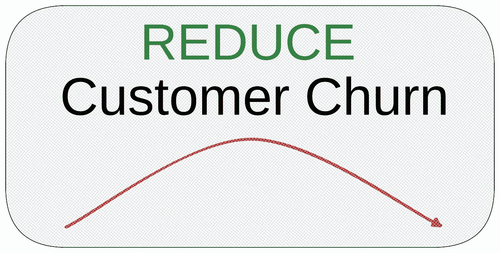
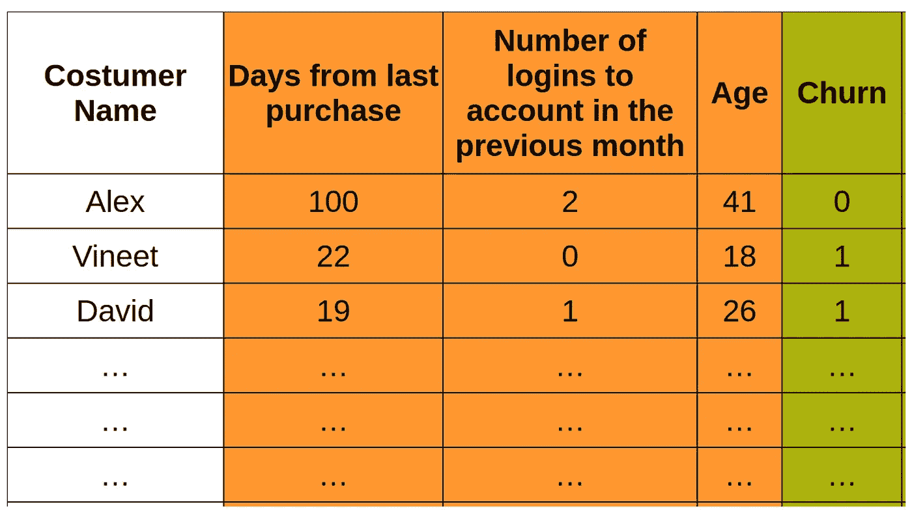
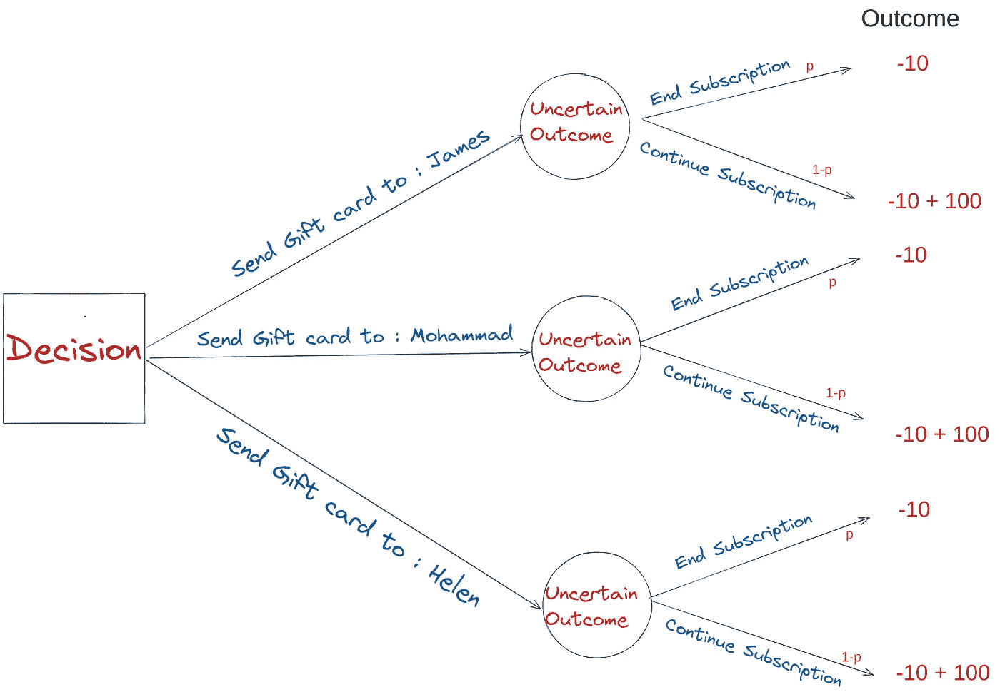
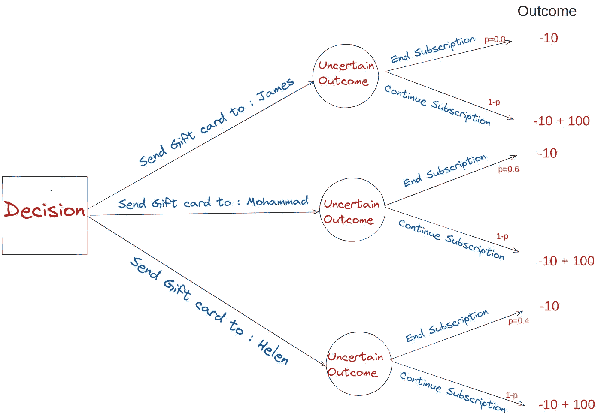

# 数据驱动决策的不利方面

> 原文：<https://towardsdatascience.com/the-downside-of-data-driven-decision-making-b753301b8d66>

## 数据驱动的决策通常会为“错误的问题”提供完美的答案。

克劳迪奥·施瓦兹在 [Unsplash](https://unsplash.com/s/photos/data-decsion?utm_source=unsplash&utm_medium=referral&utm_content=creditCopyText) 上的照片

如今，很难找到一家公司不把“**数据驱动决策制定**”(简称 DDDM)放在战略清单的首位。公司拥有的数据比以往任何时候都多，他们的自然动机是找出如何从这些数据中创造价值。然而，根据该报告(对美国各行业 190 名高管的调查):

> 只有 32%的公司表示能够从数据中实现有形且可衡量的价值。

在这里，我想提供一个见解，也许可以解释为什么公司不能从数据中实现价值。重要的是要认识到，在 DDDM，焦点是数据**。我们在 CEO 演讲、公司演示、媒体文章中听到很多:)等等。，像“数据有更好的想法”或“数据是新的黄金”这样的短语。“数据驱动决策”的主要思想可以归结为:**

> **我们能从这些数据中得到什么启示？**

**我想告诉你，跟着上面的问题走，往往会问出**“错题”。在 DDDM 方法中，我们试图为手头的数据找到一个用途。然而，这不是决策者的目标。公司决策者的目标是创造价值，这只能通过“**高质量”**的决策来实现。在组织中，我们需要找到为决策服务的**相关数据**。****

> **组织创造价值的唯一途径是做出高质量的决策，而数据需要为实现这一目的服务。**

**在这个背景下，我想看一个商业决策的例子，首先我考虑“**数据驱动”**方法的情况。接下来是另一个替代方案，通过**“决策驱动的数据分析”**方法来修复该方法中的一些缺陷。**

# **商业决策示例:**

# **流失分析:**

****

**来源:作者**

**对于任何向客户提供产品的 SaaS(软件即服务公司)来说，流失分析都扮演着重要的角色。简而言之，流失分析包括建立:**

> **预测性流失模型着眼于过去的用户活动，并基于客户特征，然后创建一个模型，给出客户终止您的服务或产品的可能性。**

**作为客户，我们都可能通过以下渠道从某项服务中流失:**

*   **结束订阅**
*   **关闭服务帐户**
*   **拒绝续订合同或服务协议**

**SaaS 公司需要找到降低流失率的解决方案，因为**

> **获得一个新客户的成本是留住一个老客户的 6-7 倍。**

**给定这个案例的简短描述，我们按照 DDDM 的方法来决定这个问题:**

*****数据驱动方式:*****

**现在，让我们来看一个开发机器学习(ML)模型的例子，该模型可以给出客户离开订阅的概率(流失概率)。ML 模型基于公司的内部数据。然后，这个 ML 模型将用于“决定”当该人的订阅结束时，向哪个客户发送礼品卡(10 美元)(为了续订订阅，该公司有 100 美元的年费)。比如下面是一个“网购网站”的**过去**的用户数据名为“David”(26 岁)的用户在 19 天前进行了最后一次购买，并且在上个月登录过一次他的帐户。**

****

**来源:作者**

**在上表**中，我们看到了过去客户**的“数据”，其中列名“Churn”表示他们是否搅动(停止订阅)了服务(这里是订阅)(Churn=1)或没有搅动(Churn=0)。**

> **现在，给定这些数据，我们可以建立一个机器学习模型，它可以说，对于未来的任何一个人(看不见的数据)，这个人流失的概率是多少？**

**从简单的 ML 角度来看，**

**x:功能栏(橙色栏)**

**y:输出列(绿色列)**

**建立了“预测模型”后，现在想象“在线购物网站”需要为三个客户决定他们的订阅即将结束，发送礼品卡以避免此人的“流失”。(他们只能给一个人送一张 10 美元的礼品卡)。**

**现在**要做的决定**是:**

> **在即将结束订阅的三位客户(James、Mohammad 和 Helen)中，我们需要向哪一位发送“礼品卡”以降低流失率？**

**我们使用我们的 ML 模型做出这个决定，将其应用于三个客户，并**要求 ML 预测，“此人流失的概率是多少”？****

**在下表中，您可以看到 ML 模型预测詹姆斯有 80%的概率**终止订阅**，穆罕默德有 60%，海伦有 40%。**

****

**来源:作者**

**根据 ML 模型的预测，有理由将“礼品卡”发送给 **James** ，因为他是最有可能退出订阅的客户。我认为这将是一个合乎逻辑的决定，因为我们试图将“礼品卡”发送给退出订阅的风险最高的人。**

> **然而，正如我将在下面概述的，上面的方法有一些缺陷(虽然看起来很合理),并导致做出“次优”决策。**

*****决策驱动法:*****

**在这一节中，**我想通过首先着手“决策”，然后收集数据来重新构建同一个业务问题**。在这种方法中，首先是“决策”，然后是支持最佳决策的相关“数据”。**

**作为一个经典的决策分析练习，对于任何“决策”制定过程，我们至少需要三个要素，在本例中:**

*   ****替代品:****

**这里的选择是是否发送 10 美元的礼品卡给詹姆斯，穆罕默德，或海伦(三个选项)。**

*   ****目标****

**目标是使组织的价值最大化(这里，给定 10 美元礼品卡的成本和 100 美元的持续订阅回报)**

*   ****信息****

**我们需要这些信息来确定我们的客户是终止订阅还是继续订阅的概率。给定这三个元素，手头问题的**决策树**可以绘制如下:**

****

**来源:作者**

**给定备选方案、目标和信息，上述决策树是构建决策环境的起点。**决策驱动框架要求高质量决策所需的相关数据**。在这种情况下，**相关数据**为:**

> **假设顾客收到 10 美元的礼品卡，她终止订购的可能性有多大？**

**值得一提的是，*我们在决策驱动方法中需要的信息不同于数据驱动方法中需要的信息。*在决策驱动的方法中，这个问题的正确数据是**信息**，它给出了上述决策树中“p”的估计值。**

**组织可以通过实验获得这样的信息，比如 A/B 测试。你可以做的是，让 100 名顾客，随机给其中一半人购物卡(治疗组)，另一半没有安迪购物卡(对照组)，然后比较这个决定的“**效果**”。在下面的图表中，我展示了一篇“伟大”研究论文的[图，该论文阐述了这一分析](https://journals.sagepub.com/doi/pdf/10.1509/jmr.16.0163)。x 轴显示了离开订阅(R10)的风险“最高”的客户朝向最小(R1)的客户。在我们的例子中，我们可以假设詹姆士属于 R8，穆罕默德属于 R4，海伦属于 R2。**

****令人惊讶的是**我们可以看到，根据研究，终止订阅的概率几乎等于在续订信中赠送礼品卡而终止订阅的概率:**

**P(结束认购)≈ P(结束认购|领取礼品卡)**

****

**[来源](https://journals.sagepub.com/doi/pdf/10.1509/jmr.16.0163)**

**有了这些信息，现在我们可以写下决策树，这次是从上面的分析中找到的概率。**

****

**来源:作者**

**现在，定义了备选方案，提供了不确定性和目标评估的信息，我们可以根据每个选择的“预期结果”做出决策:**

****备选方案 1)向詹姆斯发送礼品卡:****

**EV = 0.8×(-10) + 0.2×(90) = 10**

****备选方案 2)向 Mohammad 发送礼品卡:****

**EV = 0.6×(-10) + 0.4×(90) = 30**

****备选方案 3)给海伦送一张礼品卡:****

**EV = 0.2×(-10) + 0.8×(90) = 54**

**如果我们遵循**“决策驱动”**方法，礼品卡应该发送给 **Helen** ，而在**“数据驱动”**方法中，这个人是 **James** 。那么，是什么改变了我们，让我们最终有了两个不同的行动，取决于方法，**

> **数据驱动的方法为错误的问题提供了一个完美的答案。决策驱动的方法从“正确的问题”开始，并试图利用相关数据来回答问题。**

****外卖信息:****

*   **企业中的决策者、为客户 a 提供服务的顾问、做出经营决策的员工的目标都是创造价值，而价值只有通过“**高质量”**的决策才能实现。**
*   **要做出“**高质量的决策，我们首先需要构建决策框架，识别其要素(备选方案、目标和不确定性)，并根据预期回报最高的选择做出决策。****
*   ******“决策驱动”**方法为制定**“高质量”**决策提供了一个框架。**“数据驱动”**通过**寻找数据的目的而不是使数据符合目的，决策制定可能导致次优决策。******

******最终注释**:****

****我想补充一下，我从[阅读这篇文章](https://sloanreview.mit.edu/article/leading-with-decision-driven-data-analytics/)中学到了很多。对于决策分析领域的深入研究，[这本书](https://www.amazon.com/Foundations-Decision-Analysis-Ronald-Howard/dp/0132336243)是你需要的。Reidar Bratvold 也有一本关于如何做出好的决定的好书[在这里](https://www.amazon.com/Making-Good-Decisions-Reidar-Bratvold/dp/1555632580)。此外，您可以关注 Cassie Kozyrkov([Cassie Kozyrkov](https://medium.com/u/2fccb851bb5e?source=post_page-----b753301b8d66--------------------------------))，了解更多关于[“决策智能”的信息。](https://medium.com/towards-data-science/introduction-to-decision-intelligence-5d147ddab767)****

****[1]“[缩小数据价值差距，](https://www.accenture.com/_acnmedia/pdf-108/accenture-closing-data-value-gap-fixed.pdf)”白皮书，埃森哲，都柏林，2019。****

****[2] [面向现代商业领袖的机器学习驱动的流失分析](/machine-learning-powered-churn-analysis-for-modern-day-business-leaders-ad2177e1cb0d)****

****[2]阿里·库比，你的标志性品牌的首席执行官:[https://tinyurl.com/bdh9uy2z](https://tinyurl.com/bdh9uy2z)****