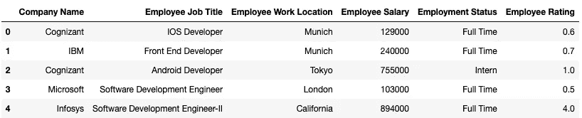

# PandaSQL 简介:没人谈论的缺点

> 原文：<https://towardsdatascience.com/the-downsides-of-pandasql-that-no-one-talks-about-9b63c664bef4>

## 熊猫+ SQL = PandaSQL =一塌糊涂

由[约书亚·赫内](https://unsplash.com/@mrthetrain?utm_source=medium&utm_medium=referral)在 [Unsplash](https://unsplash.com?utm_source=medium&utm_medium=referral) 拍摄的照片

结构化查询语言(SQL)和 Pandas 无疑是数据科学家管理、处理和分析表格数据的首选工具。

虽然 Pandas 是数据科学家使用的用于数据分析的流行 Python 库，但 SQL 是其自身的完整编程语言，用于与跨越计算机科学各个领域的数据库进行交互。它们之间有一个突出的共同点，那就是它们都是处理表格数据的不可思议的工具。

PandaSQL 是一个流行的 python 包，它融合了 Pandas 和 SQL，允许您在 python 环境中利用 SQL 语法的强大功能。因此，PandaSQL 使您能够使用 SQL 语法查询 pandas 数据帧——对于不熟悉或不习惯 Pandas 语法的人来说，这是一个巨大的胜利。

这篇文章是对 PandaSQL 的介绍。我将演示如何在示例查询中使用 PandaSQL。最后，我将比较 Pandas 和 PandaSQL 的运行时差异。简要概述如下:

[**panda SQL**](#1289)[**panda SQL**](#ab40)的注意事项

你可以在这里找到这篇文章[的笔记本。](https://deepnote.com/workspace/avi-chawla-695b-aee6f4ef-2d50-4fb6-9ef2-20ee1022995a/project/PandaSQL-a196556e-7a37-433d-bd8f-beb19b838913/%2Fnotebook.ipynb)

我们开始吧🚀！

# PandaSQL 入门

如上所述，PandaSQL 是一个 python 库，它为您提供了在 Pandas 数据帧上执行 SQL 查询的灵活性。下面详细演示了实现这一点的逐步过程。

## 步骤 1:安装 PandaSQL

首先，使用`pip`安装 PandaSQL 库。你可以在这里找到说明[或者使用下面的命令来安装它:](https://pypi.org/project/pandasql/)

## 第二步:进口要求

接下来，我们导入上面安装的库和这个项目中需要的其他预安装的库。

## 步骤 3:创建虚拟数据集

为了理解如何在使用 PandaSQL 的 pythonic 环境中使用 SQL，我们将创建一个包含一万名雇员的虚拟数据集。以下代码后面的图像显示了数据集的一瞥。

数据帧的前五行(图片由作者提供)。

## 步骤 4: **创建 PandaSQL 环境**

下一步是设置 SQL 环境，如下所示:

我们创建一个 lambda 函数，它接受一个查询`q`和程序范围内的变量，使用`globals()`返回一个 python 字典。

本质上，SQL 查询在 Python 中被写成字符串。为了让 PandaSQL 解释字符串中指定的表名及其列名，我们使用`globals()`方法检索所有全局变量，并将其传递给定义的 lambda 函数。步骤 3 中定义的`data`数据帧可以使用`globals()`引用，如下所示:

## 步骤 5:在 Pandas 数据帧上运行 SQL 查询

一旦建立了 SQL 环境，就可以继续执行 SQL 查询。PandaSQL 使用的 SQL 语法与传统的 SQL 语法完全相同。

## 查询 1:

例如，让我们编写一个查询来计算数据帧中的记录数。下面演示了这一点:

## 问题 2:

接下来，如果您想基于某个条件查询数据帧，可以使用 SQL 中的`where`子句，如下所示:

## 问题 3:

最后，如果您想获得给定数据中每个组织对应的记录数，您可以使用`groupby`子句:

与我在上面三个示例查询中演示的类似，您可以编写自己选择的任何 SQL 查询，并使用 PandaSQL 库在 Pandas DataFrame 上执行它。

# PandaSQL 的警告

对于不熟悉 Pandas 要求的 pythonic 语法的 SQL 背景的人来说，PandaSQL 无疑是一个很好的选择。例如，在聚合多个列时，过滤数据帧或在特定列上对它们进行分组可能会让人感到有些不知所措或困惑。但是这些东西在 SQL 中很容易实现和解释。

然而，这种在 Pandas 中轻松利用 SQL 的方式带来了巨大的额外运行时成本。为了更好地理解这一点，我们来比较一下 PandaSQL 和 Pandas 的运行时。我们将用 SQL 编写一个查询，然后将运行时与其在 Pandas 中的相应实现进行比较。如果你不熟悉基本 SQL 查询到 Pandas 操作的翻译，我推荐你阅读我下面的帖子:

 [## 将 SQL 查询转换为 Pandas 操作

### Pandas 中的 SQL 查询及其对应方法

towardsdatascience.com](/translating-sql-queries-to-pandas-operations-2d27c354b8a2) 

## 语法警告:

Python 已经有很多名字被保留为关键字，比如`for`、`while`、`in`、`if`、`else`、`elif`、`import`、`as`等。SQL 的引入引入了围绕变量命名的进一步限制，如更多的关键字，如`create`、`like`、`where`、`having`等。，不能再用作变量名。我在下面实现了这样一个场景:

## 执行运行时警告

虽然可以通过修改变量名来一次性处理语法警告，但运行时引入的开销却非常令人担忧。请考虑下面的问题，以便更好地理解。

## 查询 1:

首先，让我们比较一下计算数据帧中记录数量的运行时间。下面用 PandaSQL 和 Pandas 演示了这一点:

为了计算行数，PandaSQL 使用的运行时间比 pandas`shape`属性多近 t13 倍 t14 倍的 10⁵时间。

## **查询 2:**

接下来，让我们比较运行时间，找出给定数据帧中对应于每个组织的记录数。这在下面实现:

熊猫又一次以相当大的优势超过了 PandaSQL。在这种情况下，Pandas 比 PandaSQL 快 70 倍。

## 问题 3:

现在，我将演示基于使用 PandaSQL 和 Pandas 的条件过滤数据帧的运行时差异。SQL 查询及其对应的 Pandas 方法实现如下:

与基于 Pandas 的方法相比，PandaSQL 在过滤操作上花费了多 160 倍的时间。

## 问题 4:

最后，让我们考虑一下连接的运行时差异。我们将在给定的数据帧上实现自连接。下面演示了这一点:

然而，熊猫又一次成为了明显的赢家，它以 27 倍于 T21 的成绩超过了 PandaSQL。

总之，我同意 PandaSQL 是一个完美的工具，如果你对熊猫感到不舒服的话。然而，毫无疑问，这是**而不是**一个人应该期待在其数据管道中利用的长期解决方案。相反，花有意义的时间了解熊猫和它们相应的方法是一个人可以采取的最佳方式。

但是学习整个熊猫图书馆可能是具有挑战性的，不是吗？别担心。阅读我下面的博客开始吧。

 [## 数据科学家 80%的时间使用熊猫 20%的功能

### 将帕累托法则运用于熊猫图书馆

towardsdatascience.com](/20-of-pandas-functions-that-data-scientists-use-80-of-the-time-a4ff1b694707) 

感谢阅读。

作者在[imgflip.com](https://imgflip.com/)创造的模因