# 2022 年部署你的机器学习模型最简单的方法:Streamlit + BentoML + DagsHub

> 原文：<https://towardsdatascience.com/the-easiest-way-to-deploy-your-ml-dl-models-in-2022-streamlit-bentoml-dagshub-ccf29c901dac>

## 将模型部署为具有用户友好界面的轻量级 API

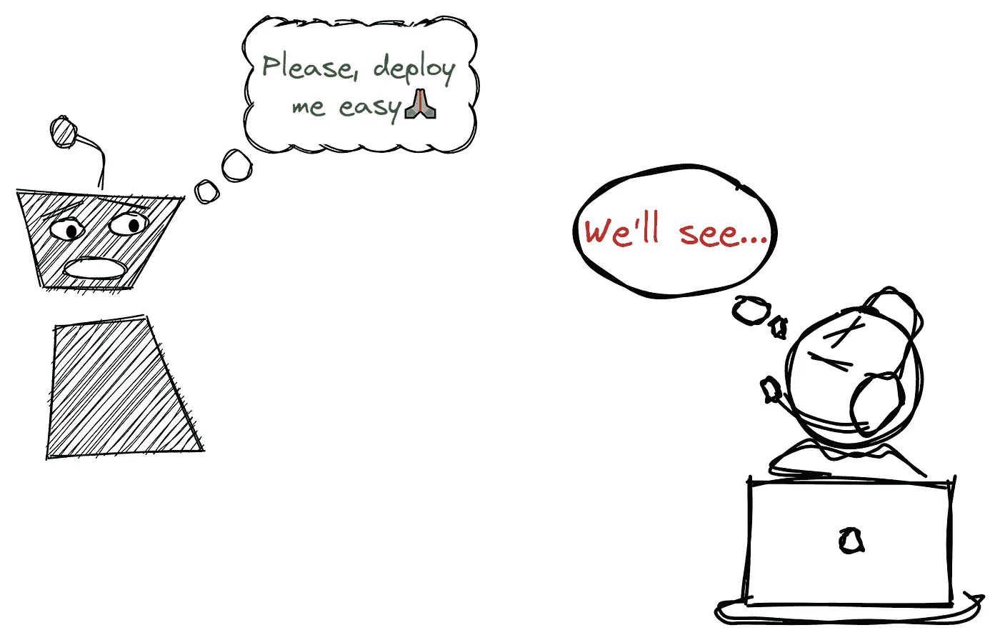

作者图片

## 介绍

你有一个现成的机器学习模型。现在怎么办？你用它做什么？你会像珍藏一样把它藏在你的 Jupyter 里不让任何人看见吗？不，你让别人分享和玩你的作品变得尽可能简单。换句话说，您*部署*模型。

但是怎么做呢？您应该将模型作为文件共享吗？不，那是最糟糕的。

码头集装箱怎么样？是的，这样更好——用户可以在本地运行您的模型。但是……他们仍然需要在编码环境中进行。不太方便。

那么，API 呢？好吧，祝你向非程序员解释 API 时好运。

嘿，如果你建立一个网络应用程序呢？是的，这似乎是最好的选择。但是怎么建呢？不需要学习 web 框架吗？

好消息是——你不需要做上面的任何事情。在本文中，我将展示一种部署方法，它使您能够将您的模型作为 API、Docker 容器和托管的 web 应用程序来提供，所有这一切只需几分钟和几个简短的 Python 脚本。

听起来很棒？继续读。

[](https://ibexorigin.medium.com/membership) [## 通过我的推荐链接加入 Medium-BEXGBoost

### 获得独家访问我的所有⚡premium⚡内容和所有媒体没有限制。支持我的工作，给我买一个…

ibexorigin.medium.com](https://ibexorigin.medium.com/membership) 

获得由强大的 AI-Alpha 信号选择和总结的最佳和最新的 ML 和 AI 论文:

[](https://alphasignal.ai/?referrer=Bex) [## 阿尔法信号|机器学习的极品。艾总结的。

### 留在循环中，不用花无数时间浏览下一个突破；我们的算法识别…

alphasignal.ai](https://alphasignal.ai/?referrer=Bex) 

## 我们在解决什么问题？

今天的部署方法适用于任何 ML/DL 框架的任何模型架构。但是，就像我们在过去两篇文章中所做的那样，我们将继续研究[宠物流行度数据集](https://www.kaggle.com/c/petfinder-pawpularity-score)。

Petfinder.my 数据集收集了猫和狗的图像数据集，并使用他们内部的评分算法给每只猫和狗打分。我们一直试图使用这个数据集来预测给定图像的宠物的可爱程度。

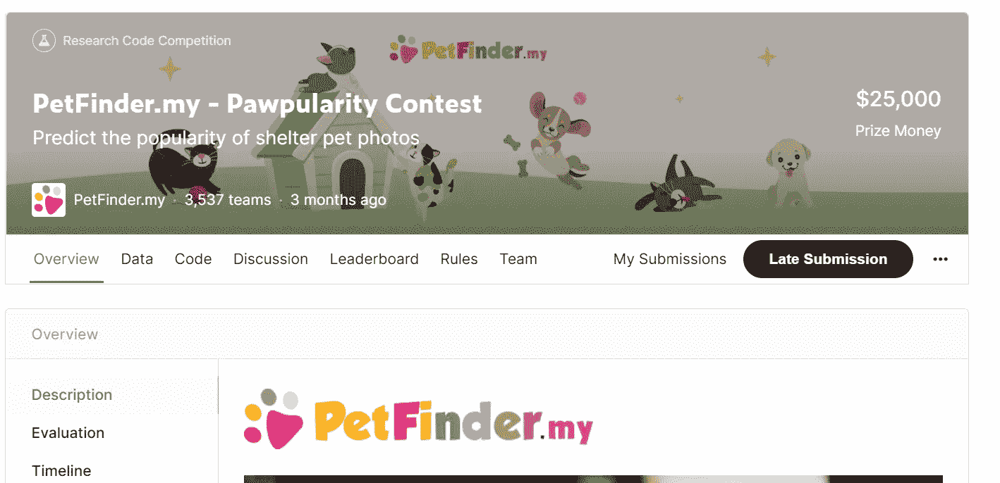

作者截图。宠物人气[比赛主页](https://www.kaggle.com/c/petfinder-pawpularity-score)。

该数据集用于在 Kaggle 上举办宠物流行度竞赛，希望顶级解决方案能够提高宠物收养率。

在第一篇文章的[中，我们对图像及其元数据进行了 EDA，并概述了我们解决问题的方法以及在此过程中使用的工具。](/open-source-ml-project-with-dagshub-improve-pet-adoption-with-machine-learning-1-e9403f8f7711)

[第二篇文章](/complete-guide-to-experiment-tracking-with-mlflow-and-dagshub-a0439479e0b9)是一个关于跟踪你的机器学习实验并找到预测可爱评分的最佳模型的综合教程。

最后一篇文章将展示如何将 Keras 图像回归模型部署为 API 和 web 应用程序，以使每个人、程序员和普通用户都可以访问它。

## 我们将使用什么工具来部署？

很难就为生产中的模型服务的最佳工具达成一致，因为每个问题都是独特的，并且它们的解决方案有不同的约束。

因此，我想选择一个解决方案或一套工具，让尽可能多的人受益。解决方案应该足够简单，只需要几分钟就可以完成一个工作原型，并在网上提供，如果需要，可以扩展到更大规模的问题。

这个解决方案的核心组件是 [BentoML 包](https://docs.bentoml.org/en/latest/)。它是 MLOps 领域最有前途的玩家之一，已经在 GitHub 上积累了 50 万次下载。

它的目的是用尽可能少的代码行将 ML 模型作为 API 端点，并且没有 Flask 等其他框架的麻烦。它适用于几乎所有的 ML 框架:

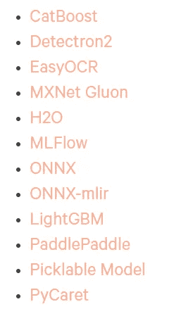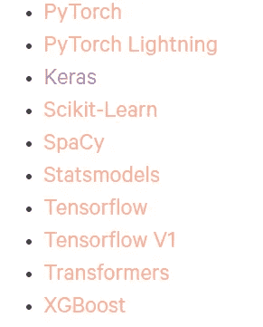

作者截图。 [BentoML 文档](https://docs.bentoml.org/en/latest/frameworks/index.html#frameworks-page) —接受的框架。

向前跳几步，您可以查看包含我们将在本文中构建的已部署 API 的链接[。](https://pet-pawpularity.herokuapp.com/)

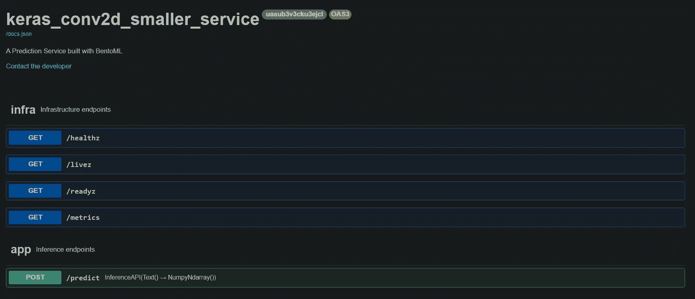

图片由作者提供。加载服务器需要一分钟时间。

部署也不应该仅仅停留在 API 上。毕竟，API 只面向程序员，你也需要一些非编程社区也能与之交互的东西。这就是 Streamlit 的用武之地。

Streamlit 对您来说可能并不陌生，因为它已经成为为几乎任何类型的 ML 应用程序创建极简 web 应用程序的首选库。

由于我们在 API 的基础上构建了 Streamlit UI，web 应用程序将更加轻量级。您将不会有依赖性问题，因为您只需要`requests`库来通过 Streamlit 应用程序处理对 BentoML API 的请求。

下面，你可以看到我们将在本文中构建的[应用:](https://share.streamlit.io/bextuychiev/pet_pawpularity/ui/src/ui.py)

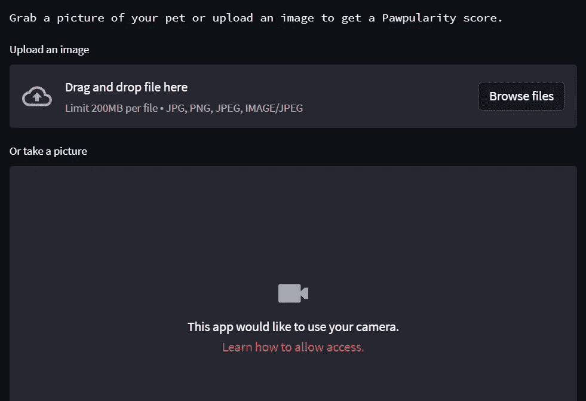

图片由作者提供。

最后但同样重要的是，我们将再次使用 [DagsHub](https://dagshub.com/) 来管理整个项目。DagsHub 是面向数据专业人士的 GitHub，允许你进行 360 度的机器学习。

您可以将 DagsHub 存储库用于许多任务:

*   托管代码:完全支持 Git(就像 GitHub 一样)。
*   [存储器](https://dagshub.com/docs/reference/dagshub_storage/):有数据专用存储器&模型存储器，由 [DVC](https://dvc.org/) 管理
*   [实验跟踪](https://dagshub.com/docs/reference/discovering_experiments/):支持 [MLflow 跟踪](https://dagshub.com/docs/reference/mlflow_tracking/)和 [Git 跟踪](https://dagshub.com/docs/reference/git-tracking/)。

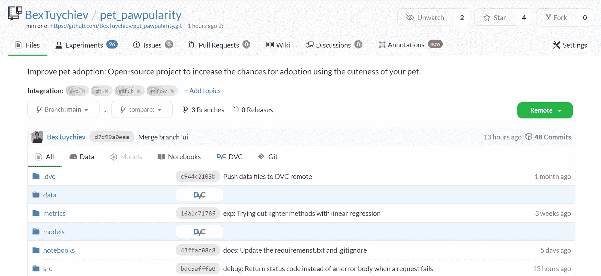

图片由作者提供。[宠-paw popularity DagsHub 回购。](https://dagshub.com/BexTuychiev/pet_pawpularity)

我们在实验的第二部分中使用 DagsHub 最多:

[](/complete-guide-to-experiment-tracking-with-mlflow-and-dagshub-a0439479e0b9) [## 使用 MLFlow 和 DagsHub 进行实验跟踪的完整指南

### 创建可重复且灵活的 ML 项目

towardsdatascience.com](/complete-guide-to-experiment-tracking-with-mlflow-and-dagshub-a0439479e0b9) 

机器学习生命周期不仅仅是部署。一款车型要想在生产中获得成功，需要基础设施的坚实基础。DagsHub 允许你建立这个基础。

现在，让我们进入文章的中心部分，从解释如何使用 BentoML 为预测服务创建 API 端点开始。

## 第一步:将最佳模型保存到 BentoML 本地商店

> 本节所有代码片段摘自项目 repo — [training.py](https://dagshub.com/BexTuychiev/pet_pawpularity/src/main/src/training.py) 。

让我们从导入必要的库开始:

确保安装带有`--pre`标签的`bentoml`，因为它仍在预览中。

下面，我们将创建几个辅助函数来创建和训练 Keras 卷积模型:

我省略了第一个函数的主体，它创建了一个 Conv2D 实例，其中有三个隐藏层和中间的 dropout、MaxPool 层。我们不必太关注模型架构。

`fit_keras_conv2d`使用第一个函数，用提前停止和 30 个历元训练得到的模型。

接下来，我们创建一个函数来将模型保存到 BentoML 本地存储:

`keras.save`函数将 Keras 模型保存为适合其他 BentoML 操作的格式。

因此，让我们运行这些函数来获得一个现成的模型:

训练和保存完成后，您可以运行下面的命令来获取 BentoML 商店中的模型列表:

```
$ bentoml models list
```

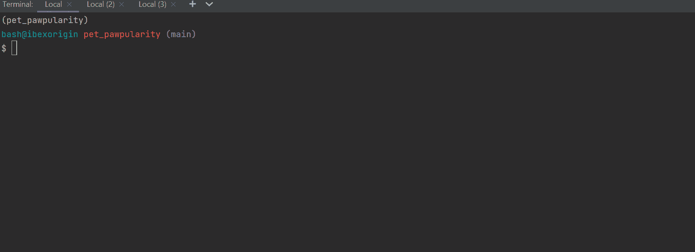

作者 GIF

保存的模型在 BentoML 文档中正式称为*标签*。默认情况下，所有模型都将保存在您的主目录和带有随机标签的`bentoml/models`文件夹中，以防有多个模型同名。

如果您进入给定的路径，您将会找到如下文件:

您总是可以使用前面带有相关框架名称的`load_runner`函数加载回模型:

加载后，模型可以使用其`run`方法进行预测，该方法调用引擎罩下 Keras `Model`对象的`predict`方法。

## 步骤 2:创建服务

> 本节所有代码片段均取自项目 repo — [service.py](https://dagshub.com/BexTuychiev/pet_pawpularity/src/main/service.py) 。

现在，我们只需要几行代码就可以将保存的模型转换成一个有效的 API。

首先，我们编写一个函数来创建 BentoML 的[服务对象](https://docs.bentoml.org/en/latest/concepts/service_definition.html),它可以处理所有的 API 逻辑，而无需我们付出任何努力。

在用`load_runner`函数加载回模型之后，我们用一个任意的名字将它传递给`Service`方法。

之后，我们创建一个 API 端点来处理我们的 POST 请求。通过定义一个用我们刚刚创建的服务对象的`api`方法修饰的函数，可以在 BentoML 中创建端点:

在讨论车身之前，先说一下`service.api`装饰工。它有两个必需的参数- `input`和`output`。

您应该根据将从端点发送和返回的数据类型来定义这些参数。

当我们发送一个带有图像的请求时，上面的`predict`端点返回一个可爱分数。因此，我将输入定义为`Text()`,因为我们将把 NumPy 图像数组作为字符串发送。输出应该是`NumpyNdarray()`，因为当我们调用`model.run(image)`时，返回的数据类型将是一个 Numpy 数组。

为端点获取正确的数据类型非常重要。您可以阅读 BentoML 文档的本页，了解您可以处理的其他类型的数据。

至于主体，你应该在调用`model.run`之前把所有的预处理逻辑写到图像中。在训练之前，我将图像的大小调整为(224，224，3)，并通过将它们的像素值除以 255 来归一化它们。所以，我也在端点函数中执行了这些步骤。

> 重要提示:如果您使用其他框架，比如 Sklearn，来处理表格数据，那么也要确保在 API 端点内部运行所有的预处理步骤。我们可以通过酸洗您的所有处理函数并在`predict`函数中调用它们来实现这一点，因此不会有任何数据泄漏或者您不会传递格式不正确的数据。

现在，要为我们的 API 启动一个调试服务器，您只需要将所有代码放入根目录下的一个 Python 文件中，通常命名为`service.py`，并调用下面的命令:

```
$ bentoml serve service.py:service --reload
```

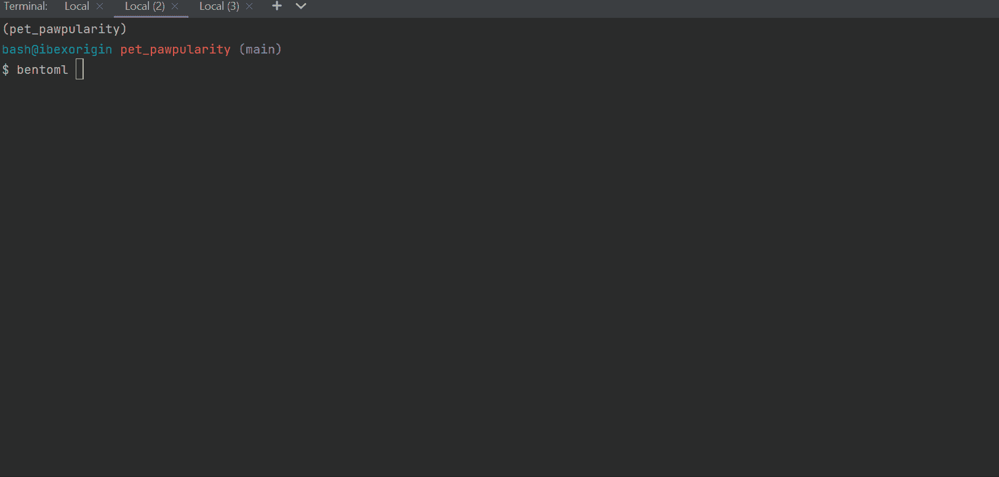

作者 GIF

`--reload`标记确保本地服务器检测到对`service.py`的更改，并自动更新逻辑。

从 GIF 上可以看到服务器在 [http://127.0.0.1:3000/](http://127.0.0.1:3000/) 上直播，有一个简单的 UI:

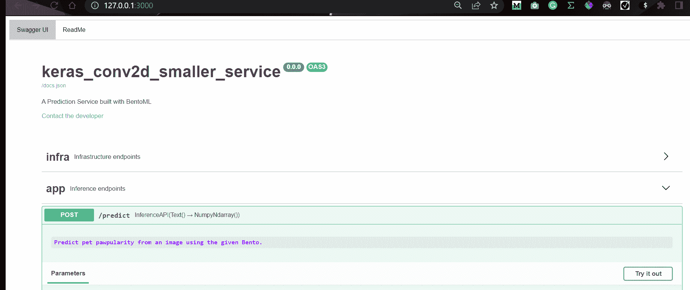

作者 GIF

我们已经可以向本地服务器发送请求，并获得对图像的预测:

确保为您的数据类型设置正确的标题，并通过`str`功能发送打包的图像。同样，您可以从文档的[这一页](https://docs.bentoml.org/en/latest/concepts/api_io_descriptors.html#)中找到带有每种数据类型的正确内容头的请求示例。

我们来看看回复文字:

```
>>> print(response.text)
[35.49753189086914]
```

我们发送的图像是这样的:

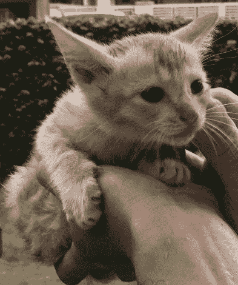

**图片来自**[**Pet paw popularity 数据集**](https://www.kaggle.com/competitions/petfinder-pawpularity-score/data) **。**

[](https://ibexorigin.medium.com/membership) [## 通过我的推荐链接加入 Medium。

### 作为一个媒体会员，你的会员费的一部分会给你阅读的作家，你可以完全接触到每一个故事…

ibexorigin.medium.com](https://ibexorigin.medium.com/membership) 

## 第三步:做便当

现在，我们准备制作我们的第一份便当。

术语“便当”是指包含运行我们的在线服务或 API 的一切的档案，包括所有的代码、模型、依赖信息和设置配置。

构建它首先要在目录中创建一个与`service.py`文件相同级别的`bentofile.yaml`文件(最好两者都在项目根目录中):

YAML 文件的第一行应该包含服务文件名，后跟“:service”后缀。接下来，你添加所有需要的文件`service.py`文件工作没有错误(数据，助手脚本等)。).在这里，我只包括服务文件本身，因为我们没有在其中使用任何额外的脚本。

然后，在 Python 和包下，指定依赖项及其版本。如果你不确定版本，有一个我经常使用的有用的小软件包叫做`pipreqs`:

```
$ pip install pipreqs

$ pipreqs .
```

调用`pipreqs [path]`会创建一个`requirements.txt`文件，其中包含您导入的所有使用过的包以及它们在给定路径下的版本，如下所示:

列出依赖项后，只需要调用`bentoml build`:

```
$ bentoml build
```

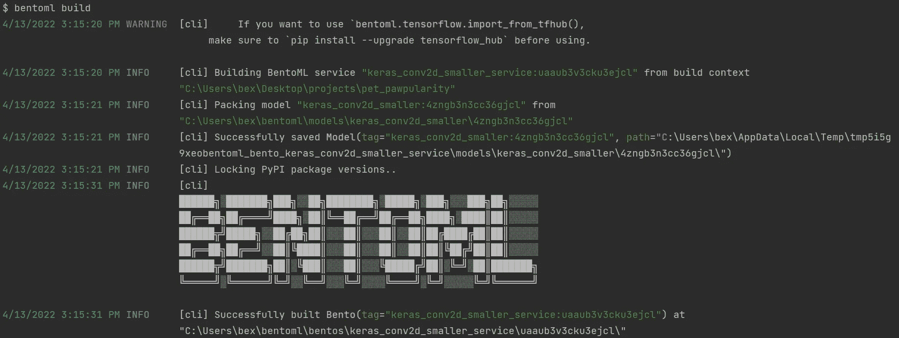

作者图片

要查看您所有便当的列表，请拨打`bentoml list`

```
$ bentoml list
```

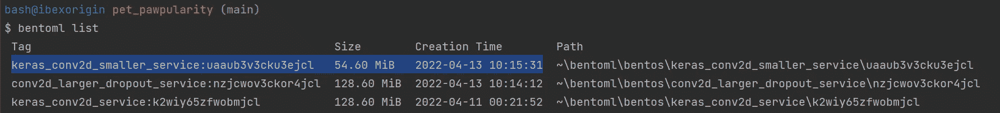

作者图片

## 步骤 4:部署到 Heroku

`build`命令在本地商店保存一份新鲜的便当，其树形结构如下:

您可以从[本页](https://docs.bentoml.org/en/latest/concepts/building_bentos.html#building-bentos)中了解这些子文件夹的功能。我们感兴趣的文件夹是`env/docker`那个。它包含了构建一个全功能 Docker 容器所需的一切，我们将使用它来在线部署我们的 API。

这有很多选择，像亚马逊 EC 或谷歌云平台，但 Heroku 是最省事的平台。

Heroku 是一个流行的云应用程序平台，支持任何语言的开发人员构建和维护云应用程序。如果您还没有，请[创建一个帐户](https://signup.heroku.com/)并[下载 CLI](https://devcenter.heroku.com/articles/heroku-cli#install-the-heroku-cli) ，您可以使用它来创建和管理您的 Heroku 应用程序。

安装后，调用`login`来验证您的终端会话:

```
$ heroku login
```

这将在浏览器中打开一个选项卡，您可以在其中使用您的凭据登录。接下来，登录到容器注册表:

```
$ heroku container:login
```

现在，让我们创建一个名为`pat-pawpularity`的应用程序:

```
$ heroku create pet-pawpularity
```

之后，该应用程序应该可以在[https://dashboard.heroku.com/apps:](https://dashboard.heroku.com/apps:)看到

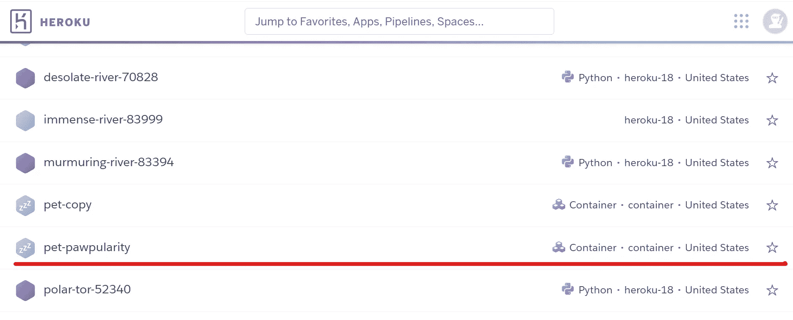

作者图片

现在，我们需要将我们的便当推送到这个应用程序，并在线部署它。为此，我们需要`cd`进入便当目录(可以通过`bentoml list`找到)和`docker`文件夹:

```
$ cd ~/bentoml/bentos/keras_conv2d_smaller_service/uaaub3v3cku3ejcl
$ cd env/docker
```

从那里，您调用这个命令:

```
$ heroku container:push web --app pet-pawpularity --context-path=../..
```

根据归档文件的大小，该命令将需要几分钟才能完成。

最后，您可以使用下面的命令发布应用程序:

```
$ heroku container:release web --app pet-pawpularity
```

现在，你可以去[https://pet-pawpularity.herokuapp.com/](https://pet-pawpularity.herokuapp.com/)在线查看 API，或者去你仪表盘上的应用页面打开它:

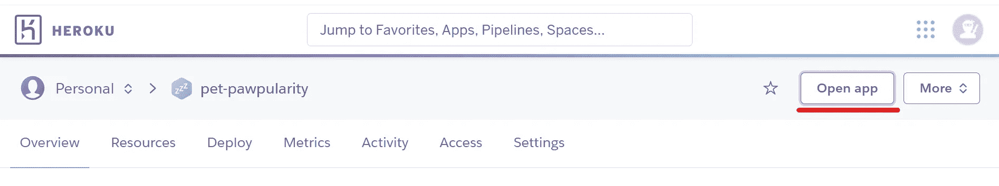

作者图片

现在，任何人都可以向这个 API 发送请求。让我们试试:

## 步骤 5:用 Streamlit 构建一个简单的 UI

> 本节所有代码片段均取自项目 repo — [ui.py](https://dagshub.com/BexTuychiev/pet_pawpularity/src/main/src/ui.py) 。

现在，让我们围绕我们的 API 构建一个轻量级用户界面。首先，我们将为我们的应用程序编写一个简单的标题部分，其中包含一个任意的封面图片:

接下来，我们定义核心功能。我们将创建一个函数，通过向我们的 API 发送请求来生成可爱度分数:

上传到 Streamlit 应用程序的图像将具有“BytesIO”格式，因此我们需要首先将它们转换为 NumPy 数组。第 6–7 行完成了这一点，剩下的就不言自明了。

现在，我们创建两个图像输入组件—一个用于文件上传，另一个用于网络摄像头输入:

使用时，这两个组件将显示一个简单的待机动画，然后返回一个可爱评分。这是我们正在运行的应用程序:

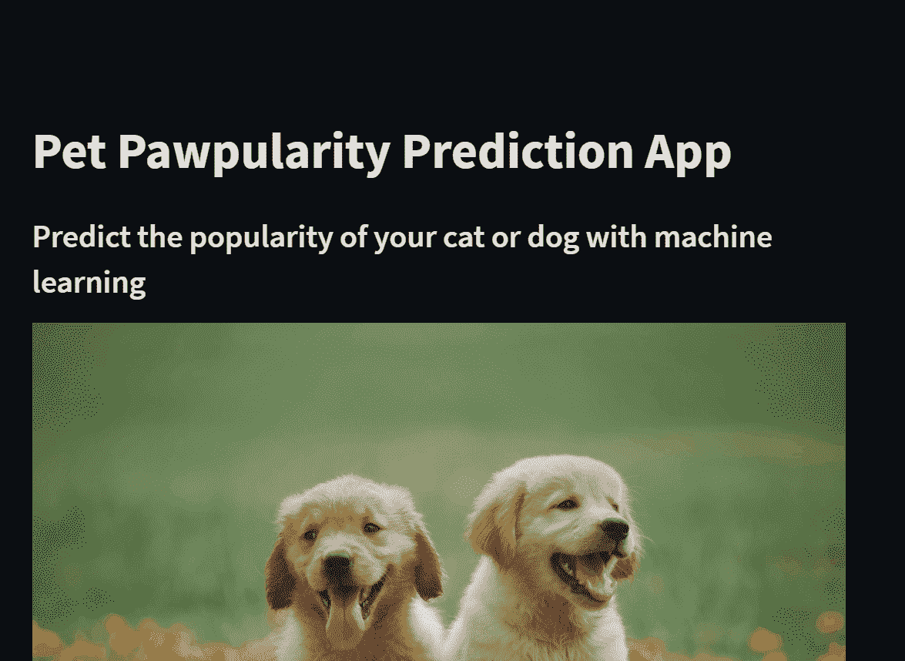

作者 GIF

现在，在你将这些改变推送到 GitHub 之后，你可以通过去[https://share.streamlit.io/deploy:](https://share.streamlit.io/deploy:)在线部署你的应用

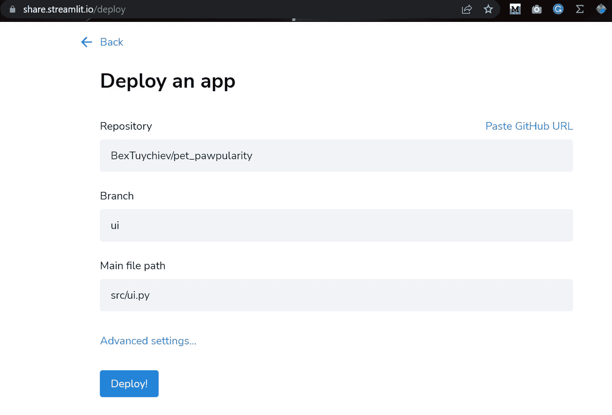

图片由作者提供。

以下是已部署应用的链接:[https://share . streamlit . io/bextuychiev/pet _ paw pularity/ui/src/ui . py](https://share.streamlit.io/bextuychiev/pet_pawpularity/ui/src/ui.py)

## 结论

恭喜你！您刚刚构建了一个完整的图像应用程序，它为日常用户提供了一个非常棒的 UI，并为您的程序员朋友或队友提供了自己的 API。现在，您有了一种可靠的方式来与其他人共享您的模型，而不必担心环境设置和代码。

感谢您的阅读！

[](https://ibexorigin.medium.com/membership) [## 通过我的推荐链接加入 Medium。

### 作为一个媒体会员，你的会员费的一部分会给你阅读的作家，你可以完全接触到每一个故事…

ibexorigin.medium.com](https://ibexorigin.medium.com/membership) [](https://ibexorigin.medium.com/subscribe) [## 每当 Bex T .发布时收到电子邮件。

### 每当 Bex T .发布时收到电子邮件。注册后，如果您还没有中型帐户，您将创建一个…

ibexorigin.medium.com](https://ibexorigin.medium.com/subscribe) 

## 也可以随意查看这些内容:

[](/open-source-ml-project-with-dagshub-improve-pet-adoption-with-machine-learning-1-e9403f8f7711) [## DagsHub 的开源 ML 项目:通过机器学习提高宠物认养率，第一

### 构建一个预测猫狗可爱程度的应用程序

towardsdatascience.com](/open-source-ml-project-with-dagshub-improve-pet-adoption-with-machine-learning-1-e9403f8f7711) [](/complete-guide-to-experiment-tracking-with-mlflow-and-dagshub-a0439479e0b9) [## 使用 MLFlow 和 DagsHub 进行实验跟踪的完整指南

### 创建可重复且灵活的 ML 项目

towardsdatascience.com](/complete-guide-to-experiment-tracking-with-mlflow-and-dagshub-a0439479e0b9) [](/3-best-often-better-alternatives-to-histograms-61ddaec05305) [## 直方图的 3 个最佳(通常更好)替代方案

### 避免直方图最危险的陷阱

towardsdatascience.com](/3-best-often-better-alternatives-to-histograms-61ddaec05305) [](/comprehensive-guide-to-writing-python-functions-others-can-use-2fa186c6be71) [## 编写其他人可以使用的 Python 函数的综合指南

### 函数编写是一项技能——迈出掌握它的第一步

towardsdatascience.com](/comprehensive-guide-to-writing-python-functions-others-can-use-2fa186c6be71)