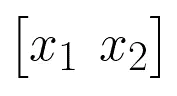
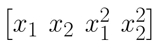
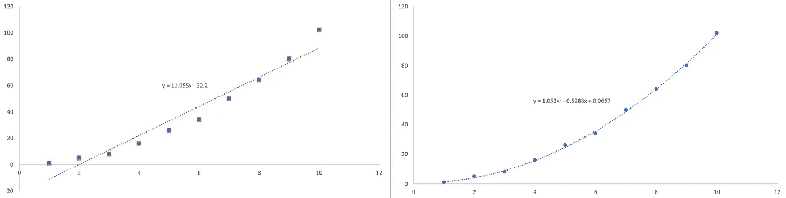
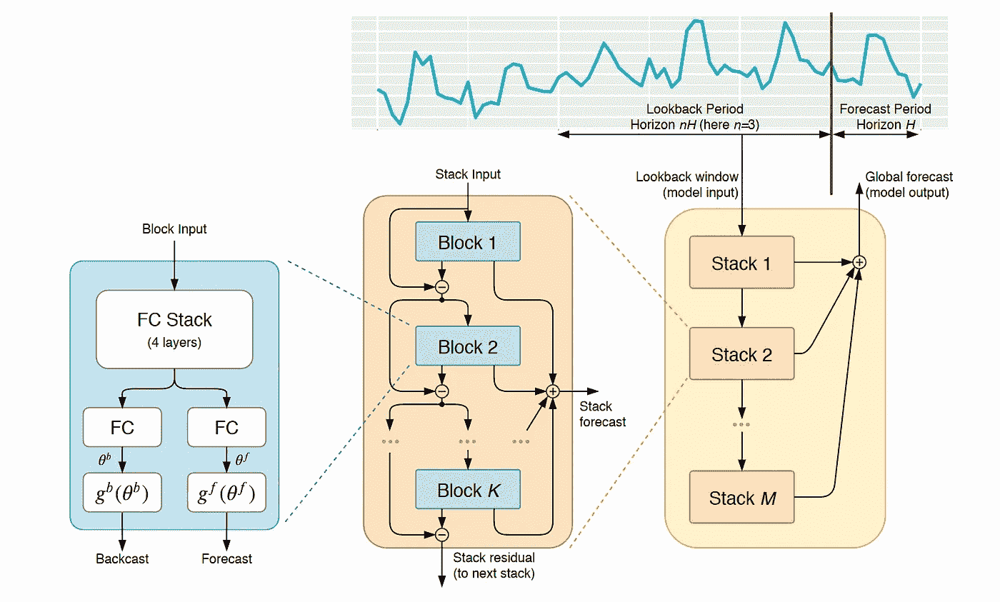
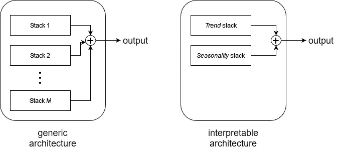
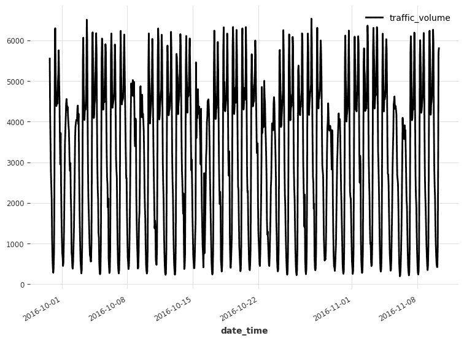
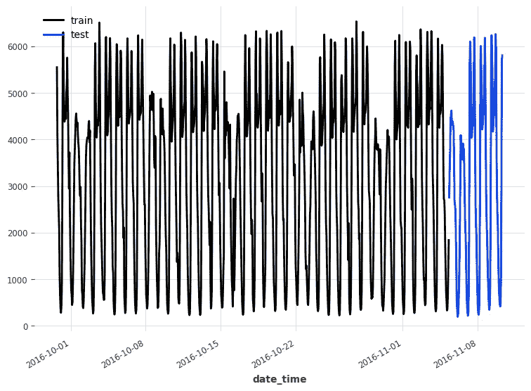
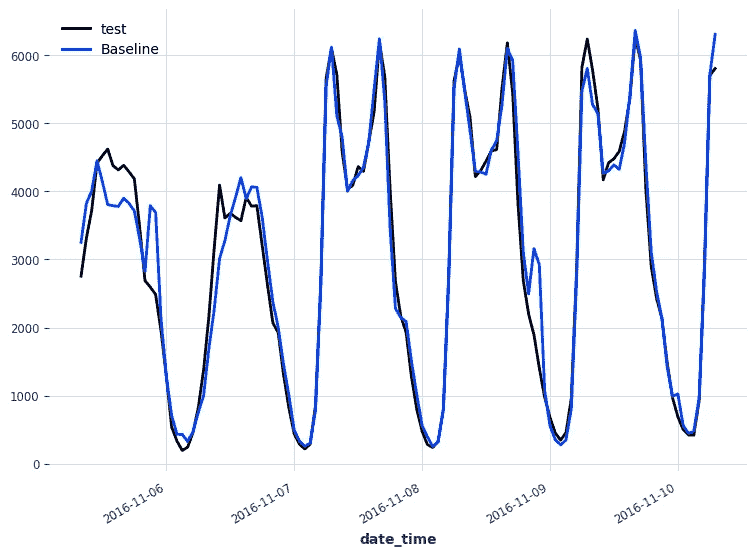
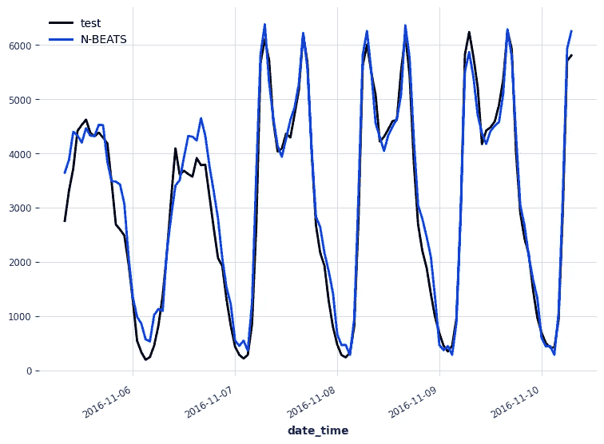
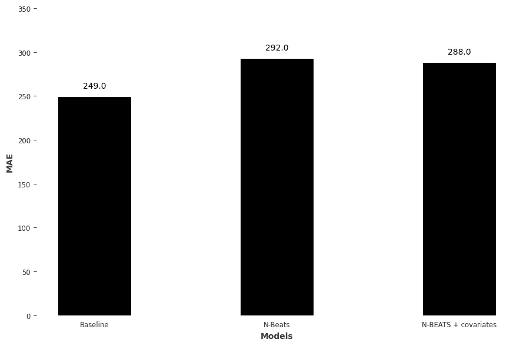

# 使用 N 拍预测时间序列的最简单方法

> 原文：<https://towardsdatascience.com/the-easiest-way-to-forecast-time-series-using-n-beats-d778fcc2ba60>

## 从理论到实践，了解 N-BEATS 的工作原理，并使用 Python 将其应用到实际预测项目中


在 [Unsplash](https://unsplash.com?utm_source=medium&utm_medium=referral) 由 [Pablo de la Fuente](https://unsplash.com/@pablodelafuente?utm_source=medium&utm_medium=referral) 拍摄的照片

如果你和我一样，对时间序列预测感兴趣，很可能你偶然发现了 N-BEATS 模型。该模型承诺使用纯深度学习架构获得最先进的结果。换句话说，它不需要时间序列的特定成分，如趋势或季节性。

你可能读过 Oreshkin 等人写的关于 N-BEATS 的 [2020 论文](https://arxiv.org/pdf/1905.10437.pdf)。虽然这篇论文信息量很大，但它并不容易阅读，你在这里可能意味着你同意我的观点。

所以，在这篇文章中，我将首先使用更多的直觉和更少的等式来解释 N-BEATS。然后，我将使用 Python 将它应用于现实生活中的预测场景，并评估它的性能。

我们开始吧！

> ***用 Python 中我的*** [***免费时间序列小抄***](https://www.datasciencewithmarco.com/pl/2147608294) ***学习最新的时间序列分析技巧！获得统计和深度学习技术的实现，全部在 Python 和 TensorFlow 中！***

# 理解 N 节拍

N-BEATS 代表**N**eural**B**as**E**x expansion**A**analys 代表**I**N**T**ime**S**系列。

顾名思义，N-BEATS 的核心功能在于**基础扩展**。因此，在深入模型的架构之前，让我们首先澄清什么是基础扩展。

## 基础扩展

基础扩展是一种扩充数据的方法。这通常是为了模拟非线性关系。

常见的基展开是多项式基展开。例如，假设我们只有两个特性，如下所示。



一组两个特征。图片由作者提供。

然后，如果我们进行 2 次多项式基展开，我们的特征集变成:



特征集上 2 次多项式基展开的结果。我们注意到，我们只是简单地将现有特征的平方相加。这允许我们拟合二次模型，以便我们可以捕捉非线性关系。图片由作者提供。

如您所见，2 次多项式基展开的结果是我们简单地将我们的特征的平方添加到特征集中。

因此，这意味着我们现在可以用二次多项式模型来拟合我们的数据，有效地模拟非线性关系！

当您对数据进行线性趋势或多项式曲线拟合时，这基本上就是在 Excel 中发生的事情。



基础扩展前(左)和基础扩展后(右)。在左边，我们停留在线性模型上，但是添加特征的平方允许我们有一个更适合的非线性模型。图片由作者提供。

看上面的图，我们可以看到，当我们不进行基展开时，我们只有一条直线，如左图所示。然而，在右边，一旦我们执行了 2 次多项式基展开，我们就得到一个二次模型，它与我们的数据更加吻合。

当然，基展开并不限于多项式；我们可以计算对数、幂等。主要的收获是，基础扩展用于增加我们的特征集，以便对非线性关系建模。

在 N 拍的情况下，基展开不是我们定的。取而代之的是，该模型被训练来寻找最佳的基展开方法，以便拟合数据并进行预测。换句话说，我们让神经网络找到最佳的数据扩充方法来拟合我们的数据集，因此得名:神经基础扩展。

现在我们已经熟悉了基础扩展的概念，让我们继续讨论模型的架构。

## **N 拍的架构**

在设计 N-BEATS 的架构时，有三个关键原则:

1.  基础架构应该简单、通用，但富有表现力
2.  该架构不应依赖于特定于时间序列的组件(如趋势或季节性)
3.  该架构是可扩展的，以使输出可解释

基于这些考虑，N-BEATS 的创造者设计了这样一个模型:



N 拍的架构。图片由 B. Oreshkin、D. Carpov、N.Chapados 和 Y. Bengio 拍摄，来自 [N-BEATS:可解释时间序列预测的神经基础扩展分析](https://arxiv.org/pdf/1905.10437.pdf)

从上图可以吸收很多信息，一步一步来。

从图的右上方看，我们可以看到一个时间序列分为回顾期和预测期。回望期提供给模型，而预测期包含允许我们评估模型预测的实际值。

请注意，输入序列的长度是预测长度的倍数。因此，对于长度为 *H* 的预测范围，输入序列通常应该具有从 2 *H* 到 6 *H* 的长度。

然后在上图中从右到左，我们看到 N-BEATS(右边黄色矩形)是由分层的*栈*组成的，这些栈本身又是由*块*(中间橙色矩形)组成的，我们可以看到每个*块*是如何构造的(左边蓝色矩形)。

我们可以看到一个*块*由四个完全连接的层组成。这个网络产生两样东西:一个预测和一个反向预测。预测只是对未来值的预测，而反向预测是来自模型的值，我们可以立即将其与输入序列进行比较，并评估模型的拟合度。

注意，网络在*块*级找到扩展系数(在图中表示为*θ*)，然后执行基扩展(在图中表示为函数 *g* )。

在这种架构中，只有第一个*模块*获得实际的输入序列。随后的*块*获得来自第一*块*的残差。这意味着只有未被第一个*模块*捕获的信息被传递到下一个模块。

这导致输入序列的顺序处理，其中每个*模块*试图捕捉前一个模块遗漏的信息。

将不同的*块*组合在一起，然后给我们一个*堆栈*，它输出一个部分预测。然后，我们将更多的*堆栈*添加到模型中，并且每个*堆栈*将输出其部分预测。然后，每个部分预测的组合产生最终预测。

## 使模型可解释

在这一点上，我们理解了 N-BEATS 的内部工作原理，但是这个模型究竟如何解释呢？

现在，它不是。负责基扩展的函数，在图中表示为 *g* ，是一个可学习的函数。这意味着我们让神经网络设计一个特定于问题的函数来获得最佳结果。

然而，将函数 *g* 限制在我们能理解的范围内是可能的。在时间序列预测中，我们经常使用趋势和季节性等元素来通知我们的预测，我们可以强制函数 *g* 来表示趋势分量或季节性分量。

为了表示趋势，我们使用多项式基。为了表示季节性，我们使用傅立叶基础。

因此，在该架构的可解释版本中，我们强制模型只有两个堆栈:一个堆栈专门用于预测趋势组件，另一个专门用于预测季节组件。然后，每个预测被组合以形成最终输出。

通用架构和可解释架构之间的区别如下所示。



N-BEATS 的通用架构和可解释架构之间的差异。在左边，通用架构有我们想要的那么多栈，但是我们失去了可解释性。在右边，我们强制模型只有两个堆栈，代价是可能会降低性能。图片由作者提供。

## 包扎

总结一下，N-BEATS 有两种配置。通用配置允许模型找到针对我们的问题的最佳基本展开。可解释的配置迫使一个堆栈专门预测趋势，另一个堆栈专门预测季节性。

网络中的剩余连接允许模型捕捉被先前块遗漏的信息。最后，将每个堆栈的部分预测的组合进行组合，以获得最终预测。

我希望我设法让 N 拍相当容易理解。现在，让我们继续在使用 Python 的预测项目中实际应用 N-BEATS。

# 使用 N 节拍进行预测

我们现在准备在预测项目中应用 N-BEATS 模型。在这里，我们将预测每小时 94 号州际公路西行交通量。注意，我们只使用了 UCI 机器学习知识库上的[完整数据集](https://archive.ics.uci.edu/ml/datasets/Metro+Interstate+Traffic+Volume)的一个样本，该样本由明尼苏达州交通部好心提供。

我们将在这个项目中使用 Darts 库，因为它使得在时间序列应用中应用最先进的模型(如 N-BEATS)变得非常容易。

所有代码都是 Python 语言，你可以在 [GitHub](https://github.com/marcopeix/time-series-analysis/blob/master/NBEATS.ipynb) 上获得完整的源代码和数据集。

我们走吧！

## 读取数据

当然，每个项目都从导入必要的库开始。

```
import pandas as pd
import numpy as np
import datetime
import matplotlib.pyplot as plt

from darts import TimeSeries

import warnings
warnings.filterwarnings('ignore')
```

然后，我们实际上读取我们的数据，并将其存储在数据帧中。

```
df = pd.read_csv('data/daily_traffic.csv')
```

由于我们使用的是 dart，我们将从 DataFrame 转到 TimeSeries 对象，这是 dart 中的基本对象。Darts 中的每个模型都必须有一个 TimeSeries 对象作为输入，它还输出一个 TimeSeries 对象。

```
series = TimeSeries.from_dataframe(df, time_col='date_time')
```

现在，我们可以使用`plot`方法轻松地可视化我们的数据。

```
series.plot()
```



每小时 94 号州际公路西行交通量。我们已经可以看到每日的季节性和每周的季节性。图片由作者提供。

看上面的图，我们已经发现我们有两个季节周期:每周和每天。很明显，白天路上的车比晚上多，工作日的车比周末多。

这实际上可以用飞镖来验证。它带有一个`check_seasonality`函数，可以告诉我们一个季节周期是否具有统计意义。

在这种情况下，因为我们有每小时的数据，所以每日季节性的周期为 24(一天中的 24 小时)，每周季节性的周期为 168(一周中的 24*7 小时)。

所以，让我们确保这两个季节都很重要。

```
from darts.utils.statistics import check_seasonality

is_daily_seasonal, daily_period = check_seasonality(series, m=24, max_lag=400, alpha=0.05)
is_weekly_seasonal, weekly_period = check_seasonality(series, m=168, max_lag=400, alpha=0.05)

print(f'Daily seasonality: {is_daily_seasonal} - period = {daily_period}')
print(f'Weekly seasonality: {is_weekly_seasonal} - period = {weekly_period}')
```

上面的代码块将打印出两个季节周期都是重要的，稍后我们将如何对该信息进行编码以将其输入到我们的模型中。

## 拆分数据

预测项目中的一个自然步骤，将我们的数据分成训练集和测试集。在这种情况下，我们为测试集保留最近五天的数据，并将其余数据用于训练。

```
train, test = series[:-120], series[-120:]

train.plot(label='train')
test.plot(label='test')
```



训练/测试分割了我们的数据。最后五天用于测试集。图片由作者提供。

## 基线模型

在使用 N-BEATS 之前，最好先有一个基线模型。这是一个简单的模型，作为确定更复杂的模型是否更好的基准。

基线模型通常依赖于简单的统计或简单的启发式。在这种情况下，一种简单的预测方法是简单地重复上一个季节。在这里，由于我们有两个季节性周期，我们将使用每周季节性，以考虑周末的交通量较低。

```
from darts.models.forecasting.baselines import NaiveSeasonal

naive_seasonal = NaiveSeasonal(K=168)
naive_seasonal.fit(train)

pred_naive = naive_seasonal.predict(120)
```

在上面的代码块中，我们简单地获取了训练集中最后一周的数据，并在将来重复它。当然，由于我们的预测范围只有五天而不是七天，我们在第五天截断了预测。

下面，我们可以看到来自基线模型的预测。

```
test.plot(label='test')
pred_naive.plot(label='Baseline')
```



来自基线模型的预测。图片由作者提供。

然后，我们使用平均绝对误差(MAE)来评估基线的性能。

```
from darts.metrics import mae

naive_mae = mae(test, pred_naive)

print(naive_mae)
```

这给了我们一个 249 的 MAE，这就是我们试图用 N 拍来打破的分数。

## 无协变量的 n 拍

我们最终达到了应用 N 拍来解决问题的地步。

我们知道我们有两个季节周期，但是让我们在不给出信息的情况下尝试 N-BEATS。在我们帮助它之前，我们将让模型自己工作。

我们从导入 N-BEATS 和数据缩放器开始，以加速模型的训练。

```
from darts.models import NBEATSModel
from darts.dataprocessing.transformers import Scaler
```

然后，我们在 1 和 0 之间调整数据。请注意，我们只在训练集上安装了缩放器，因为模型不应该有来自测试集的信息。

```
train_scaler = Scaler()
scaled_train = train_scaler.fit_transform(train)
```

然后，我们初始化 N 拍模型。输入长度将包含一整周的数据，模型将输出 24 小时的数据。在这种情况下，我们使用通用架构。

```
nbeats = NBEATSModel(
    input_chunk_length=168, 
    output_chunk_length=24,
    generic_architecture=True,
    random_state=42)
```

现在，我们简单地在缩放的训练集上拟合模型。

```
nbeats.fit(
    scaled_train,
    epochs=50)
```

一旦模型完成训练，我们就可以在测试集的范围内进行预测。当然，预测也是成比例的，所以我们需要反向转换。

```
scaled_pred_nbeats = nbeats.predict(n=120)

pred_nbeats = train_scaler.inverse_transform(scaled_pred_nbeats)
```

最后，我们评估了 N-BEATS 的性能。

```
mae_nbeats = mae(test, pred_nbeats)

print(mae_nbeats)
```

这给出了 MAE 为 292，高于基线。这意味着 N-BEATS 的表现并不比我们天真的预测要好。

因此，让我们将协变量添加到模型中，看看我们是否可以改善它的性能。

## 有协变量的 n 拍

在本文的前面，我们确定了在我们的时间序列中有两个重要的季节周期。我们可以对这些信息进行编码，并将其作为协变量传递给模型。

换句话说，我们向模型添加了两个特性，告诉它我们在一天和一周中的位置。通过这种方式，模型了解到周末的交通流量较低，并且夜间的交通流量低于白天。

飞镖很方便地带有一个，使用`datetime_attribute_timeseries`很容易实现这一点。

```
from darts import concatenate
from darts.utils.timeseries_generation import datetime_attribute_timeseries as dt_attr

cov = concatenate(
    [dt_attr(series.time_index, 'day', dtype=np.float32), dt_attr(series.time_index, 'week', dtype=np.float32)],
    axis='component'
)
```

然后，我们也对协变量进行缩放，将其输入到模型中。

```
cov_scaler = Scaler()
scaled_cov = cov_scaler.fit_transform(cov)
```

请注意，我们不需要将协变量分割成训练集和测试集，因为 Darts 会在训练过程中自动进行适当的分割。

现在，我们重复初始化 N 拍和拟合的过程。这一次，我们也传递协变量。

```
nbeats_cov = NBEATSModel(
    input_chunk_length=168, 
    output_chunk_length=24,
    generic_architecture=True,
    random_state=42)

nbeats_cov.fit(
    scaled_train,
    past_covariates=scaled_cov,
    epochs=50
)
```

一旦模型被训练，我们就产生预测。记住再次反转变换，因为预测在 0 和 1 之间缩放。

```
scaled_pred_nbeats_cov = nbeats_cov.predict(past_covariates=scaled_cov, n=120)

pred_nbeats_cov = train_scaler.inverse_transform(scaled_pred_nbeats_cov)
```

我们也可以用下面的代码块来可视化我们的预测。

```
test.plot(label='test')
pred_nbeats.plot(label='N-BEATS')
```



来自 N 拍的预测。图片由作者提供。

同样，我们使用 MAE 评估模型的性能。

```
mae_nbeats_cov = mae(test, pred_nbeats_cov)

print(mae_nbeats_cov)
```

这给了我们一个 288 的 MAE。这比不使用协变量要好，但仍然比基线模型差。



每个模型预测的平均绝对误差。我们看到，添加协变量有助于模型，但其性能仍然比基线差。图片由作者提供。

**对结果的说明**

获得的结果并不令人兴奋，但要有所保留。请记住，我们正在处理一个相当小而简单的数据集。这可能是因为我从[完整数据集](https://archive.ics.uci.edu/ml/datasets/Metro+Interstate+Traffic+Volume)中提取的样本本质上只是重复性的，这解释了为什么基线如此之好。

尽管如此，您现在已经知道如何在预测项目中实施 N-BEATS，并且您还可以体会到拥有基线模型的重要性。

# 结论

N-BEATS 是一个最先进的深度学习模型，用于时间序列预测，它依赖于基础扩展的原则。该模型可以学习特定问题的基础扩展功能，或者我们可以限制它们具有可解释的输出。

我希望你喜欢这本书，并且你学到了新的东西！

干杯🍺