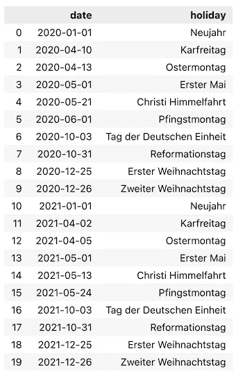
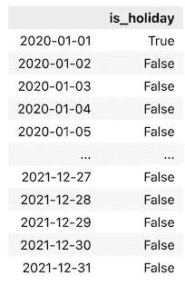

# 用 Python 识别假日的最简单方法

> 原文：<https://towardsdatascience.com/the-easiest-way-to-identify-holidays-in-python-58333176af4f>


照片由[esteée 扬森斯](https://unsplash.com/@esteejanssens?utm_source=unsplash&utm_medium=referral&utm_content=creditCopyText)在 [Unsplash](https://unsplash.com/s/photos/calendar?utm_source=unsplash&utm_medium=referral&utm_content=creditCopyText) 上拍摄

# 用 Python 识别假日的最简单方法

## 如何快速将假期要素添加到数据集中

当处理时间数据时，无论是时间序列分析还是正常的回归/分类任务，知道某一天是否是某种假日都会让我们受益匪浅。

例如，如果我们是一个流媒体平台，我们可能会注意到用户活动在休息日出现高峰。作为一名零售商，我们可能会注意到假期前(尤其是与礼物相关的，如圣诞节)的购物量比假期中多。这些只是首先想到的一些想法。

这就是为什么在处理时间数据时识别节假日非常有用的原因。在本文中，我们将探索如何使用两个流行的 Python 库— `holidays`和`workalendar`快速完成这项工作。两者在 GitHub 上都相当受欢迎(~650 颗星)，并且仍然由它们的创作者维护。让我们开始吧！

# 快速设置

像往常一样，我们需要加载一些库。在这个例子中，我们将看看德国的节日。这就是为什么我们从`workalendar`库做了一个特殊的导入。

# 1.假日

`holidays`图书馆允许我们识别大约 90 个国家的主要节日的日期。此外，在某些情况下(如美国、巴西、法国、加拿大等)，甚至可以更深入地了解特定地区的假日。

我们已经提到，在这个例子中，我们将看看德国的假期。从`holidays`图书馆检索假日信息非常简单，您马上就会看到。使用下面的片段，我们打印 2020-2021 年的所有德国假日。

这将返回以下列表:

```
(datetime.date(2020, 1, 1), 'Neujahr') 
(datetime.date(2020, 4, 10), 'Karfreitag') 
(datetime.date(2020, 4, 13), 'Ostermontag') 
(datetime.date(2020, 5, 1), 'Erster Mai') 
(datetime.date(2020, 5, 21), 'Christi Himmelfahrt') (datetime.date(2020, 6, 1), 'Pfingstmontag') 
(datetime.date(2020, 10, 3), 'Tag der Deutschen Einheit') (datetime.date(2020, 10, 31), 'Reformationstag') (datetime.date(2020, 12, 25), 'Erster Weihnachtstag') (datetime.date(2020, 12, 26), 'Zweiter Weihnachtstag') (datetime.date(2021, 1, 1), 'Neujahr') 
(datetime.date(2021, 4, 2), 'Karfreitag') 
(datetime.date(2021, 4, 5), 'Ostermontag') 
(datetime.date(2021, 5, 1), 'Erster Mai') 
(datetime.date(2021, 5, 13), 'Christi Himmelfahrt') (datetime.date(2021, 5, 24), 'Pfingstmontag') 
(datetime.date(2021, 10, 3), 'Tag der Deutschen Einheit') (datetime.date(2021, 10, 31), 'Reformationstag') (datetime.date(2021, 12, 25), 'Erster Weihnachtstag') (datetime.date(2021, 12, 26), 'Zweiter Weihnachtstag')
```

出于我们的目的，将该信息存储在`pandas`数据帧中可能更容易。通过稍微修改上面的代码片段，我们得到了想要的结果:



作者形象

我们已经看到了如何获取给定时间和国家的假期列表。该库的另一个有用的特性是检查给定的日期是否是假日。这样，我们可以很容易地为我们的模型/分析创建布尔特征。

```
de_holidays = holidays.Germany(years=[2020, 2021])"2021-12-26" in de_holidays
```

运行上面的代码片段会返回一个`True`。使用列表理解，我们可以快速地将相同的逻辑应用于整个日期列。



作者形象

*趣闻*:库中有一些小而有趣的不一致。对于绝大多数国家，我们需要使用`holidays.country_name`，就像我们已经对德国所做的那样。但是，也有一些像波兰这样的边缘案例。为了得到波兰假期，我们必须使用`holidays.Polish`。没什么大不了的，但我发现为什么会这样很有趣。

# 2.工作日历

我们今天介绍的第二个库是`workalendar`，它类似于`holidays`，提供了识别大约 80 个国家(其中一些包括地区)的假日的可能性。

我们从下载 2020 年的德国假期开始。与`holidays`相反，我们必须一年一年地工作。


作者形象

我们可以很容易地发现两个库的输出之间有两点不同。首先，`workalendar`的节日名称是英文的，而在`holidays`是当地语言。第二，`workalendar`将德国 2020 年的假期确定为少一天——Reformation Day/Reformationstag(2020–10–31)。根据对维基百科的快速浏览，这可能是因为今天是休息日，但不是在德国的所有地区。

作为下一步，我们还可以检查任何日期是否是假日。为此，我们使用实例化日历对象的`is_working_day`方法。

```
de_calendar.is_working_day(date(2020, 1, 1))
```

答案是`False`。`workalendar`有一些`holidays`中没有的更有用的功能。首先，我们可以使用`add_working_days`方法轻松地将工作(业务)日期添加到任何日期。

```
de_calendar.add_working_days(date(2020, 12, 24), 5)
```

它返回

```
datetime.date(2021, 1, 4)
```

其次，我们可以很容易地得到两个日期之间的工作天数。

```
de_calendar.get_working_days_delta(date(2021, 1, 1), date(2021, 1, 31))# Answer: 20
```

该库还包含一些其他有趣的功能，例如:

*   获取可变日期假期(`get_variable_days`)，
*   获取一年中特定假日的日期(例如，`get_ascension_thursday`)，
*   得到一个月的最后一个工作日(`get_last_weekday_in_month`)。

有趣的事实:一些日历可能需要天文计算(例如，亚洲日历需要春分和节气)。在这种情况下，`workalendar`提供 1991-2051 年的预计算值。

# 外卖食品

*   使用`holidays`或`workalendar`，我们可以很容易地计算出许多国家的假日日期，
*   我们可以使用这些信息来创建机器学习模型或探索性分析的特征。

您可以在我的 [GitHub](https://github.com/erykml/medium_articles/blob/master/Time%20Series/holidays.ipynb) 上找到本文使用的代码。此外，欢迎任何建设性的反馈。你可以在[推特](https://twitter.com/erykml1?source=post_page---------------------------)或评论中联系我。

喜欢这篇文章吗？成为一个媒介成员，通过无限制的阅读继续学习。如果你使用[这个链接](https://eryk-lewinson.medium.com/membership)成为会员，你将支持我，而不需要额外的费用。提前感谢，再见！

您可能还会对以下内容感兴趣:

[](/8-more-useful-pandas-functionalities-for-your-analyses-ef87dcfe5d74)  [](/introduction-to-hierarchical-time-series-forecasting-part-ii-e73dfd3de86b)  [](/linkedins-response-to-prophet-silverkite-and-greykite-4fd0131f64cb)  

# 参考

*   [https://github.com/dr-prodigy/python-holidays](https://github.com/dr-prodigy/python-holidays)
*   [https://github.com/workalendar/workalendar](https://github.com/workalendar/workalendar)