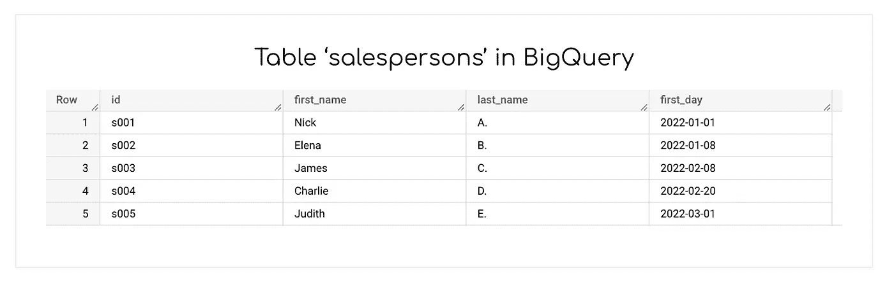
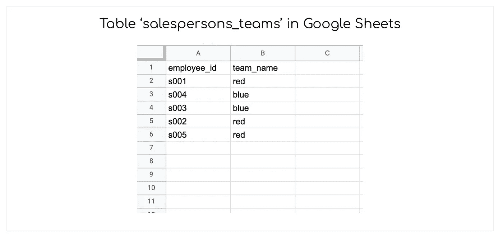
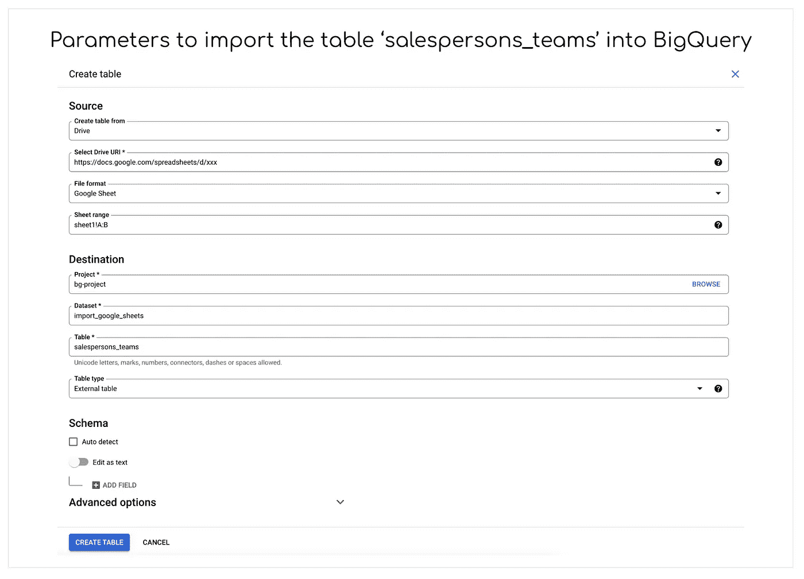
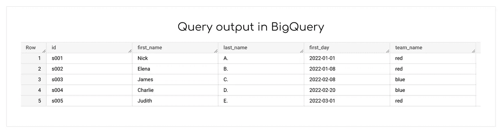

# 将数据导入 BigQuery 的最简单方法

> 原文：<https://towardsdatascience.com/the-easiest-way-to-ingest-data-into-bigquery-a94e63d4846e>

## 如何使用 Google Sheets 将数据直接加载到 BigQuery 中——以及为什么它是某些用例的最佳解决方案

巴勃罗·阿罗约在 [Unsplash](https://unsplash.com/?utm_source=unsplash&utm_medium=referral&utm_content=creditCopyText) 上的照片

当在一家公司谈论数据管理时，首先浮现在脑海中的是诸如“数据架构”、“数据工程管道”、“数据质量检查”之类的关键词……简而言之，围绕着在整个组织中流动的数据 **的**结构化的概念**。事实上，所有关于数据管理的最佳实践都依赖于这样一个假设，即我们应该将大数据构建到特定的架构中。我同意，而且我肯定会建议任何人，只要他们属于一个组织，就应该构建一个干净可靠的架构。**

然而，我发现**有时候最微不足道的解决方案最终会成为最好的解决方案**。这也适用于数据架构。这就是为什么**使用 Google Sheets 将数据注入到您的数据仓库 BigQuery** 有时会很有用。虽然它不应该作为获取数据的主要方式，但它提供了某些优势。

在这篇文章中，我想涵盖三个方面:

1.  为什么应该使用 Google Sheets 将数据导入 BigQuery？
2.  怎么做呢？
3.  这样做时应该采取什么预防措施？

为了说明我的想法，让我们考虑在您的数据仓库中有一个名为“销售人员”的表。它列出了销售部门的成员(每人一行)。这张桌子看起来像这样:

BigQuery 中的输入表(图片由作者提供)

您面临的挑战是，一个业务用户(在我们的例子中是销售主管)定期更新他们团队的组成。例如，尼克最近改变了团队:他不再是蓝队的一员，但他现在是红队的一员。你将如何更新这条信息？

# 为什么使用 Google Sheets？

**添加类似“team _ name”**的字段的通常流程是在任何[数据架构](/modern-or-not-what-is-a-data-stack-e6e09e74ae7f)的数据转换步骤中直接更新它。根据您公司的组织，数据工程师、分析工程师甚至数据分析师都可以在“员工”表中进行修改。

Google Sheets 中的输入表格(图片由作者提供)

然而**完成整个流程**可能需要几天时间，而添加“团队名称”列的需求可能很迫切。此外，这可能是一个准时的需求:添加员工的团队名称可能只与一个人或一个特定的分析相关。如果它没有为整个组织增加多少价值，那么经历整个数据工程过程可能不值得。

这就是使用 Google Sheets 及其与 BigQuery 的本机集成变得相关的地方。**第一个优势是灵活性**。在我们的示例中，如果销售主管改变了主意，Nick 将转到黄色团队而不是红色团队，那么可以通过更改 Google Sheets 中相关单元格的值来轻松完成这一更改。随着灵活性而来的是**快速**。即使不能立即更新，Google Sheets 文件中的更新也可以在几分钟内出现在相应的 BigQuery 表中。

# 如何将 Google Sheets 中的一个表摄取到 BigQuery 中？

Google Sheets 和 BigQuery 之间的原生集成允许**将一个工作表的内容直接链接到一个数据库表**。这是一个实时连接，这意味着您不必下载 Google Sheets 文件，然后在每次发生更改时手动上传到 BigQuery。

相反，转到 BigQuery 中的数据集，然后**单击“创建表”**。这将打开以下面板，您可以在其中完成:

*   用作源的 Google Sheets 文件的 URL
*   如果文件中有多张工作表，则为工作表范围
*   目标(项目、数据集、输出表的名称)

在“模式”部分，您有三种选择:

1.  “自动检测”让 BigQuery 自动推断导入表的模式
2.  “作为文本编辑”允许您以 JSON 的形式写下表的模式
3.  “+”允许您直接在 BigQuery 的界面中添加每个字段及其特性(类型、模式、描述)

最后，您可以让 BigQuery 跳过“高级选项”中的标题行。在我们的示例中，我将“1”放在该字段中，因为我们希望忽略第一行(“employee_id”、“team_name”)。

将 Google Sheets 中的表格导入 BigQuery(图片由作者提供)

一旦完成，您的工作表就可以在 BigQuery 中使用了！这允许**编写整合来自 BigQuery 和 Google Sheets 文件**的数据的查询。

回到我们前面的例子，导入 Google Sheets 文件允许我编写下面的查询，其中我协调来自我的数据仓库(表“salespersons”)和来自我的电子表格(表“salespersons_teams”)的数据。

这导致了下面的输出表:

BigQuery 中的输出表(图片由作者提供)

# 你应该在什么时候使用这个技巧？什么时候不呢？

在我们的例子中，一个人(销售主管)将负责更新 Google-Sheets 文件。只要情况保持不变，前面提到的所有优点都适用:灵活性、快速性。但是**如果更新文件的责任被太多人分担**，你会看到质量差的风险增加。这可能会导致错误的数据输入(例如，合并两个单元格，将一个字符串插入到一个整数字段中)…并且可能会导致表格或仪表板损坏。

这就是为什么我个人会在满足几个条件的情况下使用这种技术:

*   **只有一个人**(或非常有限的几个人)**负责**保持 Google Sheets 文件中数据的正确和最新
*   和/或**所处理的用例具有有限的影响**:它旨在为业务用户回答一个准时的或非常具体的问题
*   和/或**该方法用作概念验证**，供数据工程团队进一步开发

事实上，人们可以考虑将来自 Google Sheets 的数据集成到 BigQuery 中，这可能与更高级的数据产品的**初级版本相关。在我们的示例中，如果向销售人员分配团队的用例似乎超出了销售主管的单独使用范围，那么下一步将是向数据工程团队提供这种集成作为概念验证。**

# 结论

不可否认，将 Google Sheets 文件中的数据集成到 BigQuery 表中有两个优点:灵活性和快速性。这就是为什么在处理有限的利益相关者的特定用例时**特别有用的原因**。

然而，它也有缺点，因此您必须确保用这种方法处理的用例的框架设置清晰。为了获得更高的可伸缩性(但灵活性和速度较低)，通过通常的数据体系结构传输数据仍然是在数据集中实现结构化更改的最佳实践。

你喜欢读这篇文章吗？ [*成为*](https://marie-lefevre.medium.com/membership) *的一员，加入一个不断成长的充满好奇心的社区吧！*

<https://marie-lefevre.medium.com/membership> 