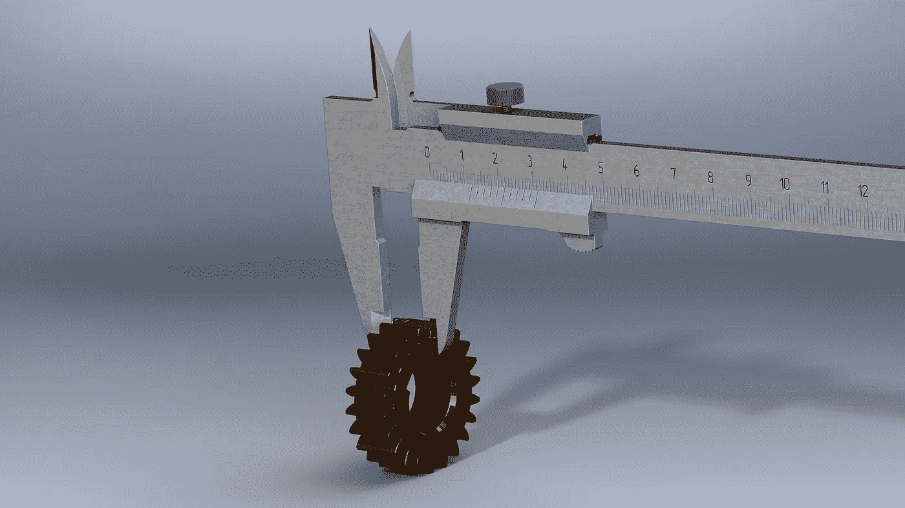
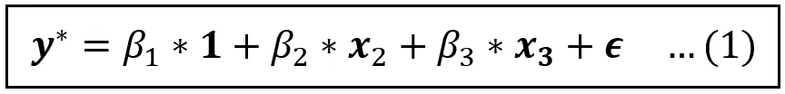
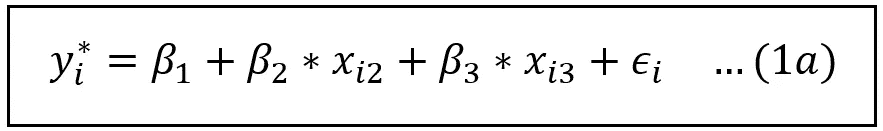
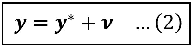
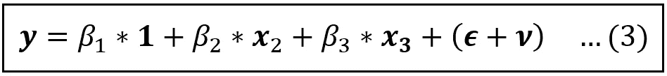
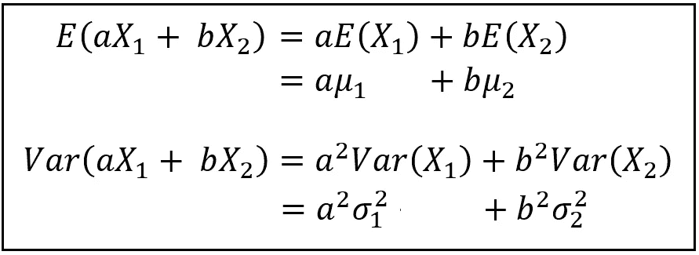
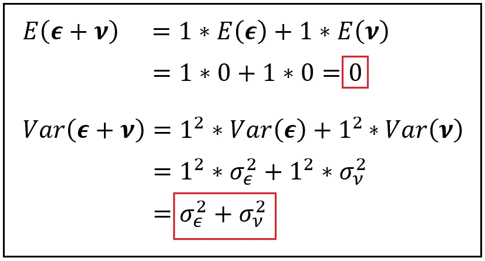
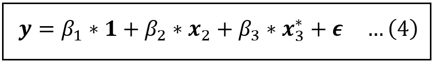
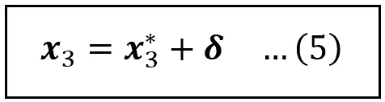

# 测量误差对线性回归模型的影响

> 原文：<https://towardsdatascience.com/the-effect-of-measurement-errors-on-a-linear-regression-model-c853bb689974>

图片由[皮克斯贝](https://pixabay.com//?utm_source=link-attribution&utm_medium=referral&utm_campaign=image&utm_content=1121746) ( [牌照](https://pixabay.com/service/license/))的[安德格林](https://pixabay.com/users/andergrin-1845553/?utm_source=link-attribution&utm_medium=referral&utm_campaign=image&utm_content=1121746)拍摄

## 当回归变量或因变量包含测量误差时会发生什么

测量误差可能由于各种原因渗入实验中，例如测量仪器本身、实验的形式或调查对象提交的错误回答。有人可能会争辩说，通常一个变量的测量会有一些误差。在这种情况下，了解这种度量误差对回归模型的影响以及如何减轻这种影响非常重要。

在本文中，我们将使用一个线性回归模型作为我们的工作台来着手做这件事。

有两种情况需要考虑测量误差:

1.  当误差在回归模型的响应变量(***【y】)***时。
2.  当一个或多个解释变量***x****_ I*测量有误差时。

# 响应变量中的测量误差

考虑以下线性模型:

变量的线性模型(图片由作者提供)

上式中，**，* ***1，x*** *_2，****x****_ 3*，*是大小为*【n×1】*的列向量假设有 *n* 向量 ***1*** 仅仅是一个 1s 的向量。乘法符号(*)会在需要的地方明确显示，但为了简洁起见，也可以将其删除。 ***y*** 上面的*不是乘号。我们将很快解释它是什么。误差项*假设正态分布，均值和方差为零 *σ _ϵ* ，即 ***ϵ*** *~ N(0，σ _ϵ)* 。***

**对于数据集中第*行和第*行，上述模型可以重述如下:**

****

**用数据集中的第 I 行表示的线性模型(图片由作者提供)**

**为了方便起见，我们将继续使用等式(1)而不是(1a)。让我们假设 ***x*** *_2* 和****x****_ 3*是**即与***【ϵ***不相关，那么等式(1)(或 1a)中的模型可以使用普通最小二乘法(OLS)一致地估计*****

******我们假设 ***y*** *** 是因变量的真实(确切)值但我们测得(即观察到)的值是***y******y***包含一个误差 ***ν*** 我们假设这个误差是可加的。我们可以将 ***y*** *** 与 ***y*** 的关系表示如下:******

************

******观测值 **y** 是精确值 ***y*** *** 和一些误差 ***ν*** *(图片由作者提供)*******

******我们假设 ***ν*** 正态分布，均值为零，方差σ _ *ν* 。批注-大小: ***ν*** *~N(0，* σ _ *ν* )。正如我们将看到的，这个假设将有助于分析。******

******将等式(2)代入等式(1)并重新排列各项，得到如下结果:******

************

******包含错误测量的响应变量的线性模型(图片由作者提供)******

******在上面的模型中， ***x*** *_2* 和****x****_ 3*继续保持[外生](/what-are-exogenous-and-endogenous-regression-variables-c0ea1ba03ce8)即不与*复合*误差项**(***+*)因此，就像早期的模型一样，等式(3)中的模型可以使用普通最小二乘法(OLS)和 OLS 一致地估计**，将产生所有回归系数的无偏估计。***********

********我们来考察一下随机变量*(****ϵ****+****ν****)的均值和方差特性。*对于两个*独立*随机变量***X****_ 1*和***X****_ 2*的均值和方差，我们将使用以下两个恒等式********

************

******随机变量线性组合的均值和方差。a 和 b 是一些常数(图片由作者提供)******

******回想一下，误差****ν***【正态分布】即**~ n(0，σ_ϵ)****ν****~ n(0，* σ _ *ν*********

******应用以上两个恒等式，我们分别得到合成误差*(***+****ν****)**(σ_ϵ+*σ_*ν)*的均值和方差为零，如下:*******

************

******复合误差的均值和方差*(****ϵ****+****ν****)(图片由作者提供)*******

******由此我们可以看出，虽然复合误差的均值仍然为零，但其方差却比原始模型的方差大。******

*******误差项的方差越大，意味着包含不精确测量的* ***y*** *的该模型的预测越不精确。它们的预测区间比带有精确* ***y*** **的模型的预测区间更大。*******

******现在让我们来看看其中一个回归变量包含误差项的情况。******

# ******回归变量中的测量误差******

******考虑以下线性模型:******

************

******二元线性模型 **x** _2 和 **x** _3(图片由作者提供)******

******和前面一样， ***y*** *，* ***1，x*** *_2，****x *****_ 3*， ***ϵ*** 都是大小为*【n×1】*的列向量。******

******这一次，我们假设 ***y*** 被精确测量，但是***x***** _ 3*包含测量误差。具体来说，***x***** _ 3*代表变量的确切值但观测值是 ***x*** *_3。还是和以前一样，我们将假设观察值中的误差是以零为中心的、正态分布的和可加的。由此，我们可以对***x***** _ 3*说如下:*******

**********

*******x** *_3 测量有附加误差 **δ** *(图片由作者提供)******

********δ*** 是测量误差。我们假设它围绕一个零均值*正态分布，即****δ****~ N(0，* σ _ *δ* )。*****

*****为了评估这种测量对模型运行特性的影响，我们将采用与 ***y*** 相同的调查方法。让我们将等式(5)代入等式(4)给出的回归模型，并将各项稍微重新排列如下:*****

**********

*****包含测量不完全的回归变量的线性模型(图片由作者提供)*****

*****与等式(3)中的模型一样，该模型也包含复合误差项*(****【ϵ—****【β_ 3 *****【δ****)*。我们不应该被误差中的负号所迷惑，认为合成误差小于原始模型的误差项 ***ϵ*** 。不一定更小，因为它的值取决于 ***ϵ*** 、 *β_3* 和 *δ的符号。*事实上，正如我们马上会看到的，从绝对意义上来说，它可能比原始模型的误差更大。*****

*****误差*(****ϵ—****β_ 3 *****δ****)*是*大概独立的*随机变量 ***ϵ*** 和 ***δ的线性组合。*** 我们还假设 ***δ*** 和 ***ϵ*** 各自正态分布在一个零均值附近。因此，我们可以使用与之前相同类型的分析来计算复合误差的平均值和方差*(****【ϵ】—****【β_ 3 *****【δ****)*。具体来说，我们可以证明，合成误差项*(****)ϵ—****β_ 3 *****δ****)*也是围绕一个零均值正态分布的，它的方差为 *(σ _ϵ + β _3*σ _δ)。******

## *****回归变量的测量误差对模型的影响*****

*****等式(6)中的模型的合成误差的方差 *(σ _ϵ + β _3*σ _δ)* 表明对所得模型的以下影响:*****

1.  *****由于 *(σ _ϵ + β _3*σ _δ)* 中的所有量都是非负的，所以合成误差至少与原始模型的误差项的方差*、σ _ϵ* 一样大(实际上通常更大)。这使得回归项中包含测量误差的模型(即等式(6)中的模型)的预测区间比精确模型的预测区间更宽。这个结果类似于我们之前看到的在响应变量 ***y*** 中包含测量误差的模型。*****
2.  *****误差方差的大小与 *β_3、*的绝对值的大小成正比，而绝对值的大小又是 ***x*** *_3* (包含测量误差的变量)与 ***y*** *相关程度的度量。*如果从这个角度来看，这一发现似乎很直观:*如果高度相关的回归变量包含测量误差，那么模型的精度会比不相关的变量包含测量误差时受到更严重的影响。******
3.  *****观察#2 有另一面。即使是一个不相关的变量，当它被错误地测量时，也会在一定程度上导致最终模型的精度损失。因此，*如果你对一个变量的相关性有所怀疑，并且它也很可能难以精确测量，你可以通过简单地将它去掉来帮你的回归模型一个忙。******
4.  *****最后，误差方差的大小与***x****_ 3*中测量误差的方差有多大成正比。测量的***x****_ 3*越不精确，得到的模型中的误差方差越大。这似乎很直观。*****

## *****回归变量和测量误差之间的相关性*****

*****再次考虑理论精确值***x***** _ 3*，其不完全观测值***x**_ 3*，以及测量误差 ***δ*** 之间的以下关系:*******

******

*****x** *_3 测量有附加误差 **δ** *(图片作者提供)****

***有两个有趣的场景需要考虑:***

1.  ***测量误差 ***δ*** 是*而不是*与观测值 ***x*** *_3。****
2.  ***测量误差 ***δ*** *与观测值***x****_ 3*相关。****

***回想等式(6)中的模型:***

******

***包含测量不完全的回归变量的线性模型(图片由作者提供)***

***我们通过将原始模型中的 ***x**** *_3* 替换为*(****x****_ 3—****△****)*得到这个模型。在上述模型中，***x****_ 2*和***x****_ 3*与原模型的误差项***【ϵ】***不相关。***

***让我们来看看上面两个场景中的第一个。***

## ******x****_ 3*是*不是*与 ***δ相关。******

***由于***x****_ 3*也与误差项***【ϵ***不相关，这就意味着***x****_ 3*与合成误差项*(****——****β_ 3 **这样，等式(6)中的 ***，x*** *_3* 继续保持外生。通常没有令人信服的理由相信模型中的其他回归变量(在这种情况下，***x****_ 2)*会与***x***** _ 3*中的测量误差相关，即***【δ***。因此，模型(6)中的所有回归变量都是外生的。此外，我们之前表明，等式(6)中模型的复合误差项是以零为中心的。等式(6)中的模型可以使用 OLS 一致地估计，估计的系数没有偏差。***

***现在考虑第二种情况。***

## ******x****_ 3 与 ***δ*** 相关****

***由于 ***δ*** 是本模型中误差项的一部分，这使得***x****_ 3***[**内生**](/what-are-exogenous-and-endogenous-regression-variables-c0ea1ba03ce8) ，即***x****_ 3*正相关这个模型不能再用 OLS 来持续估计了。*****

*****由内生的***×内生的*** *_3* 组成的第二个场景产生了另一个不幸的红利。由于与**_ 3***相关的误差***δ****δ隐藏在复合误差项中，因此***δ***实际上扮演了省略回归变量的角色，导致 [**省略变量偏差**](/what-happens-when-you-omit-important-variables-from-your-regression-model-966830590d53) ，即任何使用 OLS 估计模型的尝试都将导致估计的系数系统地偏离*********

## ******衰减偏差******

******还可以看出，估计系数中的这种偏差趋向于零。也就是说，由 OLS 估计器估计的β值被降低或*向零衰减*，使它们小于真实值。这被称为**衰减偏差**，它会导致实验者认为回归变量在解释响应变量的方差方面不如实际有效。******

******所有系数，而不仅仅是易出错变量的系数，都会受到这种衰减偏差的影响，无论样本大小或均衡程度如何，偏差都不会消失。******

******那么，当回归变量之一被不完美地测量时，实验者应该做什么呢*和*不完美的程度恰好与测量值相关？******

## ******救济方法******

******幸运的是，情况并非没有希望，因为有一些补救措施:******

1.  ******简单而懒惰的做法是接受最终模型的内生性和估计系数的偏差。如果预计误差和观察值之间的相关量很小，这是一个非常合理的选择。这通常是实验者的判断要求，因为测量误差不能直接观察到。******
2.  ******在 [**面板数据模型**](/understanding-the-fixed-effects-regression-model-d2fccc2cc27e) 中，如果易错变量不随时间变化，可以简单地将其从模型中差分出来。******
3.  ******人们可以识别一个或多个 [**工具变量**](/introduction-to-instrumental-variables-estimation-3eba75a04418)**【IV】**对于易出错的内生变量，用 IVs 替换易出错的变量，并使用 IV 估计器如 [**2 阶段最小二乘法**](/introduction-to-two-stage-least-squares-estimation-4dbabdd98102) 一致地估计所得模型。******

# ******关键要点******

*   ******测量误差可以(并且经常)渗入回归模型的响应变量和解释变量中。******
*   ******在线性模型的情况下，响应变量的测量误差通常不是大问题。仍然可以使用最小二乘法对模型进行一致的估计(或者在模型具有仪表化变量的情况下，使用 2 阶段最小二乘法)。******
*   ******如果误差在解释变量中，只要误差与变量的观测值不相关，模型仍然可以使用 OLS(或 2 阶段 OLS)进行一致估计。******
*   ******在所有情况下，测量误差都会增加模型误差项的方差，从而导致预测区间变宽，模型预测精度降低。精确度的损失与测量响应变量或解释变量的不精确程度成正比。******
*   ******如果高度相关的回归变量包含测量误差，模型的精度会比不相关的变量包含测量误差受到更严重的影响。******
*   ******如果你怀疑一个变量的相关性，并且它也可能很难精确测量，你可以通过简单地把它去掉来帮你的回归模型一个忙。******
*   ******如果错误地测量了一个或多个解释变量，并且测量误差与该变量的观察值成比例，则该变量是内生的。使用 OLS 估计器不能对该模型进行一致的估计，任何这样做的尝试都将导致系数估计偏向零，即衰减。******
*   ******当面对上述情况时，通常的补救方法是要么接受偏差，要么区分出易错变量，要么确定工具变量来代替易错变量。******

# ******进一步阅读的建议******

****** [## 一致估计量

### 回归建模器指南

towardsdatascience.com](/the-consistent-estimator-913fab06f4f3)  [## 当你忽略回归模型中的重要变量时会发生什么

### 我们将了解什么是遗漏变量偏差，并使用真实数据集说明其计算

towardsdatascience.com](/what-happens-when-you-omit-important-variables-from-your-regression-model-966830590d53)  [## 什么是外生和内生回归变量？

### 虽然外生性是一件好事，但内生性会让你的模型的有效性受到质疑

towardsdatascience.com](/what-are-exogenous-and-endogenous-regression-variables-c0ea1ba03ce8)  [## 工具变量估计导论

### 我们将学习工具变量，以及如何使用它们来估计线性回归模型

towardsdatascience.com](/introduction-to-instrumental-variables-estimation-3eba75a04418)  [## 两步最小二乘估计简介

### 我们将学习如何使用 2SLS 技术来估计包含工具变量的线性模型

towardsdatascience.com](/introduction-to-two-stage-least-squares-estimation-4dbabdd98102) 

# 参考文献、引文和版权

## 形象

本文中所有图片的版权归 [CC-BY-NC-SA](https://creativecommons.org/licenses/by-nc-sa/4.0/) 所有，除非图片下面提到了不同的来源和版权。

*如果你喜欢这篇文章，请关注我的*[***Sachin Date***](https://timeseriesreasoning.medium.com)*获取关于回归、时间序列分析和预测主题的提示、操作方法和编程建议。*******