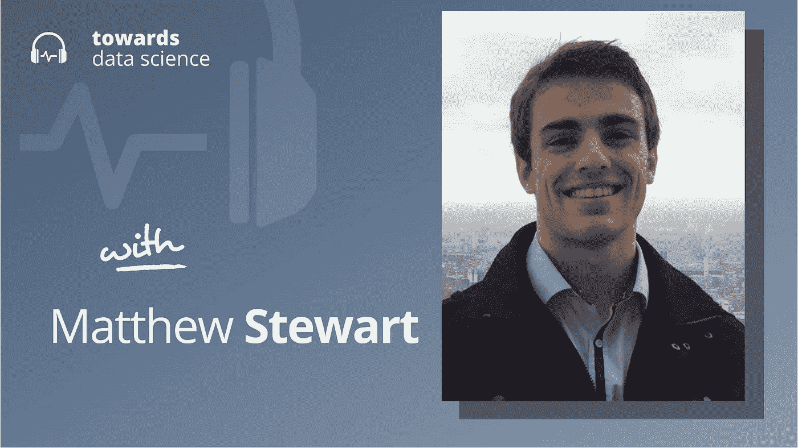

# ML 传感器的新兴世界

> 原文：<https://towardsdatascience.com/the-emerging-world-of-ml-sensors-7b6801a054c5>

## [播客](https://towardsdatascience.com/tagged/tds-podcast)

## Matthew Stewart 谈边缘设备检测的新模式

[苹果](https://podcasts.apple.com/ca/podcast/towards-data-science/id1470952338?mt=2) | [谷歌](https://www.google.com/podcasts?feed=aHR0cHM6Ly9hbmNob3IuZm0vcy8zNmI0ODQ0L3BvZGNhc3QvcnNz) | [SPOTIFY](https://open.spotify.com/show/63diy2DtpHzQfeNVxAPZgU) | [其他](https://anchor.fm/towardsdatascience)

*编者按:TDS 播客由 Jeremie Harris 主持，他是 Gladstone AI 的联合创始人。每周，Jeremie 都会与该领域前沿的研究人员和商业领袖聊天，以解开围绕数据科学、机器学习和人工智能的最紧迫问题。*

今天，我们生活在 AI 缩放的时代。似乎无论你看哪里，人们都在推动大型语言模型变得更大，或者更多模态，并利用不可思议的处理能力来做到这一点。

尽管这是现代人工智能时代的定义趋势之一，但它不是唯一的趋势。与超大规模变压器和巨型密集网络世界截然相反的另一个极端是快速发展的 TinyML 世界，其目标是将人工智能系统打包到小型边缘设备上。

我今天的嘉宾是 [Matthew Stewart](http://mpstewart.net/) ，他是哈佛大学的深度学习和 TinyML 研究员，在那里他与世界领先的物联网和 TinyML 专家合作，开展旨在让小设备用人工智能做大事的项目。最近，Matt 和他的同事共同撰写了一篇论文，介绍了一种新的感知思维方式。

这个想法是将机器学习和传感紧密集成在一个设备上。例如，今天我们可能会在边缘设备上嵌入一个像摄像头这样的传感器，摄像头必须将视野中所有像素的数据发送回中央服务器，中央服务器可能会获取这些数据并使用它来执行面部识别等任务。但这并不好，因为它涉及到从边缘设备向服务器发送潜在的敏感数据——在这种情况下，是人脸图像——从而带来安全风险。

因此，如果相机的输出在边缘设备上处理，那么所有必须发送到服务器的信息都是不太敏感的信息，如是否检测到特定的人脸，会怎么样？这些系统——边缘设备利用板载人工智能，只与世界其他地方共享处理后的输出——就是马特和他的同事们所说的 *ML 传感器*。

ML 传感器确实看起来像是未来的一部分，它们引入了一系列具有挑战性的道德、隐私和操作问题，我在这一集的 TDS 播客中与 Matt 讨论了这些问题。

以下是我在对话中最喜欢的一些观点:

*   大多数现代智能设备本身并不智能。虽然他们收集各种传感器数据，但他们通常不会自己处理这些数据。相反，他们通常将它发送到一个中央服务器，该服务器应用任何需要的算法。这种方法有一个明显的缺点:它迫使开发人员通过云将传感器数据从传感器发送到服务器——这一过程可能导致拦截或数据损坏。但它目前是默认的，因为历史上很难将视觉、机器人控制或语言模型打包到内存和处理能力有限的边缘设备上。
*   亚马逊 Echo 和 Google Home 实际上具有与 ML 传感器概念相匹配的功能。这些设备通常具有板载算法，该算法允许它们检测何时给出提醒注意的命令(例如“Ok Google”)，并且一旦听到该命令，它们就继续将用户的查询转发给中央服务器，该中央服务器可以执行响应用户的查询所涉及的繁重工作。在这种情况下，“ML 传感器”将是 Google Home 的麦克风和它的“Ok Google”识别软件的组合。
*   Matt 使用面部识别的例子来说明 ML 传感器范例。目前，我们认为传感器是“向我们强大的处理器提供原始数据的东西”——像相机这样的东西非常符合这一描述。但是想象一下，你可以买一个“面部检测器”，而不是买一个摄像头，这是一个集成设备，将摄像头与机载面部识别模型相结合，其整体输出不是图像，而是一个结论(“Jeremie 的面部被检测到了！”或者“没有检测到杰瑞米的脸。”)
*   ML 传感器可能比传统传感器更难表征。这是因为它们可以包含硬件和软件的任何组合，任何传感器，以及应用于该传感器输出数据的任何模型。对传感器板载软件的任何更改都会对其性能特征产生重大影响。

## 章节:

*   0:00 介绍
*   with TinyML 特别挑战
*   9:00 马特工作中最具挑战性的方面
*   12:30 毫升传感器
*   21:30 定制技术
*   24:45 数据表和 ML 传感器
*   31:30 客户拥有自己的定制软件
*   36:00 访问算法
*   40:30 总结