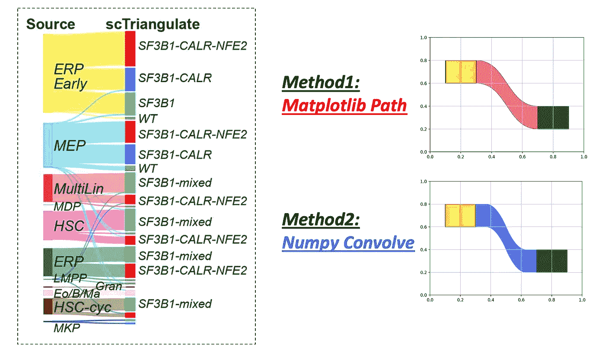
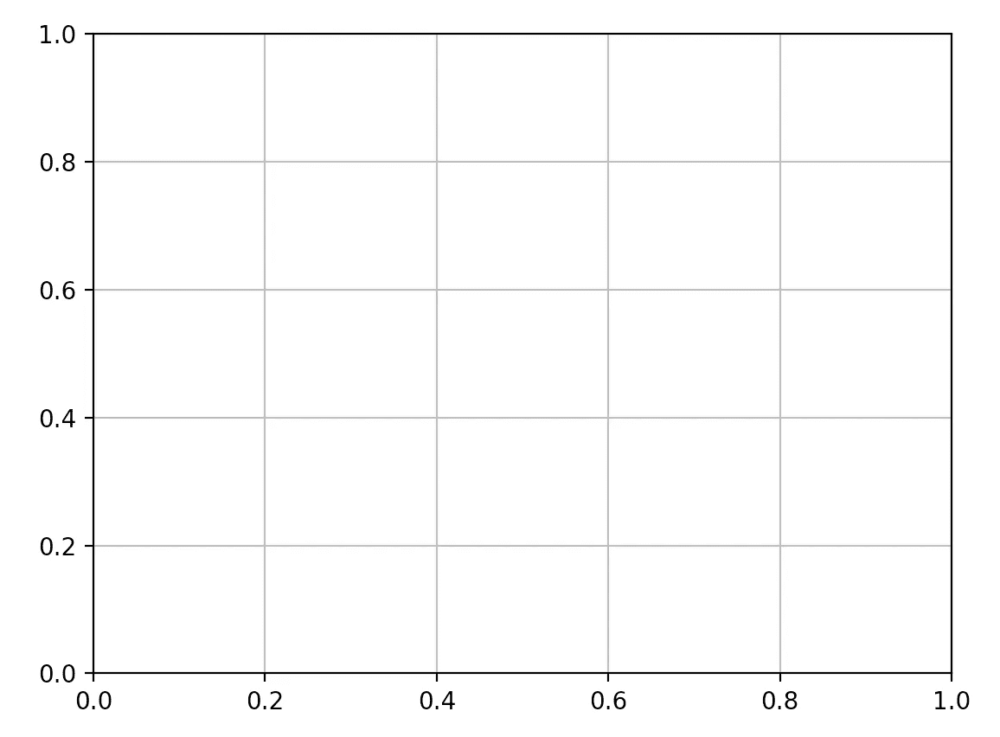
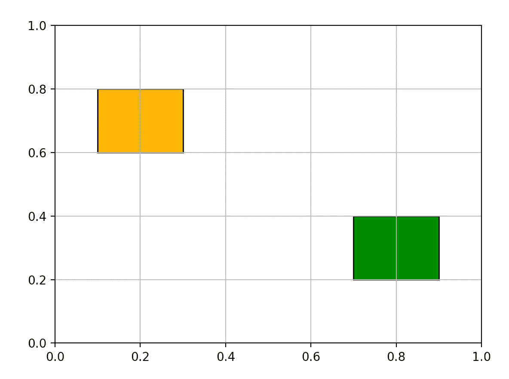
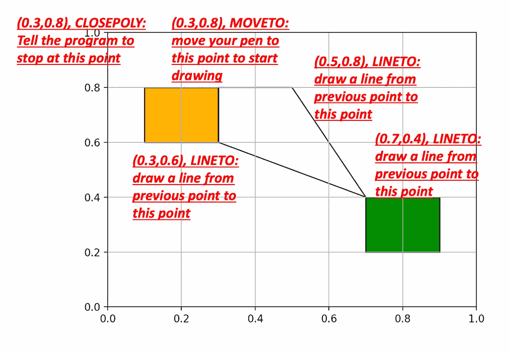
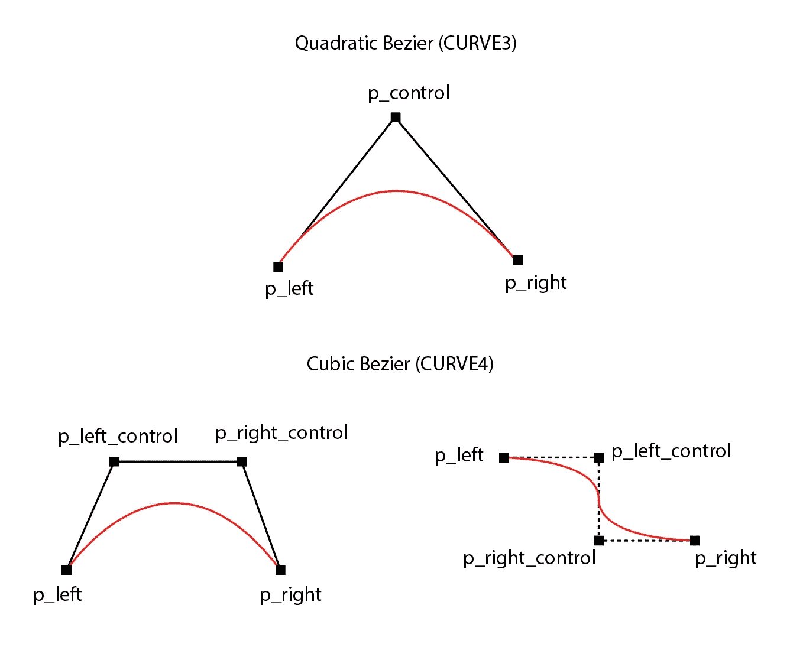
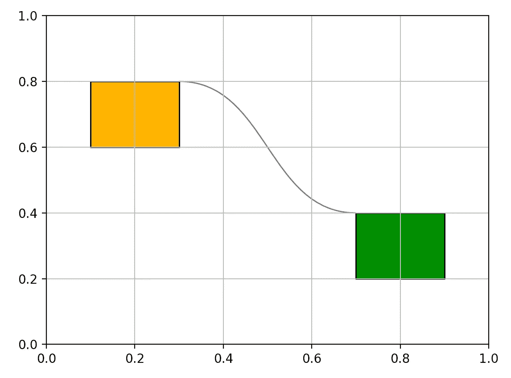
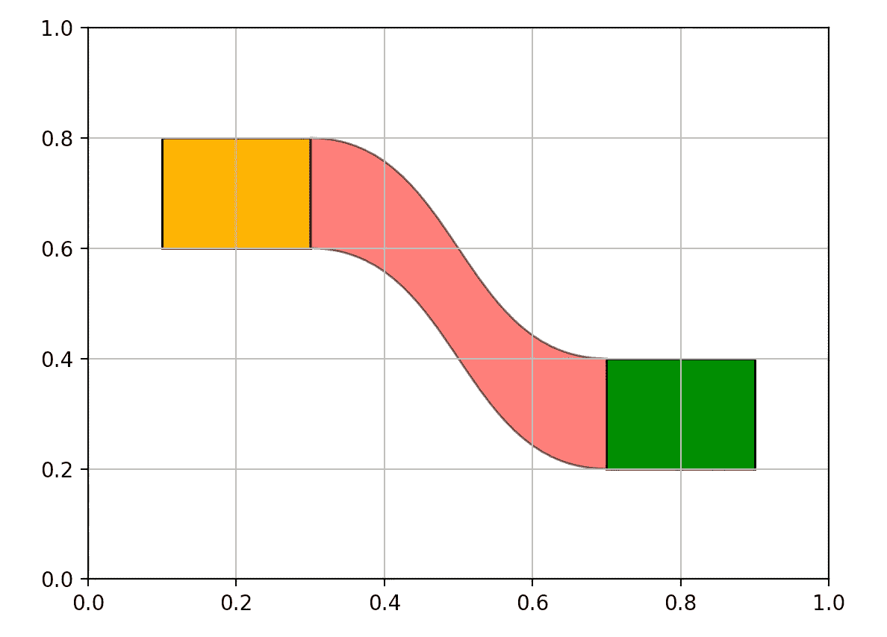
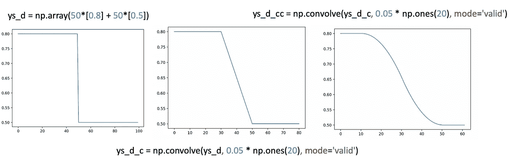
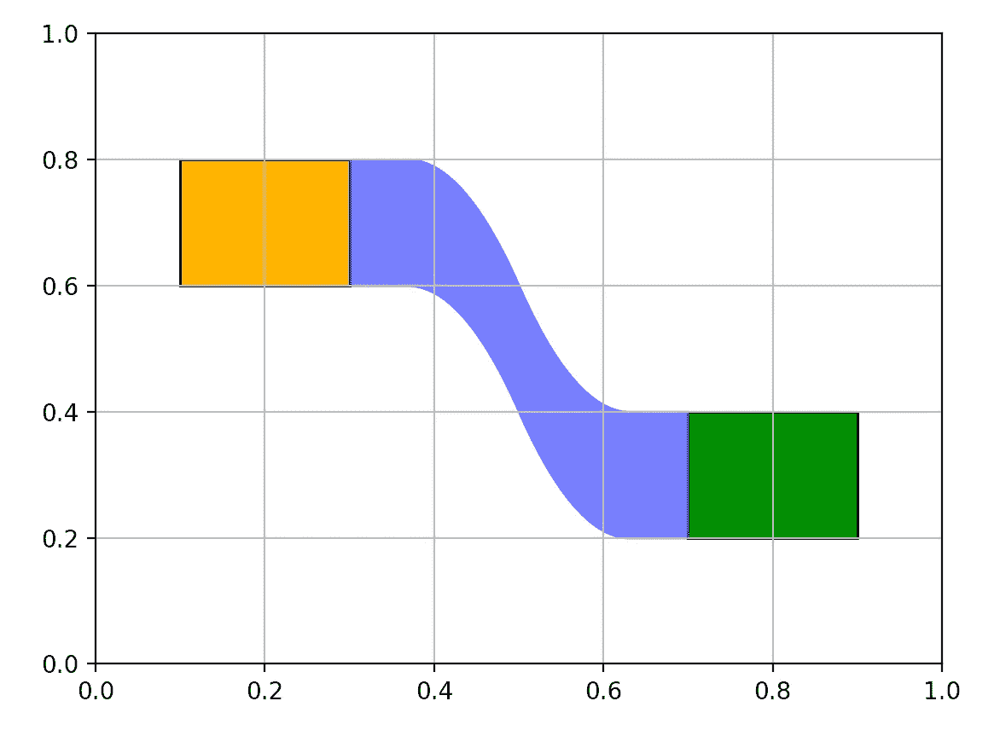

# 绘制桑基图的本质

> 原文：<https://towardsdatascience.com/the-essence-of-drawing-sankey-plot-491fb2cb234>

## 我想分享两种用纯 Python 生成 Sankey 图最重要部分的方法



图片来自[作者自己的研究论文](https://www.biorxiv.org/content/10.1101/2021.10.16.464640v2.full)

Sankey plot 是一种非常好的、简洁的方式来可视化值如何从源类别流向目标类别。在上面显示的左图中，我使用了 Sankey 图来展示每个造血群体(干细胞、红系祖细胞)如何根据其突变谱进一步分为更细的亚群体。除了这个例子之外，桑基图也被广泛用于显示[能量流变化](https://developers.google.com/chart/interactive/docs/gallery/sankey#:~:text=A%20sankey%20diagram%20is%20a,the%20connections%20are%20called%20links.)、[关于活动的统计](https://www.azavea.com/blog/2017/08/09/six-sankey-diagram-tool/)等等。

虽然有几个现成的软件包可以在一行中绘制桑基图(即 [pySankey](https://github.com/anazalea/pySankey) 、 [Plotly](https://plotly.com/python/sankey-diagram/) 、 [networkD3](https://r-graph-gallery.com/sankey-diagram.html) )，但我发现弄清楚桑基图实际上是由什么组成的是一个非常有趣的练习，这样我们就可以从头开始制作自己的桑基图，并进行所需的修改。

如果我们将一个复杂的 Sankey 图分成几部分，我们会发现最重要的部分只是两个垂直的条(矩形),分别代表左侧和右侧每个类别的数量，以及连接这两个矩形的曲线。今天分享两种在 Matplotlib 包中绘制这些零件的图的方法。

本教程中的代码可以在[这里](https://github.com/frankligy/python_visualization_tutorial/tree/main/sankey)找到。

# 设置网格和边栏

首先，我们需要在两边画出矩形，这个任务可以从不同的角度来看。一种方法是将它们视为两条线之间的区域，这样我们可以使用`ax.fill_between`函数来填充颜色。另一种方法是将它们视为独立的矩形，并利用`matplotlib`包中内置的`Rectangle`补丁。在这里，让我们使用第二种方法进行演示，但是您也可以尝试第一种方法。

```
from matplotlib.patches import Rectangle
fig,ax = plt.subplots()
ax.set_xlim([0,1])
ax.set_ylim([0,1])
ax.grid()
```



作者图片

在指定了画布和我们要绘制的轴之后，我们可以开始绘制这两个矩形。如果你不熟悉 canvas(fig)和 ax，也许[我之前的教程集](/making-publication-quality-figures-in-python-part-i-fig-and-axes-d86c3903ad9b)能有点帮助。

```
rec_left = Rectangle(xy=(0.1,0.6),width=0.2,height=0.2,facecolor='orange',edgecolor='k')
ax.add_patch(rec_left)

rec_right = Rectangle(xy=(0.7,0.2),width=0.2,height=0.2,facecolor='green',edgecolor='k')
ax.add_patch(rec_right)
```



作者图片

# 方法 1:使用 Matplotlib 路径对象

接下来的任务是绘制曲线条带，我想先介绍一下 Matplotlib 中强大的`Path`模块。这个模块有时被认为是一个低级 API，但它实际上是 Python 中最常用的可视化的基础，因为一切都可以归结为涂鸦，对吗？

`Path`模块允许你随意绘制任何形状的线条，这是由两个参数控制的，按照惯例命名为`verts`和`codes`。`verts`是一个 2D NumPy 数组或嵌套列表，其中每个元素都是一个元组，这个 2D 数组的每个元素或每一行都代表锚点的(x，y)坐标，这样，如果你想用 5 个锚点画一条线，你的`vert`的长度应该是 5。同时，`codes`参数定义了在画线时如何解释每个锚点。让我们看一个简单的例子:

```
from matplotlib.path import Path
from matplotlib.patches import PathPatchverts = [(0.3,0.8),(0.5,0.8),(0.7,0.4),(0.3,0.6),(0.3,0.8)]
codes = [Path.MOVETO, Path.LINETO, Path.LINETO, Path.LINETO, Path.CLOSEPOLY]
p = Path(verts,codes)
ax.add_patch(PathPatch(p,fc='none'))
```

剧情会看那个:



作者图片

我希望这个例子能让你了解`verts`和`codes`是如何合作完成任务的。然而，正如你所看到的，到目前为止，我们仍然只是处理直线，那么我们希望绘制的曲线呢？

您可以在`codes`列表中包含另外两个名为`CURVE3`和`CURVE4`的代码。`CURVE3`代表我们所说的二次贝塞尔曲线，而`CURVE4`代表三次贝塞尔曲线。如下图所示:



作者图片

如果你想画一条二次贝塞尔曲线，你需要指定三个锚点(CURVE3)和中间的一个来控制曲率。类似地，你总共需要四个点来画一个三次贝塞尔曲线(曲线 4)。我们将使用 CURVE4 进行条带可视化。

```
verts = [(0.3,0.8), (0.5,0.8), (0.5,0.4), (0.7,0.4)]
codes = [Path.MOVETO, Path.CURVE4, Path.CURVE4, Path.CURVE4]
p = Path(verts,codes)
ax.add_patch(PathPatch(p,fc='none',alpha=0.6))
```



作者图片

现在，我们如何实现最终目标变得更加清晰，代码如下所示:

```
verts = [(0.3,0.8), (0.5,0.8), (0.5,0.4), (0.7,0.4), (0.7,0.2), (0.5,0.2), (0.5,0.6), (0.3,0.6), (0.3,0.8)]
codes = [Path.MOVETO, Path.CURVE4, Path.CURVE4, Path.CURVE4, Path.LINETO, Path.CURVE4, Path.CURVE4, Path.CURVE4, Path.CLOSEPOLY]
p = Path(verts,codes)
ax.add_patch(PathPatch(p,fc='red',alpha=0.6))
```



方法 1:使用路径对象。

# 方法 2:使用 Numpy 卷积

另一种思考条带的方式是将它重新构建为一个信号处理问题，这个想法来自于 [pySankey](https://github.com/anazalea/pySankeyhttps://github.com/anazalea/pySankey) 包的实现。当给定两个信号`f(x)`和`g(x)`时，线性卷积算子可以总结出信号`g(x)`对信号`f(x)`的影响，从而得到卷积信号函数`f(x)*g(x)`。这个函数已经被实现为`numpy.convolve`，它是如何计算的在这篇[文章](http://en.dsplib.org/content/conv/conv.html)中有很好的说明。请注意，这里我们使用了`mode='valid'`，因此只计算两个信号完全重叠的位置。



卷积如何帮助生成曲线带？

按照这个逻辑，我们可以修改我们的代码:

```
yu = np.array(50*[0.8] + 50*[0.4])
yu_c = np.convolve(yu, 0.05*np.ones(20),mode='valid')
yu_cc = np.convolve(yu_c, 0.05*np.ones(20),mode='valid')
yd = np.array(50*[0.6] + 50*[0.2])
yd_c = np.convolve(yd, 0.05*np.ones(20),mode='valid')
yd_cc = np.convolve(yd_c, 0.05*np.ones(20),mode='valid')
ax.fill_between(np.linspace(0.3,0.7,62),yd_cc,yu_cc,color='blue',alpha=0.6)
```

我们基本上对上面的虚拟例子做了两次同样的事情，第一次是对上半部分的曲线，另一次是对下半部分的曲线，这样，我们可以利用方便的`ax.fill_between`函数用想要的颜色填充区域来完成任务。



方法 2:利用数值卷积

# 结论

好了，就这些了，非常感谢你的阅读，希望你喜欢这个简短的教程。如果你喜欢这篇文章，请在 medium 上关注我，非常感谢你的支持。在我的 [Twitter](https://twitter.com/FrankLI55917967) 或 [LinkedIn](https://www.linkedin.com/in/guangyuan-li-399617173/) 上联系我，也请让我知道你是否有任何问题或你希望在未来看到什么样的教程！