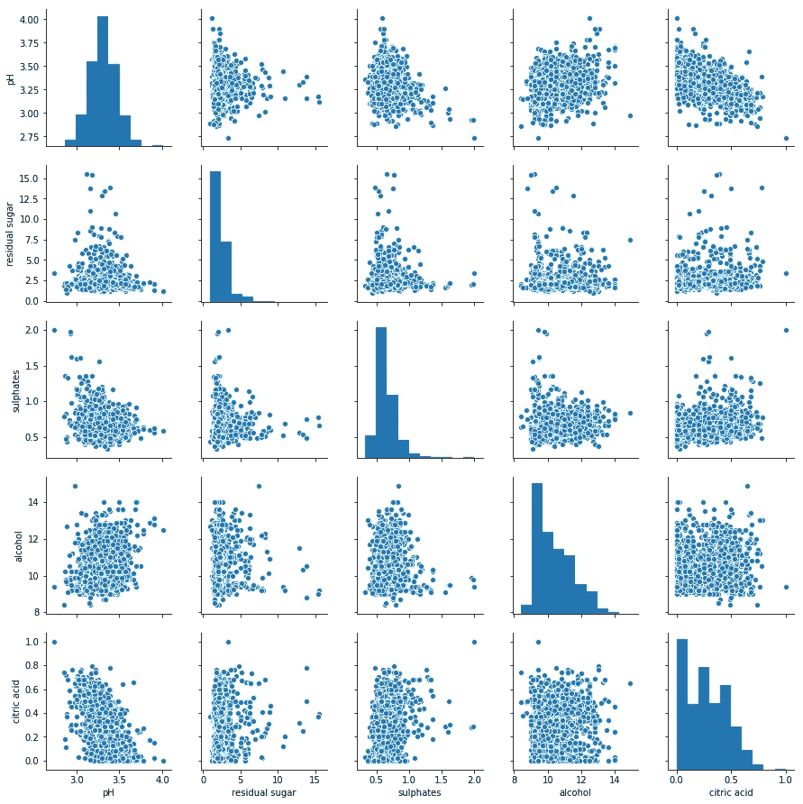
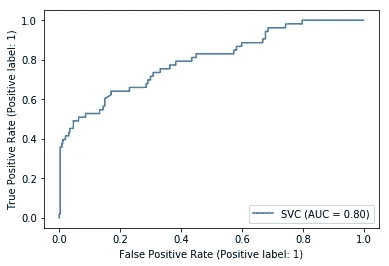

# 基本数据科学参考笔记本

> 原文：<https://towardsdatascience.com/the-essential-data-science-reference-notebook-d71ebba922b6>

## 针对 EDA、特征工程、模型拟合等的单一参考


詹姆斯·哈里逊在 [Unsplash](https://unsplash.com?utm_source=medium&utm_medium=referral) 上拍摄的照片

我最近完成了内部调动，加入了 Meta 的核心数据科学团队。在与我的同事 Barry Zhang 和 Nicolas Lepore 研究这些采访时，我们发现没有单一的资源用于典型的数据科学编码功能，如 EDA 绘图、数据清理、数据转换、超参数优化、模型拟合、无监督学习等。所以我们决定创造一个。即使在我们的采访之后，我也不断地回头参考这个笔记本，并相信它是常用的 DS 编码函数的最大资源之一。

这篇文章详细介绍了我们笔记本的各个部分，并在底部提供了下载链接，对于那些可能会觉得有用的人来说。

## 快速免责声明

每个部分出现的顺序通常是这些步骤通常执行的顺序，但并不完美。例如，大多数数据转换，如缩放和一个热编码，应该在将数据分成训练和测试后*完成，但为了简单起见，这款笔记本之前就有。*

## **数据检查**

第一步是检查数据集。我们感兴趣的是数据的形状和大小，特征的类型(字符串/浮点/整数等)。)，这些要素的类的分布或数量，以及是否有缺失或重复的值。

## EDA 绘图

一旦我们知道了数据的基本情况，比如列名是什么，有多大，是否有空值等等。我们可以将它形象化，以获得更好的理解。下面，我们使用热图来可视化数据中的相关性，并查看空值的分布中是否存在模式。除此之外，散点图矩阵将显示所有数值的成对散点图网格。对于简单的双变量分析，我们还包括一次性散点图、十六进制图、箱线图、计数图和直方图。



散点图矩阵，图片由作者提供

## **数据清理**

现在我们将注意力转向空值、重复值和异常值。对于空值，找出导致空值的原因并查看它们是否随机分布总是很重要的。然而，在访谈的短时间内，通常可以用均值/中值(对于连续特征)或众数(对于分类特征)快速估算。更高级的技术包括用剩余的特征建立一个模型来预测空值，但是这通常不会在面试或带回家的作业中出现。

如果空值的数量相对于数据集的大小来说很小，并且它们是随机分布的，我们也可以像通常处理重复项一样删除它们。

虽然基于树的模型或神经网络对异常值相当稳健，但对线性模型进行 winsorize 是个好主意。我们提供了 3 个函数，用于基于以下内容裁剪裁剪异常值:

> ***百分位数:*** *例如，剪切高于第 99 个百分位数截止值和低于 1%截止值的所有值。* ***标准差:*** *裁剪所有偏离平均值超过 3 个标准差的值。* ***四分位范围:*** *裁剪所有值 1.5*IQR 之外的 IQR 的上下界(旁注:Shivam Chaudhary 有一个很大的* [*文章*](/why-1-5-in-iqr-method-of-outlier-detection-5d07fdc82097) *关于我们为什么用 1.5 作为比例因子)*

## 数据转换

在拟合模型之前，我们必须获得可用形式的数据。这通常涉及对分类和/或连续特征的某种特征变换。我们首先使用。select_dtypes()方法。

对于连续要素，如果我们使用的线性模型本身无法拟合非线性趋势，我们可能希望生成多项式要素。使用 StandardScaler 或 MinMaxScaler 缩放数字要素也是一个好主意，这将有助于模型更快地收敛，并且在进行正则化(如 Lasso 和 Ridge 回归)时是必要的，因为这会影响系数的大小。最后，您可能希望通过选择 1/0 截止值的阈值将连续要素转换为二进制(“二进制化”)。

对于分类特征，几乎所有用 Python 编写的学习算法都不能使用字符串特征，所以我们需要对列进行一次性编码。在这个过程中，我们使用 sklearn 中的 OneHotEncoder 类将一个字符串特性转换为一系列 1/0 指示列，用于特性的每个类。我们包括“drop =‘first’”参数，以避免[虚拟变量陷阱](https://medium.com/nerd-for-tech/what-is-dummy-variable-trap-how-it-can-be-handled-using-python-78ec17246331)。

然而，并不是每个人都喜欢使用 sklearn 进行这些转换，所以我们也为下面的分类变量提供了标准缩放、最小-最大缩放、一次热编码和二进制化的替代方法。

最后，如果在 EDA 过程中，您观察到存在较大的标注不平衡，则可能有必要对数据集进行上采样或下采样，以强制这些类得到更平等的表示。有更复杂的方法来实现这一点(过采样:SMOTE & ADASYN 算法，欠采样:Tomek 链接和基于聚类),但同样是为了采访或带回家作业的目的，只采取随机样本替换就足够了。

## 监督学习

现在我们可以开始建模过程了。Sklearn 的 API 是标准化的，每个建模过程本质上都是:

```
model = Model()
model.fit(X_train, y_train)
model.predict(X_test)
```

下面我们从 sklearn 和 xgboost 中导入并实例化一些最常见的模型，以及它们的一些主要超参数。

我们在模型中使用的上述超参数是任意选择的。可能需要执行网格搜索，为该模型和数据集选择最佳超参数。这里我们展示了一个简单的网格搜索，使用 GridSerachCV 库为随机森林分类器挑选最佳的 *n 估计值*和*最大深度*超参数。实际上，全网格搜索是相当计算密集型的，所以最好选择随机网格搜索或贝叶斯搜索，正如 Maria Gorodetski 在她的文章[中所描述的。为了简单起见，我们只展示了一个简单的网格搜索，参数很少。](/bayesian-optimization-for-hyperparameter-tuning-how-and-why-655b0ee0b399)

如果我们不进行交叉验证，通常我们会将我们的数据分成训练和测试，以训练模型，然后根据以前从未见过的数据对其进行评估，以获得对其性能的公平评估。Sklearn 的 train_test_split 是实现这一点的完美函数，如下所示:

一旦我们训练好了模型，我们就用它来预测测试集的值。对于回归，我们可以看看 r、MSE 和 MAE。对于分类，我们有准确度、精确度、召回率、F1 和 AUC。Sklearn 还有一个方便的功能，如果给定模型，它将绘制 ROC 曲线，并测试特征和标签。



sklearn 的 ROC 曲线，图片作者

虽然 sklearn 是用于 ML 的最普遍的库，但是它的线性和逻辑回归的输出在某种意义上是有限的，因为它们只给出特征的系数。Statsmodel 将提供系数及其 p 值和其他有价值的信息，如 F 统计量、德宾-沃森统计量、AIC、BIC、r、调整后的 r 等。

使用随机森林模型，我们无法像使用线性模型那样获得系数，但我们能够提取特征重要性:

## 无监督学习

为了使笔记本更加完整，我们简单地加入了一些无人监管的技术。主成分分析(PCA)有助于降低数据集的维数，同时仍然保留其中的大部分信息。这可以帮助可视化数据，组合相关的特征，并加速大型学习算法的训练。在下面的代码片段中，我们将数据集“X”缩减为两个组件，并绘制它。

最后，我们以 KMeans 聚类结束。除非你有一个源于领域知识的理由来选择 kmeans 的集群数量，否则在实践中大多数人使用如下所示的[肘方法](https://www.geeksforgeeks.org/elbow-method-for-optimal-value-of-k-in-kmeans/)。在这种方法中，通过惯性(数据点到它们最近的聚类中心点的平方距离的总和)来绘制聚类的数量，并选择图中扭结处的聚类的数量。

一旦选择了聚类的数量，拟合和预测与 sklearn 中的其他模型相似，只是它没有标签，因为这是无监督的学习。

上面的代码是从几十本书、无数 Kaggle 提交的内容和多年的经验中提炼出来的。其中没有一个非常优雅或复杂，但它为大多数数据科学函数提供了一个极好的参考。你可以从 [my](https://github.com/eonofrey/ds_reference_notebook) 或者 [Barry 的](https://github.com/nub3Ar) Github 下载完整的 Python 笔记本。要完全访问 Medium，请单击此处的！