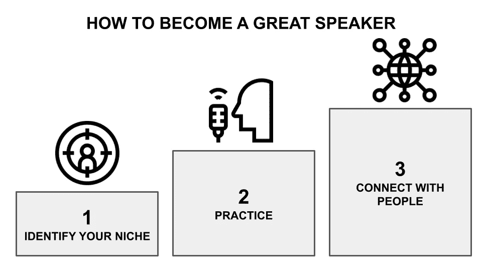
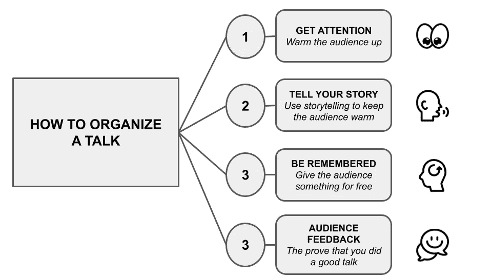
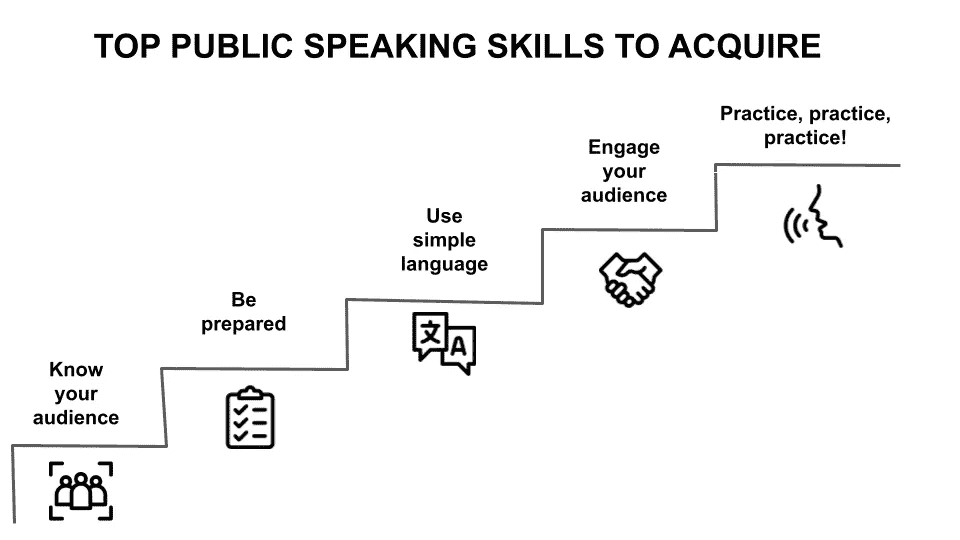

# 数据科学职业公开演讲的要点

> 原文：<https://towardsdatascience.com/the-essentials-of-public-speaking-for-a-career-in-data-science-b0d8ea6402ec>

## 数据科学

## 关于如何提高你作为数据科学家的公开演讲技巧的一些建议

凯恩·莱因霍尔德森在 [Unsplash](https://unsplash.com?utm_source=medium&utm_medium=referral) 上的照片

数据科学是一个相对较新的领域，公众演讲对于任何想在这个领域发展的人来说都是一项基本技能。清晰有效地交流复杂数据概念的能力对于数据科学的成功至关重要。

如果你是数据驱动型的，并且希望促进你在科学领域的职业发展，公开演讲是获得关注的一个很好的方式。但是你具体是怎么做的呢？我们已经掌握了数据科学公开演讲的基本要素，因此您可以在下一次会议上引起轰动。

这篇文章的内容受到了 DataTalks 的播客插曲的启发。与 DataRobot 首席人工智能策略师本·泰勒一起参加了名为[数据科学职业公开演讲要点](https://datatalks.club/podcast/s02e10-public-speaking.html)的俱乐部。

文章组织如下:

*   建立你的心态
*   入门指南
*   组织一次谈话
*   需要掌握的顶级公共演讲技巧

# 建立你的心态

有许多不同的方式参与数据科学，但最重要的方式之一是**推广人工智能，这涉及到试图说服你，你的公司需要人工智能**。

作为一名数据科学家，你有机会成为推动人工智能及其改变世界的潜力的强大声音。这意味着你有责任教育其他人什么是人工智能，以及它如何被用来做好事。你可以通过写博客、发表演讲，甚至只是和有兴趣了解更多的人交谈来做到这一点。

无论你使用什么平台，你的目标应该是提供关于人工智能及其潜在影响的准确信息。尊重不同的观点并开放讨论也很重要。毕竟，数据科学仍然是一个年轻的领域，我们对它的潜力还有很多不了解的地方。

通过参与促进人工智能，你可以帮助塑造这个令人兴奋的领域的未来，并确保它用于造福所有人。

# 入门指南

要成为一名伟大的演说家，你能做的最重要的事情就是练习，练习，再练习。你在观众面前站得越多，你说话就越自如。此外，在每次演讲前做好充分准备也很重要。对你的材料了如指掌，这样你就可以专注于传达你的信息，而不是担心你接下来要说什么。最后，记住自信是关键。散发自信，你的听众会相信你和你的信息。

更详细地说，要成为一名伟大的演说家，你应该遵循以下步骤:

*   **确定你的定位**。你对数据科学的什么感兴趣？你是哪方面的专家？一旦你知道你的重点，开始在会议上推销你的想法。保持你的演讲简短而甜蜜——你不想用太多的信息淹没组织者。
*   **练习**。你对你的材料越放心，你就越能吸引你的观众。如果可能的话，录下你自己的演讲并回放——这将有助于你发现任何需要改进的地方。
*   **与人交往**。你越真诚、越热情，就越有可能给你的听众留下持久的印象。所以，走出去，向世界展示数据科学是什么！

作者图片

此外，你应该非常注意观众的反馈，因为这是一个参考点。你需要在演讲结束后和听众商量，找出答案。你不会让每个人都开心的。总会有一些人不喜欢这个演讲，或者他们会受到一些批评。

# 组织一次谈话

组织演讲最成功的方法之一就是把它变成一个故事。你可以通过关注以下几个方面来做到这一点:

*   获得关注
*   被记住
*   观众反馈

下图总结了如何组织讲座:

作者图片

## 获得关注

在做陈述或演讲时，引言通常是最重要的部分。这是你留下良好第一印象的机会，并为你接下来的谈话定下基调。

> 当你开始一个演讲时，你吸引了所有听众的注意力，但他们会很快决定是拿出手机、笔记本电脑，还是放弃。
> 
> 本·泰勒

造成差异的最重要的事情之一是第一印象。有不同的方法可以吸引观众的注意力，包括但不限于:

*   讲故事
*   幽默
*   个人故事
*   轶事
*   令人惊讶的事情

按照本·泰勒的说法，*你应该* ***给他们一个听你话的理由*** *。一个更好的方法，也是非常困难的，是跳到一个故事中，让观众断定你是那个故事的英雄。这允许你征服观众的情绪。*

在构思你的介绍时，有一些关键的事情要记住:

1.  **言简意赅**。你最不想做的事情就是用冗长的介绍让你的听众厌烦。抓住要点，让他们体验一下接下来会发生什么。
2.  **自信**。在大型演讲前感到紧张是完全正常的，但不要表现出来。慢慢地、有意识地说，对你的声音和肢体语言表现出自信。
3.  **一开始就钩住它们**。砰的一声开始！讲一个笑话，分享一个有趣的事实，或者问一个修辞性的问题，从一开始就吸引你的听众。
4.  **设置舞台**。就你演讲的主题提供一些简短的背景信息，这样每个人都能理解。
5.  **戏弄即将到来的事情**。让你的观众先睹为快，激发他们的兴趣。

## 被记住

当你做演讲时，你希望别人记住你的好想法和深刻见解，而不是你紧张不安的坐立不安或“嗯”。这里有一些小技巧可以帮你留下持久的印象。

1.  眼神交流:这听起来很简单，但是和你的观众进行眼神交流是和他们建立联系的最好方式之一。
2.  使用肢体语言:你的肢体语言应该传达自信和放松。避免交叉双臂或双腿，尽量保持双手放松。
3.  说话清晰:一定要吐字清晰，语速适中。这将有助于确保你的听众理解你，并且不会迷失在试图理解你所说的话中。
4.  微笑:真诚的微笑会让你看起来平易近人，讨人喜欢——这两种品质会让你的演讲更加成功。
5.  做好准备:增强自信的最好方法之一就是为你的演讲做好充分准备。对你的材料了如指掌，这样你就可以专注于有效地传递它，而不是担心接下来会发生什么。

## 观众反馈

如果观众中有人问你一个问题，这意味着你的演示是成功的。但是，可能会出现你不知道某个问题的答案的情况。在这种情况下，本·泰勒建议不要试图回答，相反，你可以说，“观众中还有人知道答案吗？”或者“我们以后再谈这个。我很想听听你的观点。”然后继续下一个你能回答的问题。

# 为会议撰写演讲提案

在大型会议上发言之前，你应该从地方会议开始，在那里你可能知道组织者。有时，当你提交一个会议的演讲提议时，你还必须包括一个之前演讲的短片。如果你没有以前的视频，你可以考虑录制一个，并在 YouTube 或类似的网站上发布。

根据本·泰勒的观点，你的演讲应该尽可能有创意。

此外，还应包括:

*   对你演讲的简要描述
*   将涉及的主要主题或话题
*   为什么你认为这很适合这个会议？
*   您拥有的任何支持材料(例如幻灯片、演示等。)

写一份强有力的提议对让你的演讲被接受是至关重要的。花点时间回顾一下大会的提案征集，确保你的提案符合大会的主题和目标。如果您有任何问题，请随时联系会议组织者。

通常有许多不同的主题可供选择，所以选择一个既有知识性又有吸引力的主题很重要。以下是一些开始谈话的好话题:

*   数据科学的现状及其发展方向
*   数据科学在当今世界的重要性
*   数据科学如何用于解决现实世界的问题
*   有趣的案例研究或数据科学应用示例
*   您个人对数据科学的体验

# 需要掌握的顶级公共演讲技巧

在寻找数据科学职业时，有很多重要的技能需要掌握，但公开演讲绝对是最重要的技能之一。在这个领域，能够有效地交流你的发现和见解是至关重要的，这需要练习来磨练这一技能。以下是一些帮助你开始的提示:

*   **了解你的观众**。让你的信息适合那些将会聆听的人是很重要的。考虑他们的理解水平，以及你想让他们从你的演讲中学到什么。
*   **做好准备**。这似乎是显而易见的，但它值得重复。确保你对你的材料了如指掌，这样你才能自信而优雅地发表演讲。
*   **使用简单的语言**。数据可能很复杂，但你的演示不需要如此。使用每个人都能理解的清晰简洁的语言。
*   **吸引观众**。通过使用故事、例子和幽默(在适当的时候)来吸引你的听众。没有人想听一个无聊的讲座，所以确保你让事情保持有趣！
*   **练习，练习，练习！你练习得越多，你在公众演讲方面就会变得越好。**

作者图片

# 摘要

恭喜你！您刚刚学习了数据科学职业公开演讲的基本知识！

公开演讲对于数据科学领域的任何人来说都是一项基本技能。数据科学家经常被要求向客户、经理和其他利益相关者展示他们的发现。能够做一个清晰简洁的演讲，对于你的听众是否理解和接受你的作品来说，是至关重要的。如果你想在数据科学领域提升自己的职业生涯，那就从磨练公开演讲技能开始吧。

这篇文章的内容受到播客插曲[的启发，本·泰勒在 DataTalks.Club 发表了《数据科学职业公开演讲的要点](https://datatalks.club/podcast/s02e10-public-speaking.html)

*本文的第一个版本最初发布在* [*DataTalks 上。俱乐部*](https://datatalks.club/blog/essentials-of-public-speaking-for-career-in-data-science.html) *。*

# 您可能也对…感兴趣

## [如何在数据科学领域开始职业生涯](/starting-a-career-as-a-data-scientist-57b3406a5390)

虽然数据科学家的工作可能因行业而异，但他们的职责通常分为三类:A 类、B 类和 c 类。在本文中，我们将探讨数据科学家应该关注的三个主要领域。

## [数据科学经理和数据科学专家的区别](/data-science-manager-vs-data-science-expert-2784d3740a75)

在本文中，我们将探讨每个选项的优缺点，以帮助您为您的组织做出决策。

## [如何建立数据科学团队](/building-a-data-science-team-d03f854e63b4)

建立一个数据团队可能是一个挑战，但通过仔细的规划和执行，这肯定是可行的。在本文中，我们将探讨如何建立一个高效的数据科学团队的一些技巧。

# 有趣的书…

*   金德拉大厅——经久不衰的故事:*讲故事如何吸引顾客，影响观众，并改变你的业务*
*   Al Ramadan，Dave Peterson，Christopher 洛希黑德，Kevin Maney — *玩得更大:反叛者和创新者如何创造新的类别并主宰市场*