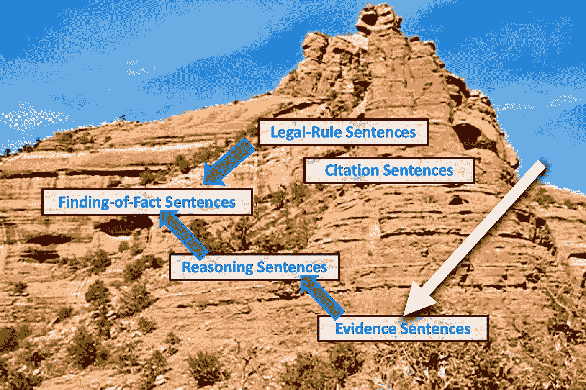
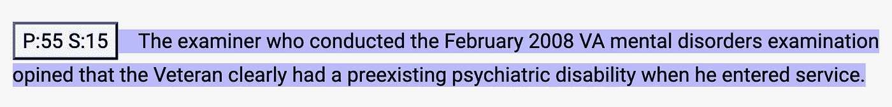
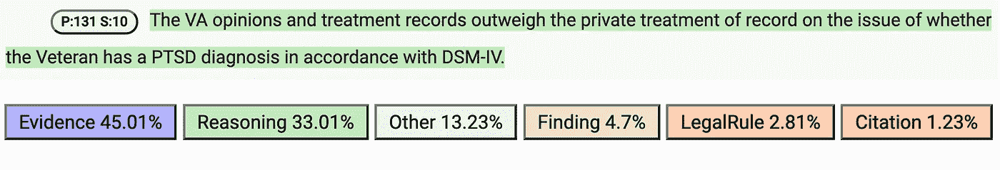
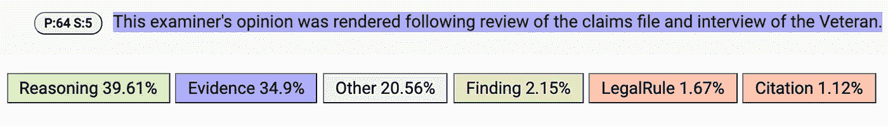

# 这些证据对于法律案件的分类至关重要

> 原文：<https://towardsdatascience.com/the-evidence-is-critical-for-classifying-legal-cases-36c1dd6cfd04>

## 识别证据以挖掘法律推理

图片由 Vern R. Walker 拍摄， [CC 由 4.0](https://creativecommons.org/licenses/by/4.0/) 拍摄。

在任何法律案件中，是证据使案件变得独一无二。同样的证据也决定了哪些其他案件可以被认为是“类似”的案件——而法治要求类似的案件应该得到类似的判决。因此，一个案件中的证据是特定的，但证据的类型往往是通用的，归类为类似的案件。

当事人的律师面对要证明的法律问题，必须决定出示什么证据。他们从以前的类似案例和相关法律规则中寻找指导。为了帮助律师和法官，以及出于其他原因，数据科学家面临着从已公布的案件判决中提取被认为相关和重要的证据的问题。

在这篇文章中，我讨论了什么是法律证据及其在法律推理和辩论中的作用。我还讨论了使机器学习(ML)算法能够从法律判决文件中自动提取重要证据的语言特征。

## 法律证据的作用和类型

在一个典型的法律案件中，原告一方有举证责任来支持有利于该方的判决。反对方试图破坏证据的可信性或可信度，他们可能会提出更多相反或不一致的证据。反对者也可能提出证据来支持任何提出新的法律问题的肯定性法律辩护。因此，证据可能来自法律案件的各个方面。

**证据**可以包括证词、文件和物证。证人证言是由证人宣誓后就其所见所闻提供证词，或者由专家证人根据证人的专业知识提供意见。书面证据可以来自各种来源，如医疗或业务记录。物证，如实物，也可以作为证据引入。

一旦法庭裁定所提供的证据与案件相关并可被采纳，律师们就会就被采纳的证据证明的法律问题提出论据。法庭的事实审判者(如陪审团、法官或行政决策者)必须评估该证据的证明价值并得出事实结论。例如，事实的审判者可能不相信证人证词的可信度，或者可能认为某一特定文件的内容是可信的。事实审判者还评估所有证据的证明价值，并就法律问题得出[事实结论](/conclusions-as-anchors-for-mining-legal-reasoning-6f837fb8da3c)。

## 陈述证据的句子

由法庭写下的判决是挖掘证据的良好开端。它通常列举所涉及的重要证据，并且还解释(除非事实的审判者是陪审团)从证据到事实发现的推理。律师和其他研究该决定的人想要确定哪个证据被用来得出哪个发现或结论。根据法律问题，该决定可以生成一个提示性列表，列出在类似案件中需要提供的证据。此外，数据科学家可能会根据证据生成各种类型的法律案件的统计数据。

在法律判决文件中，**证据句**是主要陈述证人证词或作为证据提出的文件的内容，或者中立地描述证据的句子。证据句子的例子如下(如在由[学徒系统公司](https://apprenticesystems.azurewebsites.net/index.html)开发的网络应用中所显示的，蓝色背景颜色表示证据句子，矩形图标表示该句子出现在文档的第 55 段，句子 15 中):

图像由弗恩 r .沃克， [CC 由 4.0](https://creativecommons.org/licenses/by/4.0/) 。

这句话报告了一个法医的看法。(我的例子来自[退伍军人上诉委员会](https://www.bva.va.gov/) (BVA)的裁决，该委员会裁决美国退伍军人因服役相关残疾而提出的福利索赔。)

理想情况下，证据句只是报告证据，而不是评估证据。报告和评估之间的这种区别允许我们将证据本身与特定的事实审查员对其证明价值的评估分开。然而，这种区分有时很难适用于整个判决，因为法官可能会将证据报告和对证据的评估合并成一个句子。尽管如此，法官们还是有动机去写那些首先以中立的方式展示重要证据的判决。因此，我们经常能够识别出主要陈述重要证据而没有对其进行评估的句子。

## 证据句的语言特征

为了识别判决中的证据句，律师使用各种语言线索或特征。通常，句子包含一个提示(一个单词或短语),保证读者将某个命题归因于证据来源。证据归属线索的例子有:“*证人作证说*、“*以专家证人的观点*、“*在他的报告中，检查医生记下了*”如果被归因的内容被标点为引语，则这样的句子成为证据句的可能性增加。

其他语言特征包括句子是否:

紧接在证据记录(例如，听证笔录)中对来源的引用之前或包含在其中；

只包含确定的主语，指特定的人、地点或事物(与关于不确定主语的法律规则相反)；

不包含全称量词(如“*全部*或“*任何*”)；或者

不包含表示义务、允许或禁止的道义性词语或短语(例如，“*必须*”或“*要求*”)。

其他特征包括出现在专门叙述证据的段落中。因此，各种各样的语言信号可以表明一个句子正在陈述证据。(更多细节和众多例子，可以查看我在担任[霍夫斯特拉定律的定律、逻辑&技术研究实验室(LLT 实验室)](https://www.lltlab.org/) *主任时创作并发表的[注释证据语句的协议](https://github.com/LLTLab/VetClaims-JSON/blob/master/LLT%20Annotation%20Protocols/LLT%20Annotation%20Protocol%20-%20EvidenceSentence%20Type%20-%20Github.pdf) *、*。)*

## 机器学习结果

正如我们可能期望的那样，给定证据句子的语言特征，ML 算法可以学习识别那些主要陈述证据的句子。[我们在 LLT 实验室的 50 个 BVA 判决的数据集上训练了一个逻辑回归模型](http://ceur-ws.org/Vol-2385/paper1.pdf)，该数据集包含预处理后的 5797 个人工标记的句子，其中 2419 个是证据句子。该模型对证据句的分类精度为 0.87，召回率为 0.94。我们后来在同一个 BVA 数据集上训练了一个神经网络(NN)模型，并在 1846 个人工标记的句子上进行测试。证据句的模型精度为 0.88，召回率为 0.95。

[我们最近进行的一项研究表明](https://arxiv.org/abs/2201.06653)在对更少的标记数据进行训练后，ML 算法可能能够准确地识别证据句子。使用 LLT 实验室的 50 个 BVA 决策的数据集，我们分析了增加训练集规模的影响，从少到一个案例决策到 40 个决策(总共 50 个决策中的 10 个被留作测试集)。使用加权平均 F1 分数作为性能指标，我们发现，在仅仅 5 次决策后，证据句子的训练就获得了远高于 0.8 的 F1 分数，并且分数在此后不久就达到了平台期。我们假设，证据句作为一个类别彼此之间的“语义同质性”可能有助于解释这一结果。

也有理由认为，一旦证据句子被识别，ML 算法可以从中提取关于案件证据的重要信息。上面讨论的[语言线索表明，归因理论可以帮助我们](https://sites.hofstra.edu/vern-walker/wp-content/uploads/sites/69/2019/12/WalkerEtAl-AttributionAndLegalDiscourseModels-ASAIL2015.pdf)提取证据来源的列表，然后我们可以对其进行分类。我们也可以提取一系列在法律记录中至少有一些证据的主张。

## 实际误差分析

在我上面提到的第一个 ML 实验中，NN 模型预测了 740 个句子是证据句。其中 89 个是误分类，这些错误中约三分之二(60 句)由**误分类推理句为证据句**组成。当你考虑到许多推理句子是关于评估证据项目的可信度或可信度时，这是可以理解的。例如，经过训练的 NN 模型将下面的句子错误分类为证据句，而实际上它是推理句(如绿色背景色所示):

图像由弗恩 r .沃克， [CC 由 4.0](https://creativecommons.org/licenses/by/4.0/) 。

这句话提到了证据，但它这样做是为了解释法庭的推理，即退伍军人管理局的证据的证明价值大于私人治疗证据的证明价值。对可能的句子角色的预测分数(显示在来自法律学徒 web 应用程序的该屏幕截图中的句子文本下方)显示，NN 模型预测这是一个证据句子(分数= 45.01%)，尽管推理句子也获得了相对较高的分数(33.01%)。

NN 模型偶尔也会**将证据句误分类为推理句**。在 686 个人工标记的证据句子中，该模型将 24 个错误分类为推理句子。例如，训练好的模型预测以下证据句子(手动标记，用蓝色突出显示)是推理句子:

图片由 Vern R. Walker， [CC BY 4.0](https://creativecommons.org/licenses/by/4.0/) 。

虽然这句话只是陈述了审查员的专家意见的基础，但 NN 模型将这句话归类为陈述了法庭本身的推理。该模型的预测得分表明，混淆是一个死里逃生:推理句(39.61%)对证据句(34.9%)。

实际上，对于某些用例，0.88 的精度和 0.95 的召回率就足够了。这样一个模型可以从相似的案例中提取并呈现出大量可接受的证据，而且噪音很小。如果主要的混淆发生在证据句和关于证据的推理句之间，那就更是如此。这种应用程序的用户可能仍然认为这种查询结果对于在以后的情况中引导争论是有信息的。

另一方面，如果目标是收集有关已决案件中所依赖的证据类型的统计数据，或衡量事实认定中的偏差程度，这样的错误率可能是不可接受的。采样理论需要计算频率估计值的置信区间，这种测量不确定性可能是不可接受的。

## 摘要

总之，在书面法律判决中有许多理由来识别证据句，特别是[如果目标是挖掘在类似案件中发现的法律推理](/7-challenges-for-argument-mining-in-law-fb98a6df7b0c)。证据句有助于识别可能与新案件相似的过去的判决。此类判决还能确定哪些证据在类似案件中发挥了重要作用，并有助于指导未来案件中的证据出示。有理论和实验基础可以得出结论，ML 算法可以学习(A)自动识别那些主要陈述证据的句子，以及(B)从那些句子中自动提取关于该证据的一些重要信息。因此，证据判决是对法律案件进行分类的重要关键。