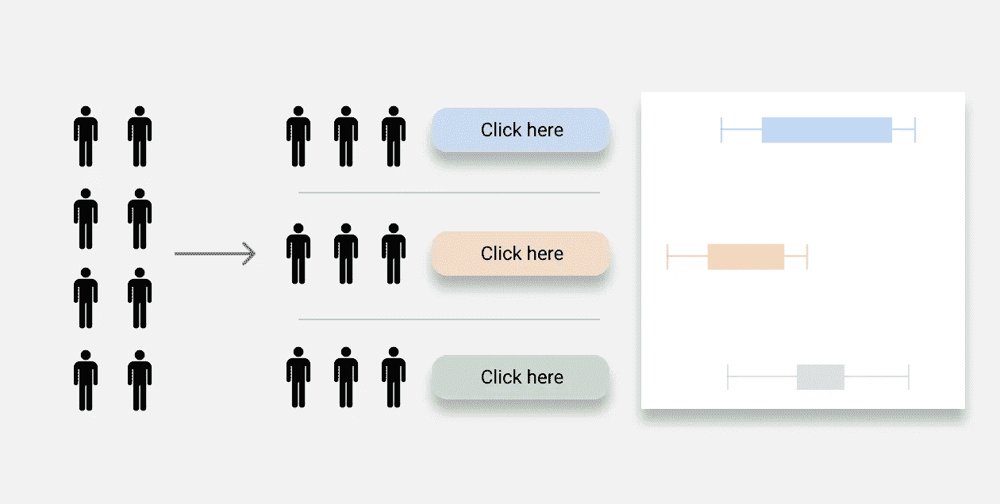
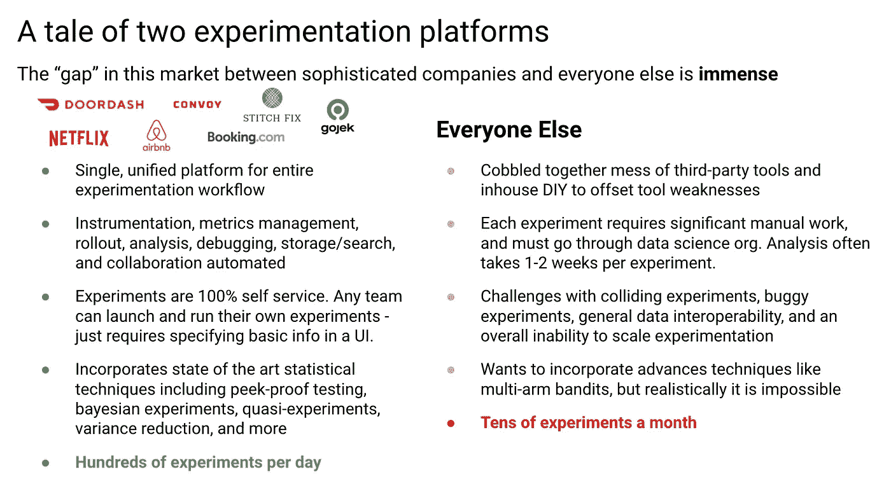
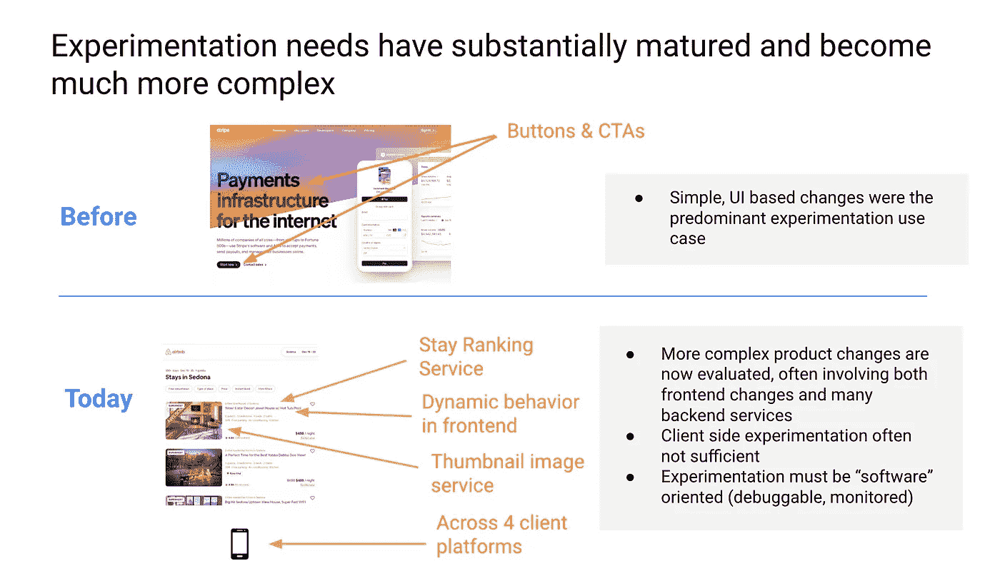
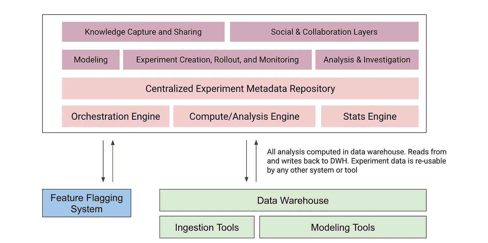
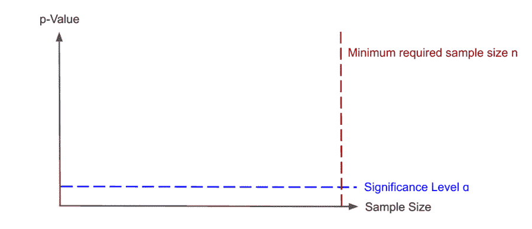
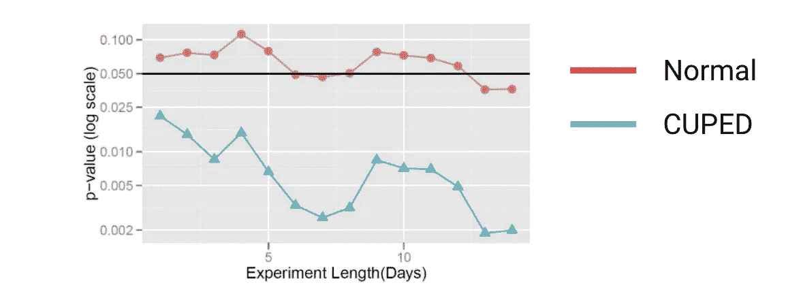

# 实验差距

> 原文：<https://towardsdatascience.com/the-experimentation-gap-3f5d374d354c>

## 统计决策是如何演变的，然而大多数公司并没有跟上

作者图片

过去 20 年，在线可控实验已经成为许多最成功的科技公司开发产品的方式中日益核心的一部分。像 Airbnb、Booking.com、微软、谷歌、网飞、Doordash 和 Stitch Fix 这样的公司每年运行[数万次实验](https://www.reforge.com/brief/airbnb-growth-principles-for-effective-experimentation#I5AU3sKz0emcsneiPu6EbQ)，因此能够严格量化他们推出的大多数想法和功能的影响。在许多情况下，即使是简单的实验也会产生深远的影响——[Bing 曾经因为一名工程师进行的一项简单地重新调整广告标题布局的实验而将其年度广告收入提高了 12%](https://hbr.org/2017/09/the-surprising-power-of-online-experiments)。更广泛地说，即使每个实验的影响更小，一年成千上万个小的积极变化的复合效应最终会产生更好的产品。

然而，这些从实验中获得巨大成功的故事掩盖了一个不幸的事实:**尽管尽了最大努力，大多数公司仍然无法真正实现接近上述公司的实验项目**。虽然像[experimental Works](https://www.amazon.com/Experimentation-Works-Surprising-Business-Experiments/dp/163369710X/ref=asc_df_163369710X/?tag=hyprod-20&linkCode=df0&hvadid=421832517736&hvpos=&hvnetw=g&hvrand=12524893754528613212&hvpone=&hvptwo=&hvqmt=&hvdev=c&hvdvcmdl=&hvlocint=&hvlocphy=9031967&hvtargid=pla-877557038302&psc=1&tag=&ref=&adgrpid=101123916470&hvpone=&hvptwo=&hvadid=421832517736&hvpos=&hvnetw=g&hvrand=12524893754528613212&hvqmt=&hvdev=c&hvdvcmdl=&hvlocint=&hvlocphy=9031967&hvtargid=pla-877557038302)这样的书支持这样一个世界，即大多数硅谷科技初创公司已经成功建立了一种根深蒂固的实验文化，但对大多数人来说，实验的现实截然不同。首先，这是一个现实，其特点是手动工作、瓶颈流程、老派统计技术、劣质工具、文化挑战，以及通常一个月只能运行几个实验。

同类最佳对比普通实验平台。左边的公司列表是说明性的，不是全面的。图片作者。

这种“实验差距”是我在所有数据基础设施中看到的“先进”公司和“普通”公司之间最明显的鸿沟之一。在与近 50 个参与实验的团队(从最复杂的到最基础的)交谈，以及通读了[关于实验平台](https://github.com/DavisTrey/ExperimentationResources)的大部分公开内容后，我想分享一些我的观点，说明为什么会出现这种情况，以及公司可以做些什么来避免这种情况。

# **在线受控实验简史**

为了理解我们是如何走到这一步的，首先理解实验作为一种实践的历史是很有用的。

许多早期的 A/B 测试是由推广这一概念的公司进行的，比如谷歌，本质上非常简单。[谷歌最著名的早期实验之一是在搜索结果中的一个链接上测试 40 种深浅不同的蓝色——其结果是一年多了 2 亿美元的广告收入](https://bharathbalasubramanian.medium.com/data-driven-decisions-googles-50-shades-of-blue-experiment-996f01819a97)。这个例子代表了许多早期实验的样子——它们是简单的客户端优化，如颜色、字体和网站上的副本。

像 Optimizely 这样的早期实验工具就是为适应这个世界而设计的。营销人员是核心用户，并优化地允许他们以自助方式对静态页面进行简单的客户端更改，这种方式与软件开发生命周期完全不同。鉴于当时缺乏广泛可用的数据工具和开发人员基础设施，这种工具必须是完整的，并处理从特征标记和统计分配到计算管道的一切。

从那以后，很多事情都变了。首先，数据基础设施已经有了显著的发展，并且已经围绕现代云数据仓库和数据湖进行了整合。针对功能标记、工具和日志记录、数据转换和计算的同类最佳解决方案已经出现，所有这些解决方案都旨在读取和写入这个集中式云数据存储。与这个工具链的本机集成现在是必不可少的。

作者图片

第二，实验需求已经基本成熟，变得更加复杂。实验更有可能与核心产品体验而不是静态登录页面相关联，并且经常涉及跨多个服务一次协调许多变化——给定的实验可能涉及改变动态前端行为、后端搜索服务和后端排名服务，并且这必须跨 3-4 个不同的平台一次完成。仅仅客户端的改变通常是不够的，更重要的是实验是可监控的、可调试的，并且深入集成到工程栈中。许多公司想要运行的原始实验量也增加了实验冲突的可能性，这需要进一步小心以避免。

作者图片

第三，与在线实验相关的人物角色发生了变化。与复杂数据工具的兴起同时出现的是数据专业人员——数据科学家、数据工程师和分析工程师。与此相关，实验已经从某种程度上的利基营销工具变成了现代产品团队的核心武器——实验被视为一种竞争优势，事实上是大多数现代增长项目课程的核心部分。这意味着实验需要成为产品发布过程的一个系统化的部分，并且紧密地融入到这些人物角色使用的工具和系统中，而不是在一个孤立的泡泡中到处做一件特别的事情。

不幸的是，虽然世界已经发生了很大的变化，但是这个领域的工具却没有跟上时代的步伐。以下引用的一位数据科学领导者的话代表了我从数十个试图建立自己的实验实践的团队那里听到的普遍经验:

*“我们最初购买 Optimizely，认为它可以解决我们所有的实验问题。然而，随着时间的推移，我们意识到它有许多问题——它不适合数据仓库架构，它本质上只是一个标记和分配工具，而且它是一个非常难以诊断内部问题的黑匣子。*

*我们最终使用 Optimizely 只是为了赋值和标记。我们设置定制的 ETL 作业来摄取标签，将它们与点击流数据结合，将其存储在 S3 中，使用 PySpark 运行 ETL，然后使用 Redash SQL 查询来进行分析。如今的分析完全是手动的，我们在实验管理方面仍然有很多问题。* ***我们现在正在构建一个完整的内部实验平台*** *。”*

团队最终每年要支付 4 万多美元来购买实验工具，这些工具最多只能用于统计任务，而且为了得到几乎不起作用的东西，必须在上面添加一些修补程序。工具之间粗糙的接口导致它们很难一起工作。实验的监控、记录或可调试性很少，甚至没有，并且实验经常相互冲突。每个实验都需要大量的定制工作，包括度量建模、设计和分析。一系列创可贴 ETL 管道使数据流入和流出不是围绕数据仓库设计的工具。最后，总体的实验过程没有应用软件工程的原则(例如，评审、版本控制、受控展示等)。Zulily 的这段视频很好地诠释了这段旅程。缺乏对如何建立真正的“实验文化”的理解和认识通常会大大加剧这些工具问题。

这些挑战的结果是，大多数公司经历了建立实验计划的第一年或第二年，最终每个月不超过 1-5 次实验，数据科学团队成为一个巨大的瓶颈，因为所有实验设计(例如计算运行时间和功耗、指标建模)和实验执行(展示、监控、分析、报告)都必须经过它们。尽管尽了最大努力，这种建立实验实践的最初尝试经常以失败告终。

简而言之，你不能用为不同时代设计的工具和系统来创建一个现代实验项目。事实上，大多数现代团队在经历了上面的旅程后意识到，满足他们需求的唯一解决方案——他们想要运行的实验的复杂性、他们想要运行实验的角色、他们需要集成的工具和堆栈——是在内部构建他们自己的平台。但是，我们将从对有效完成这一任务的公司的研究中发现，构建一个合适的实验平台的范围可能比许多公司预期的要大 10-50 倍，并且包含许多非直观的组件。

## **现代实验平台的结构**

如果你研究网飞、Faire、Doordash、Airbnb、Booking、Stitch Fix、Yelp、谷歌和微软等公司所做的工作，你会发现已经实现规模化自助服务实验的平台几乎总是坚持一些核心原则。

首先，端到端自动化至关重要。如果实验工作流程的任何步骤都需要手动工作，从功率计算到指标建模再到分析，那么实验自然会成为数据科学或数据基础架构中少数关键人员的瓶颈。

其次，自助服务工作流与基础架构同样重要。如果没有产品经理、工程师或设计师可以用来创建、展示、监控和管理实验的简单用户体验，实验将不会成为更广泛的组织将采用的工具。[这种工作流程对实验中的许多统计概念进行抽象和简化，以使实验变得容易进行，这一点至关重要](https://booking.ai/leaky-abstractions-in-online-experimentation-platforms-ae4cf05013f9)。

第三，在实验的“DevOps”方面的重大投资——这包括诸如监控、可调试性、关于所有正在进行的实验的丰富的可搜索元数据、实验周围的护栏等等。如果您试图在一个没有这些组件的公司内创建广泛采用的实验，您将被冲突的实验、不正确配置的(因此是错误的)实验、破碎的用户体验和许多其他问题所困扰。负责实验平台的中心团队必须能够跟踪、理解和验证正在发生的事情。

第四，社交和协作功能至关重要。这可能是实验平台最被低估的方面，然而根据我的经验，它一直被做过实验的公司评为让实验正确的最*重要的*方面之一。

> Booking.com 做的最有用的事情是找到了让非专家进行实验和理解统计思维的方法。这在很大程度上归结为设计产品是“优化+ Reddit”。与实验相关的社交功能——评论、“@”功能、线程、链接到实验结果以便任何人都可以看到，等等——绝对是他们平台最有价值的方面之一。
> 
> *首先，这教会人们如何讨论和谈论实验——组织熟悉实验的“语言”,以及如何在实验的背景下谈论产品/功能发布。*
> 
> *其次，它允许透明、反馈和“边做边学”。很多人最初会创建非常糟糕的实验——糟糕的设置，糟糕的推理，等等。但是，关键是让这种情况发生，然后允许公司中的任何人提供反馈。这是一种比“上课”或“培训”更有效的教学方式——人们通过实践来学习。结果是公司里的每个人在适当的实验设计方面不断变得越来越好。*
> 
> 第三，它强制问责。如果你想在一些电子邮件、闲散讨论或任何其他上下文中引用一个实验作为推出一个功能的理由，你必须引用它，任何人都可以看到关于该实验的所有细节。这迫使学术诚实和严谨，并在实验决策中创造了更多的信任。如果你的实验不合法，人们会知道的。"
> 
> 【Booking.com】前实验主任卢卡斯·维米尔

这些原则通常会转化为实验平台，这些实验平台具有**以下所有**组件:

1.  **自助式实验创建** —允许个人定义、配置、启动和跟踪实验的自助式用户界面。
2.  **统计分配** —根据正确的维度集分配实验组的服务。这通常是位于实验元数据存储之上的全局 API，所有服务都可以调用它，提供输入维度(例如，用户 id、区域等)和它们需要的对象，并获得指定它们应该公开的变体/处理的响应。根据成熟度，这里需要各种统计包来支持不同类型的随机化和分配。
3.  **度量建模** —允许对实验分析中常用的所有核心度量进行建模的工具。这包括关键目标指标(例如点击率、转化率、参与度)、健康指标(例如延迟、支持票)和“发现”指标(即帮助您识别用户行为中意外关系的二级指标)。
4.  **数据管道化和流程编排** —必须存在计算管道，能够自动接收任务数据和用户操作，潜在地利用二级资源丰富这些数据，然后自动计算与本实验相关的所有指标。还需要数据管道来自动分析实验元数据(例如，我在我的实验组中看到了正确的 50/50 比例吗？)以及统计方面的实验(如运行时、功率)。
5.  **监控和调试—** 监控实验元数据并识别异常或意外结果(例如，缺失数据、不均匀的实验分割、异常结果、显示奇怪行为的 A/A 测试)的系统。经常需要健壮的日志记录基础设施来实时测量、查询和分析这些数据。与此相关，通常需要丰富的调试经验来诊断实验，并允许快速识别给定用户正在进行的实验(这对客户支持至关重要)。
6.  **调度、展示和实验管理** —一个允许围绕实验的调度和展示的丰富逻辑的系统(例如，增量展示、回滚、由于错误而重新启动)。逻辑也必须到位，以帮助避免实验冲突，并确保在平行实验的数量和任何给定实验达到统计显著性所需的时间之间有正确的平衡。通常需要一个 UI 来查看和管理整个实验日程。
7.  **实验审查和监督**—分散的实验仍然需要监督，特别是因为公司内的大多数人不一定具备完美运行实验的统计知识。因此，许多公司需要围绕实验审查流程的某种程度的自动化，以及确保实验始终符合特定标准的防护栏(例如，每次实验都必须计算特定的健康指标)。
8.  **调查引擎**需要一些工作流程来允许在实验结果之上的这种“切片和切块”的研究经验。
9.  **知识获取和报告** —必须存在一个任何人都可以搜索的实时实验库。完整的实验结构、历史和结果需要是可用的。实验必须是可链接的，这样它们才能在一个组织内被广泛共享，并为将来的决策提供参考。

现代数据堆栈中的关键实验平台组件。您可以在此找到实验平台架构的其他示例[。图片作者。](https://github.com/DavisTrey/ExperimentationResources/blob/main/README.md#experimentation-platforms)

建造这一切是一个沉重的负担。然而，忽略这些组件中的任何一个——尤其是将实验仅仅视为基础设施和特性标记问题——将会极大地限制您分散实验的能力，从而限制实验的规模。好消息是，现代开发人员工具可以让您的生活变得更加轻松；围绕数据仓库构建，以 launch crystally 等标记工具和现代数据堆栈的其余部分(Airbyte、Fivetran 等)为特色，您可以加快这方面的工作。

# 高级统计技术

统计引擎是这个堆栈中的一个特殊组件，值得进一步讨论。与统计决策相关的研究和最佳实践在过去十年中发生了巨大的变化，许多领先的实验平台都投入了大量资金开发先进的统计技术，这些技术远远超出了基本的 A/B 测试。

一方面，如果您仍然处于试验平台之旅的早期，我会鼓励您不要过于担心这些新兴技术——通过专注于基本的、固定范围的、频繁的 A/B 测试，以及围绕它构建的正确的自动化和工作流，您可以走得非常远。另一方面，我知道许多公司，包括一些初创公司，已经看到了更先进的实验方法所产生的巨大价值。因此，我想强调一些潜在的高影响力的统计方法，一旦你有了实验平台的基础，这些方法可能是值得投资的。

## 顺序测试和峰值验证分析

经典的实验测试统计基于对固定样本大小(N)的承诺，然后仅在收集了固定样本大小数量的数据后做出实验决策。这确保了显著性值实际上映射到假阳性的概率。

不幸的是，在一个可以立即看到实验中收集的数据的世界中，这种约束很难遵守。因此，许多从业者成为“偷看”的受害者，在达到适当的样本量之前，实验结果被错误地调用。

“偷看”该结果的用户可能(错误地)认为在达到所需的最小样本量之前该结果是有意义的。[这篇文章深入探讨了这背后的直觉(图片由丹尼斯·迈斯纳拍摄)](/unlocking-peeking-in-ab-tests-7847b9c2f6bb)

为了解决这个问题，[已经对“顺序测试”范例](http://library.usc.edu.ph/ACM/KKD%202017/pdfs/p1517.pdf)进行了研究，这些范例会产生始终有效的 p 值——本质上，显著性阈值变成了一个与迄今收集的数据量相关联的动态值。这使得产品团队能够就是否以及何时提前进行实验做出更有效的决策，这对于由于样本大小/能力问题而限制实验数量的公司尤其有用。

## 分配策略

一个理想的实验包括完全随机化，这样处理组之间唯一的总体差异是实验条件。虽然在许多情况下可以通过简单的策略实现这一点，例如针对 user-id 的随机分配，但在许多情况下并不容易。

比如 [Doordash 不能随机给司机分配不同的匹配算法，因为一个地区的司机 A 是否匹配到订单 B 会影响该地区其他司机匹配到什么订单](https://doordash.engineering/2019/02/20/experiment-rigor-for-switchback-experiment-analysis/)。这种用户之间实验处理的非独立性在有物理操作或紧密网络效应的企业中非常普遍，并且经常需要替代的实验结构。一种这样的结构包括利用“转回”实验，其中随机化在区域+时间的基础上发生。这需要利用各种误差校正技术，如[群集稳健标准误差](https://doordash.engineering/2019/09/11/cluster-robust-standard-error-in-switchback-experiments/)或[德尔塔法](https://en.wikipedia.org/wiki/Delta_method)。

除了支持非用户级别的随机化，许多公司还投资于更细致的分配策略。例如，网飞的实验平台天生就能区分新用户和现有用户，他们可以独立地在这些人群中进行几乎所有的实验。许多其他公司投入工程努力来运行随机实验，不是针对所有用户，而是只针对被测试功能的活跃用户。

最后，与用户跟踪相关的复杂性也需要更高级的分配策略。许多 web 应用程序支持处于登录和注销状态的用户，并通过登录和 cookie 跟踪客户端。在这种情况下，你需要非常小心如何在实验环境中跟踪用户。举个简单的例子，您的分配服务可能会在用户登录之前将他们映射到治疗组 A，而在登录之后将他们映射到治疗组 B，但是您可能希望避免用户的治疗组在单个会话期间发生变化的情况，因为这会导致混乱的用户体验。[鉴于很难将用户的行为归因于处理 A 或 B](https://medium.com/@yucunli/dealing-with-logged-out-users-in-a-b-testing-488d692d86c4) ，这种情况可能会在更大程度上使您得出的统计结论无效，需要对仪器和计算进行仔细考虑。

## 方差缩减

你需要在实验中收集的样本量最终取决于两个因素:你的治疗的效果大小，以及你所测量的度量的方差。多种技术可用于显著降低您所测量的指标的有效方差，从而大幅提高您的实验通量。

简单来说，一些基本策略，如[离群值封顶](https://craft.faire.com/how-to-speed-up-your-a-b-test-outlier-capping-and-cuped-8c9df21c76b?gi=30a5b71e93a2)和关注[更“接近”的指标](https://craft.faire.com/how-to-speed-up-your-ab-test-d81cf8b4ae4b)可能是非常有价值的。在更高级的方面，可以利用预实验数据来更好地理解与您正在测量的指标相关的协变量。对这些协变量的智能控制可以导致具有显著更低方差的调整后的度量。“使用已有数据的受控实验”，又名 CUPED，是最广泛采用的算法，并且已经被诸如[微软](/how-to-double-a-b-testing-speed-with-cuped-f80460825a90)、[网飞](https://www.kdd.org/kdd2016/papers/files/adp0945-xieA.pdf)、[猫途鹰](https://www.tripadvisor.com/engineering/reducing-a-b-test-measurement-variance-by-30/)和[预订](https://www.google.com/url?q=https://booking.ai/how-booking-com-increases-the-power-of-online-experiments-with-cuped-995d186fff1d&sa=D&source=editors&ust=1642980076251103&usg=AOvVaw1YBm88g4XoXjQxV3PL3Ka9)这样的公司广泛报道。各种公司也建立了有趣的 CUPED 衍生产品，如 [Doordash](https://doordash.engineering/2020/06/08/improving-experimental-power-through-control-using-predictions-as-covariate-cupac/) 。

[在使用 CUPED 后，Bing 发现有效方差减少了约 50%，在某些情况下，以前需要 10 多天才能达到统计显著性的领先实验改为需要 1 天(图片由 Bing 提供)](https://exp-platform.com/Documents/2013-02-CUPED-ImprovingSensitivityOfControlledExperiments.pdf)

## 准实验

在很多情况下，公司可能无法构建一个完全随机的实验，但基于统计信息的决策同样有价值。例如，您可能希望将一个大型产品发布会与一个重要的营销发布联系起来，在这种情况下，将一些用户作为控制手段是不合理的。或者，您可能希望在您的用户群中测试定价，但是您需要小心避免两个用户同时看到同一件商品的不同价格的情况。

在这种情况下，许多拥有先进实验平台的公司转向“准实验”，利用各种统计技术来估计反事实或控制会是什么。简而言之，这通常看起来像是利用实验前的时间(T0)作为对照，利用实验后的时间(T2)作为治疗，并确定如何适当地解释这两个时间段中的非治疗差异。一些最常用的方法包括具有固定效应的线性回归、差异中的差异建模和利用多重干预。 [Shopify](https://medium.com/data-shopify/how-to-use-quasi-experiments-and-counterfactuals-to-build-great-products-487193794da) 、[网飞](https://netflixtechblog.com/key-challenges-with-quasi-experiments-at-netflix-89b4f234b852)、[预订](https://booking.ai/theres-more-to-experimentation-than-a-b-223fba846876)就这些话题写了一些不错的文章。

虽然它们有时被认为不如经典的 A/B 测试有用或更适合，但我实际上发现，准实验通常占公司所有实验的 10 %- 30 %,这些公司为它们投资了基础设施，并产生了巨大的价值。我怀疑这实际上是现代公司中统计决策最未开发的领域之一，因为在以某种方式与物理世界交互的公司中，经常会遇到[稳定单位处理值假设](https://statisticaloddsandends.wordpress.com/2021/06/08/what-is-the-stable-unit-treatment-value-assumption-sutva/)被打破的情况，*尤其是*。

_

其他一些值得深入探索的有趣策略包括[多臂强盗](https://multithreaded.stitchfix.com/blog/2020/08/05/bandits/)，替代统计方法，如[贝叶斯方法](/why-you-should-switch-to-bayesian-a-b-testing-364557e0af1a)和利用[分布比较](https://netflixtechblog.com/streaming-video-experimentation-at-netflix-visualizing-practical-and-statistical-significance-7117420f4e9a)而不是均值比较(T-检验)，以及[因果建模](https://www.youtube.com/watch?v=GTgZfCltMm8)。我在这篇博客的末尾添加了一个链接，链接到一个更广泛、更完整的高级统计技术内容库。

# **实验文化**

到目前为止，我已经广泛接触了许多与大规模支持自助服务实验相关的工具和架构挑战。然而，我想强调的是，考虑发展一种实验文化是多么的重要。当我与许多试图扩展他们的实验项目的数据科学家和产品团队交谈时，文化通常是他们最担心做对的事情。[即使是最先进的公司也很难做到这一点！](https://exp-platform.com/Documents/2019-FirstPracticalOnlineControlledExperimentsSummit_SIGKDDExplorations.pdf)

与实验相关的文化问题会以多种方式出现。领导者和高管可能已经习惯了这样一种环境，在这种环境中，他们可以一直做出基于直觉的决策，并在直觉与数据不一致的情况下苦苦挣扎。没有统计学背景的员工可能不理解实验的效用，或者由于不熟悉统计学概念而感到不知所措。团队可能从来没有感受到通过数据发现用户行为的意想不到或不直观的一面的喜悦，或者来自能够严格量化他们工作的影响的授权。

正如我已经强调的，建立在正确原则上的工具可以为实验文化提供基础。实验平台应该是透明和开放的，这样任何人都可以创建实验，每个人都可以看到已经运行的历史实验——包括假设、实验设计和结果。评论和版本控制等社交层允许同行评审和同行教育。分享功能，使其易于链接到电子邮件、slack 或其他通信渠道中的实验，从而增强实验素养。抽象统计概念并使人们更容易理解什么是实验的工作流程降低了人们的准入门槛，使人们更容易参与。**总之，这些原则有助于在您的组织内培养和加强实验素养** —人们将慢慢熟悉和适应在统计测试的背景下谈论功能和发布。

我发现最成功的团队强调一种“边做边学”的心态，而不是更自上而下的教育方法，如课堂、研讨会或类似的方法。[我还发现，在大多数公司，实验作为一种实践，是从庆祝小胜利开始的。](https://ieeexplore.ieee.org/document/9582567)即使只有一两个团队在进行实验，量化新功能影响的前几封“发布邮件”也经常会得到公司其他人的热烈掌声。这为接下来的 1-2 个团队尝试实验创造了条件，最终创造了一个实验结果的飞轮，推动了更多的实验投资。值得一提的是,“胜利”不一定是一个积极的指标变化——胜利也可以是了解到一个功能是*而不是*一个好主意，或者甚至只是发现一些关于用户行为的新知识。无论任何特定测试的结果如何，你都希望庆祝严格假设测试的过程以及从中获得的知识。

此外，虽然我们讨论的部分目标是实验管道的自动化，但在早期，数据科学组织通常应该为刚入门的人提供某种程度的“实验支持”。这种个人接触有助于帮助公司的一些人开始真正接受统计决策。

最后，领导者自上而下的支持对于培养实验文化至关重要。如果领导者不愿意相信实验结果并采取行动，团队将永远不会投入时间将实验纳入他们的发布节奏。如果领导者不问为什么一个新功能的影响没有被严格量化，没有人会费心去学习如何进行实验。不幸的是，许多数据科学家被带入这样的组织，并花费大量但徒劳的努力试图进行专门的实验分析，结果却被忽视了。如果这是你，更好的第一步是在公司内部找到一个实验冠军，他确实希望更多地由数据驱动。

# **实验平台的力量**

如果你与那些在真正将实验融入其文化和运营的公司工作过的人交谈，他们通常永远不会想回到一个没有实验的地方。这部分源于显而易见的好处——他们喜欢能够量化他们工作的影响，他们欣赏能够严格测试假设而不是仅仅依赖直觉的好处。事实上，执行良好的实验是数据组织展示不可否认的业务价值的最清晰的方式之一，因此会产生更大的影响。但是，实验平台也有许多不太明显的好处。

首先，实验平台赋予一个组织权力，并创造一种更具企业家精神的文化。实验使员工能够证明他们想法的影响，给他们强大的弹药去推动他们认为正确的事情，不管他们有多初级。领导者不再能够简单地说“我不认为*T3 是个好主意”。结果往往是团队和员工中的创造性爆发，他们对尝试事物和测试想法感到兴奋。结果，数据团队在工作中感受到了更多的意义和影响。*

第二，实验平台往往最终成为公司非常强大的调试工具。bug、正确性错误和类似的问题自然会在所有公司出现，但往往会被忽视很长一段时间。根据 north star 标准对所有版本进行严格测试，通常可以更快地发现问题和缺陷。

第三，实验平台成为知识获取的有力形式。经过几年的严格实验，大多数公司将获得大量关于用户行为的知识。如果这些信息被适当地捕获、标记、索引和提供，它将成为一个事实上的用户研究库，可以影响公司内部的一系列决策。从这个意义上来说，任何一个实验的结果都可能比人们最初预期的要深远得多。

当然，实验不是万能的。不是所有的东西都是可量化的，没有完美的度量标准，并且很有可能在其他有用的决策输入的命令下过度优化度量标准，例如用户研究、产品感觉、直觉和关于产品应该是什么的原则信念。如果做错了，实验可能会被过度依赖，导致糟糕的决策和员工不满。

但是，统计推理应该是大多数公司决策工具包的核心部分，不幸的是，实验的好处如此之大，尽管事实上很少有公司达到实验成熟。我希望这篇文章能揭示你在建立一个实验项目时可能面临的许多常见陷阱，以及许多构成正确进行实验的公司基础的“商业秘密”。尽管这些平台的范围和规模相当大，但如果你研究一下这些公司都做了些什么，你就可以轻而易举地达到目的。希望围绕现代实验工作流程的需求而构建的新工具的出现，如 [Eppo](https://www.geteppo.com/) 、 [Statsig](https://www.statsig.com/) 和 [A/B Smartly](https://absmartly.com/) ，也将使这些在未来变得更加容易。

要获得更多资源，你可以在这里找到许多关于实验的精彩文章、著作和研究论文的列表。如果有我遗漏的东西，请提交 Github PR 让我知道！如果你想谈论这个领域或数据工具，我很乐意联系——给我发电子邮件，地址是戴维斯 innovationendeavors.com