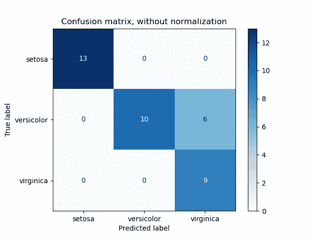
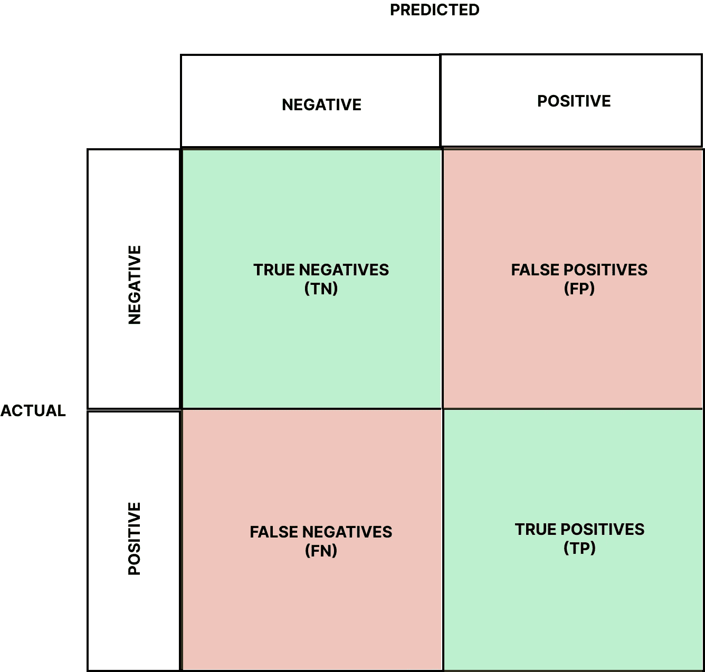
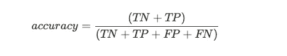
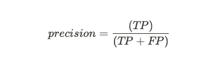
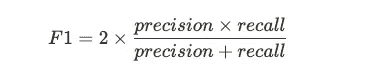
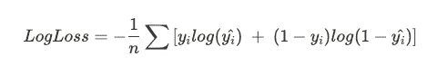
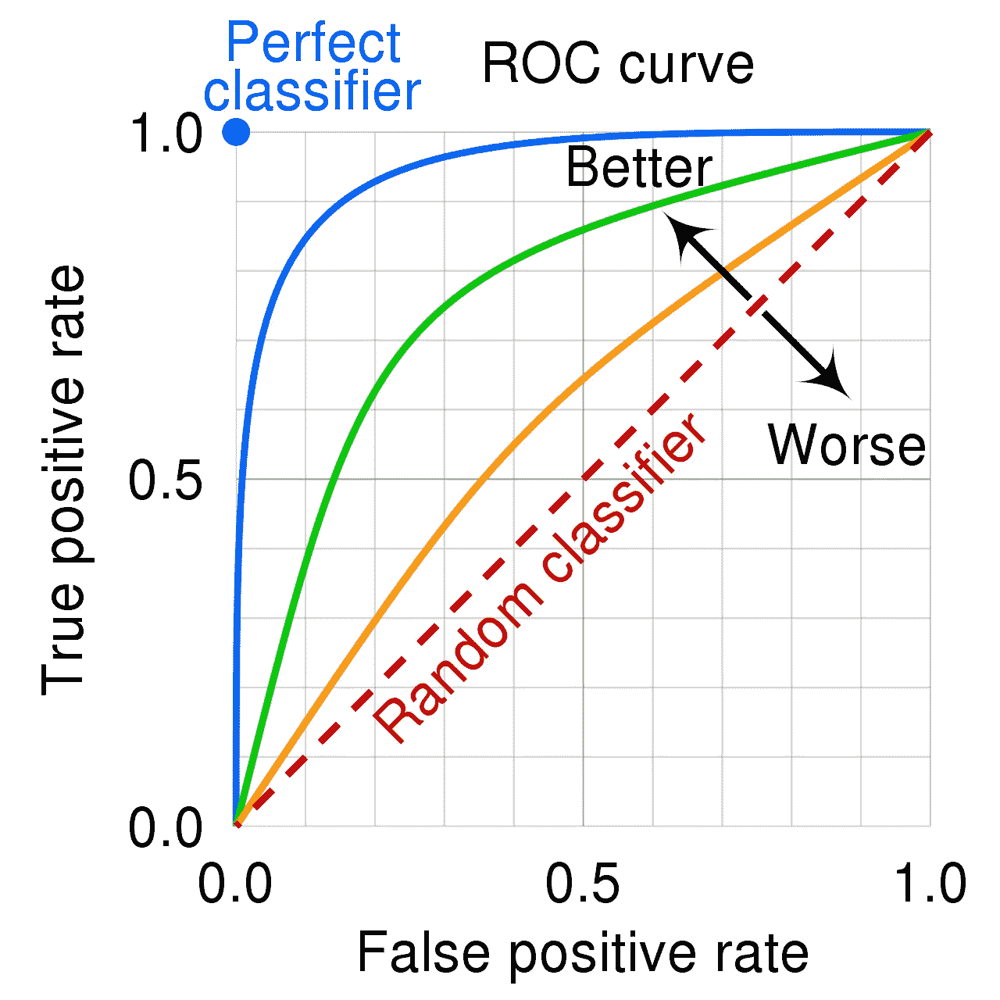
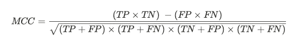

# 你需要的关于二进制分类标准的解释

> 原文：<https://towardsdatascience.com/the-explanation-you-need-on-binary-classification-metrics-321d280b590f>

## *用于评估二元分类模型质量的最常用指标的直观概述*

由[安妮·斯普拉特](https://unsplash.com/@anniespratt?utm_source=unsplash&utm_medium=referral&utm_content=creditCopyText)在 [Unsplash](https://unsplash.com/s/visual/4de89986-1731-4556-a65d-b56aafbaa197?utm_source=unsplash&utm_medium=referral&utm_content=creditCopyText) 上拍摄

当我们创建由学习算法在训练期间没有看到的示例组成的维持集时，模型评估阶段开始。如果我们的模型在维持集**上表现良好，我们可以说我们的模型概括得很好**并且质量很好。

评估模型好坏的最常见方法是计算维持数据的**性能指标。**

本文将关注二进制分类模型的性能指标。这是值得详细说明的，因为回归[任务有完全不同的可跟踪性能度量。](/assessing-model-performance-for-regression-7568db6b2da0)

# 二元分类的性能度量

我们将涵盖的指标有:

*   准确(性)
*   精确度和召回率
*   F1 分数
*   原木损失
*   ROC-AUC
*   马修斯相关系数

## 准确(性)

当我们想要分析一个二进制分类器的性能时，最常见和最容易得到的度量当然是准确度。它告诉我们，相对于总数，我们的模型在数据集中正确分类了多少次。

事实上，准确性的公式是正确答案的数量与答案总数之比

精确度考虑了模型*在最严格意义上的性能*。换句话说，它不允许我们**理解我们经营的环境**。

> 脱离上下文，准确性是一个非常微妙的指标来解释。

例如，**在处理不平衡数据集**时，不建议使用精确度作为评估标准，因为在不平衡数据集中，类的分布是不均匀的。如果准确性只不过是正确答案与总数的比率，那么你就会明白，如果一个类占了我们数据集的 90%，而我们的模型(错误地)将数据集中的每个例子都归入了那个特定的类，那么它的准确性将是 90%。

如果我们不小心，我们可能会认为我们的模型表现很好，而实际上却远非如此。

但是，如果我们确信数据集是平衡的，并且数据是高质量的，那么准确性是一个合理的度量标准。

## 精确度和召回率

为了更好地理解精确度和召回率的概念，我们将使用一个*混淆矩阵*来介绍这个主题。之所以称之为 like so，是因为它向分析师传达了模型的误差程度(以及由此产生的混乱)。

要创建混淆矩阵，我们只需在行中列出数据集中存在的实际类，在列中列出模型必须预测的类。单元的值对应于模型在这些条件下的响应。

让我们看一个使用 [Sklearn 作为源](https://scikit-learn.org/stable/auto_examples/model_selection/plot_confusion_matrix.html)的例子

来源:Sklearn (BSD 许可证)

这是一个应用于著名的 Iris 数据集的二元分类器的混淆矩阵的例子。

对角线上的值指示分类模型的预测对应于数据集中存在的真实类别的点。**对角线上出现的元素越多，我们的预测就越正确**(注意，我没说模型在表演！让我们记住上面的准确性问题)。

让我们抽象地表示混淆矩阵，以便更好地理解填充单元格的值。

混淆矩阵中的行、列和值代表什么。图片作者。

我们看到许多标签:真阴性、真阳性、假阴性和假阳性。让我们一个一个来看。

*   **真否定(TN):** 包含被正确分类为否定的例子。
*   **真阳性(TP):** 包含已被正确分类为阳性的例子。
*   **假阴性(FN):** 包含被错误地归类为阴性，因此实际上是阳性的例子
*   **假阳性(FP):** 包含被错误地分类为阳性并因此实际上是阴性的例子

通过使用混淆矩阵，我们因此能够更好地理解我们的分类器的行为以及如何进一步改进它。

接下来，让我们看看如何从混淆矩阵中导出精度公式:

这无非就是正确答案的数量除以总数。

**现在让我们用公式定义精度**

是如何解读的？**精度就是只对正类计算的精度。**它也被称为*特异性*，因为它定义了当有需要识别的信号时，仪器的灵敏度。事实上，这个指标告诉我们，当我们把一个类归类为积极的时候，我们有多经常是正确的。

让我们再举一个例子:我们在家里安装了一个带有面部识别算法的报警系统。它连接到摄像头和控制单元，如果有人进入房子，而它不认为这是朋友或家庭成员，它会在我们手机上的应用程序上发送通知。

> 一个高精度的模型只会偶尔提醒我们几次，但当它提醒我们时，我们可以非常确定它真的是一个入侵者！因此，当房子里确实有入侵者时，该模型能够正确地区分入侵者和家庭成员。

另一方面，召回代表着天平上的另一根针。如果我们有兴趣识别尽可能多的肯定类别，那么我们的模型必须具有高召回分数。

它的公式是

实际上，这意味着我们必须考虑假阴性而不是假阳性。召回也被称为*敏感度*，因为随着召回的增加，我们的模型变得越来越不准确，并且还将负面类别分类为正面类别。

让我们看一个包括召回的例子:我们是放射科医生，我们训练了一个模型，使用计算机视觉对任何肺部肿瘤的存在进行分类。

> 在这种情况下**我们希望我们的模型有高召回率**，因为我们希望确保每个被模型认为是正面的例子都经过了人类的检验。我们不希望恶性肿瘤被忽视，我们会欣然接受假阳性。

总结一下，我们来看这个类比:

> **一个高精度的模型是保守的**:它并不总是正确地识别类，但是当它识别时，我们可以确信它的答案是正确的。
> **高召回模型是自由的:**它更经常地识别一个类别，但是在这样做的时候，它也倾向于包括许多噪声(误报)。

细心而好奇的读者会推断，不可能有一个模型同时具有高精度和高召回率。事实上，**这两个指标是互补的**:如果我们增加一个，另一个必然减少。这被称为**精度/召回权衡。**

作为分析师，我们的目标是联系上下文并理解哪个指标为我们提供了最大的价值。

## F1 分数

在这一点上，很明显，使用精度或召回率作为评估指标是困难的，因为我们只能使用一个而牺牲另一个。**F1 成绩解决了这个问题**。

事实上，F1 分数将精确度和召回率结合成一个指标。

这是精确度和召回率的调和平均值，并且可能是用于评估二元分类模型的最常用的度量。

> 如果我们的 F1 得分增加，这意味着我们的模型在准确性、召回率或两者方面的性能都有所提高。

## 原木损失

日志损失是一个常见的评估指标，尤其是在 Kaggle 上。在深度学习的背景下也称为交叉熵，这一指标衡量模型预测的概率和观察到的现实的概率之间的差异。**该指标的目标是估计一个示例具有正面类别的概率。**

这种度量在数学上比以前的更复杂，没有必要深入了解它在评估二进制分类系统中的有用性。

这是完整性的公式

*n* 代表数据集中样本的数量，y_i 代表观察到的现实，yˇ_ I 代表模型的预测。

我不会继续解释这个公式，因为它会误入歧途。如果你想了解更多，谷歌是你最好的朋友🙂

## ROC-AUC

ROC-AUC 指标基于**接收操作特征曲线**的图形表示。我不会试图用我自己的话来解释，因为这次维基百科做得非常好

> ROC 曲线[…]是二元分类模型的图解。灵敏度和(1-特异性)可以沿两个轴表示，分别由真阳性率(TPR，真阳性的比例)和假阳性率(FPR，假阳性的比例)表示。换句话说，**ROC 曲线显示了真报警(命中率)和假报警之间的关系。**

最后一句粗体字(我套用的)是让我们刚刚读到的 ROC 曲线的描述变得直观的那一句。显然，我们希望真警报和假警报之间的关系有利于真警报，因为性能更好的模型会做到这一点。

让我们看看这个图表是什么样的

来源:维基百科

AUC 代表曲线下的*面积。如果我们把注意力放在蓝线上，我们会发现在它下面实际上有一个比绿线和橙线更大的区域。虚线表示 50%的 ROC-AUC 指标。*

因此，好的模型将具有大的 ROC-AUC，而差的模型将位于虚线附近，这只不过是一个随机模型。

ROC-AUC 指标对于比较不同模型也非常有用。

## 马修斯相关系数

在这里，我们看到了二进制分类模型的最后一个评估指标，该模型旨在评估在**不平衡数据集上训练的模型。**

这个公式看起来像绕口令，但实际上它的表现就像一个相关系数。因此，它的范围在-1 和+1 之间。

趋向于+1 的值衡量我们的分类器预测的质量，即使在数据集中的类不平衡的情况下，**因为它表明实际观察值和我们的模型所做的预测之间的相关性。**

# 结论

与回归模型的评估指标一样，Sklearn 提供了几种快速计算这些指标的方法。这里有一个到文档的[链接。](https://scikit-learn.org/stable/modules/model_evaluation.html)

最后一点，这些是评估二元分类模型的指标。例如，对于多类分类，只需将这些度量之一应用于每个类，然后应用一种对所有示例进行概括的策略，例如平均值(微观/宏观平均)。但那是另一篇文章的话题:)

**如果你想支持我的内容创作活动，欢迎点击我下面的推荐链接，加入 Medium 的会员计划**。我将获得你投资的一部分，你将能够以无缝的方式访问 Medium 的大量数据科学文章。

 [## 通过我的推荐链接加入 Medium-Andrew D # data science

### 阅读 Andrew D #datascience(以及媒体上成千上万的其他作者)的每一个故事。您的会员费直接…

medium.com](https://medium.com/@theDrewDag/membership) 

下一篇文章再见👋