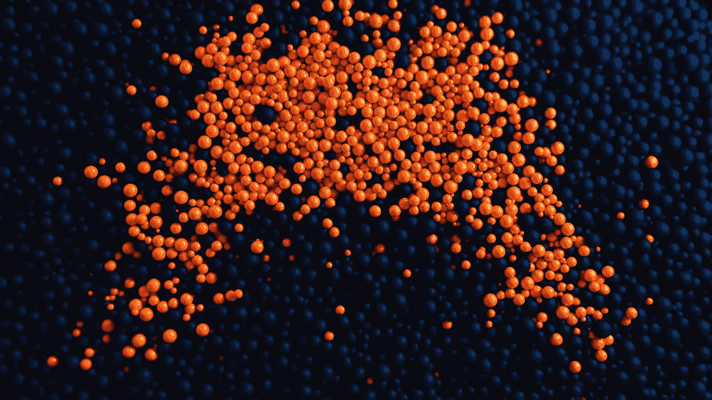
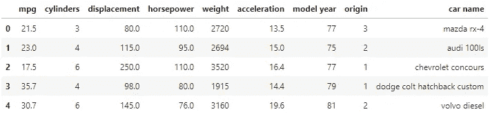
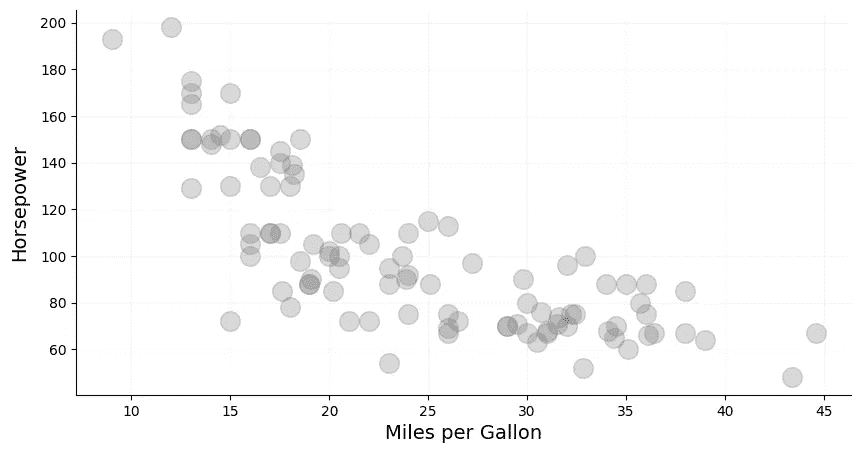
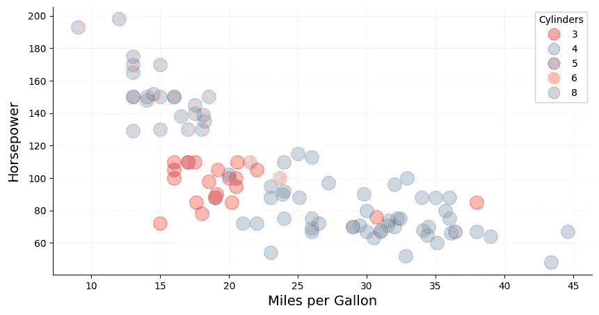
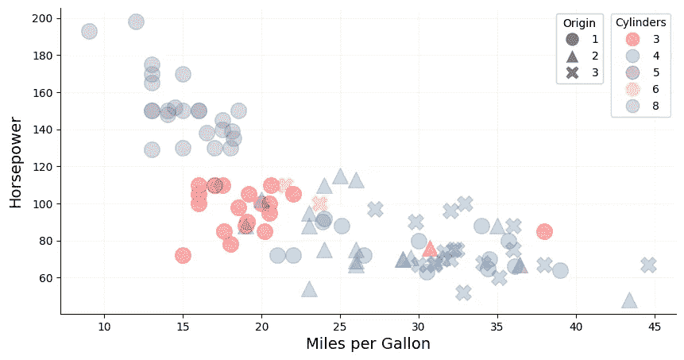
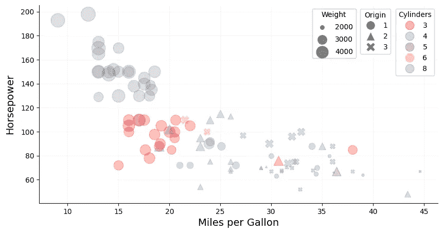
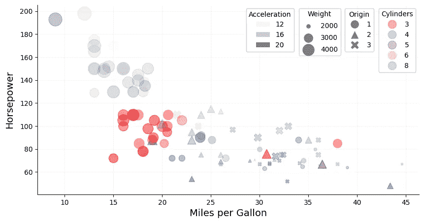

# 散点图的表现力

> 原文：<https://towardsdatascience.com/the-expressive-power-of-the-scatter-plot-c2f3354d3d97>

## 如何在 2D 可视化多维数据

由[罗格维尔德](https://unsplash.com/@roguewild)在 [Unsplash](https://unsplash.com/photos/SGcFBTuSSU4) 上拍摄的照片

# 介绍

数据可视化是数据科学的一个重要方面，它使从业者能够获得手边数据的图形表示，检测异常，或识别模式和趋势。虽然有多种方法来执行图形数据分析，但散点图是一种广为人知且经常使用的工具，用于可视化变量之间的关系。

虽然散点图通常只显示二维，但无需在空间上正交相加，就可以显示更多的维度。这可以通过利用颜色、形状、大小或不透明度等视觉属性来实现。我们将在本文中探讨这些属性的使用。

在深入研究之前，值得注意的是，向图中添加第三个正交维度当然也是可能的。然而，这种做法通常应该避免，除非存在与情节交互的可能性。本文的最后一节将对此进行详细阐述。

# 数据集和预处理

下面的散点图是使用公开的[自动 MPG 数据集](https://archive.ics.uci.edu/ml/datasets/auto+mpg)【1】在 Python 中生成的。为了便于说明，这里只使用了整个数据集的 25%的随机样本(表 1)。

表 1:自动 MPG 数据集的快照。

假设我们最感兴趣的是将*马力*可视化为*每加仑(mpg)* 英里数的函数。因此，这两列将作为贯穿本文的正交维度。然后，我们将通过视觉属性添加更多的维度。

# 2D

一个简单的二维散点图*马力*和*英里/加仑*已经为我们提供了这些特性如何相互关联的重要信息。它揭示了一种反比关系，其中具有较高 *mpg* 的汽车往往具有较低的*马力*，反之亦然(图 1)。

图 1:显示马力作为 mpg 的函数的二维散点图。图片作者。

# 三维（three dimension 的缩写）

现在让我们以**颜色**的形式添加第三维。为了获得更好的表现力，谨慎的做法是选择一个具有离散值和相对较低基数的维度，这样可以很容易地从视觉上区分不同的颜色。在我们的数据集中，列 *cylinders* 只有五个唯一值，这使它成为一个合适的候选者(图 3)。

图 3:三维散点图，利用颜色来说明圆柱体的数量。图片作者。

添加颜色作为视觉属性，可以从情节中提取更多的信息。或许有些出乎意料，随着*马力*的降低和 *mpg* 的上升，*气缸*的数量趋于减少。这并不奇怪，因为功率较小的汽车通常包含更少的气缸，具有更好的燃油效率。

# 4D

与 color 类似， **shape** 是我们可以添加的另一个支持低基数特性的可视属性(图 4)。在我们的数据集中， *origin* 只包含三个唯一值，它们代表汽车制造的地理位置。这些信息已经被标签编码:1 代表美国，2 代表欧洲，3 代表日本。

图 4:利用形状说明产地(原产地)的四维散点图。图片作者。

根据数据点的*原点*绘制各种形状的数据点，我们在这个数据集中发现了另一个有趣的趋势。基于*马力*和*汽缸*的最强劲的汽车似乎都产自美国。另一方面，燃油效率最好的汽车来自日本。欧洲汽车占据了中档市场，尽管在马力方面并没有明显更强劲，但每加仑的油耗却比日本车低。从这个信息中我们可以得出的另一个见解是，3 缸汽车似乎主要是在美国制造的。

# 5D

现在让我们添加另一个视觉属性:**大小**。与形状和颜色不同，大小不一定要求特征值是离散的。基于我们的数据集，*权重*似乎是一个合适的特征，可以通过数据点的大小来表达(图 5)。

图 5:利用尺寸说明汽车重量的五维散点图。图片作者。

不出所料，马力大、mpg 低的美国汽车往往更重，而燃油效率较好、马力较小的欧洲和日本汽车往往更轻。

***提示:*** 这个数据集中的*体重*在 1760 到 4952 磅之间。当使用 [**matplotlib**](https://matplotlib.org/stable/api/_as_gen/matplotlib.pyplot.scatter.html) 绘制数据时，简单的比例因子不足以直观地表达*重量*的差异，因为轻型汽车的数据点几乎与重型汽车的数据点大小相同。为了提高对比度，可以使用 sklearn 的 MinMaxScaler 对数据进行缩放。但是，需要确保转换数据的下限不为零，因为大小为零的数据点不会显示在图上。

# 6D

利用**不透明度**可将另一个维度添加到绘图中。同样，我们并不局限于离散值，我们可以选择连续的特征，例如加速度*和*。该特征表示从 0-60 英里/小时加速所需的时间，以秒为单位。

图 6:六维散点图利用不透明度来说明汽车的加速度。图片作者。

通过将这些信息添加到图表中，我们可以看到，许多强劲的美国汽车加速到 60 英里/小时只需要相对较短的时间，而它们的节油型汽车需要更长的时间。

与上面的*重量*类似，*加速度*特征使用 sklearn 的 MinMaxScaler 进行缩放，以增加不透明度的差异。

# 避免 3D 散点图

从技术上讲，可以在图中添加第三个正交维度。然而，这只有在有可能与图交互并以这种方式探索数据点时才有用。

3D 散点图的基本问题是需要两个连续的数据转换:(1)将数据映射到 3D 可视化空间，以及(2)将数据从其 3D 可视化空间映射到最终图形的 2D 空间[2]。因此，投影到二维空间的 3D 图实际上只有 2.5D，从而在平面上产生了深度的错觉[3]。这通常会导致视觉失真，并增加可解释性的难度，因为很难想象数据点在空间中的确切分布。

此外，如果图是静止的，数据点很容易隐藏在其他数据点的后面。虽然引入不透明性有助于缓解这一问题，但它肯定不能提供一个可接受的解决方案。

# 结论

本文探讨了如何通过利用传统的 2D 散点图并以可视属性的形式添加更多维度来有效地可视化多维数据。使用颜色或形状时，最佳做法是为这些属性选择基数较低的离散要素，因为高基数要素会使解释和区分绘图中各种颜色或形状变得困难。对于连续要素，大小和不透明度是合适的属性，可以为所呈现的数据提供额外的洞察力。

此外，对于连续特征，可以缩放特征值以增加较低值和较高值之间的视觉差异。

最后，值得一提的是，可以使用诸如*色调*或*纹理*之类的属性来添加更多的维度。然而，应避免图中维数越来越高，因为它很容易淹没观察者，从而降低可解释性。

# 参考

[1]昆兰，R. (1993 年)。[结合基于实例和基于模型的学习](https://www.sciencedirect.com/science/article/pii/B978155860307350037X?via%3Dihub)。《第十届机器学习国际会议论文集》, 236–243，马萨诸塞大学，阿默斯特。摩根·考夫曼。

[2]克劳斯·威尔基。[数据可视化——不要 3D 化](https://clauswilke.com/dataviz/no-3d.html)。访问时间为 2022 年 12 月 11 日。

[3]罗宾·邝。[如何让 3D 图表再次伟大](https://www.ft.com/content/350424c8-0f28-11e7-b030-768954394623)。《金融时报》(旧金山，2017 年 3 月 27 日)。