# 研究员摆振筛:数据驱动综述

> 原文：<https://towardsdatascience.com/the-fellow-shimmy-sifter-a-data-driven-review-8eedc23580f8>

## 咖啡数据科学

## 双层断续浓缩咖啡制作简单

圣诞老人(妈妈)给我带来了一个 [Fellow Shimmy](https://fellowproducts.com/products/shimmy-coffee-sieve) ，我很兴奋。我想看看这个工具有多好，尤其是与 [Kruve Sifter](https://www.kruveinc.com/pages/kruve-sifter) 相比。我喜欢滤网，我认为它们有很多用处，尤其是对浓缩咖啡。许多人已经在网上回顾了摆振，我从数据的角度回顾摆振，以更好地了解它的效用。

# 摆振的目的

Shimmy 应该可以去除咖啡中的粉末，特别是为了让咖啡更好地流动。然后，用户应该把这些罚款扔掉。我认为这是对罚款来源的误解造成的错误。

[在之前的](/fines-in-coffee-grinds-searching-for-a-source-326c3eba2bb4)中，我观察了粗磨咖啡粉，它们的味道与细磨咖啡粉大不相同。我推测粗磨咖啡的粉末来自咖啡豆的内部，因为那部分更软，更容易变成灰尘。

因此，扔掉这些粉末，你就去除了咖啡风味的一个组成部分。这并不意味着摆振是一个无效的工具，而是它的真正目的还没有实现，这是一个用于[断奏](https://medium.com/overthinking-life/staccato-espresso-leveling-up-espresso-70b68144f94)咖啡的工具。分层咖啡不一定只能归入浓缩咖啡。

我发现的所有评论都集中在它作为体验的表现和对咖啡味道的影响，以及对扔掉一些咖啡渣的评论。

# 设计

就筛选时间而言，我可以在 3 到 5 分钟内相对容易地进行筛选。单屏幕比双屏幕的 Kruve 更快，我认为它的设计更好，因为上下运动比左右运动更自然。为了实现与 Kruve 屏幕尺寸相同的时间，我还必须包括一个搅拌器，这从经验中带走。

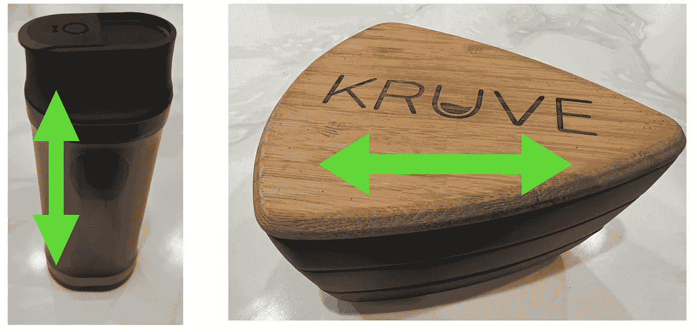

所有图片由作者提供

最近，我首先用 Shimmy 进行筛选，然后用 Kruve 上的一个更大的筛子进行快速筛选，得到三层断续浓缩咖啡。

# 技术条件

Shimmy 说它能过滤掉直径小于 200 微米的颗粒。然而，这是一个失算。

当我第一次开始用它筛选时，我注意到我的 300um Kruve 屏幕已经接近筛选输出了。所以我拿出了我的廉价显微镜，孔的形状不像圆形的。它们几乎是正方形的，这意味着对角线是真正的筛选能力。

> 减摆有效孔径= 282 微米= sqrt(2)* 200 微米

我在这里比较两者:

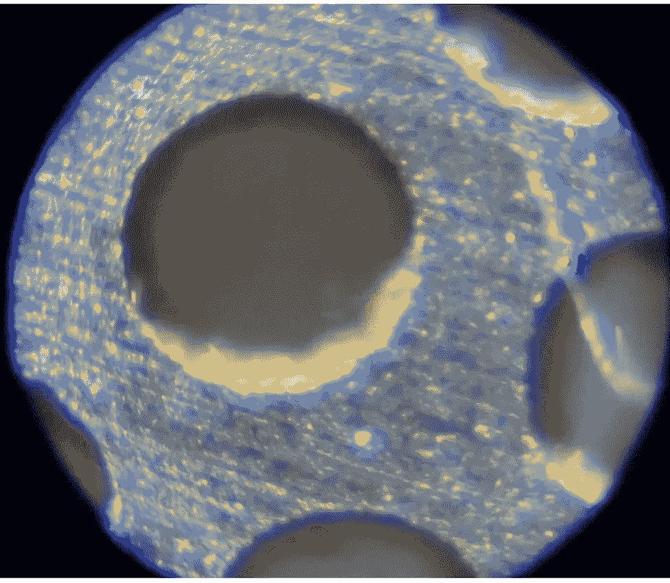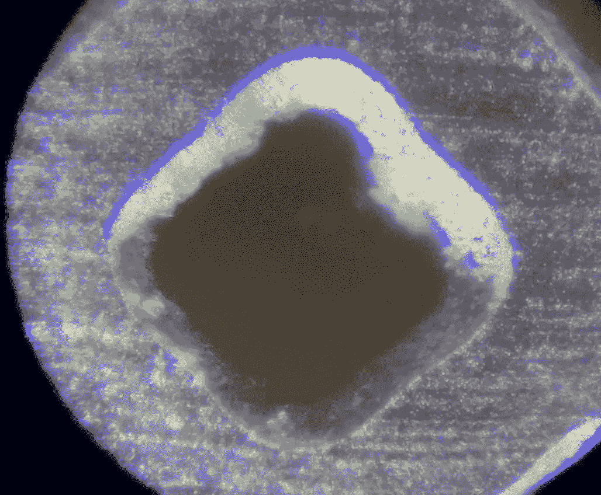

左:Kruve 300um 屏幕，右:Shimmy 200um

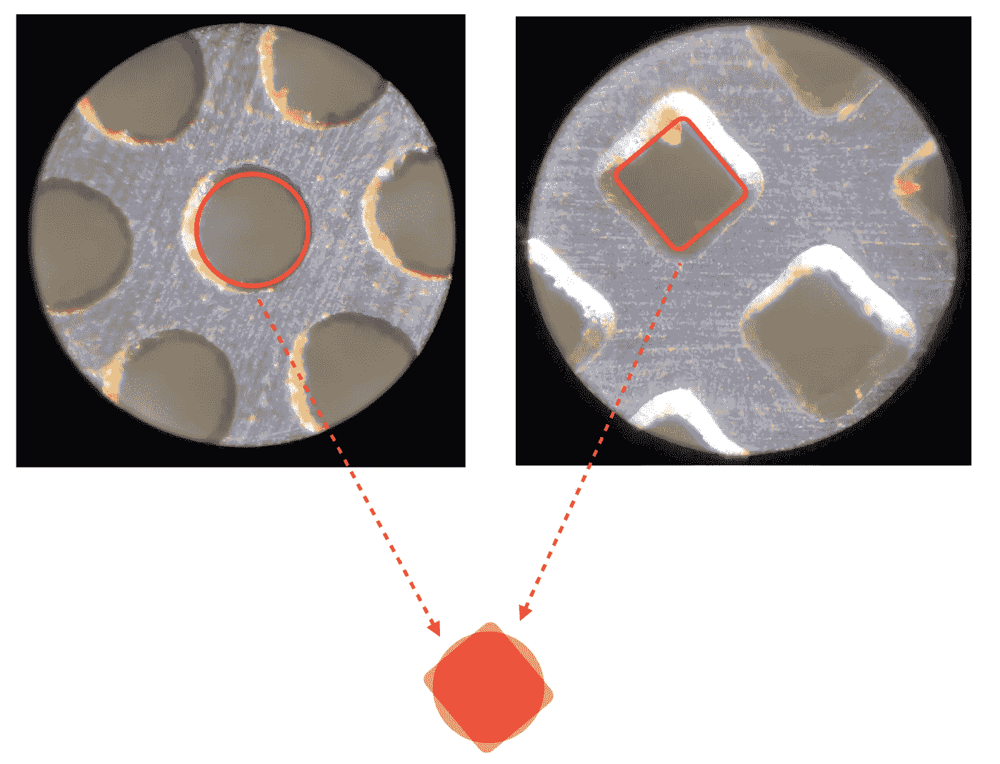

这是一个粗略的展示。让我们仔细看看。我用了一些图像处理来[分析筛子的孔径](/espresso-filters-an-analysis-7672899ce4c0)。

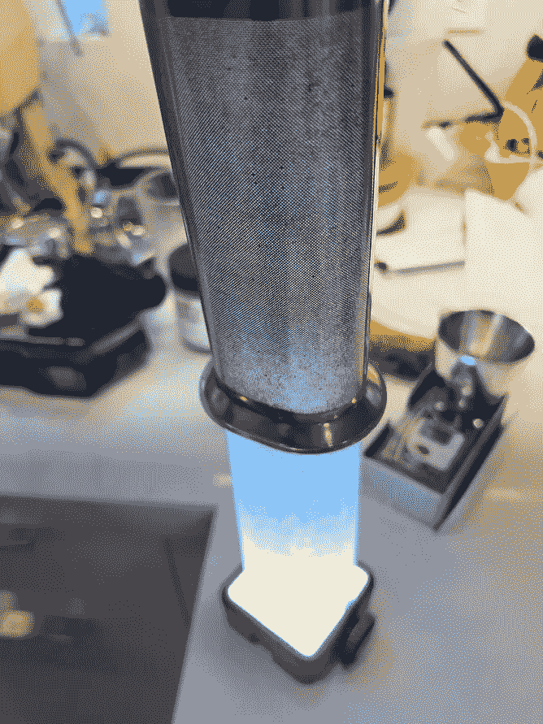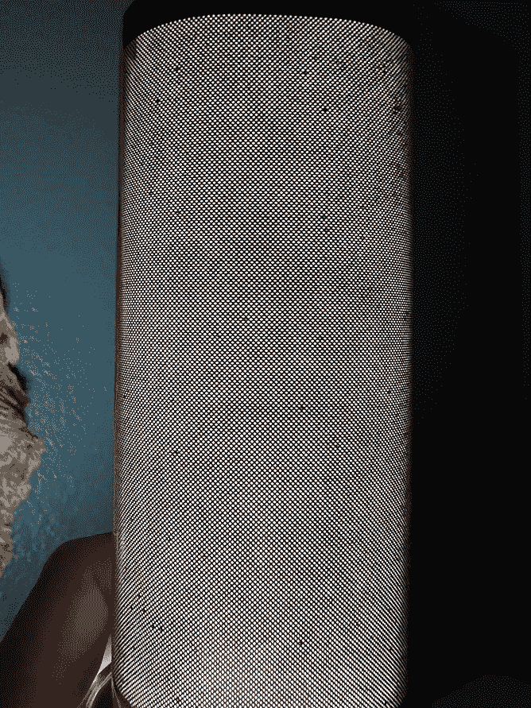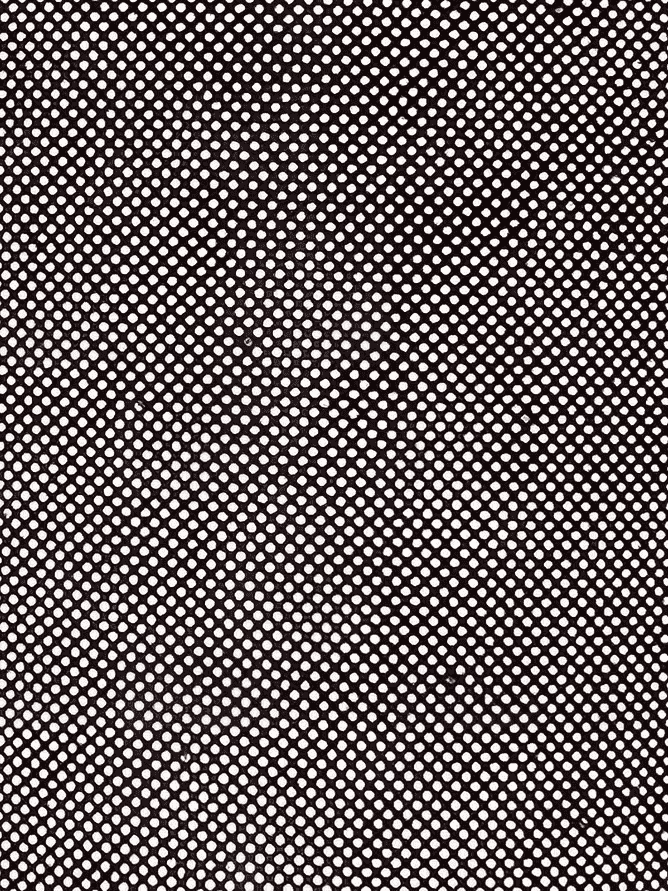

在暗室中成像

这些图像显示了彩色的孔测量值，其中蓝色较小，黄色较大。它显示了孔洞大小的变化以及它们不是随机的。我有一个[类似的](https://rmckeon.medium.com/comparing-kruve-coffee-sifters-new-and-old-677e8b16ec62)对克鲁夫的分析。

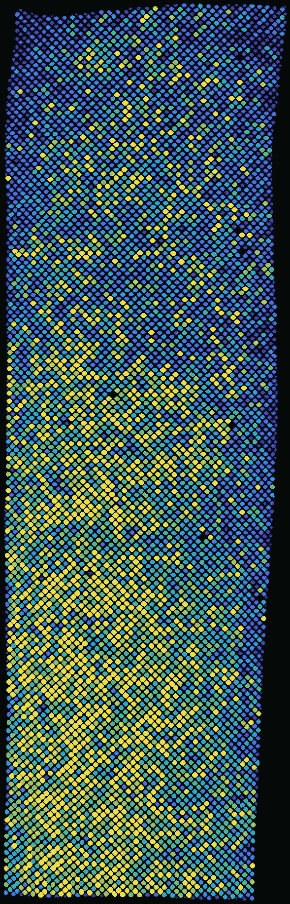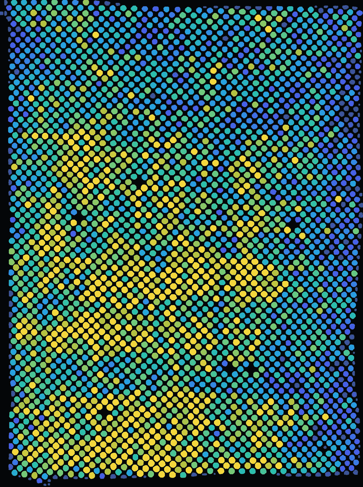

左:更宽的视野，右:放大的图像

这种测量更具挑战性，因为与 Kruve 滤波器不同，该滤波器并不平坦。如果我们假设平均孔径为 282um，假设对角线，我们可以使用这些相对数字来评估孔径的标准偏差。

从更宽的视野图像来看，标准偏差是 85 微米，而对于放大的图像来说，标准偏差是 57 微米。相比之下，300 微米的[波纹屏](/comparing-kruve-coffee-sifters-new-and-old-677e8b16ec62?source=your_stories_page----------------------------------------)的标准偏差为 113 微米。这个结果应该是半信半疑的，因为除非我打开摆振屏，否则我不能准确地测量整个东西，因为我不能把它放平。

# 磨磨蹭蹭拨号

我已经使用摆振拨入研磨。从我过去对不连续咖啡的实验中，我知道大约一半的粒子直径小于 300 微米。对某人来说这是什么并不重要，只要他们能衡量它。我的目标是 24 克咖啡配 10 克咖啡。

因此，研磨，筛选，测量，改变研磨设置，如果没有足够的细磨。在这个过程结束时，只喝一杯咖啡，你应该非常接近最佳的调入镜头，只需稍加调整。重新研磨咖啡会比正常情况下多赚一些钱，但是你会离球场更近。您可以使用一个考虑了重新研磨的目标重量。

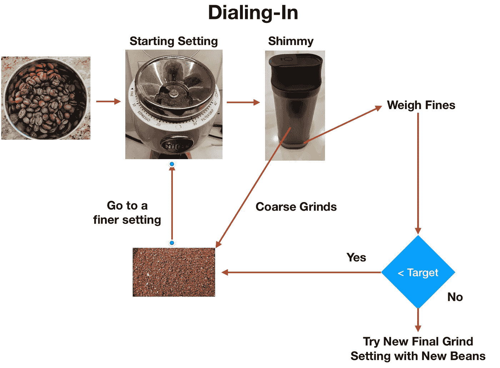

# 设备/技术

[浓缩咖啡机](/taxonomy-of-lever-espresso-machines-f32d111688f1):金快线

咖啡研磨机:[小生零](/rok-beats-niche-zero-part-1-7957ec49840d)

咖啡:[家庭烘焙咖啡](https://rmckeon.medium.com/coffee-roasting-splash-page-780b0c3242ea)，中杯(第一口+ 1 分钟)

投篮准备:[断奏](https://medium.com/overthinking-life/staccato-espresso-leveling-up-espresso-70b68144f94)和[内外断奏](/inside-out-staccato-espresso-f836fddc0bd1)

[预输注](/pre-infusion-for-espresso-visual-cues-for-better-espresso-c23b2542152e):长，约 25 秒

输液:[压力脉动](/pressure-pulsing-for-better-espresso-62f09362211d)

[过滤篮](https://rmckeon.medium.com/espresso-baskets-and-related-topics-splash-page-ff10f690a738) : 20g VST

其他设备: [Atago TDS 计](/affordable-coffee-solubility-tools-tds-for-espresso-brix-vs-atago-f8367efb5aa4)、 [Acaia Pyxis 秤](/data-review-acaia-scale-pyxis-for-espresso-457782bafa5d)、 [Kruve 筛](https://www.kruveinc.com/pages/kruve-sifter)

# 绩效指标

我使用两个[指标](/metrics-of-performance-espresso-1ef8af75ce9a)来评估技术之间的差异:最终得分和咖啡萃取。

[**最终得分**](https://towardsdatascience.com/@rmckeon/coffee-data-sheet-d95fd241e7f6) 是记分卡上 7 个指标(辛辣、浓郁、糖浆、甜味、酸味、苦味和回味)的平均值。当然，这些分数是主观的，但它们符合我的口味，帮助我提高了我的拍摄水平。分数有一些变化。我的目标是保持每个指标的一致性，但有时粒度很难确定。

**总溶解固体(TDS)是用折射仪测量的，这个数字结合弹丸的输出重量和咖啡的输入重量用来确定提取到杯中的咖啡的百分比，称为**提取率(EY)** 。**

****强度半径(IR)** 定义为 TDS vs EY 控制图上原点的半径，所以 IR = sqrt( TDS + EY)。这一指标有助于标准化产量或酿造比的击球性能。**

# **与 Kruve 相比的摆振**

**首先，我并不是说，与 Kruve 筛分机相比，Shimmy 的价值完全取决于它的性能。对于 Kruve，我总是使用 3 层断奏镜头，因为它们是自然的。对于摆振，我通常做两层断奏镜头，因为这样更自然。**

**我认为用这两种方法制作的断续浓缩咖啡会比普通的浓缩咖啡更好，而且 Shimmy 更容易携带。摆振接近与 Kruve 相同的性能，但还不够。**

**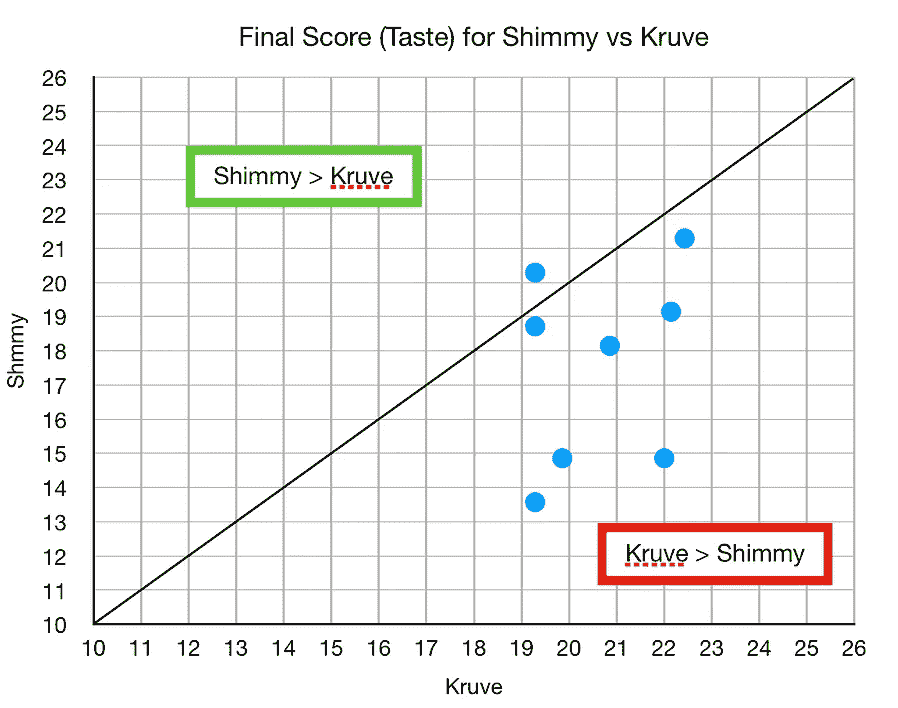****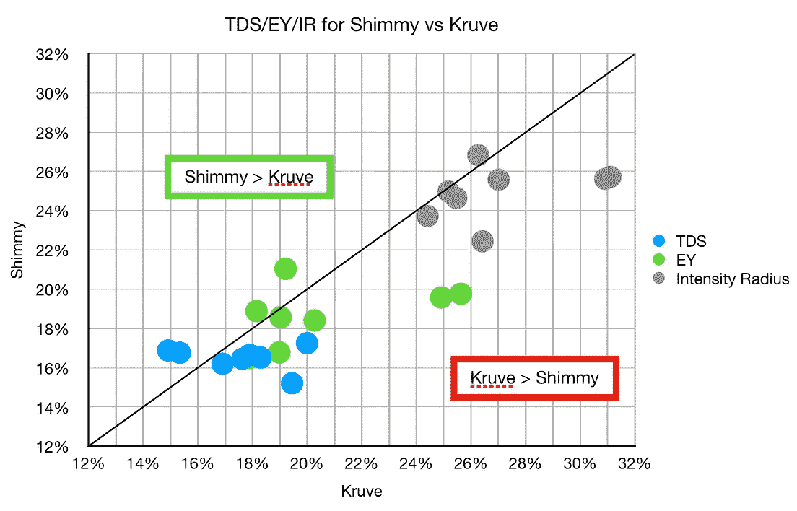**

**他们在 ey 很接近，但是口味上有一些波动。就时间而言，带摆振的镜头覆盖滤镜更快，因为顶层没有分离。**

**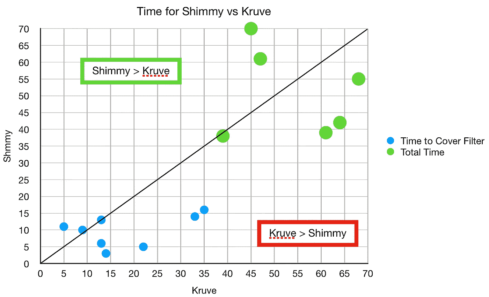**

**味觉评分平均有统计学意义上的差异，但 TDS 和 EY 没有统计学差异。**

**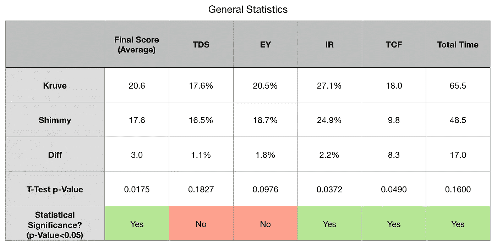**

# **凌乱的咖啡**

**使用筛子可能会很麻烦，因为咖啡不稳定。摆振最具挑战性的方面是让细颗粒没有混乱，但粗颗粒出来非常干净。与 Kruve 相比，我用的是刷子，它比 Shimmy 更乱。我已经习惯这样了，对我来说，筛过的咖啡制备造成的混乱是值得品尝的。**

**考虑到易用性，我希望有 Shimmy 的人尝试断奏。我也希望做颤音的人，尝试一种使用颤音的断奏形式，而不是扔掉它。我也希望咖啡馆可以使用这个工具或 Kruve 的筛子来减少浪费。**

**对我来说，我一直在使用 Kruve 和 Shimmy。通常，我首先使用 Shimmy，然后将粗磨过的粉末放入 Kruve 中的 500 微米筛中。**

**如果你愿意，可以在推特、 [YouTube](https://m.youtube.com/channel/UClgcmAtBMTmVVGANjtntXTw?source=post_page---------------------------) 和 [Instagram](https://www.instagram.com/espressofun/) 上关注我，我会在那里发布不同机器上的浓缩咖啡照片和浓缩咖啡相关的视频。你也可以在 [LinkedIn](https://www.linkedin.com/in/dr-robert-mckeon-aloe-01581595) 上找到我。也可以关注我在[中](https://towardsdatascience.com/@rmckeon/follow)和[订阅](https://rmckeon.medium.com/subscribe)。**

# **[我的进一步阅读](https://rmckeon.medium.com/story-collection-splash-page-e15025710347):**

**[我未来的书](https://www.kickstarter.com/projects/espressofun/engineering-better-espresso-data-driven-coffee)**

**[浓缩咖啡系列文章](https://rmckeon.medium.com/a-collection-of-espresso-articles-de8a3abf9917?postPublishedType=repub)**

**[改进浓缩咖啡](https://rmckeon.medium.com/improving-espresso-splash-page-576c70e64d0d?source=your_stories_page-------------------------------------)**

**[断奏生活方式概述](https://rmckeon.medium.com/a-summary-of-the-staccato-lifestyle-dd1dc6d4b861?source=your_stories_page-------------------------------------)**