# 用深度学习对抗假新闻

> 原文：<https://towardsdatascience.com/the-fight-against-fake-news-with-deep-learning-6c41dd9eaae4>

## 基于 LSTMs 和 BERT 的假新闻检测

马库斯·温克勒在[像素上拍摄的照片](https://www.pexels.com/photo/close-up-shot-of-a-typewriter-4160060/)

让我们玩一个游戏。我给你两个标题，你告诉我哪个是假新闻。准备好了吗？我们开始吧:

> “南希·佩洛西挪用社会保障资金用于弹劾调查”
> 
> “联邦应急管理局抵达遭受龙卷风袭击的肯塔基州——带着疫苗”

嗯……事实证明，*两个标题都是假新闻的例子。*

*残酷的现实是，错误信息和虚假信息在互联网上猖獗。根据益普索公共事务公司(Ipsos Public Affairs)为加拿大国际治理创新中心(Centre for International Governance Innovation)进行的 2019 年民意调查显示， **90%的加拿大人曾被假新闻所迷惑。***

*这让我想到，有没有可能创建一个模型来检测一篇给定文章的标题是否是假新闻？嗯，事实证明确实如此！在这篇文章中，我将与你分享我用 LSTMs 和 BERT 建立这个文本分类模型的经验。*

*你可以在我的 Github 库[这里](https://github.com/shayaf84/Fake-News-Detection)找到我使用的代码*

# *查找数据集*

*我们将使用维多利亚大学的 ISOT 假新闻数据集。它包含超过 12，600 篇来自 Reuters.com 的真实新闻文章和超过 12，600 篇由 Politifact(美国的一个事实核查组织)标记的虚假新闻文章。该数据集包含与各种主题相关的文章，尽管主要是政治新闻和世界新闻。在这个[链接](https://www.uvic.ca/ecs/ece/isot/datasets/fake-news/index.php)处检查一下。*

# *探索性数据分析*

*首先，让我们对数据进行一些分析，以便了解数据中可能的趋势。因为真实新闻和虚假新闻文件是分开的，所以我们需要标记并连接这两个数据帧。对于真实的新闻数据集，我们循环行数，并向 NumPy 数组添加 0(表示类)。该数组将被添加到真实新闻数据帧中。对于假新闻数据集，我们重复这个过程，但是向 NumPy 数组添加 1。*

*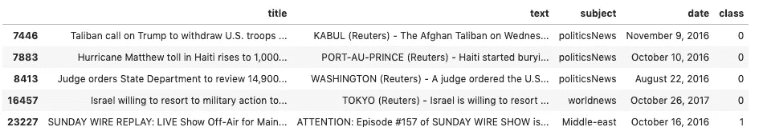*

*作者图片*

**

*作者图片*

*因为我们有 21，417 个真实新闻样本和 23，481 个虚假新闻样本，所以真实新闻和虚假新闻的比例大约是 48:52。这意味着我们的数据集相对平衡。对于我们的项目，我们只需要标题和类列。*

*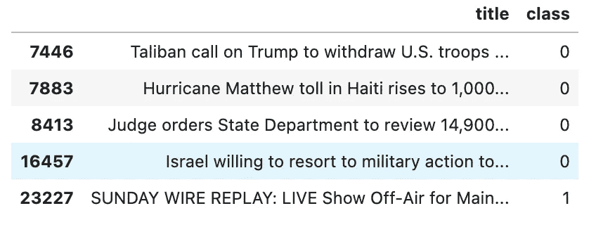*

*最终数据帧|作者图片*

*太好了！既然我们清理了数据集，我们可以分析我们在其中发现的趋势。为了测量数据集的大小，我们将分析标题的平均、最小和最大字符长度。我们将用直方图来绘制这个频率。*

*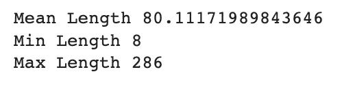*

*作者图片*

*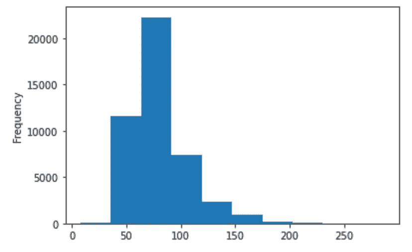*

*作者图片*

*我们看到每个条目中的字符数范围从 8 到 286。长度为 50-100 的样本浓度很高。这可以在数据集中的平均长度约为 80 时进一步看出。*

# *预处理我们的数据*

*我们将使用 python 的字符串库进行一些初始预处理。它们包括:*

*   ***小写所有字符***
*   ***去掉标点符号***

*之后，我们将需要使用 **NLTK 库**对我们的数据集进行进一步的预处理。它包括:*

*   ***标记化:**将一个文本分割成一个更小的称为标记的单元(每个单词将是一个数组中的一个索引)*
*   ***词汇化:**去除单词的屈折词尾。例如，单词“children”将被词条化为“child”*
*   ***删除停用词:**常用词如“the”或“for”将被删除，因为它们会占用我们数据集中的空间。*

*这意味着我们处理后的数据帧将如下所示:*

*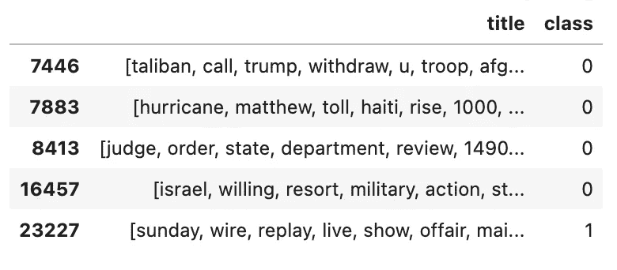*

*作者图片*

*我们将基于这些数据构建两个模型来对文本进行分类:*

*   *一个 **LSTM 模型**(我们将使用 Tensorflow 的 wiki-words-250 嵌入)*
*   *伯特模型。*

# *创建 LSTM 模型*

*首先，我们将把数据集分割成 80:20 的训练:测试比例。*

*如果我们希望我们的模型基于文本数据进行预测，我们需要将其转换为矢量格式，这样我们的计算机就可以对其进行处理。*

*Tensorflow 的 wiki-words-250 使用 Word2Vec 跳格结构。通过基于输入单词预测上下文来训练 Skip-gram。*

*例如，如果我们有这样一句话:*

> *我将乘飞机去度假*

*我们将传入单词“vacation”作为输入，并将窗口大小指定为 1。窗口大小表示要预测的目标单词前后的单词。在这种情况下，它们是单词“go”和“airplane”(不包括停用词，并且“go”是“going”的词汇化形式)。*

*我们对单词进行热编码，所以我们的输入向量的大小是 1 x V，其中 V 是我们的词汇量。该表示将乘以具有 V 行(我们的词汇表中的每个单词一行)和 E 列的权重矩阵，其中 E 是表示每个嵌入大小的超参数。因为输入向量是一位热编码的，所以除了一个值(代表我们正在输入的单词)之外，所有值都是 0。因此，当乘以权重矩阵时，输出是 1xE 向量，表示该单词的嵌入。*

*1xE 向量将被传递到输出层，由 softmax 回归分类器组成。它由 V 个神经元组成(对应于词汇的一键编码)，每个单词的输出在 0 和 1 之间，表示该单词在窗口大小中的概率。*

*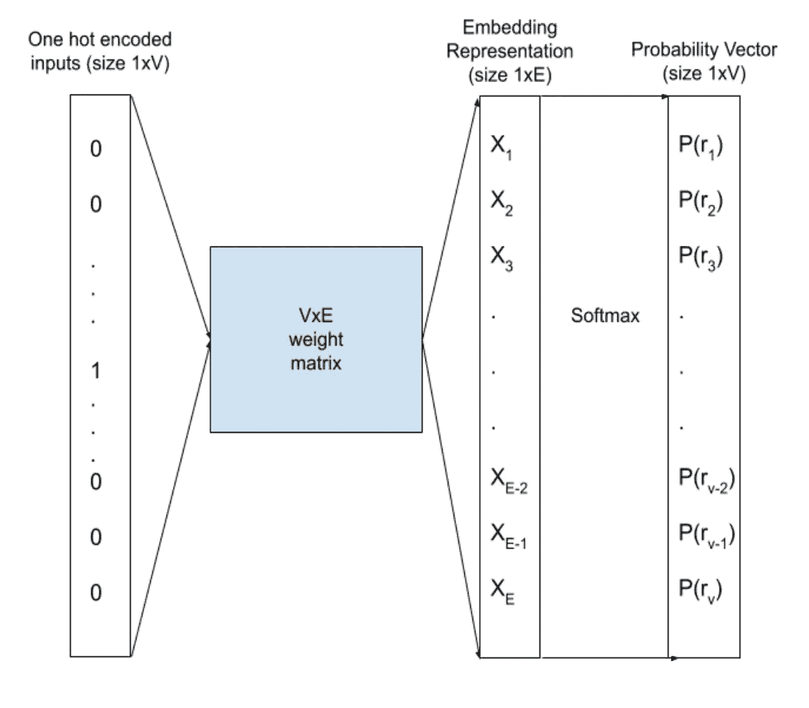*

*word 2 vec skip program 表示|作者图片*

*Tensorflow 的 wiki-words-250 由大小为 250 的单词嵌入组成。它可以通过遍历每个单词并计算每个单词的嵌入来应用于我们的模型。我们将需要应用 pad_sequences 函数来考虑不同长度的样本。*

*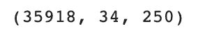*

*作者图片*

*因此，在训练数据中有 35，918 个样本，最大长度是 34 个单词(较少的单词被填充)，并且每个单词具有 250 个特征。*

*我们可以将同样的程序应用于我们的测试数据。*

*现在，让我们构建我们的模型。它将包括:*

*   ***1 LSTM 层**有 50 个单位*
*   ***2 个致密层**(一个有 20 个神经元，第二个有 5 个)，具有 ReLU 激活功能*
*   ***1 密集输出层**具有 s 形激活功能*

*我们将使用 Adam 优化器，一个二进制交叉熵损失和一个准确性的性能指标。该模型将被训练超过 10 个时期。请随意进一步调整这些超参数。*

*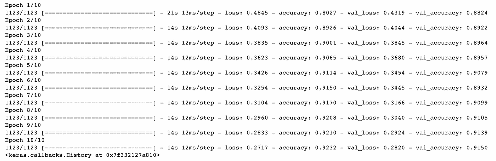*

*作者图片*

*如上所述，我们的模型对测试数据的最高准确率为 91.5%。*

# *介绍伯特*

*如果我问你英语中有最多定义的单词，你会说什么？*

*根据《牛津英语词典》第二版，这个词是“set”。*

*如果你想一想，我们可以在不同的上下文中用这个词造出许多不同的句子。例如:*

> *我的铅笔是一套**文具用品**的一部分
> 
> 我的队友**把**排球给了我*
> 
> *我摆好桌子准备吃饭*

*Word2Vec 的问题在于，不管单词的使用方式如何，它都会生成相同的嵌入。为了解决这个问题，我们可以使用 BERT，它可以**生成上下文化的嵌入**。*

*BERT 代表“来自变压器的双向编码器表示”。它使用一个转换器模型，利用注意力机制来生成情境化的嵌入。*

*转换器模型使用编码器-解码器架构。编码器层生成一个连续的表示，它由从输入中学习到的信息组成。解码器层创建一个输出，将之前的输入传递到模型中。 **BERT 只使用了一个编码器**，因为它的目标是生成一个矢量表示来从文本中获取信息。*

# *预训练和微调 BERT*

*采用两种方法来训练 BERT。第一种叫做掩蔽语言建模。在传递序列之前， **15%的单词被替换为一个【掩码】标记**。该模型将使用非屏蔽词提供的上下文来预测屏蔽词。这由以下人员完成*

*   ***在编码器输出上应用分类层**，包括嵌入矩阵。因此，它将与词汇表的大小相同。*
*   ***用 softmax 函数计算单词的概率**。*

*第二种方法是下一句预测。该模型将接收 2 个句子作为输入，并且**预测第二个句子是否跟随第一个**的二进制值。在训练时，50%的输入是成对的，而另外 50%是来自语料库的随机句子。为了区分这两个句子，*

*   *第一句开头加一个**【CLS】记号**，每句结尾加一个**【SEP】记号**。*
*   *每个记号(单词)都有一个**位置嵌入**来从文本中的位置辨别信息。这一点很重要，因为在 transformer 模型中没有递归，所以对单词的位置没有固有的理解*
*   *嵌入了的**句子被添加到每个记号(进一步区分句子)。***

*为了执行下一个句子预测的分类，【CLS】嵌入的**输出，表示“句子分类的集合序列表示法”，通过带有 softmax** 的分类层**，返回两个句子连续的概率。***

*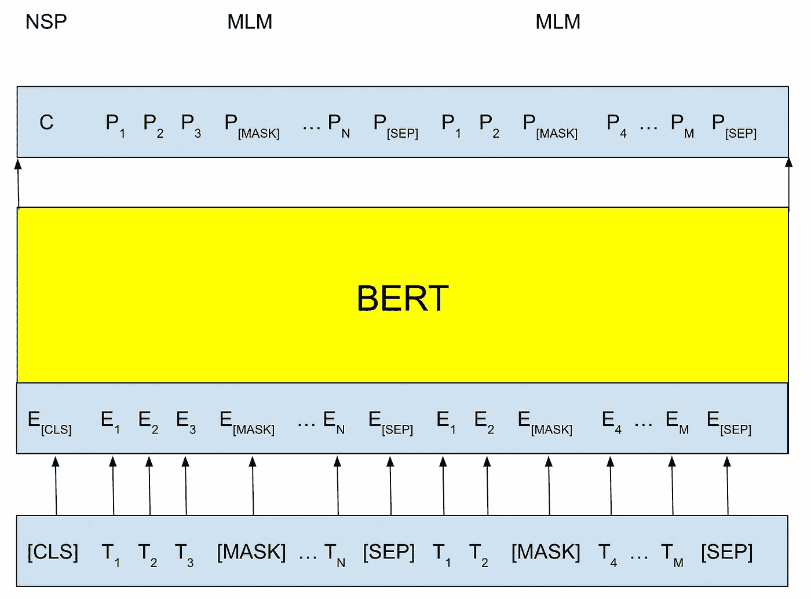*

*掩蔽语言建模和下一句预测|作者图片*

*因为我们的任务是分类，要微调 BERT，只需在 BERT 的[CLS]令牌输出上添加分类层。*

# *实施 BERT*

*我们将使用 Tensorflow-hub 的 BERT 预处理器和编码器。不要让文本通过我们之前描述的框架(去掉大写，应用词汇化等)。这是用 BERT 预处理器抽象出来的。*

*我们的数据帧最初应该是这样的:*

**

*最终数据帧|作者图片*

*之后，我们可以按照 80:20 的训练:测试比率将模型分为训练和测试数据。*

*我们现在可以用 Tensorflow-hub 导入 BERT 预处理程序和编码器*

*现在，我们可以开发我们的神经网络。它必须是一个功能模型，其中前一层的输出必须是下一层的参数。该模型包括:*

*   ***1 输入层:**这将代表将要传入模型的句子)。*
*   ***Bert _ preprocess 层:**这里我们传递输入来预处理文本。*
*   ***bert _ encoder 层:**这里我们将预处理过的令牌传递给 BERT 编码器。*
*   ***1 脱层**比率 0.2。BERT 编码器的 pooled_output 被传递给它(下面将详细介绍)*
*   ***2 个致密层**，分别有 10 个和 1 个神经元。第一个将使用 ReLU 激活函数，第二个将使用 sigmoid。*

*您可以看到“pooled_output”将被传递到 dropout 层。该值表示文本的整体序列表示。如前所述，它是[CLS]令牌输出的表示。*

*我们将使用 Adam 优化器，一个二进制交叉熵损失，以及一个准确性的性能指标。该模型将被训练超过 5 个时期。请随意进一步调整这些超参数。*

*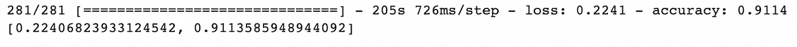*

*作者图片*

*从上面可以看到，在测试数据(来自 model.evaluate()方法)上，模型达到了 91.14%的准确率。*

# *创建 Web 应用程序*

*我们可以使用 HTML 和 Flask 创建一个 web 应用程序，允许用户与我们制作的模型进行交互。*

*到模型前端的链接可以在[这里找到](https://github.com/shayaf84/Fake-News-Detection/blob/master/templates/index.html)，到后端的链接可以在[这里找到](https://github.com/shayaf84/Fake-News-Detection/blob/master/app.py)。你可以通过 Google Colab 和 ngrok 在本地托管这个模型。*

*界面将如下所示:*

*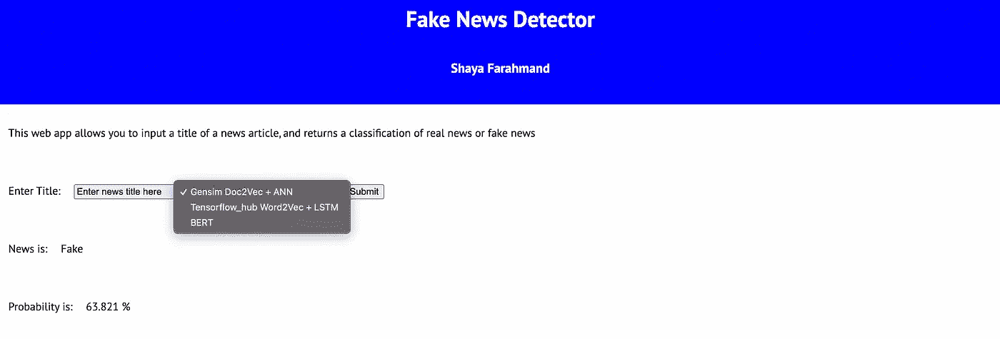*

*作者图片*

*有三种型号可供用户选择。*

*   *使用 Gensim Doc2Vec 的**基线密集神经网络***
*   *使用 wiki-words-250 嵌入的 **LSTM 模型**(使用 Word2Vec 架构)*
*   ***伯特模型***

*用户可以输入标题并选择型号。该应用程序将返回一个分类和一个概率，如果概率高于 50%，模型预测标题来自假新闻来源。因此，如果概率低于 50%，模型将预测标题来自真实的新闻来源。*

*我希望这篇文章展示了我们如何利用 NLP 中的技术来区分假新闻和真实新闻。你可能会问，“接下来我们能做什么？”嗯，我们的过程并没有结束。为了进一步改进我们的模型，我们可以:*

*   *根据更多数据训练我们的模型*
*   *调整我们模型的超参数*
*   *部署我们创建的 web 应用程序*

*希望你喜欢阅读这篇文章！欢迎在 [Linkedin](https://www.linkedin.com/in/shaya-farahmand-168307220/) 上加我，敬请关注更多内容！*

## *文献学*

*[1] [用 BERT](https://www.tensorflow.org/text/tutorials/classify_text_with_bert) (2022)，Tensorflow 对文本进行分类*

*[2] E .汤普森。[民意调查发现 90%的加拿大人已经陷入假新闻](https://www.cbc.ca/news/politics/fake-news-facebook-twitter-poll-1.5169916) (2019)，加拿大广播公司*

*[3]艾哈迈德、特拉奥雷和萨阿德。使用文本分类检测观点垃圾邮件和假新闻(2018)，《安全与隐私杂志》，第 1 卷，第 1 期，Wiley，*

*[4]艾哈迈德、特拉奥雷和萨阿德。使用 N-Gram 分析和机器学习技术检测在线假新闻，载于:Traore I，Woungang I，Awad A. (eds)分布式和云环境中的智能、安全和可靠的系统。ISDDC 2017。计算机科学讲义，第 10618 卷。施普林格，湛(第 127- 138 页)。*

*[5] J. Devlin、M. Chan、K. Lee 和 K. Toutanova。 [BERT:用于语言理解的深度双向转换器的预训练](https://arxiv.org/abs/1810.04805) (2019)，arXiv*

*[6] R. Horev， [BERT 解释道:面向数据科学的 NLP](/bert-explained-state-of-the-art-language-model-for-nlp-f8b21a9b6270) (2018)的最先进语言模型*

*[7] R. Kulshrestha， [NLP 101: Word2Vec- Skip-gram 和 CBOW](/nlp-101-word2vec-skip-gram-and-cbow-93512ee24314#:~:text=In%20the%20CBOW%20model%2C%20the,used%20to%20predict%20the%20context%20.) (2019)，走向数据科学*