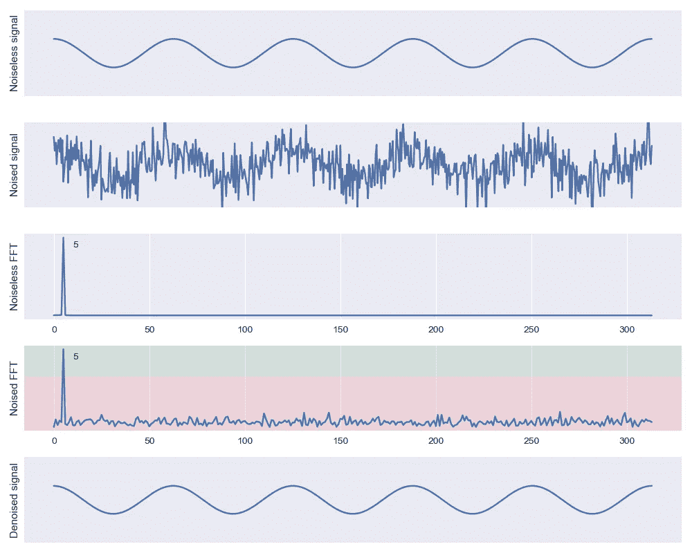
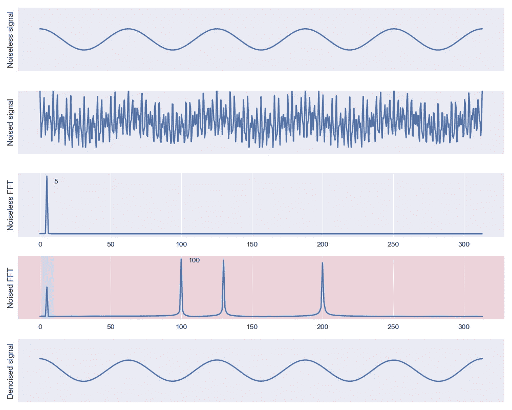
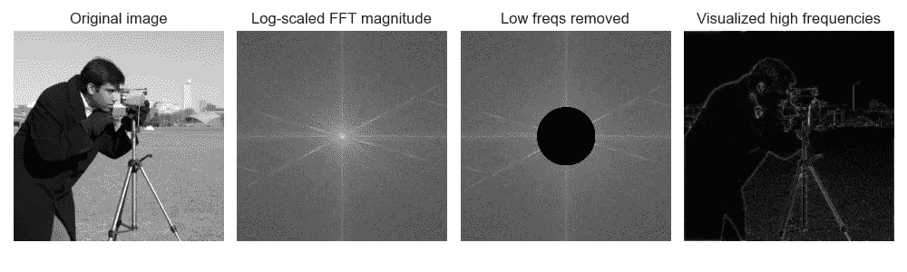
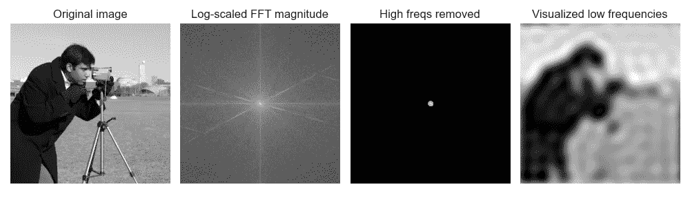

# 傅立叶变换，应用(4):让快速傅立叶变换发挥作用

> 原文：<https://towardsdatascience.com/the-fourier-transform-4-putting-the-fft-to-work-38dd84dc814>

## 傅立叶变换的实际应用

现在，我们已经拥有了演示 FFT 的一些真实用例所需的所有工具！

查看该系列的前几篇文章！

*   [https://towards data science . com/the-Fourier-transform-1-ca 31 ADB FB 9 ef](/the-fourier-transform-1-ca31adbfb9ef)
*   [https://towards data science . com/the-Fourier-transform-2-understanding-phase-angle-a 85 ad 40 a 194 e](/the-fourier-transform-2-understanding-phase-angle-a85ad40a194e)
*   [https://towards data science . com/the-Fourier-transform-3-magnitude and-phase-encoding-in-complex-data-8184 e2ef 75 f 0](/the-fourier-transform-3-magnitude-and-phase-encoding-in-complex-data-8184e2ef75f0)

# 介绍 IFFT

到目前为止，我们已经将傅立叶变换视为数学黑盒操作。类似地，我们现在将介绍*逆*傅立叶变换，而不剖析实现细节。逆傅立叶变换(IFFT)让我们逆转 FFT！

> ***逆*傅立叶变换是一种数学运算，它将我们在频域中的函数映射到时间或空间域中的函数信号。****

*IFFT(FFT(x)) ≈ x，逆性质成立！*

*重要的是，这种逆运算允许我们在频域和时间/空间域之间跳跃，以最方便的方式处理数据。*

# *傅立叶变换的应用*

*让我们开始研究傅立叶变换的实际应用吧！*

## *滤波和去噪*

*FFT 为我们提供了宝贵的“去噪”技术来抑制或消除数据中的伪像。首先，让我们考虑一个受一些低功率白噪声影响的近似[稳定的](https://en.wikipedia.org/wiki/Stationary_process)信号。为了演示，我们可以使用我们在 *之前使用的[相同的纯音信号(图 1](/the-fourier-transform-1-ca31adbfb9ef)* “无噪声信号”)。此外，尽管如此，让我们添加一些高斯噪声到信号中(*图 1* ，“噪声信号”)。*

*正如我们之前所做的那样，我们可以使用傅里叶变换来查看频率成分(*图 1* 、“无噪声 FFT”和“有噪声 FFT”)。*

**

***图 1** :从纯音信号中去除低功率噪声的简单去噪。图片作者。*

*超级有趣！在 FFT 中，我们可以看到我选择添加的噪声的一些属性。我添加的高斯噪声是零均值加性“白”噪声:它在不同频率上的强度大致相等。*

*尽管噪声在时域中看起来很可怕，但在频域中很容易分离出来。通过观察傅里叶变换的幅度值，我们可以将幅度视为频率的函数。在这个简单的例子中，我们可以非常容易地完美恢复我们的无噪声信号！由于信号和噪声之间有清晰的分离，我们可以设置硬阈值并丢弃(即设置为零)低幅度分量。保持阈值以上的值(*图 1* ，绿色的“有噪声的 FFT”)并降低阈值之前的值(*图 1* ，红色的“有噪声的 FFT”)，我们得到了无噪声信号的良好重建(*图 1* ，“去噪信号”)！*

*我们通常不会这么幸运。真实世界的噪音可能更糟糕！在许多情况下，噪音可能比我们的信号更大。但是，我们可以使用许多其他方法！*

*为了触及一种常见的滤波方法，我们来看看[带通](https://en.wikipedia.org/wiki/Band-pass_filter)滤波器。带通滤波器由两个阈值组成:(1)去除低于某个阈值的频率，允许较高频率通过(即“高通”)的滤波器，以及(2)去除高于某个阈值的频率，允许较低频率通过(即“低通”)的滤波器。结合起来，这两个滤波器只允许低频截止和高频截止之间的“频带”通过。*

*让我们在信号中加入一些高频成分。实际上，这些可能是我们环境中不想要的人为因素(例如，我们声音示例环境中不受控制的音频源)。*

**

***图 2** :从纯音信号中去除高频伪像的简单去噪。图片作者。*

*现在，我们不再为最小幅度设置硬阈值，而是将通带外的频率成分设置为零(*图 2* “噪声 FFT”)。我们再一次从噪音中恢复信号！*

## *特征抽出*

*我们也可以使用傅立叶变换来提取数据的特征。如果你之前遇到过[小波卷积](https://en.wikipedia.org/wiki/Wavelet_transform)的想法，还有一个[很深的数学联系](https://en.wikipedia.org/wiki/Convolution_theorem)！如果你对一篇深入探讨卷积定理的文章的评论感兴趣，请告诉我！*

*不过现在，我们可以通过可视化不同的频率成分来关注一个简单的例子。当我们在做这个的时候，让我们尝试一下傅立叶变换的 2D 推广！*

*我们建立的所有直觉仍然适用！靠近原点的值对应于低频，远离原点的值对应于高频。如前所述，np.abs 将恢复幅度，np.angle 将恢复相位。*

*如果我们只想检查图像的边缘，我们可以查看高频值，将原点附近的傅里叶变换分量的幅度设置为零(*图 4* )。*

**

***图 4** :简单去除低频图像成分，可视化高频。作者图。摄影师 Lav Varshney 拍摄的照片 CC0。*

*我们还可以通过将远离原点的值设置为零，来查看缓慢变化的低频分量！*

**

***图 5** :简单去除高频图像成分，可视化低频。作者图。摄影师 Lav Varshney 拍摄的照片 CC0。*

*我们可以利用这些技巧来提取各种有趣的统计特性。同样的方法也适用于一维时间或空间数据，使我们能够将缓慢移动的低频趋势与时间序列数据(如股票价值或整体市场分析)中的突然变化区分开来。*

## *其他应用*

*还有数不清的其他用途，但如果你有兴趣进一步阅读，这里有几个想到的:*

*   *有损图像压缩(如 [JPEG](https://en.wikipedia.org/wiki/JPEG) )通常使用[变换到频域](https://en.wikipedia.org/wiki/Discrete_cosine_transform)，*
*   *物理系统建模(像[热力学](https://www.youtube.com/watch?v=r6sGWTCMz2k)！此外， [3blue1brown](https://twitter.com/3blue1brown?lang=en) 是绝对的灵感)，*
*   *[对齐和注册方法](https://en.wikipedia.org/wiki/Phase_correlation)获取照片(或时间序列数据！)排队，*
*   *周期性生物现象(如呼吸率、心率)的估计和预测，以及*
*   *无线电数据分析和处理。*

*关于傅立叶变换，我们已经学得够多了，以至于危险！我们已经成功地充分发展了我们的直觉，能够解决现实世界的问题。如果你想看到其他傅立叶概念的解释，请留下评论。感谢阅读！*

*接下来，我们将介绍常见操作的傅立叶“备忘单”以及它们在工具箱中的位置。*