# 色彩在数据中的作用:一个简单(但完整)的指南

> 原文：<https://towardsdatascience.com/the-function-of-color-in-data-viz-a-simple-but-complete-guide-c324ca4c71d0>

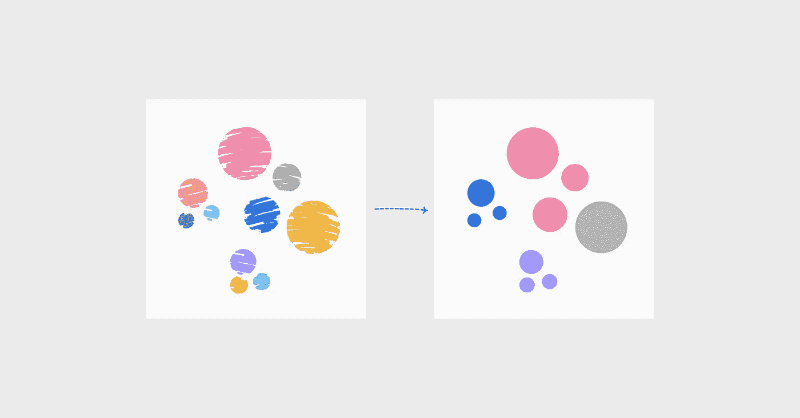

作者配图

## 有意义地使用颜色

## 创建生动图表所需的一切

颜色在任何设计中都扮演着重要的角色，数据可视化也不例外。除了设定基调，它还经常影响我们的感知。考虑下面的例子。不看标题，如果看到左边的图表(红色的)你会怎么想？如果你看到右边的图表(蓝色的)，你会怎么想？

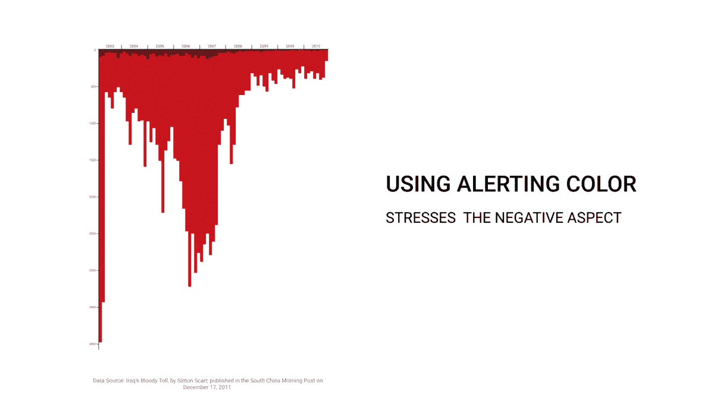

*Gif 作者，基于安迪·科特格里夫的文章[1]。原始资料图来源:S. Scarr，* [*伊拉克的血腥代价*](https://www.scmp.com/infographics/article/1284683/iraqs-bloody-toll?module=perpetual_scroll_0&pgtype=article&campaign=1284683) *(2011)，南华早报。*

两个图表使用相同的数据；事实上，它们是镜像。第一个版本是警醒——红色带有负面的内涵，它让我们想起墙上滴下的鲜血。看这个版本，你倾向于关注极端的数字。相比之下，第二个版本似乎传递了相反的信息。蓝色即使不是积极的，也是一种更中性的色调，你倾向于关注最近数量的减少。在这两种情况下，暗示性的标题都强化了信息。但是我们得到不同的见解，关注不同的方面，因为我们感知了颜色，即使没有看到标题。

这是因为颜色是前注意属性之一，是我们立即察觉的视觉特征，无需有意识的处理。它在我们没有意识到的情况下影响了我们的感知。这个过程是无意识的，由文化和我们以前的经历驱动。因此，它可能因人而异。幸运的是，一些指南帮助我们小心使用颜色。我推荐检查一下大卫·麦克肯多斯创作的文化图中的[颜色。](https://www.informationisbeautiful.net/visualizations/colours-in-cultures/)

# 色彩的功能

正如已经提到的，你可以用颜色来设定基调。尽管这个功能很重要，值得掌握，但我还是想重点介绍另外三个有时被忽略的功能:**显示关系**、**显示不同状态**和**显示值**。

这三者都是从认识数据点和我们应该使用的调色板之间的关系开始的。如果你不熟悉调色板和它们的用法，我推荐你从我之前关于这个主题的文章开始。如果你知道分类调色板、顺序调色板和发散调色板之间的区别，让我们分析一下如何将它们结合起来，使用标准的气泡图来显示颜色的不同功能。

在下面的例子中，颜色扮演了一个纯粹的装饰角色，并设置了一种情绪，而不是其他任何东西。给数据墨水*着色没有额外的价值。

**数据墨水是爱德华·塔夫特创造的一个术语。这意味着墨水致力于数据信息的非冗余显示[3]。*

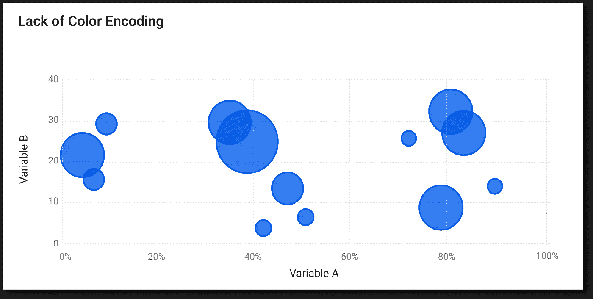

作者配图。缺少颜色编码的例子。

## 使用颜色来显示关系

显示关系有两种方式:分类或分组。在这两种情况下，我们都希望将一个集合中的成员与其他集合中的成员区分开来。另外，在分组的情况下，我们想要显示情感。这需要使用不同的方法。对于分类，我们应该使用分类颜色，而对于分组的分歧。

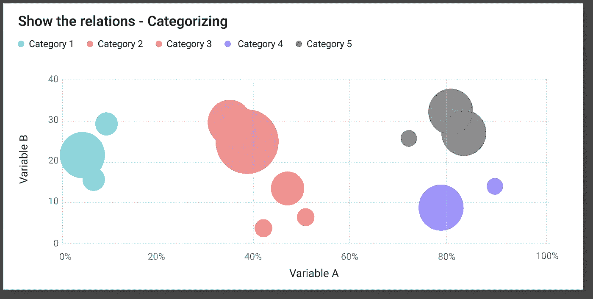

作者配图。分类:显示关系的示例

*   **功能:**分类
*   **颜色:**分类*
*   **目的:**区分一个类别与另一个类别
*   **良好实践:**保持颜色易于区分，亮度相似。你不必对后者非常严格，只要其中一个类别不比其他类别更突出，你就很好(见下面的例子)。

**如果你的类别遵循某种自然顺序(例如，年龄组、收入组、教育水平)，你可以考虑使用连续调色板或相邻色调的分类[4]。*

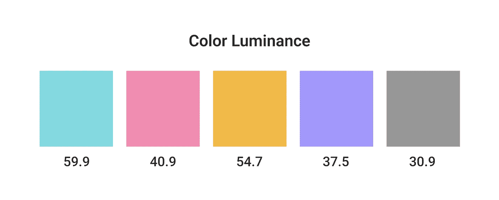

作者配图。所选分类调色板的颜色亮度值。

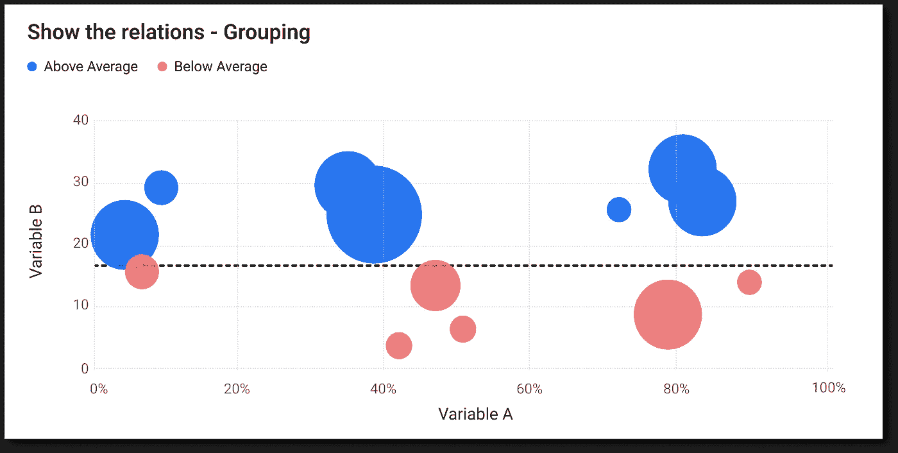

作者配图。分组:显示关系的示例

*   **功能:**分组
*   **颜色:**有无中点发散(浅灰色)
*   **目的:**将一个类别与另一个类别区分开，并显示情感(某物是好的/上面或坏的/下面)
*   **良好实践:**使用保持自然联想的颜色，具有相似的亮度(这样一种颜色不会比另一种更突出/吸引更多的注意力)，并且容易被视力有缺陷的人区分。

最常见的显示关系好坏的颜色组合是绿色和红色。但是大约 5%的人口很难区分这两种颜色。更安全的做法是使用红蓝组合，或者，如果不可行，在绿色中添加一些蓝色。

在下面的例子中，你可以看到不同视力缺陷的人是如何感知每种颜色组合的。每个人都很容易区分红蓝组合，而普通的红绿对于弱视患者来说就像是一种颜色。

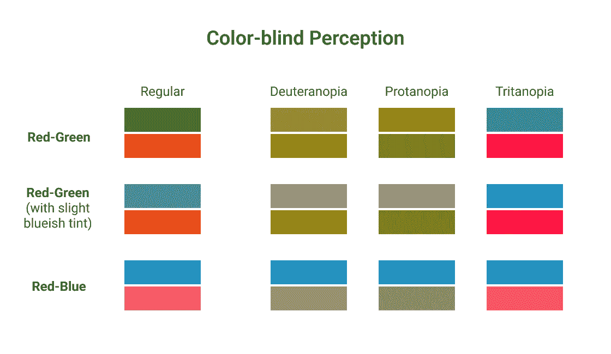

作者配图。使用 [Adobe 颜色辅助工具](https://color.adobe.com/create/color-accessibility)检查颜色辅助功能。

另一个方面是把颜色和它的意义联系起来。有一些普遍的颜色联想，像冷代表蓝色，热代表红色，土代表棕色，自然代表绿色。我喜欢美国宇航局地球观测站的例子——在谈论降雨量偏差量时，使用棕色-蓝色组合更有意义，其中棕色表示少雨/干旱，蓝色表示多雨。假设你找不到任何合适的组合。在这种情况下，最安全的选择是选择蓝色和红色，并使用它们作为好-坏对立(记住，蓝色，而不是绿色，由于上面提到的可访问性原因)。

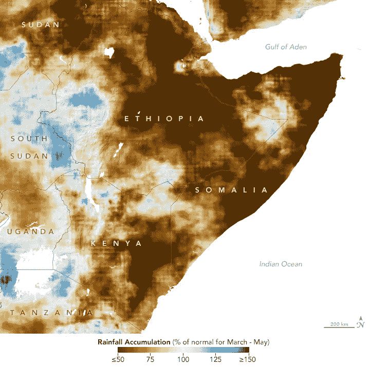

图片来自[深切关注东非的粮食安全](https://earthobservatory.nasa.gov/images/150217/deep-concern-about-food-security-in-eastern-africa)，NASA 地球观测站，公共领域。

## 用颜色来表示不同的状态

我们可以用颜色来突出显示不同的状态。这两种用法最大限度地融合了色彩的前期处理。它们有助于引导注意力和强调重要数据[5]。

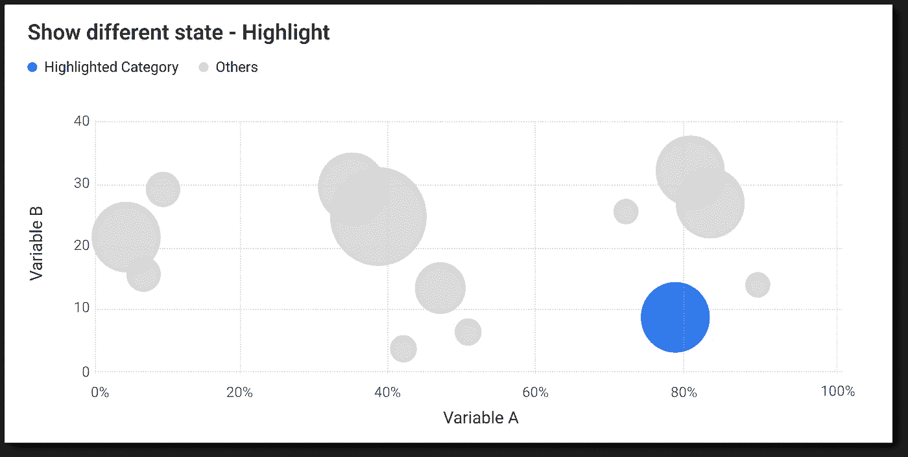

作者配图。突出显示:显示不同状态的示例

*   **功能:**高亮
*   **颜色:**中性色和正色的二元配色
*   **目的:**显示某一点的重要性
*   **良好实践:**只对你想要突出显示的点使用颜色，对其他所有点使用灰色。你可以使用正色，如蓝色、绿色或品牌色。另一种可能性是区分亮度，并为您想要突出显示的数据分配较暗的阴影[5]。理想情况下，您最终会得到一个二进制模式，将数据分成突出显示的部分和其余部分。

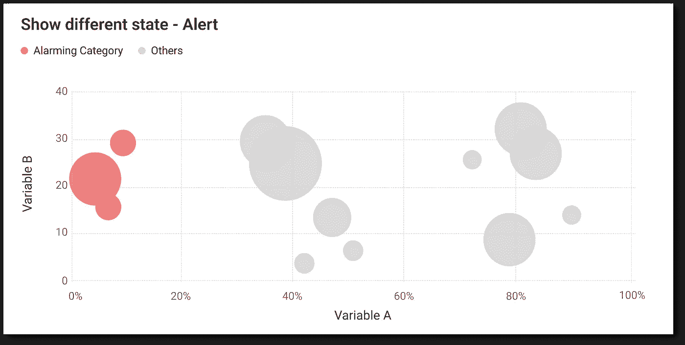

作者配图。警报:显示不同状态的示例

*   **功能:**预警
*   **颜色:**带有中性和警示色的二元配色方案
*   **目的:**引起注意并发送警告信息
*   **好习惯:**挑选能迅速吸引注意力的颜色。红色是个不错的选择。研究表明，红色的情感内涵在消极和积极之间转换。但重要的是，在这两种情绪极端情况下，红色都是重要刺激存在的信号，会吸引注意力。另一个不错的选择是粉色或橙色(后者作为警示色效果很好，或者是红色的补色，显示出不太强烈的警示)

## 使用颜色对值进行编码

颜色的最后一个功能是编码值。它可以用于离散或连续的规模。在这两种情况下，我们应该按照顺序使用颜色，并选择连续或发散的调色板。

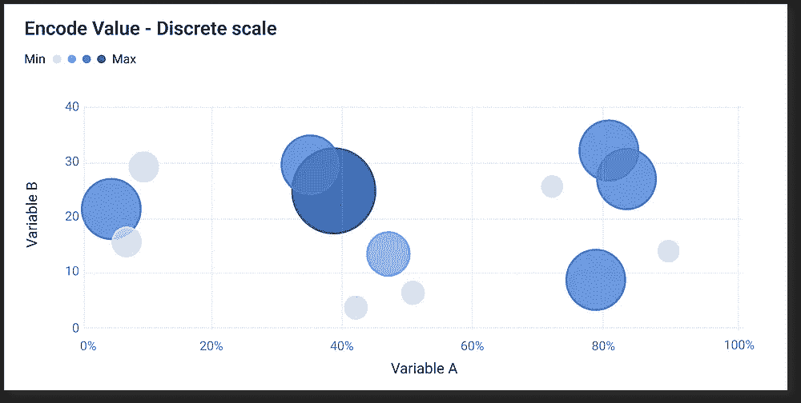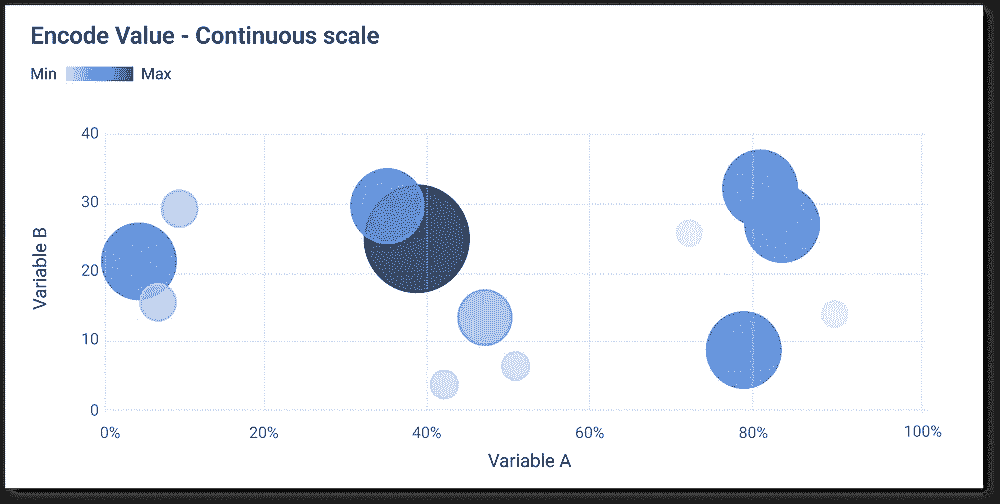

作者配图。编码值的示例。左边:离散标度。右边:连续音阶。

*   **功能:**编码值
*   **色彩:**若有中点则依次或发散。根据规模，使用离散或连续变量
*   **目的:**显示数值的差异
*   **良好实践:**选择连续调色板时要记住的最重要的事情是亮度的线性变化。根据用途，你可以选择单色(最适合热图)或多色(适合散点图)。在我的另一篇[文章](/3-tips-to-master-your-sequential-palette-a56a46bd7853)中，你会发现更多关于顺序调色板的技巧。

# 要记住的两个最大的颜色使用限制

颜色有很多功能，但也有一些局限性。其中最重要的是不精确的见解和过度使用时会分散注意力。

## 颜色不适合精确和准确的比较

尽管颜色可以用来显示数值，但它并不适合于精确和准确的比较。正如 Cleveland 和 McGill 的研究所示，有十个基本的感知任务与一种表示数据的方法相关联[8]。在一系列实验的基础上，他们根据判断的准确性进行排序。如下图所示，阴影和饱和度位于排名的底部。这意味着它们允许不太准确的评估；换句话说，用户在评估价值时更容易出错。

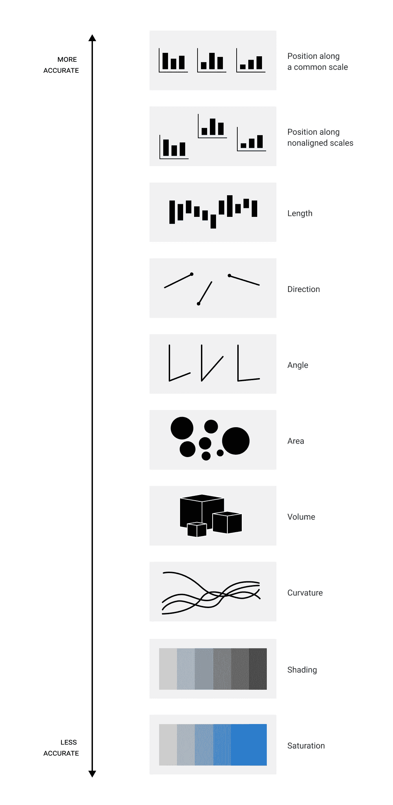

作者配图。根据克利夫兰和麦吉尔的研究对基本知觉任务进行排序。图表灵感来自阿尔贝托·开罗的[图表](http://www.thefunctionalart.com/2013/08/in-infographics-steal-what-you-need-but.html)【9】。

这并不意味着你不应该使用颜色来编码数据。但是当目标是允许精确比较时，基于位置(例如散点图、折线图)或长度(条形图、柱形图、甘特条形图)的图表胜过其他形式的表示。

如果你不相信，我们来快速测试一下。使用下面的图表，试着说出 D 和 H 之间的区别？**

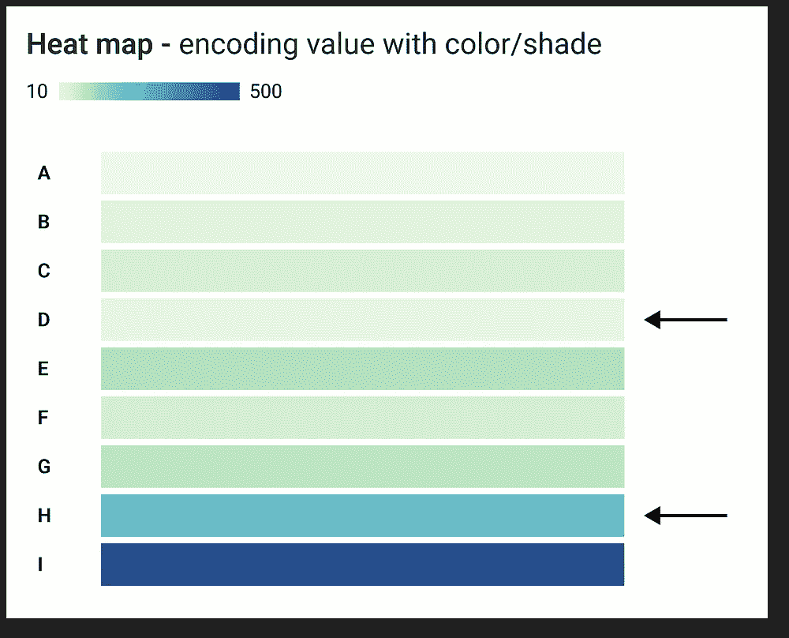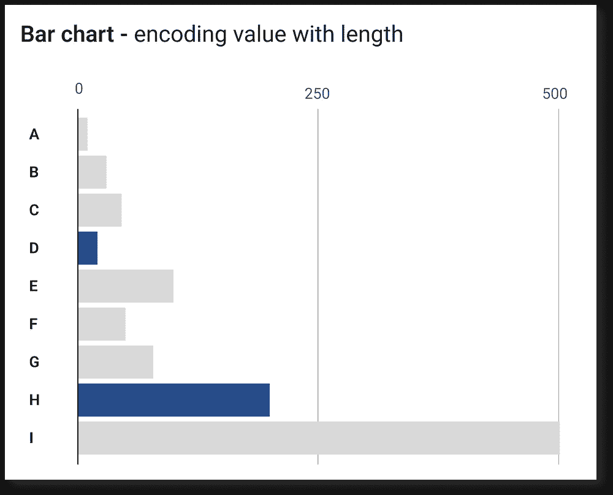

作者配图。比较使用两种不同编码方法(颜色/阴影和长度)的数据比较准确性。

## 使用太多颜色

一般来说，这是一个错误的方法——这就是为什么大多数设计师的[调色板的颜色数量有限的原因。有很多 UI 规则，比如 60–30–10 或者最多 3 种颜色[10]。在数据可视化方面也是如此。颜色越少越好。类别太多会降低信息处理速度。很多资源都说颜色的最佳数量在 6 到 8 之间。我个人喜欢把它保持在 6 以下，因为你给图例添加的每一种颜色都会增加你的观众的认知负荷。](https://colorhunt.co/)

图表顶部有十种颜色的图例意味着用户要么必须记住十种不同颜色的关联(想象以一种违反直觉的方式分配它们)，要么在图表和图例之间来回跳转。两种解决方案都涉及认知负荷，这是最昂贵的一种[11]。在第一种解决方案中，用户必须记住类别；第二个，已经处理过的信息。

幸运的是，有一些解决办法。您可以重新考虑类别并限制颜色数量，更改图表类型，或将图例放在数据旁边。下面是一个改变图例位置和减少颜色使用如何减轻认知负荷的例子。

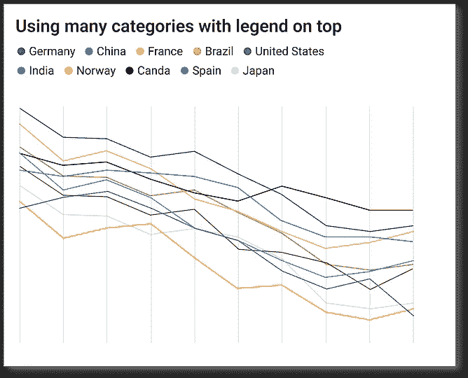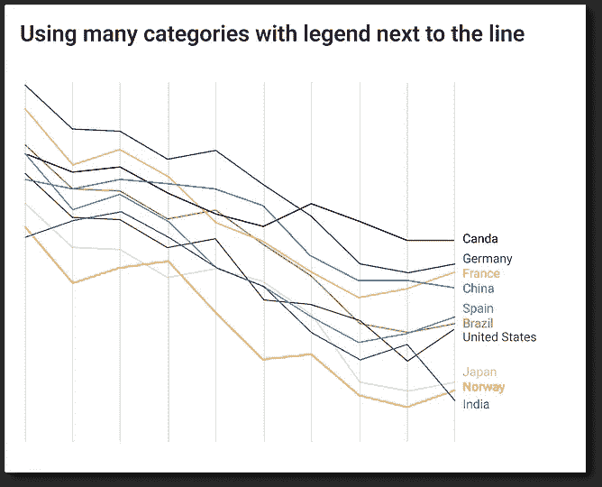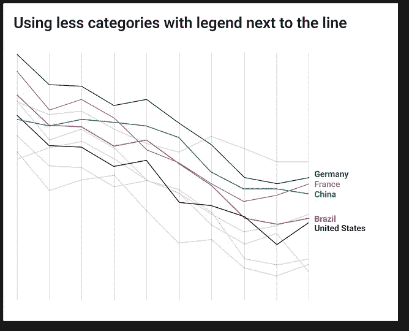

作者配图。使用标签的三种方法。左图:使用包含所有类别的单独图例。中间一个:将所有类别名称放在数据旁边。右一:限制类别的数量，并将它们的名称放在数据旁边。

***两个图表的差异相同。H 比 D 大十倍，H 等于 200，而 D 等于 20。*

*不想错过我的任何帖子？把它们直接发到你的收件箱里。做那个* [*这里*](https://gawarska-tywonek.medium.com/subscribe) *！*

如果你还不是中等家庭的一员，考虑注册成为会员。它每月只需 5 美元，支持数千名作家。 [*注册我的会员链接*](https://gawarska-tywonek.medium.com/membership) *，除了可以访问所有发表的内容，你还会得到我永远的感谢。*

# 链接

[1]a . cotgreve，[伊战的血腥代价:用标题、颜色和方向控制你的信息](https://gravyanecdote.com/uncategorized/should-you-trust-a-data-visualisation/) (2014)，Iraq 轶事

[2] W.Gawarska-Tywonek，[从选择合适的调色板开始](/use-color-meaningfully-choose-the-proper-pallet-2cfbb71a30f4) (2022)，走向数据科学

[3] E .塔夫特，*(*1983)

[4] A.Wilson，[调色板的力量:为什么颜色是数据可视化的关键以及如何使用它](https://blog.adobe.com/en/publish/2017/02/27/the-power-of-the-palette-why-color-is-key-in-data-visualization-and-how-to-use-it) (2017)，Adobe 博客

[5] K. Nussbaumer Knaflic，[用数据讲故事:商业专家数据可视化指南](https://www.amazon.com/gp/product/1119002257/ref=as_li_qf_asin_il_tl?ie=UTF8&tag=storytellingwithdata-20&creative=9325&linkCode=as2&creativeASIN=1119002257&linkId=c9a5d9689e0665c8098acb1bd01b51e1) (2015)，威利

[6] M. Kuniecki，J. Pilarczyk，S.Wichary，[红色在情感环境中吸引注意力。一项 ERP 研究](https://www.frontiersin.org/articles/10.3389/fnhum.2015.00212/full) (2015)，人类神经科学前沿

[7] W. Gawarska-Tywonek，[掌握连续调色板的 3 个技巧](/3-tips-to-master-your-sequential-palette-a56a46bd7853) (2022)，走向数据科学

[8] W. Cleveland，R. McGill，[图形感知:理论、实验和应用于图形方法的发展](https://www.jstor.org/stable/2288400) (1984)，美国统计协会

[9] A. Cairo，[功能艺术:信息图形和可视化介绍](https://www.amazon.pl/functional-art-introduction-information-visualization/dp/0321834739/ref=asc_df_0321834739/?tag=plshogostdde-21&linkCode=df0&hvadid=504212245098&hvpos=&hvnetw=g&hvrand=17470401378401661407&hvpone=&hvptwo=&hvqmt=&hvdev=c&hvdvcmdl=&hvlocint=&hvlocphy=9061073&hvtargid=pla-434099786311&psc=1) (2012)，Addison Wesley

[10] N. Babich，[在你的设计中使用色彩的 6 个简单技巧](https://uxplanet.org/5-simple-tips-on-using-color-in-your-design-40916d0dfa63) (2019)，UX 星球

[11] S. Weinschenk，[每个设计师需要了解的关于人的 100 件事](https://www.amazon.pl/Things-Every-Presenter-Needs-People/dp/1729226000/ref=asc_df_1729226000/?tag=plshogostdde-21&linkCode=df0&hvadid=504604467541&hvpos=&hvnetw=g&hvrand=2094103822596335217&hvpone=&hvptwo=&hvqmt=&hvdev=c&hvdvcmdl=&hvlocint=&hvlocphy=9061073&hvtargid=pla-645823545755&psc=1) (2018)