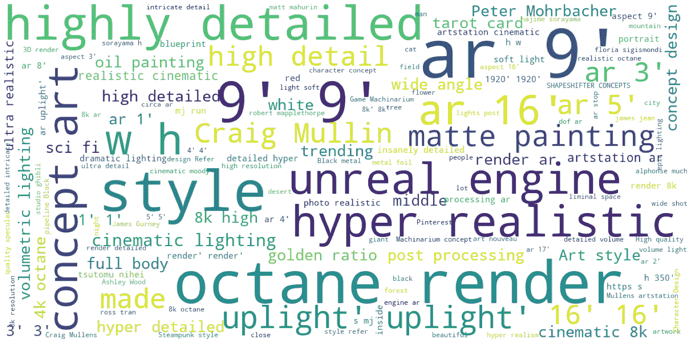
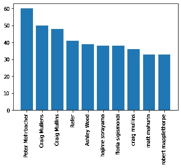
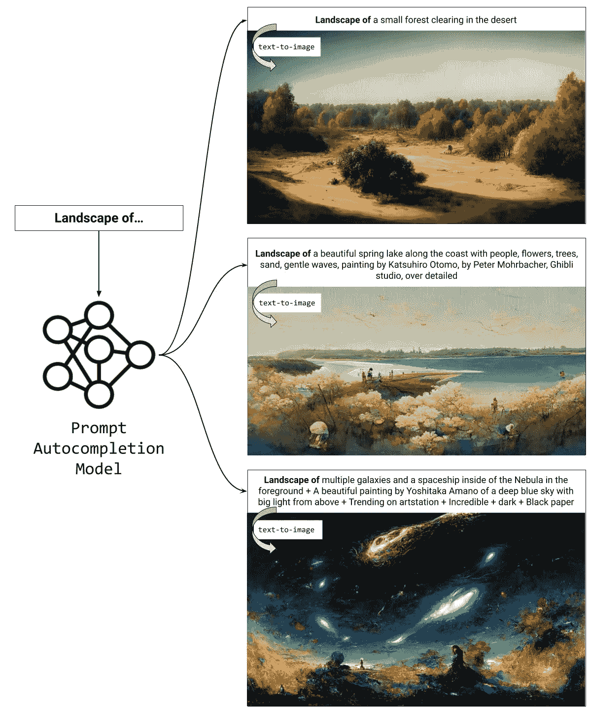

# 为文本到图像模型制作提示

> 原文：<https://towardsdatascience.com/the-future-of-crafting-prompts-for-text-to-image-models-fc7d9614cb65>

## 只要你知道正确的咒语，DALL E 可以产生你想要的任何东西

通过[中途](http://midjourney.com)生成的插图(生成式人工智能)。文字提示:“一个男孩绝望地在笔记本电脑键盘上打字，沮丧的脸，明显生气，卡通风格”。

像 [DALL E](https://openai.com/dall-e-2/) 这样以文本为条件的图像生成模型的出现无疑将改变传统的创作过程。然而，艺术不一定是免费的:负担将简单地从绘画或使用复杂的图形设计软件转移到制作有效的文本提示，以控制文本到图像模型的突发奇想。本文讨论了用户和公司解决**即时工程**或**即时设计**挑战的潜在方法。

> 提示是迁移学习的最新和最极端的形式。对图像的每一次请求都可以被视为一个新的任务，由一个根据大量数据预先训练好的模型来完成。在某种程度上，提示已经使迁移学习民主化，但还没有使它变得毫不费力。写有效的提示可能需要和培养一个新爱好一样多的工作。

# 提示的起源

有人可能会说，提示是迁移学习的最新和最极端的形式:一种允许先前训练的模型权重在新的环境中重用的机制。这些年来，我们找到了在构建特定任务模型时重用越来越多预训练权重的方法。2013 年， *word2vec* [1]将通用 word 嵌入捆绑成静态库；人们用它们作为他们 NLP 模型的现成输入。在 2010 年代末，ELMo [2]和 BERT [3]等模型引入了*微调*:它们允许预训练模型的*整个架构*被重用，并与每个任务的最小数量的额外权重连接。最后，GPT-3 [4]在 2020 年通过*提示*关闭了迁移学习章节:一个单独的预训练模型现在可以执行几乎任何特定的任务，无需额外的参数或重新训练；它只需要通过文本输入被引导到正确的方向。DALL E 等文本到图像模型处于迁移学习光谱的同一端:对图像的每个请求都可以被视为模型要完成的新任务。

# 当前的事态

在某种程度上，提示已经使迁移学习民主化:用户不再需要 ML 工程技能或昂贵的微调数据集来利用大模型的力量。然而，利用生成性人工智能还不是轻而易举的。今天，在第一篇 DALL E 论文发表 1.5 年后，DALL E 2 向少数人开放 3 个月后，写有效的提示可能需要像培养新的爱好一样的努力。有一个学习曲线在起作用:人们修补模型，通过反复实验，他们发现输入和模型行为之间的相关性。他们也让自己沉浸在文本到图像的社区中(例如 [Reddit](https://www.reddit.com/r/dalle2/) 、 [Twitter](https://twitter.com/hashtag/dalle2?src=hashtag_click) 等)。)来学习这一行业的诀窍并分享他们自己的发现。除此之外，他们还争论达尔 E 2 [是否有](https://twitter.com/giannis_daras/status/1531693093040230402)或[没有](https://twitter.com/benjamin_hilton/status/1531780892972175361)秘密语言。

作为一个数据驱动型的人，我想知道数据是否能提供一条捷径来获得快速工程这一难以捉摸的技能。我们与一位[朋友](https://twitter.com/gaurav_nemade15)一起，窃取了 [Midjourney](https://www.midjourney.com) 的公共 Discord 服务器，用户在那里与一个机器人互动，发出提示，并获得人工智能生成的图像作为回报。我们在 10 个频道上收集了 4 个月的请求和响应，并在 Kaggle 上提供了数据集:[中途用户提示&生成的图像(250k)](https://www.kaggle.com/datasets/succinctlyai/midjourney-texttoimage) 。

**文本提示中最常用的短语**由[中途](http://midjourney.com)用户发布。查看 Kaggle 上的完整数据集:[中途用户提示&生成的图像(250k)](https://www.kaggle.com/datasets/succinctlyai/midjourney-texttoimage) 。作者制作的插图。

上面的词云说明了 Midjourney 用户发出的文本提示中最常用的短语。其中一些是意想不到的，至少对于非鉴赏家来说是这样。取代动物、机器人或任何其他我们人类觉得可爱的实体(即*内容*)的是*修饰语*(即描述期望输出的风格或质量)。它们包括像[辛烷渲染](https://en.wikipedia.org/wiki/Octane_Render)或[虚幻引擎](https://www.unrealengine.com/en-US)这样的应用名称和像[克雷格穆林斯](https://en.wikipedia.org/wiki/Craig_Mullins)这样的艺术家名称。你可以在[这本笔记本](https://www.kaggle.com/code/succinctlyai/midjourney-prompt-analysis)里找到更详细的提示分析。免责声明:目前还不清楚这些发现有多普遍。它们可能只是反映了潜在的有偏见的用户群的口味，或者可能只是从中途模型中引出强烈的视觉反应。如果你有 DALL E 2 的权限，让我知道他们对它有没有影响！

中途用户在他们的文本提示中提到的顶级艺术家(y 轴是每 10k 个提示的随机子样本的计数)。你可以在本笔记本中找到更多统计数据。

诚然，我们被观察到的提示的复杂性所淹没，我们决定在这些用户生成的文本提示上对大型语言模型 GPT-2 进行微调。我们现在可以依靠它来自动完成我们微薄的提示，并将其转化为创造性的和复杂的输入，而不是靠我们自己来学习交易的技巧。**我们的模型在** [**的 HuggingFace 上免费提供，简洁/text 2 image-prompt-generator**](https://huggingface.co/succinctly/text2image-prompt-generator)**。请随意与演示互动！**

提示自动完成模型的示例用法，可在[简洁地/text 2 image-prompt-generator](https://huggingface.co/succinctly/text2image-prompt-generator)获得。这三幅图像是在[中途](https://midjourney.com)生成的。插图本身是作者画的。

# 激励遇上资本主义

> 在商业中，时间就是金钱，文本提示也是如此。

随着 DALL E 2 和 Midjourney 等竞争服务变得越来越普及(前者目前正在向其第一批一百万用户推出，而后者正在 T2 进行公开测试)，专业人士开始评估将生成性人工智能融入他们工作流程的潜力。例如，一位平面设计师在 Twitter 上发了一个帖子，探讨 DALL E 2 创建独特模型的能力:

随着文本到图像模式进入资本主义(专业设计、内容营销、广告创意)，提示不再是一种娱乐爱好，而是一项需要有效完成的工作。在商业中，时间就是金钱，文本提示也是如此。[一些人](https://www.reddit.com/r/dalle2/comments/w5y162/comment/ihbgpoi/?utm_source=share&utm_medium=web2x&context=3)预测，与其他类型的体力工作类似，即时工程将被转移到低收入国家:工人将获得每小时 10 美元的报酬，以发布尽可能多的查询并选择最佳视觉输出。然而，随着 OpenAI [颇具争议的](https://jimclydemonge.medium.com/dall-e2s-new-pricing-is-making-people-upset-b55c853faaf7)宣布基于信用的定价模式(本质上是按使用量收费，而不是提供订阅)，用户被激励发出尽可能少的提示。因此，取代上面的暴力方法，我们可能会看到一个新的职业出现:*提示工程师*——一个精通生成人工智能的能力和奇思妙想的人，他可以在 3 次或更少的尝试中制作出你需要的插图。

# 研究将如何介入

提示不一定需要永远是人类的劳动。事实上，当提示实践首次出现在文本生成领域时，研究人员对其进行了广泛的研究。这本可能并不完整的文集提到了截至 2022 年 7 月底的 86 篇论文。许多文章提出了自动化，自动地*以一种更模型友好的方式重新表述*输入，包含冗余，*生成额外的令牌*以使模型的任务更加明确，产生*软提示*(即，修改原始输入提示的内部表示)，或者为 [*交互会话*](https://arxiv.org/abs/2201.06009) 设计一个框架，在这个框架中，模型记住用户的偏好和对更长请求序列的反馈。很可能同样数量的研究将用于驯服文本到图像的模型。

# 承认

中途刮削项目是与 [Gaurav Nemade](https://www.linkedin.com/in/gauravnemade/) 合作完成的。

# 资源/链接

*   Kaggle 数据集(Midjourney 用户提示和生成的图像(250k):[https://www . ka ggle . com/datasets/succictlyai/Midjourney-texttoimage](https://www.kaggle.com/datasets/succinctlyai/midjourney-texttoimage)
*   仅带有文本提示的 HuggingFace 数据集:[https://hugging face . co/datasets/essentially/mid journey-prompts](https://huggingface.co/datasets/succinctly/midjourney-prompts)
*   HuggingFace 模型(提示生成器):[https://hugging face . co/简洁地/text 2 image-prompt-generator](https://huggingface.co/succinctly/text2image-prompt-generator)

# 参考

[1] Mikolov 等人(2013)，[向量空间中单词表示的有效估计](https://arxiv.org/abs/1301.3781)

[2] Peters 等(2018)，[深度语境化的词语表征](https://arxiv.org/abs/1802.05365)

[3] Devlin 等人(2018)， [BERT:用于语言理解的深度双向变换器的预训练](https://arxiv.org/abs/1810.04805)

[4] Brown 等人(2020)，[语言模型是很少出手的学习者](https://arxiv.org/abs/2005.14165)