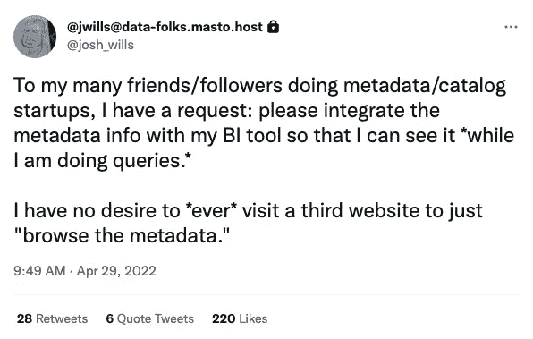
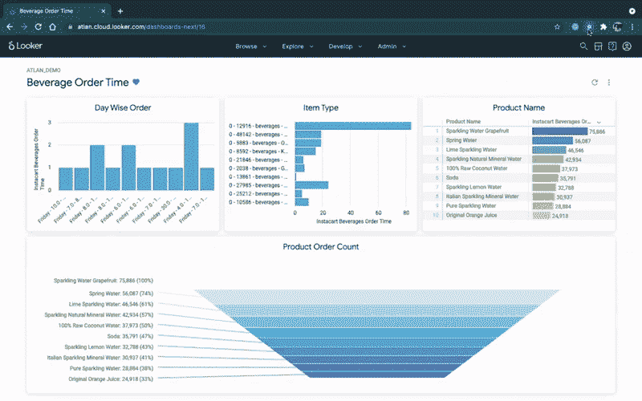
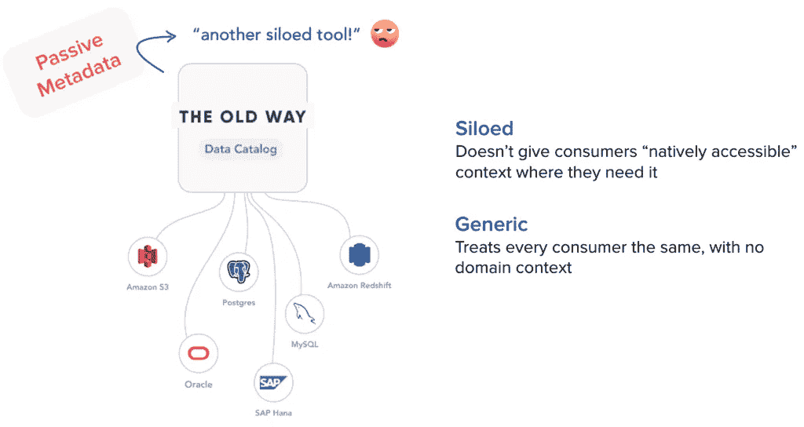
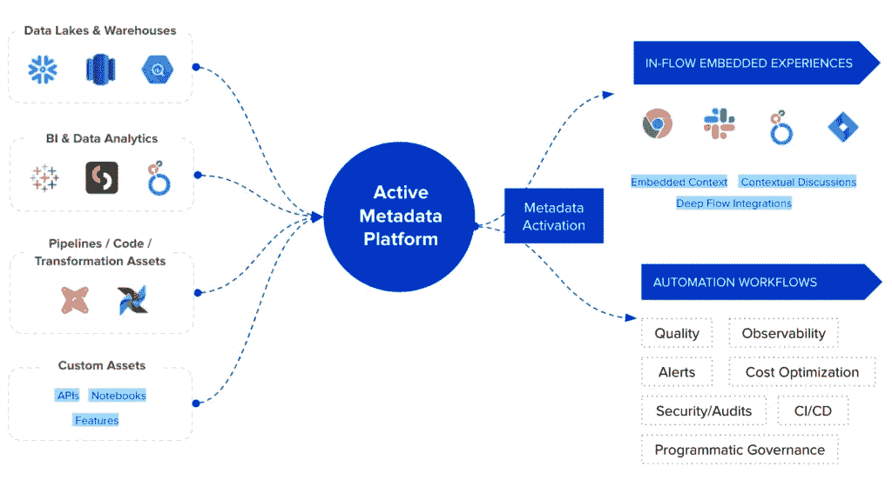

# 数据目录的未来

> 原文：<https://towardsdatascience.com/the-future-of-data-catalogs-868ffbe7354d>

## 从来没有人说过，让我们访问一个网站只是为了“浏览元数据”

Denys Nevozhai 在 [Unsplash](https://unsplash.com/?utm_source=unsplash&utm_medium=referral&utm_content=creditCopyText) 上拍摄的照片

上周五，数据 Twitter 上充斥着乔希·威尔斯关于元数据和商业智能的推文。

[由乔希·威尔斯在推特上发布](https://twitter.com/josh_wills/status/1520082864234106881)

在 [Atlan](https://atlan.com/) 时，我们开始是一个数据团队，而[我们在实现一个数据目录](https://humansofdata.atlan.com/2021/03/we-failed-to-set-up-a-data-catalog-3x-heres-why/)时失败了三次。作为目睹这些项目失败的数据领导者，我发现数据目录失败的最大原因是用户体验。这不仅仅是一个漂亮的用户界面。这是关于真正理解人们如何工作，并给他们最好的体验。

> 像乔希这样的人在他们需要的时候，想要他们所处的环境。

例如，当你在像 Looker 这样的 BI 工具中时，你不可避免地会想，“我信任这个仪表板吗？”或者“这个指标是什么意思？”任何人最不想做的事情就是打开另一个工具(也就是传统的数据目录)，搜索仪表板，浏览元数据来回答这个问题。

想象一个数据目录不存在于自己的“第三网站”的世界。相反，用户可以在他们需要的地方获得所有上下文——无论是在他们选择的 BI 工具中，还是在他们已经在使用的任何工具中，无论是 Slack、吉拉、查询编辑器还是数据仓库。

*Looker 中的活动元数据。(图片来自作者。)*

我相信这是数据目录的未来——激活元数据并将元数据带回数据团队的日常工作流程中。

> [*用 Josh 的话来说*](https://twitter.com/josh_wills/status/1520135932967411712) *“就像是逆向 ETL 但是针对元数据”。*

# 为什么今天数据目录不这样工作？

传统上，数据目录是被动的。他们将元数据从一堆不同的工具带入另一个工具，称为“数据目录”或“数据治理工具”。

这种方法的问题是，它试图通过增加一个孤立的工具来解决“太多孤岛”的问题。这并不能解决像 Josh 这样的用户每天面临的问题。最终，用户采用受到影响！

一家大公司的高级数据主管称这些数据目录为"**昂贵的货架软件**"，或搁置在货架上永远不会被使用的软件。

*传统数据目录的问题。(图片由作者提供。)*

# 我们怎样才能避免数据目录变成货架软件？

想想我们今天使用和喜爱的现代工具——[GitHub](https://github.com/)、 [Figma](https://www.figma.com/) 、 [Slack](https://slack.com/) 、[观念](https://www.notion.so/)、[超人](https://superhuman.com/)等等。

所有这些工具的一个共同点是*流*的概念。用拉胡尔·沃拉(超人的创始人)的话来说:

> *“心流是一种神奇的感觉。*
> 
> 时间会消逝。你的手指在键盘上跳舞。你被无限的能量和创造力的源泉所驱动——你完全被你的任务所吸引。
> 
> 心流把工作变成了娱乐。”

神奇数据体验的秘密在于流动。这些伟大的用户体验与宏观流程无关。它们是关于微流程的，比如不必切换到单独的数据目录来获取 BI 工具中仪表板的上下文。有几十个这样的微流可以提供神奇的体验，并彻底改变数据用户对他们工作的感觉。

这就是**活动元数据**的前景所在。

# 什么是活动元数据？

> *主动元数据使元数据* ***双向移动*** *成为可能，将丰富的元数据发送回数据堆栈中的每个工具，而不仅仅是从堆栈的其余部分收集元数据并将其带回被动数据目录。*

我最喜欢的关于“主动元数据”的解释，以及它与传统的被动方法的区别，实际上可以追溯到…字典。

> “如果你形容某人消极，意思是他们不采取行动，而是让事情发生在他们身上。”
> 
> ——[**柯林斯字典**](https://www.collinsdictionary.com/us/dictionary/english/passive)

“积极”是指始终参与并向前发展，而不是坐以待毙，让事情发生在你身边。

花一点时间在元数据的上下文中思考这种方法，它描绘了一幅活跃的元数据的图画——当元数据转化为“行动”以使我们的数据体验更好时。

# 通过活动元数据实现流动

数据团队的唯一现实是多样性——人员、工具和技术的多样性。多元化会导致混乱，给每个人带来次优体验。

解决这种多样性和实现心流的关键在于元数据。它是贯穿我们所有工具的共同线索，它提供了我们每次在工具之间来回切换以弄清楚数据项目发生了什么时所极度缺乏的上下文。

*   当您浏览数据资产的谱系并发现问题时，您可以立即创建吉拉票证。
*   当你问一个关于 Slack 中的数据资产的问题时，机器人会直接把 Slack 中的数据资产的上下文带给你。
*   当你在 GitHub 中进行生产时，一个机器人会贯穿整个谱系和依赖关系，并给你一个“绿色”状态，你不会破坏任何东西——就在 GitHub 中。

*激活元数据。(图片由作者提供。)*

# 超越数据目录

“数据目录”只是元数据的一个用例，帮助用户了解他们的数据资产。但是这仅仅触及了元数据的皮毛。

> *激活元数据是许多用例的关键，如可观察性、成本管理、补救、质量、安全、编程治理、自动调整管道等等。*

我越思考这个问题，就越开始相信主动元数据可以让智能数据梦想成为现实。

下面是它如何工作的一个例子:

1.  使用活动元数据，您可以使用 BI 工具中的过去使用元数据来了解哪些仪表板使用得最多以及人们何时使用它们。
2.  端到端沿袭将这些仪表板连接到数据仓库中支持它们的表。
3.  运营元数据显示连接的计算工作负载、关联的数据管道和运行时间。

难道我们不能使用所有这些信息来自动调整我们的管道和计算，优化出色的用户体验(在人们需要时更新仪表板中的数据，并在最大使用时实现最佳性能)，同时最大限度地降低成本吗？

*活跃元数据用例。(图片由作者提供。)*

除此之外，感觉活动元数据的用例是无限的。它有可能为数据堆栈的每个部分带来智能和流动，并真正成为我们梦想中的数据堆栈的门户，即一个真正智能的数据系统。

*   基于 SQL 查询日志自动推断数据表或仪表板的所有者和专家
*   当检测到数据质量问题时，自动停止下游管道，并使用过去的记录来预测错误并修复错误，无需人工干预
*   自动清除低质量或过时的数据产品
*   还有更多

在过去的几年中，看到活动元数据成为下一代元数据的事实上的标准是令人振奋的，甚至 Gartner 在几个月前发布了活动元数据的首个[市场指南。这听起来可能有点疯狂，但在一个拥有自动驾驶汽车、智能房屋和自动穿越火星的漫游者的世界里，我们为什么不能想象一个由我们丰富的元数据驱动的更智能的数据体验呢？](/the-gartner-magic-quadrant-for-metadata-management-was-just-scrapped-d84b2543f989)

**想了解更多关于第三代数据目录和活动元数据兴起的信息吗？** [**查看我们的电子书**](https://atlan.com/resources/data-catalog-primer/) **。**

**觉得这个内容有帮助？在我的时事通讯《元数据周刊》上，我每周都写关于活动元数据、数据操作、数据文化和我们的学习建设的文章。** [**在此订阅。**](https://metadataweekly.substack.com/)