# 理解弗里希-沃-洛弗尔定理

> 原文：<https://towardsdatascience.com/the-fwl-theorem-or-how-to-make-all-regressions-intuitive-59f801eb3299>

## [因果数据科学](https://towardsdatascience.com/tagged/causal-data-science)

## 因果推理中最强有力的定理之一的循序渐进指南

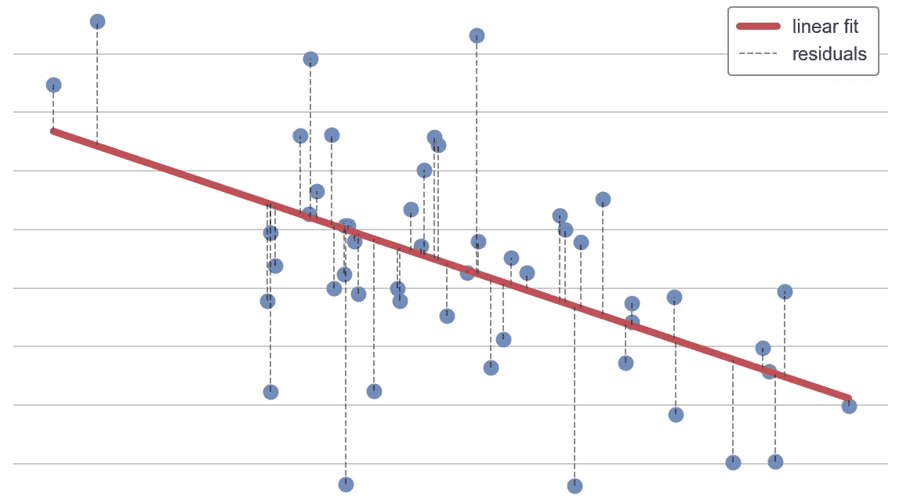

作者图片

弗里希-沃夫-洛厄尔定理是一个简单的**然而强大的**定理，它允许我们将多变量回归简化为单变量回归**。当我们对两个变量之间的关系感兴趣时，这是非常有用的，但我们仍然需要控制其他因素，正如在**因果推断**中经常出现的情况。******

**在这篇博文中，我将介绍弗里希-沃-洛厄尔定理，并举例说明一些有趣的应用。**

# **定理**

**该定理由拉格纳·弗里希和弗雷德里克·沃于 1933 年首次发表。然而，由于它的证明冗长而繁琐，[迈克尔·洛弗尔在 1963 年](https://www.tandfonline.com/doi/abs/10.1080/01621459.1963.10480682)提供了一个简单而直观的证明，他的名字被添加到定理名称中。**

**该定理指出，当估计一个模型的形式**

****

**作者图片**

**那么， *β₁* 的以下估计量是等价的:**

*   **通过对 *x₁* 和 *x₂* 回归 *y* 得到的 OLS 估计量**
*   **在 *x̃₁* 回归 *y* 得到的 OLS 估计量，其中 *x̃₁* 是 *x₁* 在 *x₂* 回归的残差**
*   **通过在 *x̃₁* 回归 *ỹ* 得到的 OLS 估计量，其中 ỹ是在 *x₂* 回归 *y* 的残差**

## **解释**

**我们究竟从**中学到了什么**？**

****弗里希-沃-洛厄尔定理**告诉我们有多种方法来估计单个回归系数。一种可能性是照常在 *x* 上运行 *y* 的完全回归。**

**但是，我们也可以在 *x₂* 上回归 *x₁* ，取残差，只回归 *y* 那些残差。这个过程的第一部分有时被称为 *x₁* 相对于 *x₂* 的**部分化**(或*正交化*，或*剩余化*)。这个想法是我们正在隔离 *x₁* 中的变异，即*正交*到 *x₂* 。注意 *x₂* 也可以是多维的(即包括多个变量而不仅仅是一个)。**

**为什么会有人这么做？**

**这似乎是一个更加复杂的过程。现在我们需要做两步甚至三步，而不是简单的一步完成回归。一点都不直观。主要的优势来自于这样一个事实，即我们已经将一个多变量回归简化为一个单变量回归，使它更容易处理，更直观。**

**我们稍后将更详细地探讨三个**应用**:**

*   **数据可视化**
*   **计算速度**
*   **推理的进一步应用**

**然而，让我们首先用一个例子更详细地探讨这个定理。**

# **例子**

**假设我们是一家零售连锁店，在不同的地点拥有许多不同的商店。我们想出了一个增加销售额的绝妙主意:以优惠券的形式发放折扣。我们印了很多优惠券，然后分发出去。**

**为了了解我们的营销策略是否奏效，我们在每家商店检查平均每日使用量`sales`以及使用量`coupon`的购物者比例。然而，有一个**问题**:我们担心收入较高的人不太可能使用折扣，但通常他们会花更多的钱。为了安全起见，我们还记录了每个商店附近的平均`income`。**

**我们可以用**有向无环图** (DAG)来表示数据生成过程。如果你不熟悉 DAGs，我在这里写了一篇关于[有向无环图的简短介绍。](https://medium.com/towards-data-science/controls-b63dc69e3d8c)**

**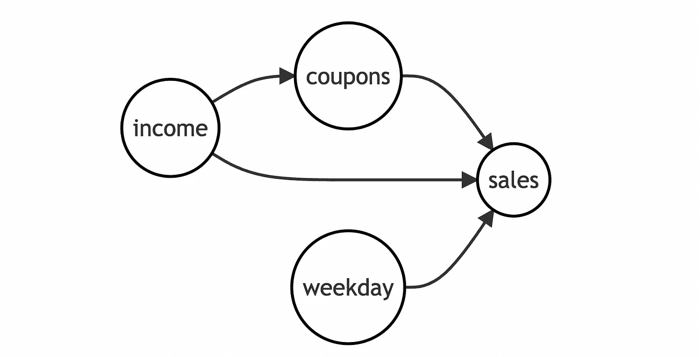**

**作者图片**

**让我们加载并检查**数据**。我从`[src.dgp](https://github.com/matteocourthoud/Blog-Posts/blob/main/notebooks/src/dgp.py)`导入数据生成过程，从`[src.utils](https://github.com/matteocourthoud/Blog-Posts/blob/main/notebooks/src/utils.py)`导入一些绘图函数和库。**

```
from src.utils import *
from src.dgp import dgp_store_coupons

df = dgp_store_coupons().generate_data(N=50)
df.head()
```

****

**作者图片**

**我们有关于 **50 家商店**的信息，我们观察使用`coupons`、每日`sales`(以千美元计)、附近平均`income`(以千美元计)和`day of the week`的顾客的百分比。**

**假设我们在`coupon`的使用上直接回归`sales`。我们会得到什么？我用`seaborn` `regplot`图形化的表示回归的**结果**。**

```
import seaborn as snssns.regplot(x="coupons", y="sales", data=df, ci=False, line_kws={'color':'r', 'label':'linear fit'})
plt.legend()
plt.title(f"Sales and coupon usage");
```

**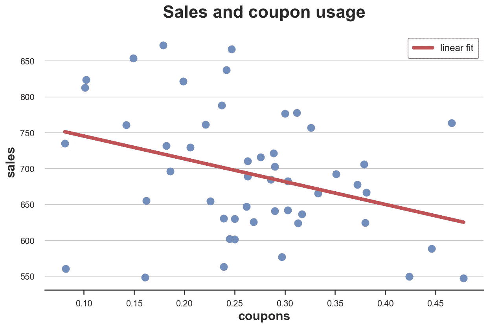**

**作者图片**

**看起来优惠券是个坏主意:在优惠券使用较多的商店，我们观察到销售额较低。**

**然而，这可能只是高收入的人使用较少的优惠券，同时也花费更多。如果这是真的，它可能会使我们的结果产生偏差。就 DAG 而言，这意味着我们有一条经过`income`的**后门路径**，生成一个非因果关系。**

**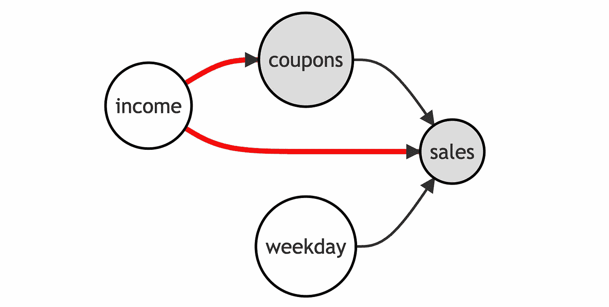**

**作者图片**

**为了恢复`coupons`对`sales`的因果影响，我们需要**对`income`进行条件**分析。这将**阻塞**通过`income`的非因果路径，只留下从`coupons`到`sales`的直接路径打开，允许我们估计因果效应。**

**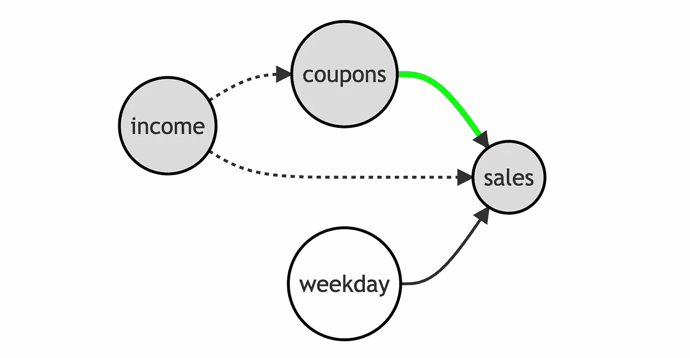**

**作者图片**

**让我们通过在回归中包含`income`来实现这一点。**

```
import statsmodels.formula.api as smfsmf.ols('sales ~ coupons + income', df).fit().summary().tables[1]
```

**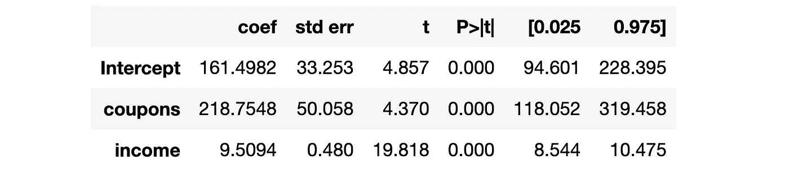**

**作者图片**

**现在估计`coupons`对`sales`的影响是积极而显著的。毕竟优惠券是个好主意。**

## **验证定理**

**现在让我们来验证弗里希-沃-洛厄尔定理是否成立。特别是，我们想要检查我们是否得到了**相同的系数**，如果不是在`coupons`和`income`上回归`sales`，我们**

*   **在`income`上倒退`coupons`**
*   **计算残差`coupons_tilde`，即`coupons`中的变化**不是`income`解释的****
*   **在`coupons_tilde`上倒退`sales`**

**请注意，我在回归公式中添加了“-1”来删除截距。**

```
df['coupons_tilde'] = smf.ols('coupons ~ income', df).fit().resid

smf.ols('sales ~ coupons_tilde - 1', df).fit().summary().tables[1]
```

**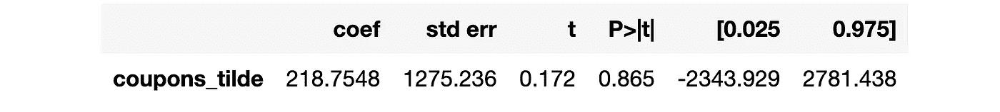**

**作者图片**

**现在系数是一样的！然而，**标准误差**已经增加了很多，并且估计的系数不再明显不同于零。**

**更好的方法是增加一个步骤，并对`sales`重复相同的程序:**

*   **在`income`上回归`sales`**
*   **计算残差`sales_tilde`，即`sales` **而非**由`income`解释的变化**
*   **最后，在`coupons_tilde`上回归`sales_tilde`**

```
df['sales_tilde'] = smf.ols('sales ~ income', df).fit().resid

smf.ols('sales_tilde ~ coupons_tilde - 1', df).fit().summary().tables[1]
```

****

**作者图片**

**系数仍然完全相同，但现在标准误差也几乎相同。**

## **推断**

****剔除**(或剩余化，或正交化)实际上在做什么？当我们取`coupons`相对于`income`的残差时会发生什么？**

**我们可以把这个过程想象成一个情节。首先，我们来展示一下`coupons`关于收入的**残差**。**

**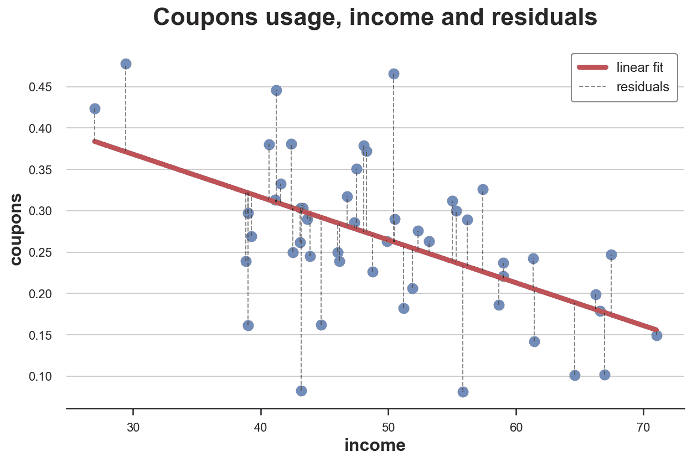**

**作者图片**

****残差**是数据和线性拟合之间的垂直虚线，即`income`无法解释的`coupons`中的变化部分。**

**通过**去除**，我们从数据中移除线性拟合，仅保留残差。我们可以用一个 gif 来形象化这个过程。我从`src.figures`文件导入代码，你可以在这里找到。**

```
from src.figures import gif_projection

gif_projection(x='income', y='coupons', df=df, gifname="gifs/fwl.gif")
```

**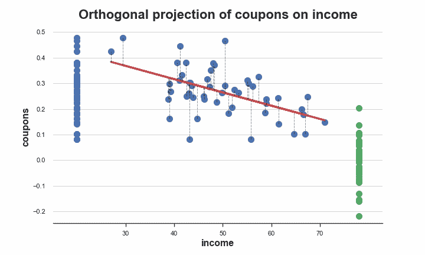**

**作者图片**

**数据的原始分布在*蓝色*的左边，被分割的数据在*绿色*的右边。如我们所见，部分删除移除了`coupons`中的水平和趋势，这由`income`解释。**

## **多重控制**

**当我们有多个控制变量时，我们也可以使用弗里希-沃定理。假设我们还想在回归中包含`day of the week`，以提高精度。**

```
smf.ols('sales ~ coupons + income + dayofweek', df).fit().summary().tables[1]
```

**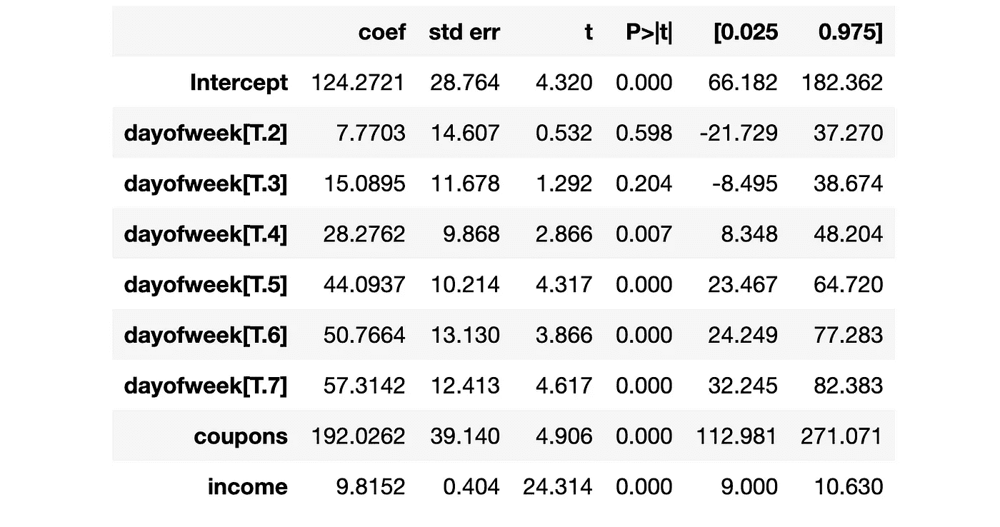**

**作者图片**

**我们可以执行与之前相同的程序，但是不是**只部分去除**而是现在我们部分去除`income`和`day of the week`。**

```
df['coupons_tilde'] = smf.ols('coupons ~ income + dayofweek', df).fit().resid
df['sales_tilde'] = smf.ols('sales ~ income + dayofweek', df).fit().residsmf.ols('sales_tilde ~ coupons_tilde - 1', df).fit().summary().tables[1]
```

**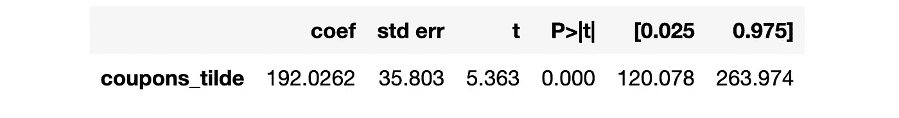**

**作者图片**

**我们仍然得到完全相同的系数！**

# **应用程序**

**现在让我们来考察 FWL 定理的一些应用。**

## **数据可视化**

**弗里希-沃夫定理的优势之一是，它允许我们从一个**单变量**回归中估计感兴趣的系数，即使用一个解释变量(或特征)。**

**因此，我们现在可以用图形来表示利益关系**。让我们绘制残差`sales`对残差`coupons`的曲线。****

```
sns.regplot(x="coupons_tilde", y="sales_tilde", data=df, ci=False, line_kws={'color':'r', 'label':'linear fit'})
plt.legend()
plt.title(f"Residual sales and residual coupons");
```

**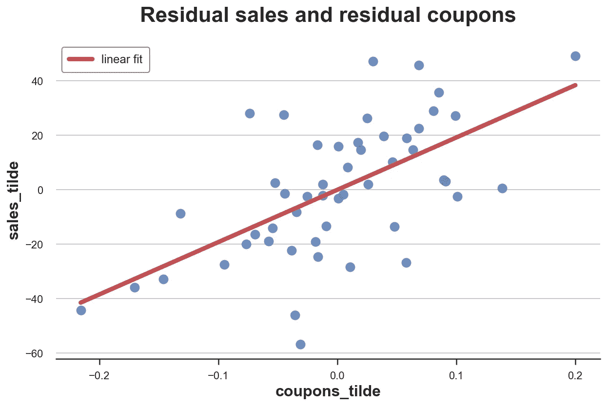**

**作者图片**

**现在从图中可以明显看出`sales`和`coupons`之间的**条件关系**(以`income`为条件)为正。**

**这种方法的一个问题是变量**很难解释**:我们现在对`sales`和`coupons`都有负值。奇怪。**

**怎么发生的？这是因为当我们分割变量时，我们将**截距**包括在回归中，有效地去除了变量的含义(即标准化它们的值，使它们的平均值为零)。**

**我们可以通过**缩放**两个变量，加上它们的平均值来**解决**这个问题。**

```
df['coupons_tilde_scaled'] = df['coupons_tilde'] + np.mean(df['coupons'])
df['sales_tilde_scaled'] = df['sales_tilde'] + np.mean(df['sales'])
```

**现在这两个变量的大小又可以解释了。**

```
sns.regplot(x="coupons_tilde_scaled", y="sales_tilde_scaled", data=df, ci=False, line_kws={'color':'r', 'label':'linear fit'})
plt.legend()
plt.title(f"Residual sales scaled and residual coupons scaled");
```

**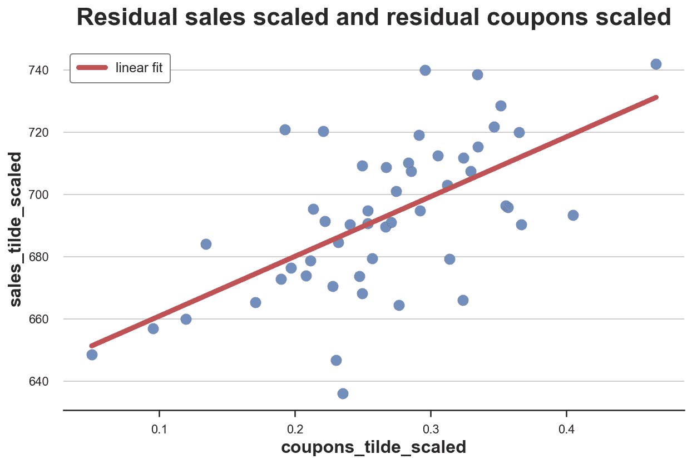**

**作者图片**

**这是一个有效的方法还是改变了我们的估计？我们可以通过用按比例划分的变量进行回归来检查它。**

```
smf.ols('sales_tilde_scaled ~ coupons_tilde_scaled', df).fit().summary().tables[1]
```

**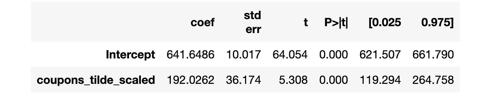**

**作者图片**

**系数和之前一模一样！**

## **计算速度**

**弗里希-沃-洛弗尔定理的另一个应用是提高线性估值器的计算速度。例如，它用于在存在高维固定效应的情况下计算有效的线性估计量(在我们的例子中为`day of the week`)。**

**一些利用弗里希-沃-洛弗尔定理的软件包包括**

*   **[Stata 中的 reghdfe](http://scorreia.com/software/reghdfe/)**
*   **[Python 中的 pyhdfe](https://pyhdfe.readthedocs.io/en/stable/index.html)**

**我还想提一下 R 中的 [fixest](https://cran.r-project.org/web/packages/fixest/index.html) 包，它在运行具有高维固定效应的回归时也非常有效，但是使用了不同的过程。**

## **推理和机器学习**

**FWL 定理的另一个重要应用位于**机器学习**和**因果推理**的交叉点。我指的是[贝洛尼、切尔诺朱科夫、汉森(2013)](https://academic.oup.com/restud/article-abstract/81/2/608/1523757) 关于后双选择的工作，以及[切尔诺朱科夫、切特维里科夫、德米勒、杜弗洛、汉森、纽维、罗宾斯(2018)](https://academic.oup.com/ectj/article/21/1/C1/5056401) 关于“双机器学习”的后续工作。**

**我计划在以后的文章中讨论这两个应用程序，但是我想从基础开始。敬请期待！**

## **参考**

**[1] R .弗里希和 F. V .沃夫，[与个体趋势相比的部分时间回归](https://www.jstor.org/stable/1907330) (1933)，*计量经济学*。**

**[2] M. C. Lowell，[经济时间序列的季节调整与多元回归分析](https://www.tandfonline.com/doi/abs/10.1080/01621459.1963.10480682) (1963)，*美国统计协会杂志*。**

## **密码**

**你可以在这里找到 Jupyter 的原版笔记本。**

**[](https://github.com/matteocourthoud/Blog-Posts/blob/main/notebooks/fwl.ipynb) [## Blog-Posts/fwl . ipynb at main matter courthoud/Blog-Posts

### 我博客文章的代码和笔记本。通过在…上创建帐户，为 matteocourthoud/Blog-Posts 的发展做出贡献

github.com](https://github.com/matteocourthoud/Blog-Posts/blob/main/notebooks/fwl.ipynb)** 

## **感谢您的阅读！**

***真的很感谢！*🤗*如果你喜欢这个帖子并且想看更多，可以考虑* [***关注我***](https://medium.com/@matteo.courthoud) *。我每周发布一次与因果推断和数据分析相关的主题。我尽量让我的帖子简单而精确，总是提供代码、例子和模拟。***

***还有，一个小小的* ***免责声明*** *:我写作是为了学习所以错误是家常便饭，尽管我尽了最大努力。当你发现他们的时候，请告诉我。也很欣赏新话题的建议！***