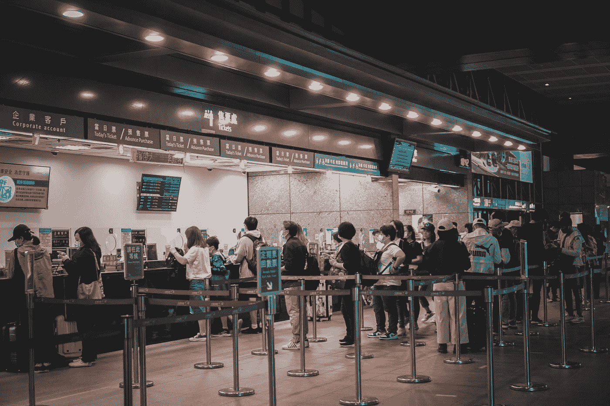
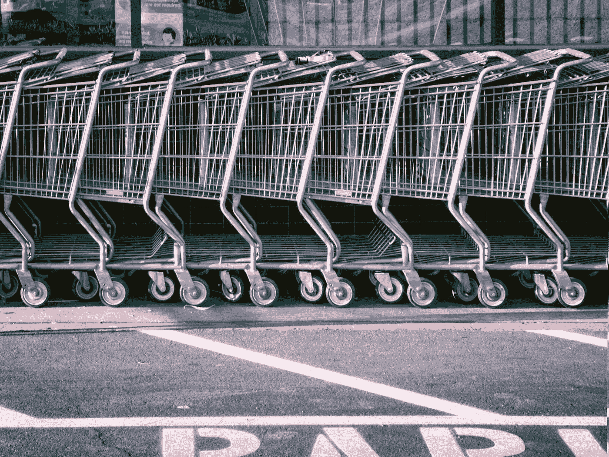
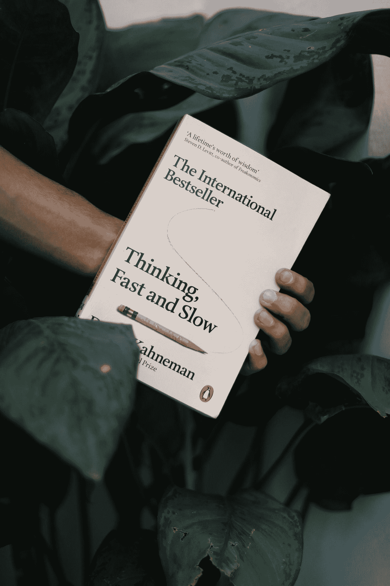

# 超市排队的博弈论

> 原文：<https://towardsdatascience.com/the-game-theory-of-queuing-bd1095998c42>

## 我们如何最大限度地减少排队时间？博弈论与我们日常生活中的决策。

**本文登上了 TDS 2022 集锦**

一天吃午饭时，我的同事告诉我们他是如何预订了一家很受欢迎的火锅店海底捞，这让我想到了我们在排队时是如何做决定的。

> “有趣的是，这实际上并不是预订一张桌子，只是预订一个优先队列。”
> 
> "哦，就像迪斯尼乐园的快速通道一样！"
> 
> “……但是，如果每个人都预订了优先队列，那会怎么样呢；那正常排队岂不是更快？”



Photo by [Lisanto 李奕良](https://unsplash.com/@lisanto_?utm_source=medium&utm_medium=referral) on [Unsplash](https://unsplash.com?utm_source=medium&utm_medium=referral)

有些同事说，有一个系统，优先队列会比正常队列移动得更快。但是我们最终得出结论，即使你有一个优先预约，也总会有一个更合理的长度去正常队列。

## 然后有人说了一句我们都同意的话:

> "如果我们是一群人，就分开，在两个队列里排队."
> 
> “如此经典的新加坡人*怕输* *举动，不知道其他国家的人会不会这么做。”

**怕输:害怕失去(新加坡式英语)*

> “这只是博弈论**，在两个队列中排队是社会的纳什均衡。”**
> 
> **“如果你离开他的队伍加入另一个队伍，排在你后面的人也不会生气！”**

# **这是新加坡人“怕输”的结果，还是博弈论？**

> ****博弈论**是一个数学领域，帮助我们理解不同参与者系统中的决策。**
> 
> **纳什均衡是每个参与者的一套策略，其中没有参与者有任何动机改变他们的策略，即使在知道其他参与者的策略之后。(以数学家约翰·纳西的名字命名)。**
> 
> **从经济学最优性的角度来看，纳什均衡是一种**最优状态，**每个参与者在考虑其他参与者的**最优策略**的同时做出**最优行动**。**

**让我们考虑一个普通的排队系统，例如在超市的收银台。有两个队列提供完全相同的服务，并且有两种类型的玩家(购物者)——(1)团体中的玩家，以及(2)单独的购物者。**

**我们将合理地假设每个**购物者都想尽快结账，也就是说，更少的排队时间=更高的回报。****

**在我们的世界里，我们认为不理性的购物者是不存在的，他们看重的是与朋友一起排队的美好时光，而不是更快的结账速度。因此，这个世界上的每个人都只想最小化他们的排队时间，其他任何行为都没有成本。**

**我们还将假设每个队列移动的速度有一些不确定性，因为这取决于一些变量，如收银员的速度和你前面的每个人需要多长时间。有一种可能性是，一个有更多人的队列实际上可能会更快，但这无法事先知道。**

**如果没有不确定性，那么较短的队伍将永远是所有购物者的最佳选择！**

****

**由[唐纳德·詹纳蒂](https://unsplash.com/@wizwow?utm_source=medium&utm_medium=referral)在 [Unsplash](https://unsplash.com?utm_source=medium&utm_medium=referral) 上拍摄的照片**

> **我会建议…**
> 
> ****这个系统中的纳什均衡是这样的:
> (1)群体购物者分成两个队列,
> (2)单个购物者应该随机选择一个队列。****

## **(1)团体购物者将自己分成两个队列**

**不管队伍有多长，团体购物者最好分散风险，分头行动。这是因为我们的“理性”假设，因此分手没有成本。因为队列移动的速度是不确定的，所以最好分开排队。**

**事实上，除了是一个纳什均衡，**这也是一个优势策略**，*，*因为不管所有其他购物者(群体或单个)决定做什么，分开仍然是最优的。**

**出于讨论的目的，如果拆分有一些成本呢？如果另一个队列长得不成比例，选择最短的队列会更好，这样拆分的成本将超过长得多的队列移动得更快的可能性。**

**但是会不会存在一个队列过长的情况呢？因为团体购物者分开并在两个队列中排队，所以影响队列长度的将是单个购物者。单身购物者会继续选择更长的队列，导致一个队列变得不成比例地长吗？**

## **(2)单个购物者应该随机选择一个队列**

**单个购物者必须在两个队列中做出选择。不管单个购物者采取什么策略，团体购物者总是会分开。因此，就纳什均衡而言，我们只需要为单个购物者找到一种策略，在这种策略下，他们没有动力去改变另一种策略。**

**较短的队列不一定是更好的选择，因为存在以下不确定因素:**

*   **出纳效率**
*   **你面前的每位顾客拥有的商品数量**
*   **你前面的组数(他们跳到另一个队列的机会)。**

**也许如果一个**

1.  **通过观察每个收银员一段时间，收集足够的信息，**
2.  **改进了一种根据购物车的大小估计购物者所需时间的方法，**
3.  **并绘制了不同场景的群体购物者的马尔可夫链…**

**人们可以确定哪个队列*更有可能*移动得更快(即更高的*预期*回报)。**

**实际上，我们不知道在这种情况下哪个队列移动得更快。即使有一个队列比另一个队列移动得快很多倍，我们也不会知道这个概率，我们也没有心理能力/时间来计算超市中的这个*。***

**因此，在不知道队列的实际概率的情况下，人们可以通过随机选择一个队列(即抛硬币)来最大化他们的预期回报。在博弈论中，这也被称为混合策略。**

```
**Calculating the expected pay-off from choosing a queue at random** Let’s say there is some probability *p* that queue A moves faster than queue B, but *p* is not known.If we choose the queue that moves faster, the pay-off is 1\. If no, the pay-off is 0\. The expected pay-off from selecting queue A is *p*, whilst the expected pay-off from selecting queue B is *1-p*. Expected pay-off from selecting queue A: *p* Expected pay-off from selecting queue B: *1-p* Without knowing what *p* is, we cannot make a decisive choice whether queue A or B is better. Obviously if *p* >0.5, queue A is better, if not, queue B is better.By giving both queue A and queue B a 50-50 chance of being selected, our expected pay-off would be: probability of selecting A and A being faster + probability of selecting B and B being faster = (0.5) * (*p*)  + (0.5) * (*1-p*) = 0.5 * (*p* + (*1-p*)) = 0.5 * (1) = **0.5****Regardless of the probability distribution *p*, randomising will always give us an expected pay-off of 0.5\.** 
```

**不管一个队列比另一个队列移动得更快的概率如何，50-50 随机选择的**预期收益将总是 0.5** ，因此在给定不确定性的情况下将是最优选择。这是一个纳什均衡，因为无论群体购物者如何决定，都没有改变策略的动机。**

***附注:由于每位购物者也随机选择了一个队列，因此每个队列中的购物者人数应该是相等的，这加强了我们之前的论点，即不存在过长的队列！***

# **单身购物者会随机化吗？**

**在“*思考快与慢”中，* [丹尼尔·卡内曼](https://en.wikipedia.org/wiki/Daniel_Kahneman)描述了我们在做决策时使用的大脑的两个系统。系统 1 快速决策，快速反应。决策是潜意识的，我们甚至经常意识不到我们正在做一个决定(例如，转弯以避开倒下的树枝)。系统 2 用于更慢和更深层次的思考(例如解决一个代数问题)。**

****

**照片由 [Mukul Joshi](https://unsplash.com/@muk_l_?utm_source=medium&utm_medium=referral) 在 [Unsplash](https://unsplash.com?utm_source=medium&utm_medium=referral) 上拍摄**

**即使它能最大化预期收益，购物者会在超市收银台扔硬币吗，或者甚至*认为*是随机的吗？购物者更有可能使用系统 1 来快速做出决定，因为我们都希望不用太多努力就能继续我们的生活。**

**没有太多考虑，大多数人会简单地选择最短的队列。这是因为随着时间的推移，我们开始相信，不管正确与否，越短的队伍移动得越快。**

> **从全局来看，我们最好不要过多考虑简单的决定，让系统 1 领先…**

## **但是知道了你现在所知道的，下次你在超市结账时，你会扔硬币吗？**

**感谢你阅读这篇关于我们日常生活中决策的小思想实验！**我很想听听你对模型假设的看法**，是否有其他策略、纳什均衡甚至是优势策略。欢迎在下面给我留言评论！**

***如果你喜欢这篇文章以及关于数据科学和数学的文章，今天就注册一个中级会员，可以无限制地访问我的故事。***

**<https://medium.com/@leannechannie/membership> **