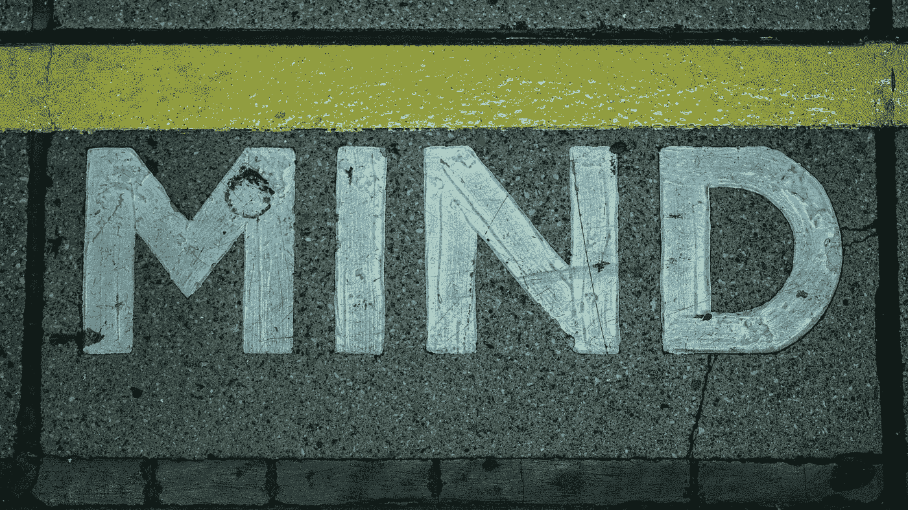
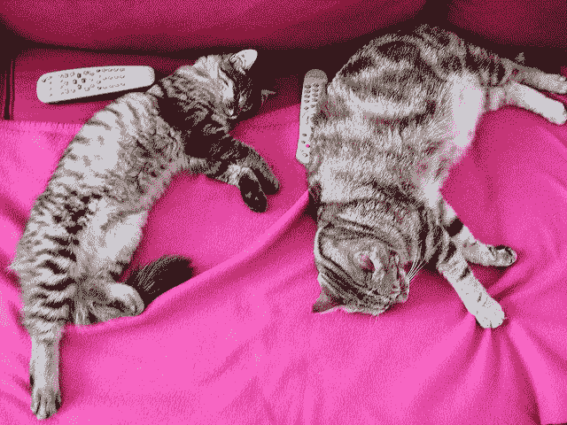
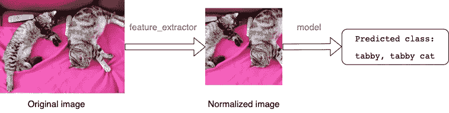
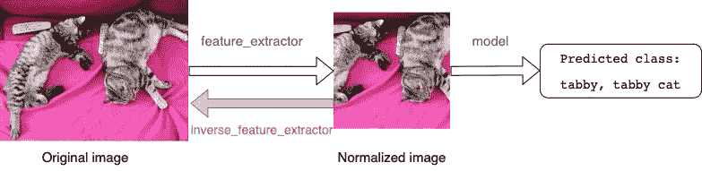
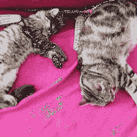
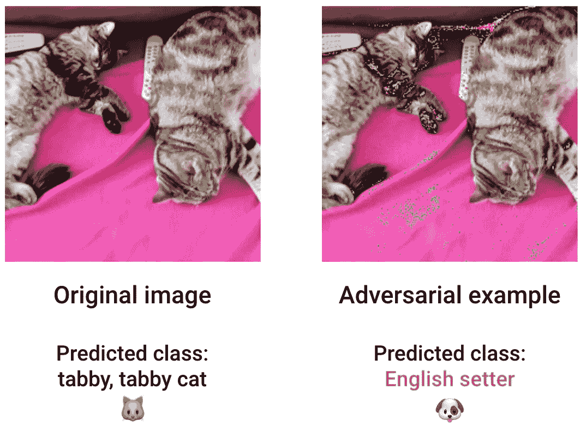

# 研究和健壮人工智能之间的差距

> 原文：<https://towardsdatascience.com/the-gap-between-research-and-robust-ai-d3849ccaf6c>

## 即使是最先进的人工智能也有它的缺陷



Miquel Parera 在 [Unsplash](https://unsplash.com/s/photos/mind-the-gap?utm_source=unsplash&utm_medium=referral&utm_content=creditCopyText) 上拍摄的照片

你会说深度学习模型已经变得如此之好，以至于强大的人工智能系统不再是一个梦想，而是一个现实吗？

你认为你可以在任何现实世界的问题中安全地使用研究人员发布的最新模型吗，比如自动驾驶汽车？还是机场的人脸识别软件？

确信机器在处理和理解图像方面已经比人类更好了？

我也是。直到我意识到用几行代码就可以欺骗一个最先进的模型，比如 DeepMind Perceiver。

在本文中，我将通过一个实际操作的例子向您展示如何在不到 10 分钟的时间内做到这一点。在路上，我们将理解这个例子对现实世界中安全和健壮的人工智能有什么影响。

我在这篇文章中展示的所有代码都可以在 [**这个 repo**](https://github.com/Paulescu/fooling_deepmind) 中公开获得，而在这个 [**Colab 笔记本**](https://colab.research.google.com/github/Paulescu/fooling_deepmind/blob/main/how_to_fool_deepmind_perceiver_in_10_minutes.ipynb) 中，你可以运行得快得惊人。

让我们开始吧！

# 问题是

深度学习模型是高度灵活和强大的机器，用于捕捉数据中非常复杂的模式。

它们是视觉任务(计算机视觉)、文本任务(自然语言处理)和机器人现实世界决策问题(强化学习)的首选解决方案。

然而，它们对于稀有的输入也非常脆弱。

> 当您发送给模型的输入数据与用于训练模型的数据相似时，机器学习模型会按预期工作。
> 
> 当模型面对的输入与训练集中的输入相差太大时，模型可能会开始犯愚蠢的错误。

你可能会想…

*这很有道理，但它并不适用于这些由 DeepMind、OpenAI、特斯拉和其他科技巨头开发的基于数十亿参数的大规模变压器模型？*

*当这些模型在数千万(甚至上亿)个例子上被训练时，怎么会有人生成稀有的输入呢？*

嗯，其实也有可能骗过这些模型。这是我接下来要展示给你们的。

让我们看看你如何生成一个罕见的输入来欺骗 DeepMind 感知者，这是当今最新最热门的深度学习模型之一。

# 深度心灵感知者

[**DeepMind 感知者**](https://www.deepmind.com/publications/perceiver-general-perception-with-iterative-attention)2021 年上映。这是一个基于 transformer 的模型，可以处理来自任意设置的数据，包括图像、视频、文本或音频。

这个模型向真正的通用架构迈出了坚实的一步，而不是特定于任务的架构，它可以处理任意的输入和输出序列。

你可以想象，这不是一个玩具模型，而是世界顶级人工智能实验室之一 DeepMind 生产的真正强大的工程作品。

我将在这个例子中使用的确切版本是在 HuggingFace 模型库中公开提供的版本，您可以在这里找到[](https://huggingface.co/deepmind/vision-perceiver-learned)**。它是一个具有超过 6200 万个参数的模型，在 ImageNet 数据集上进行了预训练，该数据集包含属于 20k 个类别的超过 1400 万个图像。**

# **欺骗深层心灵感知者的三个步骤**

**本节我展示的所有代码都在这个 [**笔记本**](https://github.com/Paulescu/fooling_deepmind/blob/main/notebooks/fooling_the_perceiver.ipynb) **里。****

**为了简单起见，我们将从您在 HuggingFace 模型卡中可以找到的相同示例开始， [**此处为**](https://huggingface.co/deepmind/vision-perceiver-learned#how-to-use) 。**

**图像是这样的:**

****

**图片来自 [**COCO 数据集**](https://cocodataset.org/#termsofuse)**

**正如所料，该模型正确地将这张图片识别为一只猫**

**`>>> Predicted class: tabby, tabby cat`**

**让我们稍微调整一下这个图像来愚弄模型，产生一个所谓的**对抗性例子**。这个对立的例子看起来与原始图像非常相似，但是模型很难理解它。**

**为了从原始的猫图像中生成一个对抗的例子，我们将使用 [Cleverhans 库](https://github.com/cleverhans-lab/cleverhans)和一个最简单的算法:快速梯度符号法(又名 FGSM)，由 Goodfellow、Shlens 和 Szegedy 在这篇开创性的论文 中介绍**

> **如果你想了解更多关于 FGSM 和其他对抗性例子的技术，我推荐你阅读我以前关于对抗性例子的文章**

**[](/adversarial-examples-to-break-deep-learning-models-e7f543833eae) [## 打破深度学习模型的反面例子

### 如何用一点 Python 来愚弄一个 27M 参数的模型

towardsdatascience.com](/adversarial-examples-to-break-deep-learning-models-e7f543833eae) 

## 第一步。负载模型

首先，我们从 HuggingFace 模型中心加载感知者模型和预处理器。

```
>>> Number of parameters: 62,255,848
```

函数`feature_extractor`将输入图像裁剪为 224×224 的分辨率，并使用平均值和标准偏差对像素值进行标准化。这种预处理是深度学习视觉模型的常见做法。



image2class(图片由作者提供)

## 第二步。辅助功能

我写了一个辅助函数，它逆转了这种预处理，并从归一化张量返回图像。我称这个函数为`inverse_feature_extractor`



逆向特征提取器(图片由作者提供)

## 第三步。快速梯度符号方法攻击

接下来，我们导入 Cleverhans 的`fast_gradient_sign`方法。该函数主要接受两个输入，即:

1.  我们要修改的原始形象→我们心爱的猫。
2.  ε，这是我们允许的每像素最大失真的大小→ `eps`。该值始终为正且很小。

一旦我们设置了`eps`，我们运行一个`fast_gradient_sign`步骤，从原始图像生成一个新图像。一般来说，你需要尝试不同的`eps`值，看看哪一个适合你正在使用的图像。

在这种情况下，我花了 10 分钟发现`eps = 0.1`产生了一个对立的例子。

```
>>> Predicted class:  English setter
```



对抗性例子
(图片由作者提供)

顺便说一下，英国雪达犬是一个犬种…

如果你仔细看这张图片，你会注意到在左边的猫身上有一团蓝色和绿色的点。除了这个微小的差别，这幅图像基本上与原作相同。然而，感知者未能预测正确的类别，并认为我们的猫实际上是狗。

这是一个对立的例子。



反例(作者图片)

# 对真实世界安全和健壮的人工智能的影响

总之，欺骗模特比训练她们要容易得多。这就是训练和欺骗深度学习模型之间存在的不对称。

因此，对立的例子限制了深度学习模型在现实世界中的适用性，并提出了以下问题:

> 在像自动驾驶汽车这样关系到人类生命的关键任务中，使用容易被愚弄的深度学习模型安全吗？"

有方法可以缓解这个问题，但都不是完全的解决方案，像 [**对抗性训练**](/adversarial-examples-to-break-deep-learning-models-e7f543833eae#b52b) 。然而，对对抗性例子进行辩护的问题还远远没有解决。

因此，鲁棒人工智能是人工智能研究中的关键问题之一。

我们不会通过专注于标准的图像分类数据集(如 ImageNet)来弥合研究和强大的人工智能之间的差距。

相反，我们需要创建算法来提高深度学习模型的鲁棒性和可解释性。

你可以在 [**这个回购**](https://github.com/Paulescu/fooling_deepmind) 里找到所有的代码。

# 想支持我吗？

你喜欢阅读和学习现实世界中的 ML、数据科学和自由职业吗？

可以无限制地访问我在 Medium 上发布的所有内容，并支持我的写作。

👉🏽今天就使用我的 [**推荐链接**](https://pau-labarta-bajo.medium.com/membership) 成为会员吧。

[](https://pau-labarta-bajo.medium.com/membership) [## 成为一个媒体成员来阅读我在媒体上分享的一切。

### 你的会员费的一部分给了所有你喜欢阅读的作家。希望是我。

pau-labarta-bajo.medium.com](https://pau-labarta-bajo.medium.com/membership) 

👉🏽订阅 [***datamachines* 简讯**](https://datamachines.xyz/subscribe/) **。**

👉🏽关注我[**Twitter**](https://twitter.com/paulabartabajo_)[**Medium**](https://pau-labarta-bajo.medium.com/)[**LinkedIn**](https://www.linkedin.com/in/pau-labarta-bajo-4432074b/)。

祝你愉快🤗

避寒胜地**