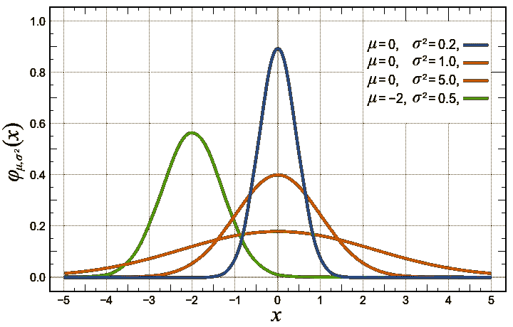
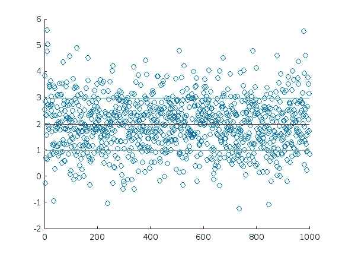
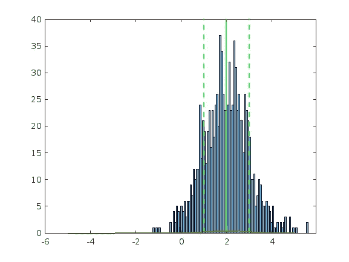
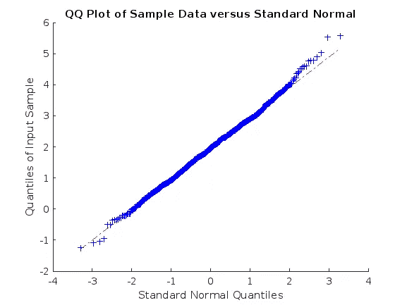
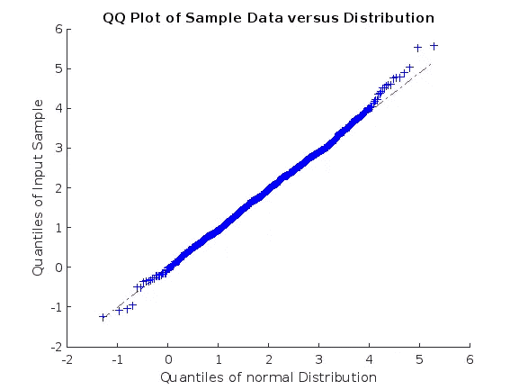

# 高斯分布解释了

> 原文：<https://towardsdatascience.com/the-gaussian-distribution-explained-19d8417fb047>

## MATLAB 中的一个例子

在某些条件下，滚动骰子可以建模为高斯分布。由 [Unsplash](https://unsplash.com/s/photos/statistics?utm_source=unsplash&utm_medium=referral&utm_content=creditCopyText) 上的 [Edge2Edge 媒体](https://unsplash.com/@edge2edgemedia?utm_source=unsplash&utm_medium=referral&utm_content=creditCopyText)拍摄

高斯分布是许多可以描述数据集的统计分布中的一种，它是一种非常重要的分布，因为许多现实生活中的过程都遵循这种分布。高斯分布的例子包括财务回报和人口身高。

在本例中，我们将从高斯分布中人工生成一个样本数据，将其绘制成理论上的高斯分布曲线，然后应用 Kolmogorov-Smirnov 测试，确定数据集是否是高斯分布的一部分，在本例中显然是高斯分布的一部分，因为它是从正态分布中生成的。

# 高斯模型

在这个例子中，我们将使用 MATLAB，但是当然，使用 numpy 和 Matplotlib 是一对一等价的。高斯模型概率密度函数显示了某些值相对于其他值的概率。

几个μ和σ值的高斯分布概率密度函数。来源:维基百科(公共领域图片)。

第一步是创建高斯分布模型。在这种情况下，我们将使用μ等于 2，σ等于 1。μ代表平均值，σ代表 68%的数据所在的位置。使用 2 σ将提供 95%数据的位置。适马(σ)是从平均值(μ)开始测量的，代表数据与平均值有多远或多近。

# 绘制数据

第二步，我们将绘制两个图，一个绘制样本数据，另一个绘制样本数据的直方图和理论高斯曲线。

这创建了两个图:

图一。样本数据集。使用 Matlab online 创建的图像。

图二。样本数据集直方图。使用 Matlab online 创建的图像。

在绘制数据点时，我们可以看到它们是如何集中在μ附近的，并且大部分数据(68%)包含在μ-σ和μ+σ内。

在第二张图中，我们看到理论上的高斯曲线比我们的数据集的比例小得多，这是因为我们必须将数据集的面积比例为 1。Matlab 可以通过一个归一化参数自动完成这项工作:

图 3。具有理论等效高斯曲线的样本数据集直方图。使用 Matlab 在线生成的图像。

# 测试数据集是否为高斯分布

在本例中，我们从高斯分布模型中人工生成了数据。这显然意味着数据是高斯分布的。虽然有时这是有意的(我们可能想要一个直接来自正态分布的数据集)，但大多数时候我们只会面对本质上似乎是高斯分布的数据，我们希望验证这一假设。

有几种方法可以测试一个数据集是否是高斯分布的。其中之一是 Kolmogorov-Smirnov 检验，该检验评估数据是高斯的零假设。

默认的 Kolmogorov-Smirnov 检验是基于均值为 0 且 sigma 为 1 的数据样本。因此，如果我们对数据集进行测试，我们将返回数据集不是高斯型的。实际上，它是关于指定平均值和 sigma 的。

如果我们减去期望的平均值并除以方差，我们就可以正常地进行检验。

# 分位数-分位数图

Q-Q 图是检查数据集是否为高斯分布的直观方法。在 MATLAB 中，有指定分布或不指定分布的选项，尽管两个图看起来相同。正确的是第二个图(使用我们创建的分布的图)，因为它生成了精确的轴(平均值和 sigma)。

图 4。使用标准正态分布的 QQ 图。使用 Matlab online 创建的图形。

注意第二张图是如何围绕我们的分布均值的:

图 5。使用高斯分布的 QQ 图。使用 Matlab online 创建的图形。

分位数到分位数图是显示数据集如何适应高斯模型的一种简单而直观的方式。

# 偏斜度和峰度

偏斜度和峰度是两种众所周知的可以应用于高斯分布的度量。偏斜度衡量平均值周围的不对称性，这是一个数值，它会告诉你在平均值的右边或左边是否有更多的值。完美的对称高斯将导致偏斜度值为 0。小于 0.5 的偏斜值或多或少是对称的，介于 0.5 和 1 之间的值是中度不对称的，大于 1 的值是高度不对称的。具体的阈值将取决于您的具体模型。
峰度是对分布尾部极端程度的度量，有时也被称为分布峰值形状的度量，尽管这种解释是不可信的。因此，它可以作为一种特征来确定异常值在特定分布中的范围。
这两种度量都很容易在 Matlab 中获得。对于偏斜度，使用 0 作为附加参数将减去平均值。这两个命令的详细信息可以在 Matlab 文档中找到。

# 摘要

高斯分布可能是许多学科中最重要的统计分布，通常需要对数据应用许多变换和数学方法。了解如何创建高斯数据集、如何解释其概率分布函数、如何归一化数据以及如何验证数据集是否为高斯数据集，这些都是数据科学中迟早需要的基本技能。