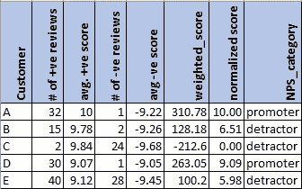

# 客户评论的金矿——量化客户体验

> 原文：<https://towardsdatascience.com/the-goldmine-of-customer-reviews-quantifying-customer-experience-2da2beedf161>

## **通过对客户评论进行情感分析，生成净推介值**

照片由[乔恩·泰森](https://unsplash.com/@jontyson?utm_source=medium&utm_medium=referral)在 [Unsplash](https://unsplash.com?utm_source=medium&utm_medium=referral) 上拍摄

# 语境

随着社交媒体、在线购物和相关活动的激增，客户倾向于提供越来越多的关于他们消费的产品和服务的评论。评论已经变得如此强大，以至于消费者根据对产品或服务的评分来做出购买决定。

让评论更强大的是评论的内容提供了一个名副其实的信息金矿。自然语言处理(NLP)库的进步使得从这些内容中提取信息变得更加容易和准确。

# 客户评论能做什么？

从客户评论的内容中产生的 NLP 用例的数量是无限的。我想强调几个非传统但功能强大的用例，它们可能来自客户评论:

*   **量化您的客户体验** —如何使用客户评论文本的 ***情感分析*** 生成净推介值
*   **构建动态客户情绪仪表板**针对不满意的客户和潜在收入流失发出实时警报
*   **竞争对手分析** —对比潜在竞争对手的 ***品牌突出度&情感得分***
*   **产品或服务的 SWOT 分析**利用 ***主题建模***
*   **根据客户评论确定购买倾向**(概率)

这篇文章的目的是给你一个从情感分析中计算 NPS 的方法的概述，从而识别支持者和反对者。让我们开始吧。

# 什么是净推广分数？

净推动者得分(NPS)是量化客户体验和识别潜在推动者和贬低者的最有效方法之一。

有 3 个组成部分用于计算 NPS — **推动者、中立者和诋毁者。**

*   **促销员**是您最快乐、最忠诚的顾客，他们在适当的时候会转变成品牌大使，并不断推荐品牌。这些客户是业务增长的关键，因此维持他们的客户体验对品牌至关重要。
*   中立者通常是满意的顾客，但通常不会刻意去推广你的品牌。中立者可能会输给竞争对手的风险始终存在。企业应该通过了解中立者的需求，寻找将他们提升为促销员的方法和途径。
*   **诽谤者**是不高兴的顾客，他们会破坏品牌形象，通过阻止其他人购买你的品牌来降低你的收入。值得注意的是，负面宣传比正面宣传效果更好，速度更快，因此对业务非常不利。

NPS 的计算方法如下:

> NPS = %推广者— %反对者

参赛:https://www.netpromoter.com/know/

# 常规核动力源和相关挑战

NPS 通常通过让客户回答一个关键问题来计算——“你向他人推荐一种产品/服务/品牌的可能性有多大？—在 1 到 10 的范围内评分。这通常是通过在购买时向客户发送调查问卷或通过单独的沟通来完成的。这种方法的常见挑战是:

*   调查的回复率相对较低。
*   收集大量的调查数据可能是一件既费时又费钱的事情。
*   发送调查问卷的费用相对较高。
*   这些回答通常是定量的。很少有定性信息解释反应的原因。

# NLP 来救援了

通过采用稍加修改的非常规方法来收集核动力源数据，可以在一定程度上缓解上述挑战。品牌可以利用对顾客评论和社交媒体帖子的情感分析，根据情感得分得出 NPS 的别名，而不是发出调查。

*免责声明:*请记住，客户评论不会直接回答计算 NPS 的核心问题。然而，它们很好地描述了顾客对该品牌的态度，因此可以作为替代品。

# 什么是情感分析？

情感分析也被称为“观点挖掘”。情感分析根据文本中使用的单词的情感语调给一串文本分配一个分数。

## 情绪得分——正面、负面和中性

*   “我对这项服务非常满意”是一个积极情绪的例子。这通常会有一个更接近+1 的情绪得分。
*   “我对服务非常失望”是一个带有负面情绪的字符串的例子，其情绪得分接近于-1。
*   “我在五月的最后一周利用了这项服务”是一个带有中性情绪的句子的例子。这将具有接近 0 的情绪得分。

# 情感分析是如何工作的？

情感分析模型基本上是文本分类模型，将句子分类为正面、负面或中性。模型的 x 变量或输入是文本上下文字符串中使用的单词。基于单词标记和上下文，预先训练的情感分析模型预测句子的情感得分。

情感分析技术的范围从原始的词袋模型到最新的上下文相关模型。随着像 BERT 这样的变压器模型的出现，情感分析模型已经提高了准确性，并且给出了更可靠的情感分数。在讽刺检测方面，他们不太容易受到与旧型号相关的挑战。

# 症结——如何从情感分析中计算 NP？

以下是可以用于从情感分析分数计算 NP 的最简单的方法:

1.  计算每个客户评论的情绪得分。
2.  对于每个客户，计算平均情绪得分。
3.  根据平均情绪得分将客户分类为支持者或反对者。

或者，您也可以为客户发布的评论数量提供额外的权重。这源于这样一个想法，即我们希望关注经常发布评论的客户，而不是很少购买/发布评论的客户。然后可以将分数归一化，得出 0 到 10 的范围。这种标准化数据可用于识别推动者、诋毁者和中立者，从而计算 NPS。请在下面找到一个在电子表格中工作的示例:

基于加权分数的 NPS 计算(使用最小-最大归一化)

# 如何使用 NPS 来提升客户体验

如此获得的 NP 可以提供几个强有力的见解。让我们探索其中的几个:

1.  首先也是最简单的——确定你的品牌的推广者、反对者和中立者
2.  计算推广者与反对者的百分比，让你深入了解你的品牌正在朝哪个方向发展。促销员的百分比越高，表明潜在的收入增长，反之则表明你的品牌正在下降。
3.  来自极度负面评论的特定文本字符串将让您深入了解需要改进的地方。一个简单的正面和负面评论的单词云将让你洞察什么对你的品牌最有效，什么无效。
4.  每个季度重复的相同练习将让您洞察客户体验的趋势——是促进者的趋势越来越多，还是反对者的趋势越来越多？

# 摘要

总之，有了大量可用的客户评论，基于情感分析计算 NPS 可以带来对客户体验的强大洞察力，并帮助您快速提取客户的脉搏并采取行动。