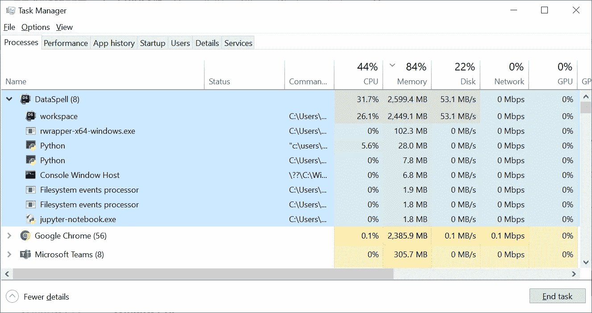
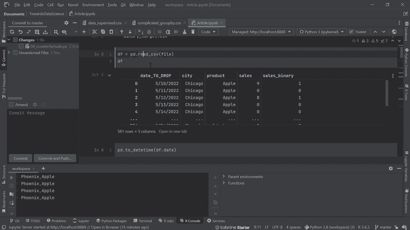
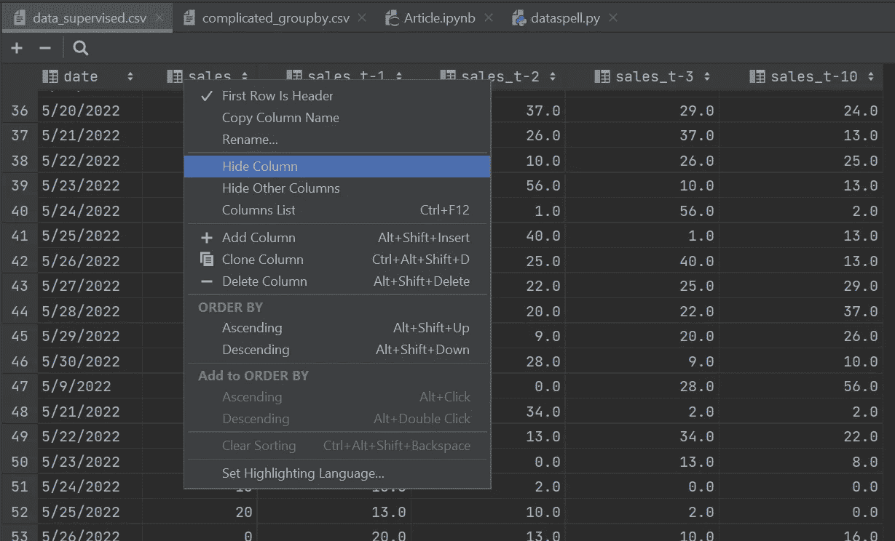
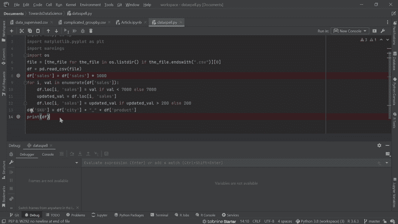
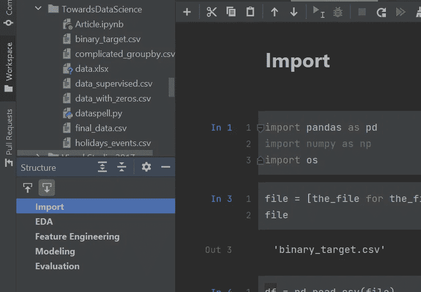
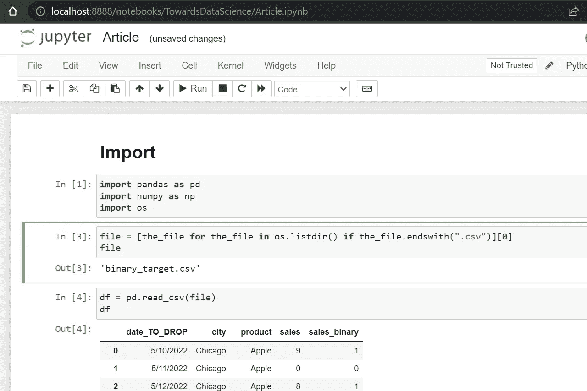
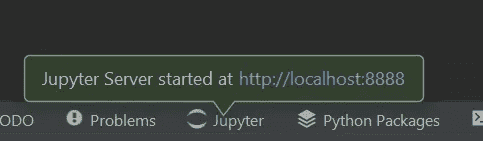
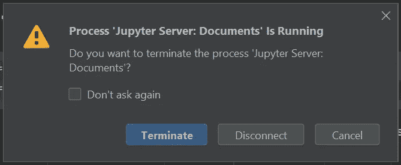
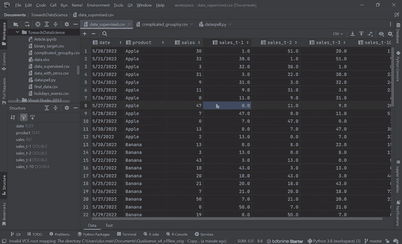
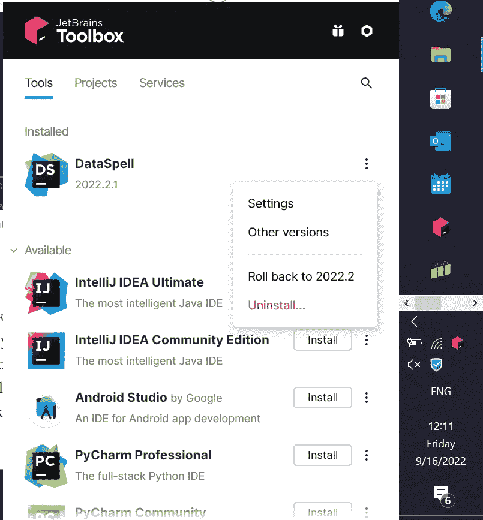

# 好的，坏的和数据

> 原文：<https://towardsdatascience.com/the-good-the-bad-and-the-dataspell-a86fec8fd6e1>

## [软件开发](https://towardsdatascience.com/tagged/software-development)

## JetBrain 的数据科学 IDE 在使用一年后的真实回顾

“一个施展法术的代码编辑器”，至少根据 [DALL E 2](https://openai.com/dall-e-2/)

***免责声明(*** [***发源于此处***](/tired-of-jupyterlab-try-dataspell-a-new-amazing-ide-for-data-science-fb7cbc1280d4)***)****):此非赞助文章。我和 DataSpell 或者它的创造者没有任何关系。本文对 IDE 进行了公正的概述，旨在使数据科学工具能够为更多的人所使用。*

D [ataSpell](https://www.jetbrains.com/dataspell/) 于去年 11 月在[正式发布，然而早在](https://blog.jetbrains.com/blog/2021/11/30/dataspell-has-been-officially-released-a-brand-new-ide-for-data-scientists-using-python-and-r/)[8 月](/tired-of-jupyterlab-try-dataspell-a-new-amazing-ide-for-data-science-fb7cbc1280d4)和[9 月](/will-you-switch-from-pycharm-to-dataspell-the-latest-data-science-ide-from-jetbrains-ab2a0ef70504)勤奋的数据科学作者已经发布了一些预览版的评论。有人可能会说所有主要的 DataSpell 功能都已经展示出来了，**那么为什么还要在这个问题上再做一篇文章呢？**

首先，自去年以来，IDE 中的情况发生了变化。但最重要的是，我使用 DataSpell 进行数据科学研究和开发机器学习应用程序已经整整一年了。因此，我使用这个工具的里程数可能足够高，可以将它的特征减少到最有用和最痛苦的特征。

让我们从三个数据难题开始。不过，我建议你不要一开始就绝望，继续通读，因为这些工具的三大好处是无价的。

# 数据混乱问题

## **1。资源使用率高**

在这方面，DataSpell 甚至可能不是 Visual Studio 等其他 IDE 的竞争对手。虽然 [JetBrains 建议](https://www.jetbrains.com/help/dataspell/installation-guide.html) 8 GB 内存足够运行程序，但如果你处理 1M 行或更多的数据集，你不应该满足于任何小于 16 GB 的内存。就 CPU 而言，拥有比 i7(或其他供应商的同类产品)更老的一代也是不明智的，除非你有很多时间可以消耗。**IDE 使用了大量的资源，特别是在启动的时候**(初始化解释器和扫描文件和软件包的时候)，或者如果[你附加了一个自动同步到云端的文件夹](https://stackoverflow.com/questions/70377577/dataspell-is-using-so-much-memory-while-i-am-not-running-any-program)。然而，当它完成启动时，下降速度相当快，或者至少和它的前身 PyCharm 的速度差不多。

不是你能找到的最敏捷的 IDE 作者图片

## **2。bug**

正式版仍然有一些错误，尽管如此，对我来说升级到新版本解决了很多错误。例如，嵌入式 Jupyter 服务器有一个重大缺陷，无法加载保存的笔记本，但后来的一个版本为我修复了这个问题。另一个解决的错误发生在使用代理连接到许可证服务器时，这在以前的版本中根本不起作用。**一个尚未解决的 bug 是 Jupyter 调试器并不总是工作**，即使工作也非常慢。我通过简单地将代码复制到一个常规脚本文件并在那里执行调试来处理这个问题。我真的希望他们解决这个问题只是时间问题，因为 Jupyter 调试会很有用。无论如何，[bug 论坛](https://youtrack.jetbrains.com/issues/DS)似乎是一个非常活跃的论坛，所以当你遇到一个 bug 时，你总是可以请求修复，甚至可能找到解决方案。

DataSpell 有很棒的特性，但也有不少 bug。Justin Lauria 在 [Unsplash](https://unsplash.com?utm_source=medium&utm_medium=referral) 上拍摄的照片

## 3.它(有点)不免费

个人使用每月花费 9 美元，但作为 JetBrains [教育包的一部分，学生或教师可以免费使用。](https://www.jetbrains.com/community/education/#students)

# DataSpell 津贴

## 1.舒适的数据视图

在新标签页中点击*打开*打开数据框的宽而长的视图。它不仅允许您只需点击鼠标就可以对列进行排序或隐藏，当数据面板在一个分割标签中打开时，**运行一个调试还可以让您观察您的数据帧如何随着每一行代码(!)**。事实证明，这在排除代码仅在某些特定单元中表现异常的原因时非常有用。

你可以忘掉 *sort_values()* 和 pd.options.display.max_rows()。作者图片

列显示选项。解释您的工作从未如此简单。作者图片

一个单元一个单元地调试数据操作。相当酷。作者图片

## 2.增强型 Jupyter

DataSpell 显著改进了 Jupyter:代码完成更快、更彻底，具有嵌入式文件资源管理器(不再需要 Jupyter Lab)，具有已经嵌入的目录(不需要安装附加组件或弄清楚如何使菜单浮动)，并且已经为所有单元格预设了行编号。总而言之，一旦你习惯了，Jupyter 的整体体验会更好。

DataSpell 已经基本将 PyCharm 代码补全嵌入到 Jupyter notebook 中。作者图片

浏览文件、查看目录，以及对行进行编号—无需任何设置。作者图片

我没有办法回到这个…作者的图片

## 3.一站式商店

在使用 DataSpell 一年后，我几乎忘记了做[打开 Jupyter 笔记本](https://jupyter-notebook-beginner-guide.readthedocs.io/en/latest/execute.html)这种可能很基本的事情需要多长时间和多痛苦:你必须打开 anaconda，运行 *jupyter 笔记本*，等待网络浏览器打开并确保文件夹路径正确。**然而在 DataSpell 中，你直接在 ide 里面打开一个笔记本文件，也就这样了。**运行第一个代码块将在后台启动 Jupyter server，几秒钟后你就可以操纵笔记本了，就好像它只是另一个 Python 脚本一样。

这一切都归结到这一点…太神奇了！作者提供的图片

笔记本和脚本之间的切换将变得非常容易。此外，**DataSpell 中的研究和开发更加错综复杂:****DataSpell 使直接将功能写入生产脚本并将其导入笔记本以供进一步研究变得更加容易，而不是将大量功能写入笔记本并最终复制到脚本中**。因此，Dataspell 有效地让我们享受到了两种工具的真正好处:Jupyter 的交互式和图形化输出，以及 PyCharm 的快速高效的代码编写。

你只需要运行一段代码来打开 Jupyter。作者图片

因此，从 DataSpell 运行 Jupyter 相当简单。更重要的是，IDE 是一个真正的一站式商店，因为:执行研究(在笔记本中)、探索数据(在数据面板中)、开发和调试生产就绪代码(在脚本中)——都在同一个地方完成！

> IDE 可以被视为一个真正的一站式商店，因为:执行研究(在笔记本中)、探索数据(在数据面板中)、开发和调试生产就绪代码(在脚本中)——都在同一个地方完成！

**当在高度安全和敏感的客户环境中工作时，这种数据处理能力变得至关重要。**您不再需要解释为什么需要单独安装 PyCharm、Jupyter Notebook 或 Lab 或 Microsoft Excel。你可以通过[安装一个 exe 文件](https://www.jetbrains.com/dataspell/)来获得这些工具的大部分好处。此外，如果您关心定期更新该工具和管理其他 JetBrains 工具，请尝试[安装 JetBrains 工具箱](https://www.jetbrains.com/toolbox-app/)，它能够以鼠标点击的方式更新和降级 DataSpell(和其他工具)。

JetBrains 工具箱可以轻松打开、更新、回滚和卸载 DataSpell。作者图片

# 摘要

DataSpell 是 JetBrain 面向数据科学家的旗舰 IDE。它并不是最轻量级的 IDE，它仍然有很多 bug，而且大多数情况下你都必须为它付费。尽管如此，好处可能大于痛苦:查看数据的交互方式，增强的 Jupyter 体验，以及在一个地方进行研究和开发，这些都是值得的。

> 欢迎分享您的反馈，并通过 [LinkedIn](https://www.linkedin.com/in/dor-meir/) 联系我。
> 
> 感谢您的阅读，祝您好运！🍀