# 构建 Python 项目的好方法

> 原文：<https://towardsdatascience.com/the-good-way-to-structure-a-python-project-d914f27dfcc9>

## *作为一名数据初学者，我希望我知道的一些简单的 Python 建议*

[照片](https://unsplash.com/photos/6CszxGveP8U)作者[菲奥娜·斯莫伍德](https://unsplash.com/@thepeoplesdigital)

无论你是独自完成一个项目，还是与他人合作，都有三个简单的小贴士帮助你保持空间整洁。

*   [提示 1:创建虚拟环境](#da77)
*   [提示#2:为测试创建一个单独的目录](#6492)
*   技巧 3:创建不同的内容目录

如果你想更进一步，你还应该:

*   技巧 4:记录你的代码
*   [提示 5:使用 GitHub 进行版本控制](#15e6)

有些部分与 PyCharm 有关。如果您使用其他 IDE，可以跳过它。

# 技巧 1:创建一个虚拟环境

为了保持你的项目空间运行，创建一个虚拟环境并保持你的依赖关系是一个好主意。

可以使用 Python 的`venv`模块，指定 Python 版本和环境名。在下面的例子中，我使用 Python3 并调用环境 venv。一旦创建了目录，您需要在其中运行脚本`activate`。

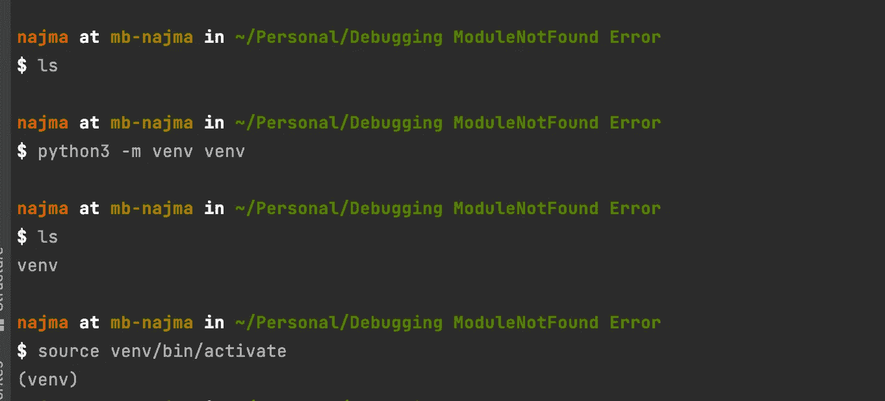

*作者图片*

**命令概要:**

1.  `python3 -m venv venv` → *创建*一个虚拟环境
2.  `source venv/bin/activate` → *激活*环境
3.  `deactivate` → *解除*环境

**👁‍🗨·皮查姆见解**

如果您正在使用 PyCharm，您将会看到一个`venv` 目录出现在左侧的项目目录中。一些东西会自动安装在里面。最有可能的是，你只关心`activate`脚本——正如我们在上面看到的。

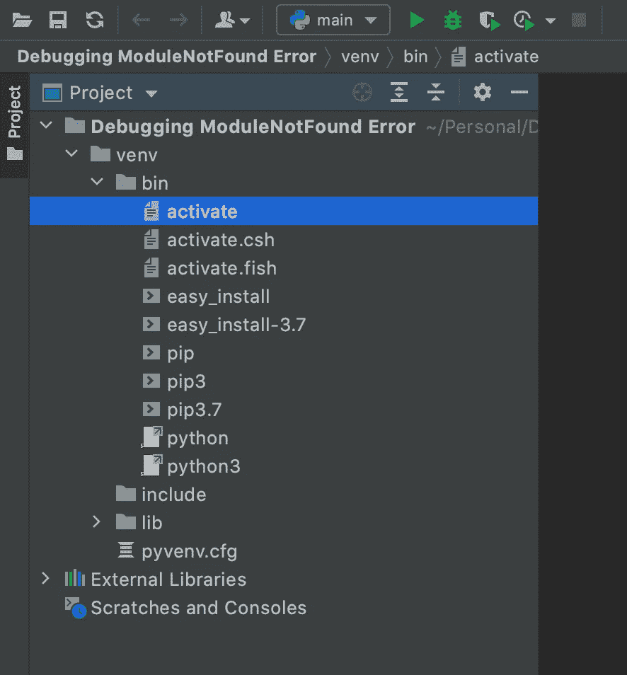

*作者图片*

重要的是，在 PyCharm 中，您应该采取额外的步骤，以便您的程序可以在您的虚拟环境中运行。

去右下角。您应该看到 PyCharm 使用的是哪个解释器。

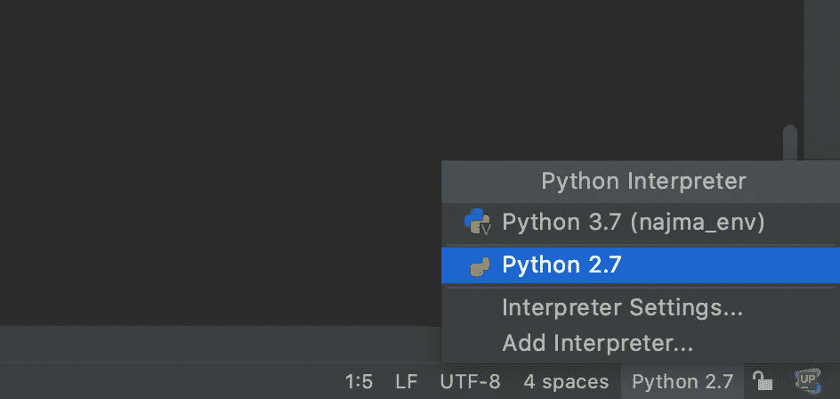

*作者图片*

点击“添加解释器”并选择“现有环境”选项。
接下来，导航到您创建环境的文件夹，并从`bin`目录中选择 Python。

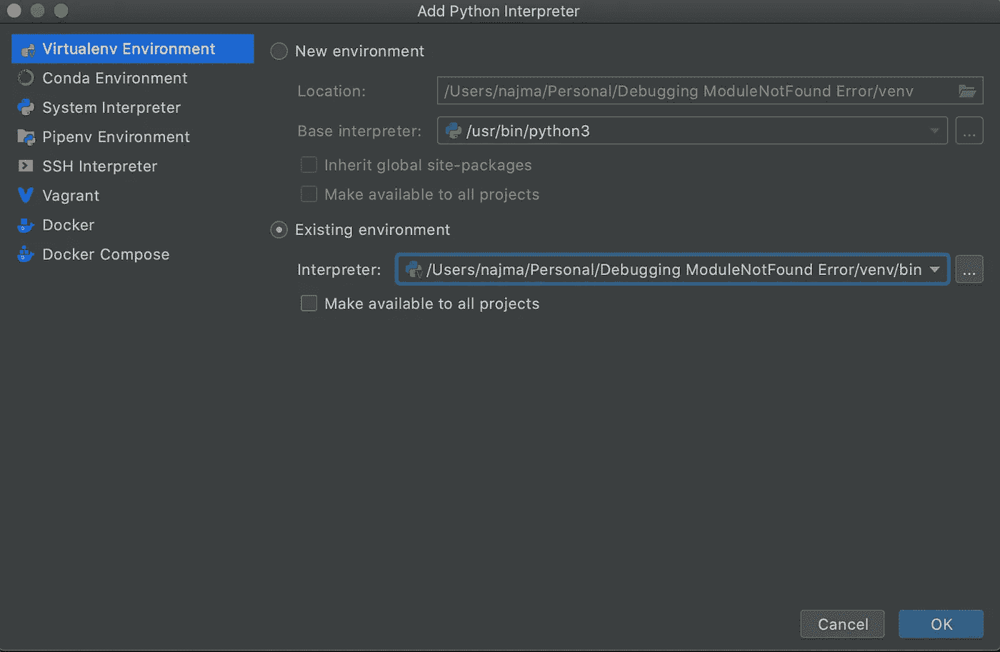

*作者图片*

如果一切正常，您应该在右下角看到虚拟环境中存在的 Python 版本。不错！🎊

*作者图片*

简而言之，虚拟环境允许您:

1.  **保持依赖性隔离。这避免了您的项目使用不同的包版本，并且每次您需要运行一个项目时，您都要全局卸载/重新安装您需要的东西。**
2.  **与他人分享你的依赖。**

一旦安装了项目需要的所有包，就可以运行:

`pip freeze > requirements.txt`

`pip freeze`是“冻结”当前正在使用的所有包/版本。然后你通过一个 txt 文件传输(即保存)了`pip freeze`的输出。

使用您的程序的其他人将会运行:

`pip install -r requirements.txt`

并且能够一次性安装所有的软件包和正确的版本。很神奇吧？🚀

*作者图片*

# 技巧#2:为测试创建一个单独的目录

您听说过为您的代码创建测试是一个好主意。所以你正在编写 Python 代码，并试图用 Pytest 测试它。

例如:假设你创建了一个名为`greetings.py`的文件和另一个名为`test_greetings.py`的文件来编写一些测试。

在这个例子中，我将使用 Pytest 作为测试包。Pytest 有很多命名约定。文件名以`test_`开头就是其中之一。如果您遵循它，Pytest 将自动在当前目录及其下的目录中查找以`test_`开头的文件并运行它们。

要创建新文件，您可以在终端中使用`touch`命令:

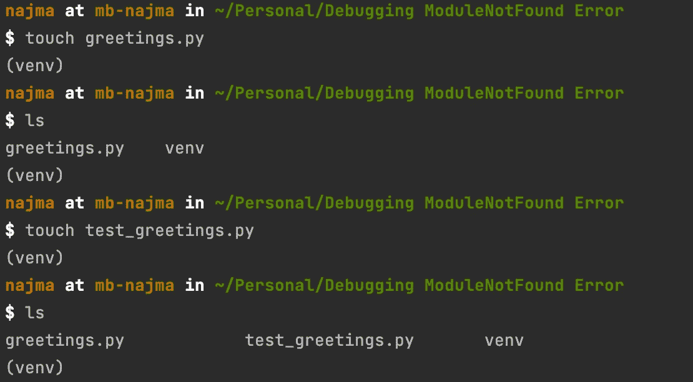

*作者图片*

在 PyCharm 的右上方，您应该会看到这样的内容:

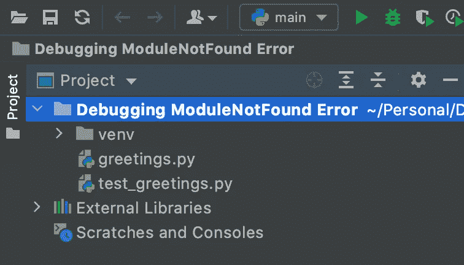

*作者图片*

打开`greetings.py`，写一个简单的函数:

在您的终端中，您可以运行`pip install pytest`来安装`pytest`模块，然后简单地安装`pytest`。由于您尚未定义任何测试，`pytest`将运行，但会收集 0 个项目。

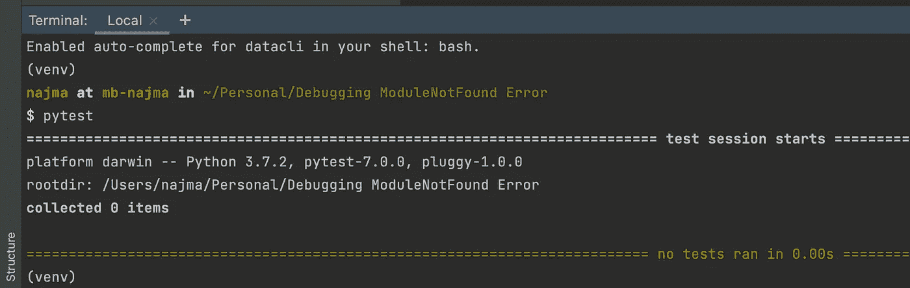

作者图片

打开`test_greetings.py`并编写一个测试函数:

如果您注意到，函数名也需要以`test_`开头，例如`test_say_hello`。这是另一个 Pytest 命名约定。

## 如何调试模块未找到错误

另一个好主意是将所有的测试收集在一个目录中。

然而，如果您只是这样做，当您现在运行`pytest`时，您将会看到您的测试都没有工作。如果你仔细看，你可能会得到一个`ModuleNotFoundError`。

让我们看看发生了什么以及如何修复它。

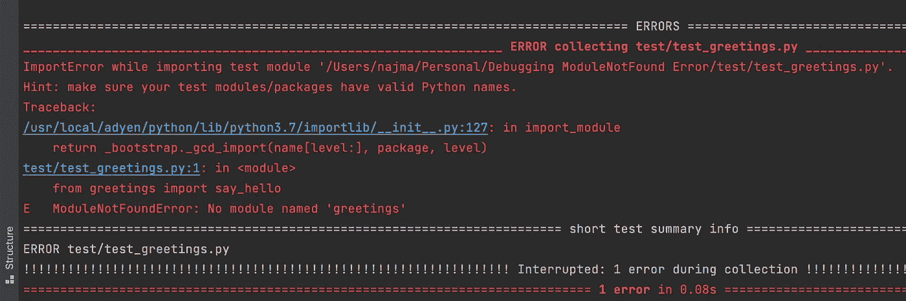

作者图片

Pytest 试图导入`greetings`模块，但是失败了。
解决这个问题最简单的方法是假设`test`目录是一个包(即模块的集合)。在目录中，创建一个名为`__init__.py`的文件

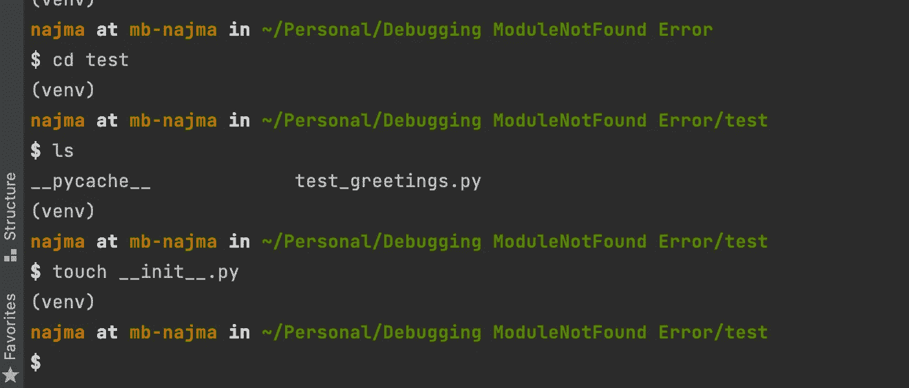

*作者图片*

这是一个完全空的文件:

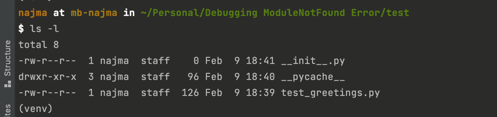

*作者图片*

然而，在那里的简单事实使您的测试再次工作。

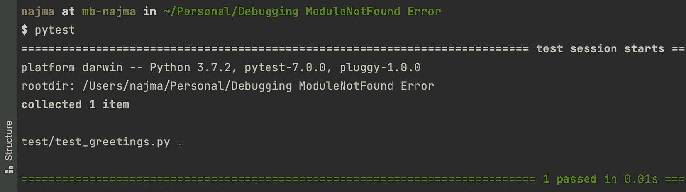

作者图片

瞧啊。🍷

# 技巧 3:创建不同的内容目录

既然您已经有了创建一个`__init__.py`文件的想法，那么您可以创建任意多的目录。

例如:

基本上:

> `__init__.py`用于将目录标记为 Python 包目录

如果您删除了`__init__.py`文件，Python 将不再在该目录中寻找子模块。因此，如果您试图将该模块导入到其他地方，它将会失败。

# 技巧 4:记录你的代码

记录你的代码对于“未来”的你和其他阅读你的项目的人都是非常重要的。一些程序员甚至说:

> 如果很难记录你的代码，考虑改变设计。

有 3 件重要的事情你应该记住:

1.  在每个文件的开头添加一个带有描述的 docstring

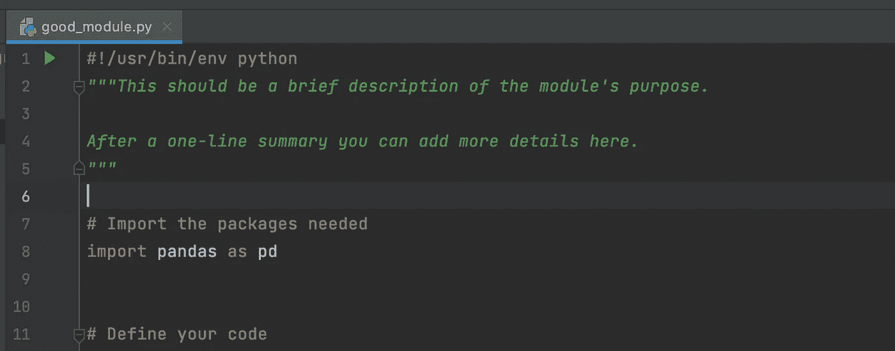

*作者图片*

2.向每个函数和类添加一个 docstring

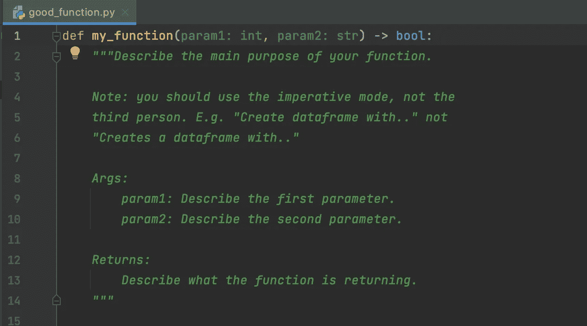

*作者图片*

3.每当你定义一个函数或者一个类的时候使用类型提示

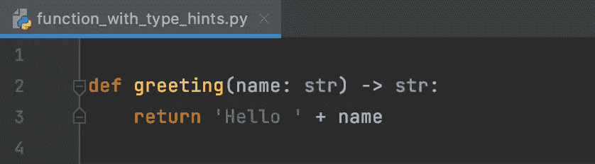

*作者图片*

类型提示(1)使函数和类更具可读性，(2)允许你绕过在文档中指定参数的类型，以及(3)你可以使用它们通过`mypy`自动检查你的代码。🎖

**有很多写好文档的风格指南。我个人比较喜欢**[**Google Style Python Docstring**](https://sphinxcontrib-napoleon.readthedocs.io/en/latest/example_google.html)**。**

# 技巧 5:使用 GitHub 进行版本控制

如果你和其他人一起工作，`Git + GitHub`对于进行代码审查和避免合并冲突是必不可少的。

如果您是独自工作，它们仍然有助于保存您的工作，并能够恢复更改和“回到过去”。

🐢如果您不熟悉这些概念，您可以在这里找到更多信息:

*   [面向 Python 开发者的 Git 和 GitHub 介绍](https://realpython.com/python-git-github-intro/)(免费)
*   [新杂志:哦，妈的，饭桶！](https://jvns.ca/blog/2018/10/27/new-zine--oh-shit--git-/)(已付费)

😱如果您发现自己在开始使用版本控制时感到恐慌:

*   哦，妈的，饭桶！？！

💪如果您想了解更多信息:

*   [欢迎学习 Git 分支](https://learngitbranching.js.org/)

使用 Git 的第一种方法很糟糕，但是我保证会有回报的。我们都经历过🙇‍♀️

我希望这是有用的！⚡️

**参考文献**

*   [新课程:用 pytest 测试您的 Python 程序](https://lerner.co.il/2020/08/31/new-course-testing-your-python-programs-with-pytest/)
*   [https://flax.readthedocs.io/en/latest/philosophy.html](https://flax.readthedocs.io/en/latest/philosophy.html)
*   [http://web.archive.org/web/20111010053227/](http://web.archive.org/web/20111010053227/http://jaynes.colorado.edu/PythonGuidelines.html#module_formatting)
*   [http://jaynes . Colorado . edu/python guidelines . html # module _ formatting](http://web.archive.org/web/20111010053227/http://jaynes.colorado.edu/PythonGuidelines.html#module_formatting)
*   [https://realpython.com/lessons/type-checking-mypy/](https://realpython.com/lessons/type-checking-mypy/)
*   [什么是 __init__。py 用于？](https://web.archive.org/web/20200721150953/http://effbot.org/pyfaq/what-is-init-py-used-for.htm)