# 图形的语法或如何在 Julia 中进行 ggplot 风格的绘图

> 原文：<https://towardsdatascience.com/the-grammar-of-graphics-or-how-to-do-ggplot-style-plotting-in-julia-1b0ac2162c82>


照片由[法新社跟随](https://unsplash.com/@olloweb?utm_source=unsplash&utm_medium=referral&utm_content=creditCopyText)在 [Unsplash](https://unsplash.com/?utm_source=unsplash&utm_medium=referral&utm_content=creditCopyText) 拍摄

## Julia 统计绘图软件包的比较介绍

*图形语法(GoG)* 是由 Leland Wilkinson([*The Grammar of Graphics*，Springer，1999](https://books.google.de/books/about/The_Grammar_of_Graphics.html?id=_kRX4LoFfGQC&redir_esc=y) )和 Hadley Wickham([A Layered Grammar of Graphics，*Journal of Computational and graphic Statistics*，vol. 19，no. 1，PP . 3–28，2010](https://vita.had.co.nz/papers/layered-grammar.html) )提出的概念； [pdf](https://byrneslab.net/classes/biol607/readings/wickham_layered-grammar.pdf) )。

它的主要思想是，每一个统计图都可以由一些基本构件(或机制)组合而成。这允许

*   可视化的简单明了的定义
*   通过仅交换以模块化方式受影响的构建块，可视化的简单适应
*   可重用的规范(相同的可视化可以应用于不同的数据)

韦翰表明，这个概念不仅是一个很好的理论。他在非常流行的 R 包`[ggplot2](https://ggplot2.tidyverse.org)`中实现了它。Julia 编程语言也有一些 GoG 实现。

在这篇文章中，我将首先解释图形语法的基本概念和思想。在后续文章中，我将展示以下四个完全或部分基于 GoG 的 Julia 图形包:

*   [牛虻. jl](http://gadflyjl.org/stable/)
*   [VegaLite.jl](https://www.queryverse.org/VegaLite.jl/stable/)
*   [Plots.jl](https://docs.juliaplots.org/stable/) (带 [StatsPlots.jl](https://github.com/JuliaPlots/StatsPlots.jl) )
*   [Makie.jl](https://makie.juliaplots.org/stable/) 和[代数图形](http://juliaplots.org/AlgebraOfGraphics.jl/stable/)

为了让您能够对这些 Julia 包进行一对一的比较，我将在每篇文章中使用相同的示例图和相同的基础数据。在本文的第二部分，我将给出示例中使用的数据，因此我不必在后续的每篇文章中重复这些内容。

# 图形语法

在接下来的章节中，我将解释威尔金森的“图形语法”和韦翰的“图形分层语法”的基本思想。我不会深入到每一个细节，在两个概念不同的方面，我会有意识地选择一个，给出一个相当“统一”的观点。

对于代码示例，我使用的是 Julia 的牛虻包(vers。1.3.4 &朱莉娅 1.7.3)。

## 主要成分

可视化的主要构件是

*   数据
*   美学
*   几何学

**数据** 这三个概念大家最熟悉的大概就是*数据*。这里我们假设数据以表格的形式出现(就像一个数据库表)。对于可视化来说，区分*数字*和*分类*数据是很重要的。

例如，我们这里有一个水果经销商的库存清单:

```
Row │ quantity  fruit   price 
────────────────────────────────
 1  │    3     apples   2.5
 2  │   20     oranges  3.9
 3  │    8     bananas  1.9
```

它由三个变量`quantity`、`fruit`和`price`组成。`fruit`是一个*分类*变量，而另外两个变量是*数值*。

**美学** 为了可视化一个数据变量，它被映射到一个或多个*美学*。

数字变量可以映射到例如

*   *在 x 轴、y 轴或 z 轴上定位*
*   *尺寸*

分类变量可以映射到例如

*   *颜色*
*   *形状*
*   *纹理*

**几何** 除了数据变量和美学，我们至少需要一个*几何*来指定一个完整的可视化。几何学基本上告诉我们想要哪种类型的图。一些例子是:

*   *线* (=线图)
*   *点* (=散点图)
*   *条形图* (=条形图)

## 基本示例

现在我们有足够的信息来建立我们的第一个基于图形语法的可视化。对于使用牛虻包的代码示例，我们假设上面的库存表位于一个名为`inventory`的变量中，变量的类型为`DataFrame`。

首先我们想看看数量是如何按价格分布的。根据所选的几何图形，我们可以得到散点图或线图:

*   将**价格**映射到 **x 轴**，**数量**到 **y 轴**
    使用牛虻中的**点几何体**
    :`plot(inventory, x = :price, y = :quantity, Geom.point)`

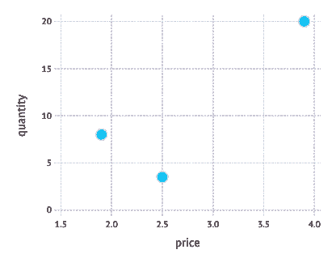

散点图[图片由作者提供]

*   将**价格**映射到 **x 轴**，**数量**到 **y 轴** 使用**线几何** 在牛虻:`plot(inventory, x = :price, y = :quantity, Geom.line)`

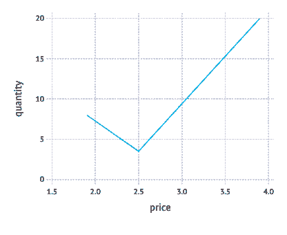

线图[图片由作者提供]

在下一步中，我们想额外看看，哪些水果涉及。所以我们也必须将`fruit`映射到一个合适的审美。在下面的两个例子中，首先使用*形状*，然后使用*颜色*。

*   将**价格**映射到 **x 轴**，将**数量**映射到 **y 轴，将**水果**形状**映射到
    使用**点几何
    牛虻`plot(inventory, x = :price, y = :quantity, shape = :fruit, Geom.point)`**

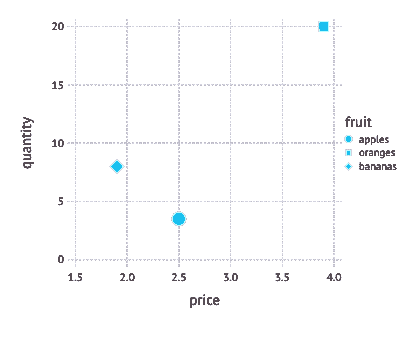

水果映射成形状[图片由作者提供]

*   将**价格**映射到 **x 轴**，将**数量**映射到 **y 轴，将**水果**颜色**T59 使用**点几何** 牛虻:`plot(inventory, x = :price, y = :quantity, color = :fruit, Geom.point)`

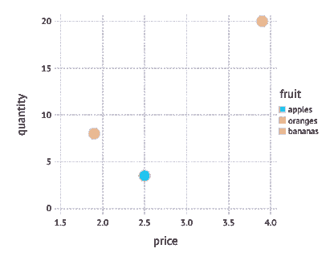

水果映射到颜色[图片由作者提供]

也可以将*一个*变量映射到*几个*美学。例如，我们可以将`fruit`映射到*形状*以及*颜色*。

*   绘制**价格**到 **x 轴**，**数量**到 **y 轴，
    果**到一个**形状**，**果**到一个**颜色**，
    使用一个**点几何** 在牛虻:`plot(inventory, x = :price, y = :quantity,
    shape = :fruit, color = :fruit, Geom.point)`

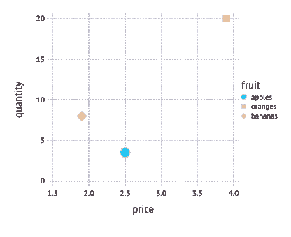

水果映射到形状和颜色[图片由作者提供]

使用*条形几何图形*我们可以绘制库存数量的统计表。这里我们将一个分类变量( *fruit* )映射到 x 轴上的位置。

*   将**水果**映射到 **x 轴**，**数量**到 **y 轴**使用牛虻中的**杆几何** :`plot(inventory, x = :fruit, y = :quantity, Geom.bar)`

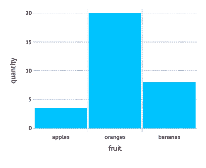

条形几何[图片由作者提供]

如果我们将*水果*也映射到一种颜色，那么条形将以不同的颜色显示:

*   将**水果**映射到 **x 轴**，**数量**到 **y 轴**，**水果**到一个**颜色**
    使用一个**几何形状** 牛虻:`plot(inventory, x = :fruit, y = :quantity, color = :fruit, Geom.bar)`

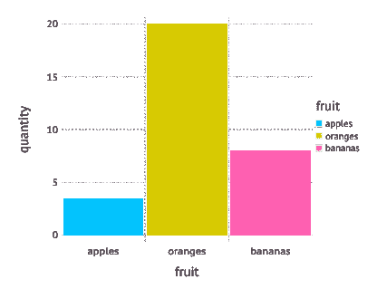

酒吧几何和水果映射到颜色[图片由作者提供]

这些基本示例很好地展示了如何使用几个简单的构建块来指定可视化，从而组成一种强大的可视化语言。

它们还表明，这些规范使图形包能够为可视化的各个方面导出有意义的缺省值，这些缺省值没有明确给出。

所有的例子都

*   x 轴和 y 轴的有意义的*刻度*(通常使用比给定数据变量稍大的间隔)
*   连同适当的*记号*和*轴*和*标记*
*   以及一个描述性的*标签*(简单地使用变量名)

一些例子甚至有自动生成的*图例*。这是可能的，因为图例只是数据映射到美学的反函数。例如，如果我们将变量*水果*映射到一个*颜色*，那么相应的图例就是从*颜色*到*水果*的反向映射。

## 更多配料

老实说，为了一个完整的可视化，我们需要更多的元素，而不仅仅是*数据*、*美学*和*几何*。

**比例** 为了将数字变量映射到位置美学(如 x 轴或 y 轴上的位置)，我们还需要一个*比例*，将数据单位映射到物理单位(如屏幕、窗口或网页)。

在上面的例子中，默认使用了一个*线性标尺*。但是我们也可以用*对数标度来交换。*

也可以将数字变量映射到颜色。然后使用*连续色标*进行映射，如下例所示:

*   将**价格**映射到 **x 轴**，**数量**到 **y 轴**，**数量**到一个**颜色**
    使用一个**点几何** 在牛虻:`plot(inventory, x = :price, y = :quantity,
    color = :quantity, Geom.point)`

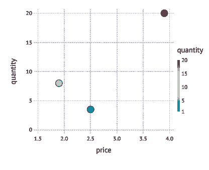

使用色阶[图片由作者提供]

**坐标系** 与标尺密切相关的是*坐标系的概念，*定义了位置值如何映射到绘图平面上。在上面的例子中，默认使用了*笛卡尔坐标系*。其他可能性是*极坐标*或*重心*坐标系统或用于地图投影的各种系统。

有趣的是，我们可以从相同的数据和美学映射生成不同类型的图表，只需改变坐标系:例如，条形图基于笛卡尔坐标系。如果我们用极坐标系统替换它，我们会得到一个 Coxcomb 图，如下例所示，来自数据科学的[](https://r4ds.had.co.nz/index.html)*(Hadley Wickham 和 Garret Grolemund，O'Reilly，2017)。*

*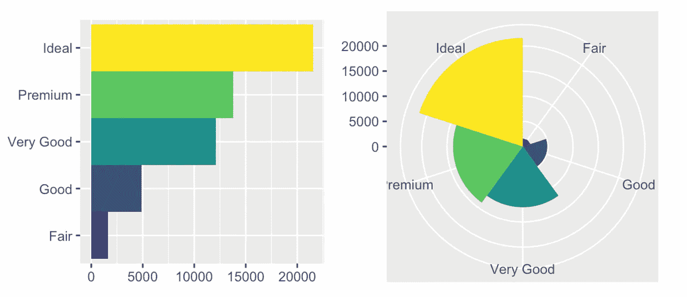*

*条形图和统计图【来源:见正文；在[知识共享许可](https://creativecommons.org/licenses/by-nc-nd/3.0/us/)下使用*

## *结论*

*有了这两个额外的概念，我们现在有了基本 GoG 的完整图像。在这篇短文中，我当然只能呈现所有可能的*美学*和*图形*的子集，还有更多 GoG 元素，如*统计*和*小平面*。但是到目前为止，我们所看到的是图形语法的核心，应该足以抓住主要思想。*

# *Julia 图形软件包的比较*

*现在让我们转到不同的 Julia 图形包的比较，我将在几篇后续文章中介绍这些比较。作为一种准备，我现在将在这些后续文章中展示不同示例图所用的数据(这些数据的灵感来自 YouTube 教程 [Julia Analysis for 初学者](https://youtu.be/s7ZRVCvdKAo)，来自频道 [julia for 天才业余爱好者](https://www.youtube.com/c/juliafortalentedamateurs))，并展望我将使用何种图表进行比较。*

## *按国内生产总值划分的国家*

*用于绘图示例的数据基础是 2018 年和 2019 年所有国家及其 GDP 和人口规模的列表。它来自这个[维基百科页面](https://en.wikipedia.org/wiki/List_of_countries_by_GDP_(nominal))(从国际货币基金组织和联合国的数据库中获得数据)。这些数据也可以从我的 GitHub 知识库中以 [CSV 格式](https://raw.githubusercontent.com/roland-KA/StatisticalPlotsWithJulia/main/data/countries.csv)获得。*

*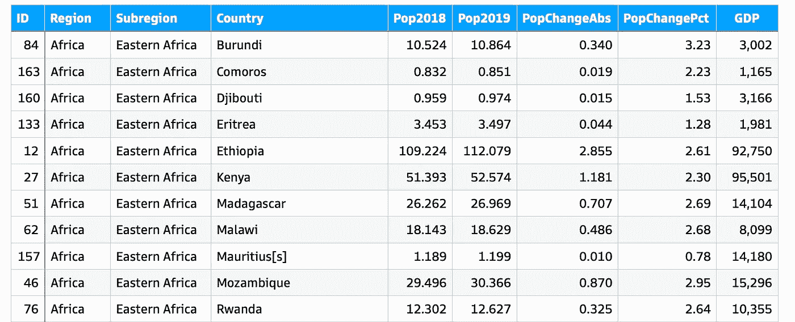*

*国家列表摘录[图片由作者提供]*

*列表中的列具有以下含义:*

*   *`ID`:唯一标识符*
*   *`Region`:国家所在的洲*
*   *`Subregion`:每个大陆又分为几个次区域*
*   *`Pop2018`:2018 年全国人口【百万人】*
*   *`Pop2019`:2019 年全国人口【百万人】*
*   *`PopChangeAbs`:2018 年至 2019 年人口绝对数量变化【百万人】*
*   *`PopChangePct`:类似于`PopChangeAbs`，但以百分比[%]表示*
*   *`GDP`:2019 年国内生产总值【百万美元】*
*   *`GDPperCapita` : `GDP`除以该国居住人数【美元/人】；该列不在源文件中，但将被计算(见下文)*

*使用以下 Julia 代码下载文件并转换为`DataFrame`:*

*第 7 行计算上面提到的新列`GDPperCapita`，并将其添加到`countries` -DataFrame 中。*

## *汇总数据*

*每个国家有一行(210 行)的详细列表将在两个级别上进行分组和汇总(使用`DataFrame`-函数):*

***级别 1 —区域:**以下代码通过`Region`(即洲)对列表进行分组，省略第 1 行中的列`Country`和`Subregion`(使用嵌套的`select`)，然后创建一个汇总所有数字列的聚合(第 2–5 行)。*

***2 级—子区域**:第 7-11 行的子区域级应用了相同的操作。首先通过省略列`Country`(第 7 行)的`Subregion`对国家进行分组，然后根据该数据创建汇总；再次对所有数字列求和。此外，地区的名称是从每个小组中挑选出来的(`:Region => first`*

*得到的数据帧`regions_cum`和`subregions_cum`如下所示:*

*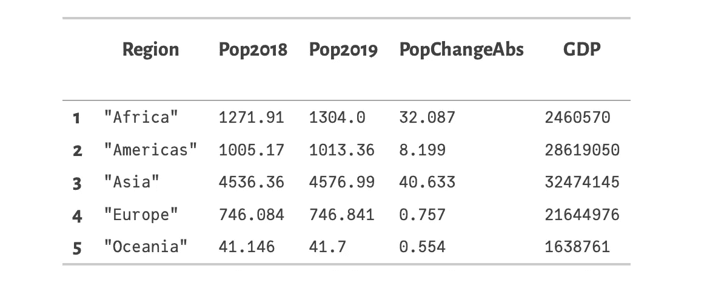*

*按区域汇总(regions_cum)*

*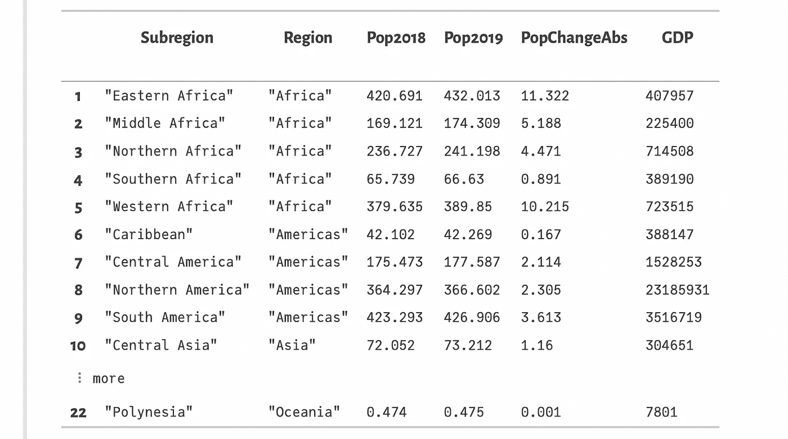*

*按次区域汇总(次区域累计)*

## *摘要*

*数据帧`countries`、`subregions_cum`和`regions_cum`是即将发表的关于不同 Julia 图形包的文章中绘图示例的基础。在这些文章中，我们将看到如何创建*

*   *条形图*
*   *散点图*
*   *直方图*
*   *盒子情节和小提琴情节*

*在这些图形包中。*

*第一篇文章将呈现牛虻。敬请关注！*