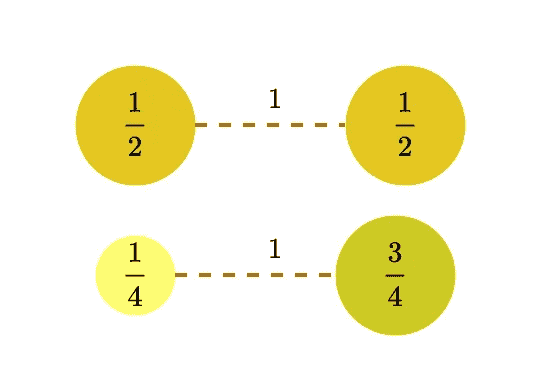
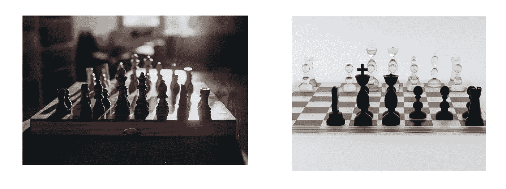
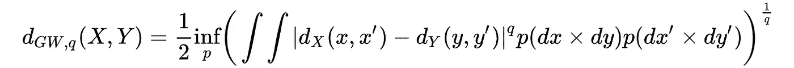
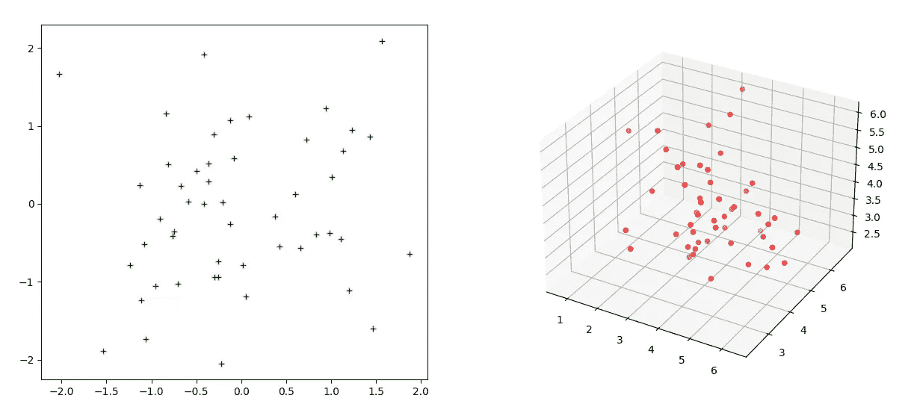
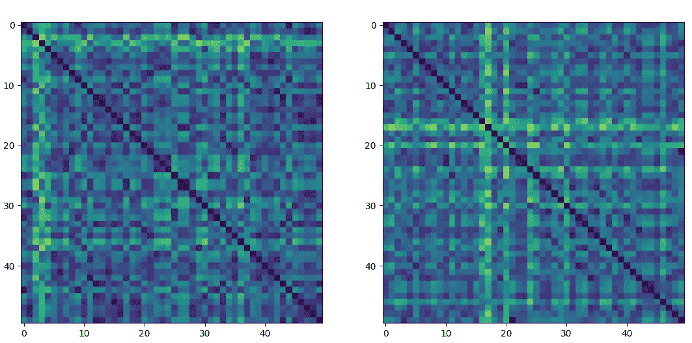
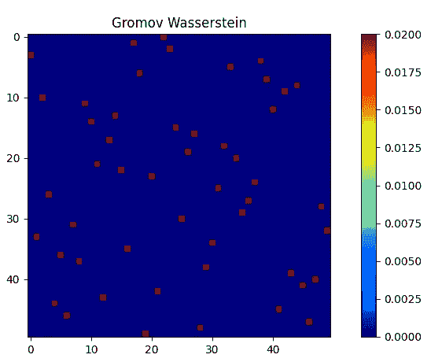

# 格罗莫夫-沃瑟斯坦距离

> 原文：<https://towardsdatascience.com/the-gromov-wasserstein-distance-835c39d4751d>

# 格罗莫夫-沃瑟斯坦距离

## Python 中对象匹配的度量与实例


作者使用人工智能工具 Dreamstudio 生成的封面照片(授权为[https://creativecommons.org/publicdomain/zero/1.0/](https://creativecommons.org/publicdomain/zero/1.0/)

在过去的几十年里，我们看到在我们可能想到的每一个领域的数据收集都取得了突破，包括运输、零售、金融、生物信息学、蛋白质组学和基因组学、机器人学、机器视觉、模式匹配等。为了分析和组织这些数据，定义对象或数据集相似性的概念很重要。在本文中，我们将互换使用对象和数据集。在这方面，我们可以提出以下几点来界定:

1.  选择合适的数据集表示
2.  定义两个数据集之间相等的概念
3.  定义一个度量空间，使所有对象的空间。度量必须使得到对象的距离为零，对象是相等的。其中一个距离是格罗莫夫-沃瑟斯坦距离。

对象匹配的概念不仅有助于建立两个数据集之间的相似性，也有助于其他类型的问题，如聚类。

为了理解格罗莫夫-沃瑟斯坦距离，我们首先定义度量测度空间。但是在我们进入度量空间之前，让我们定义一些术语。

**度量:**集合 *X* 上的一个度量 *d* 是一个函数使得 *d(x，y) = 0* if *x = y，x* ∈ *X，*Y∈*Y，*并且满足[对称性](https://en.wikipedia.org/wiki/Symmetric_function)和 [*三角形不等式*它也被称为 ***距离功能*** 。](https://en.wikipedia.org/wiki/Triangle_inequality)

度量空间:度量空间是一个非空集，其上定义了度量。它可以被认为是有序对(m， *d* ，使得*d*:m**×**m ℝ.我们用ℝ来表示实数集。

现在我们定义度量测度空间。

# 度量度量空间

与度量空间相反，度量度量空间是一个三元组(M， *d* ， *p* )，其中 *p* 是一个概率度量。度量测度空间类似于度量空间，但是被赋予了概率的概念。我来解释一下。在许多应用中，我们喜欢将权重与每个点相关联，如图 1 所示。权重可能代表我们对这些数据点的信任程度。如图 1 所示，我们考虑两个度量度量空间(简称 mm-space)，每个空间有两个点。这里我们定义*p₁*=[；]而 *p₂* = [，]，总和必须是概率(或σ代数)规则定义的 1。



图一。由作者创建

[](/manifold-alignment-c67fc3fc1a1c) [## 歧管对齐

### 多个数据集的统一

towardsdatascience.com](/manifold-alignment-c67fc3fc1a1c) 

让我们再定义几个术语:

**等距:**假设为双射的度量空间之间的距离保持变换。**等距变换**将元素映射到相同或不同的度量空间，使得新空间中元素之间的距离与原始元素之间的距离相同。

**同构:**同构是保结构映射。在线性代数的意义上，正如大多数数据科学家所熟悉的，两个向量空间 *V* 和 *W* 被称为同构，如果存在从 *V* 到 *W* 的可逆线性变换(**称为**同构)，T。考虑图 2。在图 2 中，我们有两套国际象棋。它们在国际象棋游戏中是同构的，尽管棋子看起来可能不同。

两个 mm-空间是同构的，如果存在一个等距映射*ψ:X→y*



图二。来源。左:【https://unsplash.com/photos/WtdIwprWnB4】T2，右:[https://unsplash.com/photos/R0t2pAukP9E](https://unsplash.com/photos/R0t2pAukP9E)

**前推测度:**考虑两个度量空间 X 和 Y 之间的可测映射 *f: X → Y* 和 *p* 的概率测度。前推测度是通过将一个测度(在我们的例子中，它是一个概率)从一个可测空间转移到另一个可测空间而获得的测度。它被表示为 f# *p(A) = p(f* ⁻ (A))其中 A = 𝔅(Y)，𝔅是σ-代数(为了简单起见，就认为σ-代数定义了我们所知道的概率的概念。我参考了乔治·卡塞拉斯的统计推论以获得关于这个主题的更多细节)。我们可以把 mm 空间的前推度量写成 *ψ#(p₁) = p₂.*

考虑 *R ⊂ X × Y* 是 *X* 和 *Y* 之间的对应关系。然后我们定义 *π₁(R) = X* 和 *π₂(R) = Y* 。一个概率度量 *p，*对 *X × Y* 是 *p₁* 和 *p₂、*之间的耦合，如果 *π₁#(p₁) = p，π₂#(p₂)= p。*把𝓤 ( *p₁，p₂* )看作是 *p₁* 和*p 8832】*之间所有耦合的集合。

# **定义**格罗莫夫-沃瑟斯坦距离

考虑度量度量空间上的两点(x，y)和(x’，y’)。进一步，考虑点 q ≥ 1。

(x，y，x '，y' ) ↦ |dₓ(x，x ')—dᵧ(y，y' )|^q 并挑选一个 *p* ∈ 𝓤 ( *p₁，p₂* )，那么我们定义 q 阶的格罗莫夫-瓦瑟斯坦距离为:



# 格罗莫夫-瓦瑟斯坦距离的应用

格罗莫夫-沃瑟斯坦距离可用于许多与数据科学、数据分析和机器学习相关的任务。下面列举了几个例子:

*   统一多个数据集的流形对齐。
*   形状分析
*   [原子环境的分类](https://doi.org/10.1016/j.commatsci.2020.110144)
*   [用于生物数据的多模态分析](https://doi.org/10.1101/2020.04.28.066787)
*   [图形对齐](https://arxiv.org/pdf/2003.06048.pdf)
*   [点云分析](https://doi.org/10.1109/3DV50981.2020.00057)

# Python 中的格罗莫夫-瓦瑟斯坦距离

我们将使用`POT` python 包作为 GW 距离的数值示例。它可以通过以下方式安装:

```
pip install POT
```

使用 GWdistance，我们可以计算不属于同一度量空间的样本的距离。我们在二维和三维空间中采样两个高斯分布。



图 4。作者用 Python 代码画的图

现在，让我们计算距离核，并将其归一化。



图 5。作者用 Python 代码画的图

现在，我们计算 GW 距离:

上述代码的输出是:

```
It.  |Loss        |Relative loss|Absolute loss
------------------------------------------------
    0|6.935296e-02|0.000000e+00|0.000000e+00
    1|3.779906e-02|8.347803e-01|3.155391e-02
    2|2.791583e-02|3.540367e-01|9.883228e-03
    3|2.214951e-02|2.603359e-01|5.766313e-03
    4|2.100683e-02|5.439603e-02|1.142688e-03
    5|2.093137e-02|3.605042e-03|7.545845e-05
    6|2.093137e-02|0.000000e+00|0.000000e+00
Gromov-Wasserstein distances: 0.020931367451704774
```



图 6。作者用 Python 代码画的图

执行上述 GW 模拟的完整脚本可以从[https://github . com/rahulbhadani/medium . com/blob/master/01 _ 26 _ 2022/GW _ distance . py](https://github.com/rahulbhadani/medium.com/blob/master/01_26_2022/GW_distance.py)获得。

https://github.com/PythonOT/POT/blob/master/ot/gromov.py[中提供了 GW 距离的详细实现。](https://github.com/PythonOT/POT/blob/master/ot/gromov.py)

如果你觉得这篇文章有用，你可能也会喜欢我关于[歧管对齐](/manifold-alignment-c67fc3fc1a1c)的文章。

> *感谢您的阅读。如果你喜欢我的文章并想支持我的内容，我请求你通过*[*【https://rahulbhadani.medium.com/membership*](https://rahulbhadani.medium.com/membership)*订阅 Medium。*

# 参考

1.  梅莫利，法孔多。"格罗莫夫-瓦瑟斯坦距离和物体匹配的度量方法."计算数学基础 11.4(2011):417–487。
2.  梅莫利，法孔多。"格罗莫夫-沃瑟斯坦距离:概述."*公理*3.3(2014):335–341。
3.  同构(抽象代数):[https://www.youtube.com/watch?v=BAmWgVjSosY](https://www.youtube.com/watch?v=BAmWgVjSosY)
4.  [https://optimal transport . github . io/slides-peyre/gromovwasserstein . pdf](https://optimaltransport.github.io/slides-peyre/GromovWasserstein.pdf)